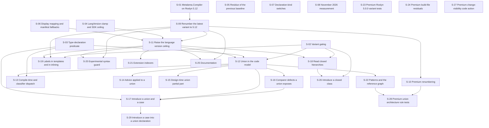

# Proposed user stories for Metalama 2027.0

This document proposes the user stories of the .NET 11, C# 15 and Roslyn 5.12 work for Metalama 2027.0. It exists so
that the decomposition can be reviewed before anything is filed. It is a draft for approval: no issue has been
created, and none is to be created in `metalama/Metalama` or in `metalama/Metalama.Premium` until the product owner
approves this document.

The sources are the theme documents of this directory, which carry the verified findings and the file and line
reference of every claim; [`DECISIONS.md`](DECISIONS.md), which records the answers taken by the product owner on
2026-09-04; [`OPEN-QUESTIONS.md`](OPEN-QUESTIONS.md), which records what is not answered; the later analyses under
[`analysis-reports`](analysis-reports), which answer questions that the theme documents left open; and the survey of
the open pull requests of the two repositories. The platform baseline itself is not decided here:
[`platform-support.md`](../platform-support.md) remains the authority on which platforms 2027.0 supports,
[`Directory.Packages.md`](../../../Directory.Packages.md) on which package versions that permits, and
[`updating-roslyn.md`](../updating-roslyn.md) on the procedure for moving a Roslyn variant.

Each story is written as the issue body would be posted, preceded by the metadata that a person filing it has to
choose. The issue type, the labels and the milestone are proposals and must be checked against the label set of the
repository before an issue is created. Every story is a sub-issue of the meta-issue #1921, which groups the platform
work of this release. The C# 15 stories, which are S-11 to S-22 and S-26, S-28, S-29 and S-30, are grouped under a
new feature issue named C# 15, itself a sub-issue of #1921. The stories S-31 to S-36 are not C# 15 stories, and they
are sub-issues of #1921 directly. That structure follows the previous release, in which the
closed issue #1039, named C# 14, grouped twenty sub-issues under the closed meta-issue #1045, named .NET 10 Support.
The `Size` field is an estimate of the effort of the pull request, on the small, medium and large scale that the
repository already uses.
The `Blocked by` field names the stories that must be merged before this one starts, and the Mermaid graph of the
next section draws the same relation.

Two rules of [`DECISIONS.md`](DECISIONS.md) govern how the stories are written. Section 7 says that a story states
the capability, the scope and the acceptance criteria, and not the shape of a public application programming
interface; section 7b says that the drafted shapes under `analysis-reports` are illustrative material for the
implementer and carry no authority. The stories below therefore name the files, the properties and the members that
exist today, and describe a new member by what it must report rather than by its signature.

Every verified finding of the theme documents is assigned exactly once: to one story, or to the last section with
the reason why it produces no story. A finding may be named again in the text of the story that owns it.

## Decisions required before the stories are created

Most of these questions are answered. The subsections below state the question, the options and their consequences,
and then either the answer that [`DECISIONS.md`](DECISIONS.md) records or, where the question is still open, the
recommendation and the work that waits on it. A reader who wants only the open items should read D-3, D-5, D-9, D-10,
D-11 and D-12.

### D-1. Does C# 15 support ship in 2027.0, and in what depth?

Every C# 15 item is downstream of one external event, which is `Metalama.Compiler` rebasing onto the stable Roslyn
that carries `LanguageVersion.CSharp15`. That Roslyn is expected to be 5.12, shipping in November 2026 with Visual
Studio 2027 and the .NET 11 SDK, against a general availability date of 2027-01-01.

- Option A, full support. Stories S-09 and S-11, and the dependent feature stories S-12 to S-22, must be written,
  reviewed and tested in roughly six weeks after the stable Roslyn exists. None of the feature work can be validated
  before it, because a test that requests C# 15 today is skipped and the suite still reports success.
- Option B, the plumbing and a defensive subset of the work. A C# 15 project builds, reports the designed diagnostics
  instead of crashing, and is not silently downgraded by the MSBuild clamp, while the language features are
  documented as unsupported.
- Option C, defer the Roslyn move. This option is not viable, because three published packages would keep a
  dependency on a Roslyn package that nuget.org does not serve, which is the restore failure of #1106.

Answer: Option A, recorded in [`DECISIONS.md`](DECISIONS.md) section 1. The schedule risk of the window between the
November 2026 Roslyn and the general availability date is accepted rather than avoided.

### D-2. How is the C# 15 Roslyn application programming interface gated between the two variants?

The same engine sources are compiled for the `Roslyn.5.0.0` variant and for the latest variant, and Roslyn 5.0 has
neither the union syntax node nor the union and closed symbol members. Three mechanisms were considered: conditional
compilation, numeric syntax kind values with a run-time guard, and a per-variant service that reads the members by
reflection. A numeric kind names no absent member but cannot override a virtual visitor method or call a syntax
factory. A reflection shim repeats what #1215 deliberately removed.

Answer: conditional compilation, recorded in [`DECISIONS.md`](DECISIONS.md) section 2. A symbol in the manner of
`ROSLYN_5_12_0_OR_GREATER` is defined by the latest variant property file, and the sources that name the C# 15 Roslyn
members are compiled only in that variant. The notes in `eng/RoslynVersions/Roslyn.5.0.0.props` and in the latest
variant property file that state that no production source branches on the variant, and the corresponding paragraph
of [`Directory.Packages.md`](../../../Directory.Packages.md), are superseded and are rewritten by S-02.

### D-3. What does the Roslyn 5.0 variant do when it meets a union or a closed type that it cannot represent?

Open. It is question Q2 of [`OPEN-QUESTIONS.md`](OPEN-QUESTIONS.md), and it applies to every C# 15 reader. The public
assembly `Metalama.Framework` is not built per Roslyn version, so a member that reports whether a type is a union
exists in every host while the engine code that answers it is compiled only in the latest variant. On the hosts that
the `Roslyn.5.0.0` variant serves, which are Rider and the Visual Studio Code C# Dev Kit, such a member reports false,
an aspect sees a union as an ordinary struct, and the editor and the command line disagree.

- Option A, report nothing. This is the behaviour that follows from doing nothing, and it is the failure mode that
  the platform doctrine exists to prevent.
- Option B, report the divergence. The diagnostic analyzer reports a design-time warning once per project, and the
  warning carries an opt-out. It is reported in an editor whose user can act on it only by changing the development
  environment.

Recommendation: Option B, which the draft in
[`analysis-reports/12-csharp15-api-drafts.md`](analysis-reports/12-csharp15-api-drafts.md) also recommends. The
severity and the opt-out of that diagnostic are question Q3 and are settled inside the story. One measurement could
change the answer, which is Q6, the Roslyn version that a current Rider presents. The answer decides one bullet of
S-12 and one bullet of S-18, which are the two stories that read a C# 15 type on both variants, and neither story is
blocked on it beyond that bullet.

### D-4. For a union that an aspect targets, is the answer a single refusal rule, per-advice rules, or nothing?

The language forbids instance fields, auto-properties and field-like events in a union declaration, forbids a public
single-parameter constructor, and requires every explicit constructor to chain to a generated one. Several ordinary
advices therefore emit code that the compiler rejects, with the diagnostic reported on generated code.

- Option A, one eligibility rule that declares a union an unsupported advice target. The rule is small, and it covers
  the three compiler errors and the silent case of an initializer injected into a constructor that has no syntax.
- Option B, per-advice rules that permit what a union can carry and refuse only what it cannot. These rules are more
  work, and each rule is a place where the language restrictions can be misread.
- Option C, no rule at all. The generated code is then silently invalid.

Answer: Option B, recorded in [`DECISIONS.md`](DECISIONS.md) section 3. Unions are supported as aspect targets, and
what a union cannot carry is refused with a clear diagnostic. Question Q9 attaches a condition to every such rule:
`ITypeSymbol.IsUnion` is true both for a `union` declaration and for a type carrying
`System.Runtime.CompilerServices.UnionAttribute`, while the member restrictions apply to the first form only, so each
rule must state which of the two forms it tests.

### D-5. Are introduced unions and introduced closed classes in scope?

Both answers are taken, and both are affirmative.

Introducing a closed class is in scope, recorded in section 5f of [`DECISIONS.md`](DECISIONS.md), which supersedes
section 5b and answers question Q4. A closed class is an ordinary class with one more modifier, the writer is sized
M, and every part of it is identified: the settable property on `INamedTypeBuilder`, its validation, the storage in
the builder data, the exposure on the introduced type, and the token emission in `ModifierHelper`. Three details of
the emission are not free: the `closed` token replaces `abstract` rather than joining it, the token goes before
`partial`, and the validation rejects a closed type that is not a class and one that is sealed or static. That work
is story S-26, and findings CM-4 and LK-5 are carried by it.

Introducing a union, and introducing a case into an existing union, is required, recorded in section 5c of
[`DECISIONS.md`](DECISIONS.md), which supersedes section 5b for unions. This is the largest single piece of C# 15
work in the release and it is story S-17.

What is still open is question Q1, the second half of that requirement.

- Option A, ship both authoring forms. For a type carrying the union attribute, adding a case is the introduction of
  a constructor, a generated partial part can express it, and the editor and the build agree. For a type declared
  with the `union` keyword, exactly one part carries the case list, so the operation rewrites the part the user
  wrote, it works at build time only, and the editor cannot show the added case. That divergence needs a design-time
  diagnostic which reports it but does not repair it.
- Option B, ship the attribute form only. Nothing diverges, and an aspect cannot add a case to a union that a user
  wrote with the concise syntax.

Recommendation: Option A, in that order, taking the attribute form first because it is small and its design-time
result is correct. If only one form fits the release it should be the attribute form. The answer decides whether
story S-29 is filed at all, because S-17 carries the attribute form and S-29 carries the form declared with the
`union` keyword together with its design-time diagnostic.

### D-6. Does the template language version move to C# 15?

`MetalamaTemplateLanguageVersion` is pinned to `14.0`, and the pin is bounded by the lowest supported Roslyn variant,
because the compile-time assembly of an aspect library must be compilable inside every supported design-time host.

- Option A, keep `14.0`. Aspect authors cannot use a C# 15 feature inside a template, which is a documented
  limitation that costs nothing.
- Option B, raise the default to `15.0`. The compile-time compilation of such a project fails inside a host on
  Roslyn 5.0 with an unsupported language version error, which is a hard failure and not a degradation.
- Option C, offer `15.0` as an opt-in property, at the cost of a support matrix with two template language versions.

Answer: Option A, recorded in [`DECISIONS.md`](DECISIONS.md) section 4. The same section adds a consequence that
changes one story: a labeled `break` or `continue` inside a template is forbidden and is reported with a diagnostic,
because the annotator cannot classify a label whose loop may be in a different scope than the statement that names
it. Run-time code that an aspect transforms and that uses a label outside a template is not affected and must keep
working once the syntax model is regenerated. Story S-19 delivers the rejection and the run-time correctness, and no
longer proposes support for labels in templates.

### D-7. Is the .NET 11 SDK installed in the build container, and what does `global.json` pin?

- Option A, install both feature bands and keep `global.json` on the .NET 10 SDK. It exercises a configuration that
  is known to be fragile, because two bands under one `dotnet` directory already produced an `MSB4062` restore
  failure through a stale `MSBuildExtensionsPath`. That mitigation is now complete: the merged pull request #1919
  removes `MSBuildExtensionsPath` in `DotNetTool.cs:61` and in `MSBuildTool.cs:55`, and the matching change is in
  PostSharp.Engineering 2023.2.421. The remaining objection to this option is therefore the cost of a second feature
  band in the image, and not a missing mitigation.
- Option B, install the .NET 11 SDK alone. One band and no conflict, but the product is then built by a compiler
  whose default language version differs from the one the tests assume.
- Option C, keep one SDK and accept that `net11.0` stays declared and untested.

Answer: Option C, recorded in [`DECISIONS.md`](DECISIONS.md) sections 6b and 6c. The container change has no
justification, because no .NET 11 application programming interface is wanted. Two things stay in scope and need no
installed SDK: the supported-toolchain check must not report `LAMA0601` for a supported .NET SDK, and the
`LangVersion` clamp must not rewrite the language version that a `net11.0` project implies. Both are properties of a
comparison and are verified by a test of that comparison. Story S-04 delivers them. Findings LV-9, UT-1, UT-6, UT-7,
UT-8 and PR-8 are withdrawn on this basis.

### D-8. Does a `net11.0` leg run in the test matrix?

Adding `net11.0` beside `net10.0` in every test project doubles the Core dimension of the longest part of the build,
and an unknown number of expected-output files may diverge between the legs.

Answer: no, recorded in [`DECISIONS.md`](DECISIONS.md) sections 6 and 6c. A leg is justified only by a .NET 11
application programming interface that Metalama wants to use, and the analysis in
[`analysis-reports/09-net11-api-value.md`](analysis-reports/09-net11-api-value.md) found none: the .NET 11 additions
are numeric types, domain name resolution, compression, process management, text, streams and vector intrinsics, and
none of them is on a path that Metalama uses. Neither repository contains a polyfill file, no production source
branches above `NET8_0_OR_GREATER`, and every shim serves the `netstandard2.0` and `net472` assets, which a `net11.0`
asset would not remove. Finding UT-5 is withdrawn on this basis.

### D-9. Is the November 2026 measurement a release blocker?

`Metalama.Framework.props` and [`Directory.Packages.md`](../../../Directory.Packages.md) both schedule a re-reading
of the Visual Studio floor, the feature band and the host-capped package pins after 2026-11-10, and the build
container pins Visual Studio Build Tools 18.9.2, which is a quarterly release below the long-term servicing floor
that PB-2027.0 names.

- Option A, measure immediately after the Visual Studio 2027 and long-term servicing releases and treat the result as
  a release blocker, so that the pins describe the hosts that 2027.0 actually supports.
- Option B, ship with the current values and re-derive in 2027.0.1, accepting that the declared minimum names a floor
  that the build host never exercises.

Recommendation: Option A for the Roslyn version of the baseline and for the variant identity, which are checklist
items 1 and 2 of [`platform-support.md`](../platform-support.md) and which decide whether S-09 renumbers to 5.12 or
to another value; Option B for the host-capped package pins, which are S-08. Whichever is chosen, the measurement
must not be scheduled on the same engineering days as S-09 and S-11, which are the critical path.

### D-10. Should the aspect test harness fail rather than skip when a requested language version is unavailable?

Today a language version that the running Roslyn does not recognise marks the test skipped with a reason, and the
suite passes. That is correct while a variant genuinely cannot serve the version, and wrong when an entire C# 15
suite is skipped and no reader of the build log observes it.

- Option A, keep skipping and rely on reviewers reading the skip list.
- Option B, fail when the version is one that the current baseline claims to support, and skip only when the running
  variant is the reason.

Recommendation: Option B. It changes the behaviour of a shared harness that the Patterns and the Premium suites also
use, so it needs an explicit decision inside S-11.

### D-11. Is the prerelease Roslyn pin a release gate for previews as well as for general availability?

`Metalama.Framework.Workspaces`, `Metalama.Testing.AspectTesting` and `Metalama.LinqPad` declare a dependency on a
Roslyn version that nuget.org does not serve. That failure already reached a user in #1106.

- Option A, gate general availability only, which reproduces that failure for anyone who restores a preview.
- Option B, gate every public publication, which means either moving to the stable Roslyn earlier or renumbering the
  latest variant to the stable 5.9.0, which exposes the same public application programming interface as the consumed
  preview and is available today, and adding a build-time check that refuses to pack a prerelease Roslyn pin.

Recommendation: Option B. It removes a class of user-facing failure at the cost of one interim renumbering. Option B
has a prerequisite that S-09 does not carry: an interim move of the latest variant to the stable Roslyn 5.9.0 needs a
`Metalama.Compiler` build on that version, per step 1 of [`updating-roslyn.md`](../updating-roslyn.md), so it is a
separate story placed before S-09 and not an acceptance criterion of it. What the answer decides inside S-09 is only
the pack-time check that refuses to publish a package pinning a prerelease Roslyn.

### D-12. How far does `Metalama.Premium` follow the core in 2027.0?

- Option A, Premium follows fully: S-10 renumbers the variants, S-22 adds the reference graph work and the
  architecture rule tests, and S-23 closes the coverage gap of the Roslyn 5.0.0 variant, all inside the same narrow
  window.
- Option B, Premium ships the renumbering only, which it must do in any case for the variant names and the payload
  paths to match the core, and defers the union-aware architecture rules to 2027.1, accepting that a rule on a type
  used as a union case under-reports with no diagnostic.

Recommendation: the renumbering of S-10 is mandatory in either option; S-22 and S-23 are the negotiable part. A
separate part of the same question is whether the missing execution of the Roslyn 5.0.0 variant is accepted for
another release: that variant serves Rider and the C# Dev Kit, and no member of the team exercises those hosts by
hand now that Visual Studio 2022 is dropped, so the risk rose this release rather than staying constant.

### D-13. Is Roslyn 5.12 added beside Roslyn 5.10, or does it replace it?

Answer: it replaces it, recorded in [`DECISIONS.md`](DECISIONS.md) section 8. No supported Visual Studio presents
Roslyn 5.10 or 5.11, because Roslyn publishes a stable package every third minor version and neither is published. A
variant whose identity is 5.10.0 would serve no host that a 5.12.0 identity does not serve, and rule 8 of the
doctrine forbids a variant that serves an empty set. The variant set of 2027.0 therefore stays at two. Two statements
of [`platform-support.md`](../platform-support.md) follow from this and are recorded as question Q10 rather than
applied, because the document belongs to the product owner; S-25 carries them once they are approved.

## Ordering

The list below reads as a dependency order. A story that names no blocker can start at once.

1. S-01, the move of `Metalama.Compiler` to the stable Roslyn 5.12. It is not work in this repository, and it is the
   head of the critical path. Its schedule is the planning information on which most of 2027.0 depends.
2. S-02, the variant gating, S-03, the type-declaration predicate, S-04, the two MSBuild comparisons, S-05, the
   residue of the previous baseline, S-06, the language version display mapping and the manifest fallbacks, S-07,
   the declaration-kind switches, S-27, the change-visibility code action of `Metalama.Premium`, S-31, the code
   refactoring provider entry points, and S-35, the host process classification. All nine are independent of the
   Roslyn gate and can be delivered before it.
3. S-08, the November 2026 measurement. It is calendar-gated rather than dependency-gated, and it must not be
   scheduled against the critical path. S-32, Visual Studio Tools for Metalama and the flowed dependency pins, names
   no blocker in this repository and is calendar-gated in the same way, by the November 2026 Visual Studio releases.
4. S-09, the renumbering of the latest variant to Roslyn 5.12 and the regeneration of the syntax model. Blocked by
   S-01. It is the gate of the whole release.
5. S-10, the Premium mirror of the renumbering. Blocked by S-09.
6. S-11, C# 15 as a supported language version. Blocked by S-04, S-06 and S-09. After it, a 2027.0 preview accepts a
   C# 15 project instead of reporting `LAMA0051`.
7. S-12, the union in the public code model. Blocked by S-02, S-03 and S-11. It is the surface that six later stories
   consume.
8. S-13, S-14, S-15, S-16 and S-22, the union consumers. All blocked by S-12; S-13 also by S-03. S-28, the union and
   closed architecture rule tests of `Metalama.Premium`, follows S-22 and S-10.
9. S-17, the introduction of a union type and of a case into a type carrying the union attribute. Blocked by S-03,
   S-12 and S-16. About half of its work can proceed before S-09. S-29, the introduction of a case into a `union`
   declaration, follows S-17 and is filed only if question Q1 chooses Option A.
10. S-18, closed hierarchies in the code model, S-19, labels, S-20, the experimental syntax guard, and S-21,
    extension indexers. All blocked by S-11. S-18 and S-19 are also blocked by S-02, and S-19 and S-20 also by S-09.
    S-26, the introduction of a closed class. Blocked by S-02 and S-18.
11. S-23 and S-24, the `Metalama.Premium` items that are independent of the Roslyn gate. S-24 waits instead on the
    open pull request metalama/Metalama.Premium#84, whose branch it is based on.
12. S-25, the documentation. It is deliberately last, because a document written before the code is a second thing to
    correct.

## Stories

### S-01. Move Metalama.Compiler to the stable Roslyn 5.12

- Issue type: User Story
- Labels: `enhancement`, `Area-Build-Engineering`
- Milestone: `2027.0`
- Repositories: `metalama/Metalama.Compiler`
- Size: L
- Blocked by: nothing in this repository
- Findings: none from the theme documents. The scope below is derived from the tracker of
  `metalama/Metalama.Compiler`, principally the pull requests #210 and #202 and their issues #207 and #201, read on
  2026-09-04. The repository is not cloned in the session that produced this analysis, so no file of it was read.

---

`Metalama.Compiler` on `develop/2027.0` carries Roslyn `5.10.0-1.26365.3`, which is a build of an upstream release
branch and will never have a stable counterpart. Step 1 of [`updating-roslyn.md`](../updating-roslyn.md) makes every
Roslyn move in `metalama/Metalama` conditional on `Metalama.Compiler` moving first, so the whole C# 15 plan of
2027.0 depends on a date that is decided in that repository. The move is not a rebase. It is a `git merge` of an
upstream Roslyn branch into `develop/2027.0`, and the two most recent such merges, pull requests #210 and #202,
measure what that costs.

#### Context

The two most recent Roslyn moves are the measurement. Pull request #210, merged on 2026-08-31, moved the repository
to Roslyn 5.10: 940 changed files, 245 commits, 39,912 added and 8,300 deleted lines, from a merge of 239 upstream
commits. Pull request #202, merged on 2026-08-12, moved it from Roslyn 5.6 to Roslyn 5.9 across roughly 14,100
files, and reported that 18,174 unit tests pass. Both were completed within one working day of the issue being
filed, so the elapsed time is short; the risk is not in the merge itself but in five places around it.

The first is the choice of the upstream branch. Issue #207 records that the branch table of
`docs-Metalama/Merging.md` was stale, because upstream rotates `release/stable` and `release/insiders` between
versions, and that the table has to be re-derived on every merge rather than trusted. Both merges rewrote that
document.

The second is the set of files that conflict, which is the set of divergences the fork carries. Pull requests #210
and #202 name them: `CommonCompiler.cs`, which holds the transformer order parsing, the
`ResolveAnalyzersFromArguments` overload and the `transformers` argument of `CompileAndEmit`;
`Syntax.xml.Main.Generated.cs`, which holds the Metalama `TreeTracker` hooks; `NullableWalker.cs`;
`DiagnosticHelper.cs` and `IDEDiagnosticIDConfigurationTests.cs`, which hold a `LAMA` guard; `Version.Details.props`
and `Version.Details.xml`; `Metalama.Compiler.slnf`; `Microsoft.CodeAnalysis.LanguageServer.csproj`; and the
external access unit test project that holds a `TypeForwards` reference. Every one of them is a place where a
Metalama change has to be re-applied inside a structure that upstream changed.

The third is package resolution. Pull request #202 reports 990 `NU1109` downgrade errors when the runtime and base
class library packages are not moved to the versions the new Roslyn floors, and #210 reports the same class of
failure for a single hardcoded entry of `eng/Packages.props`. Both merges also depend on the `roslyn-consolidated`
mirror serving the packages that upstream pins; #202 needed a namespace added to that feed, which is an
infrastructure request outside the repository.

The fourth is the build agent. Following upstream in `global.json` moves the .NET SDK band, which moves the agent
declaration in `eng-Metalama/src/Program.cs` and requires the container to be regenerated. Pull request #210 needed
two rounds of continuous integration for this reason alone: the desktop MSBuild of the agent could not host the
adopted SDK band, because that band declares a minimum MSBuild version above the one the installed build tools
provide, and the fix was a scoped `global.json` for the affected scenarios. The same rounds exposed a restore and
build skew between two SDK bands. Pull requests #211, #212 and #213 then removed the `net8.0` and `net9.0` target
frameworks, wrote the platform doctrine of that repository and moved its build image to Visual Studio 2026, so the
agent of the next merge is not the agent of #210.

The fifth is the .NET Framework test leg. Pull request #210 started with twenty failures in it, seventeen of them
caused by the merge, and the leg is not run by the same command as the rest of the suite. Its verification set is
also wider than a build and a test run: both merges required `eng/generate-compiler-code.cmd` to produce no diff,
all 71 project paths of `Metalama.Compiler.slnf` to resolve and to be present in `Roslyn.slnx`, and `Roslyn.slnx` to
be well-formed with all 365 projects present on disk.

One deliverable of this story is not a package. Step 4 of [`updating-roslyn.md`](../updating-roslyn.md) requires the
grammar file `src/Compilers/CSharp/Portable/Syntax/Syntax.xml` to be copied into `metalama/Metalama` from the
`Metalama.Compiler` branch that targets the consumed Roslyn version, because that is the grammar of the build that
is actually consumed. S-09 regenerates the syntax model from it, so S-09 needs a named branch and commit and not
only a package version.

Two properties of the previous merges must be confirmed rather than assumed for this one. Both were a single hop,
because the merge base was the upstream parent of the previous merge, and both took a preview band deliberately:
Roslyn 5.10 was consumed because it ships in a .NET 11 preview software development kit. Roslyn 5.12 is expected to
be a stable release, and the branch that produces it has to be derived again. No issue for this merge exists in
`metalama/Metalama.Compiler` as of 2026-09-04, so this story files the first one.

#### Scope

- Derive the upstream branch that produces the Roslyn version the November 2026 hosts carry, and correct the branch
  table of `docs-Metalama/Merging.md` in the same change, following issue #207.
- Merge that branch into `develop/2027.0`, report the merge base and the number of upstream commits, and re-apply
  the Metalama divergences in the conflicting files named in the Context section.
- Move the runtime and base class library package versions to the ones the new Roslyn floors, so that no `NU1109`
  downgrade is reported, and confirm that every version upstream pins is served by the `roslyn-consolidated` mirror,
  requesting the missing ones rather than pinning older versions.
- Follow upstream in `global.json`, move the agent declaration of `eng-Metalama/src/Program.cs` with it, regenerate
  the container, and confirm that the desktop MSBuild of the agent can host the adopted software development kit
  band.
- Run the .NET Framework test leg as well as the .NET leg, and account for every failure as caused by the merge or
  pre-existing.
- Set `RoslynVersion` in `eng/Versions.props`, publish the resulting `Metalama.Compiler` version, and record it in
  `eng/AutoUpdatedVersions.props` of `metalama/Metalama`, where `MetalamaCompilerVersion` is currently `2027.0.0`.
- Name the branch and the commit of `Metalama.Compiler` from which `src/Compilers/CSharp/Portable/Syntax/Syntax.xml`
  is to be copied, which is what step 4 of [`updating-roslyn.md`](../updating-roslyn.md) requires and what S-09
  consumes.
- Report the date at which the merge is expected to be complete, because the schedule of S-09, S-11 and every story
  downstream of them is derived from it.

#### Acceptance criteria

- `Metalama.Compiler` builds and passes its .NET tests and its .NET Framework tests against the stable Roslyn that
  the November 2026 hosts carry, and every remaining failure of the .NET Framework leg is shown to fail identically
  before the merge.
- `eng/generate-compiler-code.cmd` produces no diff.
- Every project path of `Metalama.Compiler.slnf` resolves and is present in `Roslyn.slnx`, and every project of
  `Roslyn.slnx` is present on disk.
- A solution-wide restore reports no NuGet error, and in particular no `NU1109`.
- The continuous integration build is green on the regenerated container.
- The branch table of `docs-Metalama/Merging.md` names the branch that was actually merged, and the date on which
  the table was derived.
- The published `Metalama.Compiler` version pins a Roslyn package that nuget.org serves.
- `metalama/Metalama` can raise `RoslynApiMaxVersion` and `RoslynMaxVersion` to that version without any prerelease
  package source.
- The story names the branch and the commit from which S-09 copies the grammar file.

#### Not in scope

This story does not edit `metalama/Metalama` or `metalama/Metalama.Premium`. Those edits are stories S-09 and S-10.
It does not correct the .NET Framework MSBuild bridge of `build/Metalama.Compiler.props`, which probes the shared
framework directory for `10.*` only; `platform-support.md:347-349` records that drift point and pull request #211
left it out of scope deliberately. It does not change the target frameworks of that repository, which pull request
#211 already reduced to `net10.0` and `net472`.

— Claude for @gfraiteur

— Claude for @gfraiteur

### S-02. Apply the variant gating decision to the engine sources and to the doctrine

- Issue type: User Story
- Labels: `enhancement`, `Area-Build-Engineering`, `Area-Framework`
- Milestone: `2027.0`
- Repositories: `metalama/Metalama`
- Size: S
- Blocked by: nothing
- Findings: [CM-10](03-code-model-unions-closed.md)

---

`Metalama.Framework.Engine.5.0.0` compiles the same source files as `Metalama.Framework.Engine` against Roslyn 5.0,
whose public application programming interface has neither `UnionDeclarationSyntax` nor `ITypeSymbol.IsUnion`.
Production source carries no conditional compilation today, and the only variant constant,
`ROSLYN_5_10_0_OR_GREATER`, is defined by `eng/RoslynVersions/Roslyn.5.10.0.props:10` and is used by two aspect tests.
Section 2 of [`DECISIONS.md`](DECISIONS.md) settles the mechanism: the C# 15 Roslyn members are reached through
conditional compilation and one implementation assembly per Roslyn version. This story applies that decision, so that
the findings which depend on it, which are every finding of the code model theme and at least fourteen findings of
the other themes, do not each decide it again.

#### Context

Issue #1881 removed 177 `#if ROSLYN_*` blocks from 152 production files and wrote the note, in both variant property
files, that no production source branches on the variant. Section 2 supersedes that note for the C# 15 members and
rejects the two alternatives that were considered, which are numeric syntax kind values with a run-time guard and a
per-variant service that reads the members by reflection; the second repeats what #1215 deliberately removed. The
decision is deliberately narrow: it covers the members that Roslyn 5.0 does not have, and it does not reopen the
general policy for anything else.

#### Scope

- Rewrite the note in `eng/RoslynVersions/Roslyn.5.0.0.props:8-10` and in the latest variant property file, and the
  corresponding paragraph of [`Directory.Packages.md`](../../../Directory.Packages.md), so that they state the
  current policy: production source may branch on the latest variant symbol, and only for members that the lower
  variant does not expose.
- State in the same place which members are covered, namely `UnionDeclarationSyntax`, `SyntaxKind.UnionDeclaration`,
  `SyntaxKind.ClosedKeyword`, `ITypeSymbol.IsUnion`, `ITypeSymbol.UnionCaseTypes`, `ITypeSymbol.IsClosed` and the
  `Name` field of `BreakStatementSyntax` and `ContinueStatementSyntax`, and that the list is closed rather than a
  precedent for new branches.
- Record that the variant symbol is named after the variant and is therefore renamed by S-09, and add it to the
  rename list of that story.
- Record what the lower variant does at each site, which is to report the value that an ordinary type would report,
  and reference D-3 for whether it also reports a diagnostic.
- Settle the suppression of `RSEXPERIMENTAL006`: it is required while the latest variant is built against a Roslyn
  that still marks the union and closed members experimental, and it disappears when the variant reaches Roslyn 5.12.
- Deliver one worked example in the smallest consumer, so that the pattern is visible in the code rather than only in
  a document.
- State whether the public `Metalama.Framework.Sdk` kind helpers, which are part of the extensibility surface, may
  name the new kinds at all, since a public surface cannot easily be narrowed later.
- Reference the open issue #1217, which asks for `Metalama.Extensions.Metrics` to support several Roslyn versions,
  and state whether the policy written here applies to that package or leaves it outside the closed list.

#### Acceptance criteria

- Both variant property files and [`Directory.Packages.md`](../../../Directory.Packages.md) describe the policy that
  is actually in force, and no document still states that production source carries no variant branch.
- One production source file compiles a C# 15 Roslyn member behind the variant symbol, and both variants build.
- The list of members that may be gated is written down, and the rule for adding to it is written down.

#### Not in scope

This story does not deliver the union and closed features themselves. It delivers the mechanism and one example.

— Claude for @gfraiteur

### S-03. Recognise any type declaration by a type test instead of by an enumerated syntax kind

- Issue type: User Story
- Labels: `enhancement`, `Area-Framework`
- Milestone: `2027.0`
- Repositories: `metalama/Metalama`
- Size: M
- Blocked by: nothing
- Findings: [CM-2](03-code-model-unions-closed.md), [CM-6](03-code-model-unions-closed.md),
  [LK-3](04-linker-and-advice.md), [DT-1](05-design-time-workspaces-linqpad.md),
  [DT-6](05-design-time-workspaces-linqpad.md)

---

`SyntaxKindExtensions.IsTypeDeclaration` at
`Metalama.Framework/src/Metalama.Framework.Engine/Utilities/Roslyn/SyntaxKindExtensions.cs:33-35` enumerates exactly
the class, struct, interface, record and record struct kinds, `IsBaseTypeDeclaration` derives from it at `:41`, and
the same enumeration is written by hand three more times in
`Metalama.Framework/src/Metalama.Framework.Engine/Utilities/Roslyn/SyntaxExtensions.cs`, at `:33-34`, `:61-62` and
`:116-117`. `SourceNamedTypeImpl.IsPartial` tests `SyntaxKind.IsTypeDeclaration` at
`Metalama.Framework/src/Metalama.Framework.Engine/CodeModel/Source/SourceNamedTypeImpl.cs:344`. Four themes reported
the same five places, and every consequence they describe follows from them.

#### Context

A `partial union` reports `IsPartial` false, so `LAMA0048` is reported although the type is partial, the design-time
generator never produces the partial file, the code fix then adds a second `partial` modifier, a suppression never
reaches a diagnostic located on a union header, and the linker consumers of the same predicates fall through. The
remedy is not union-specific: interfaces and extension blocks are already missing from several of these lists today,
so this is a correctness change that also admits unions later without naming a member that the Roslyn 5.0 variant
does not have. This is the largest piece of union plumbing that can be delivered before the Roslyn gate.

#### Scope

- Replace the enumerated kinds by a test on the abstract syntax type where the intent is a declaration that can
  contain members, in `SyntaxKindExtensions.IsTypeDeclaration`, in `SyntaxExtensions.FindMemberDeclarationOrNull`,
  `FindSymbolDeclaringNode` and `GetDeclaringType`, and in `Linking/SymbolExtensions.GetDeclarationFlags`.
- Choose deliberately between the narrow predicate that the documentation of `SyntaxKindExtensions` promises and the
  broad Roslyn helper `SyntaxFacts.IsTypeDeclaration`, which also matches delegates, enums and extension blocks and
  would therefore change shipped behaviour, and record the choice in the documentation comment.
- Review every consumer of the two predicates, and treat with care the two sites where the parameter list of a union
  is a case list and not a parameter list, which are `ImplicitLastOverrideReferenceInliner` and
  `LinkerLateTransformationRegistry`.
- Keep the record-only kind lists as they are, because they serve the record-synthesized-member logic and not the
  general question of whether a node is a type declaration.
- Keep the convention that `KindCheckOptimizationAnalyzer` of #1307 enforces, which exempts a test on an abstract
  syntax type.
- Add the unit tests that pin `IsPartial` and the suppression path for an interface and for an extension block, which
  are the cases that are wrong today.

#### Acceptance criteria

- No enumeration of concrete type-declaration kinds remains in `SyntaxKindExtensions` or in `SyntaxExtensions`.
- `IsPartial` is true for a partial interface and for every partial type declaration whose kind the predicate now
  admits, and the design-time generator produces the partial file for it.
- A suppression located on the header of an interface or of an extension block is applied.
- `KindCheckOptimizationAnalyzer` reports nothing on the rewritten sites, and both Roslyn variants build.

#### Not in scope

This story names no C# 15 syntax kind. It compiles unchanged for both variants and adds no variant branch.

— Claude for @gfraiteur

### S-04. Correct the `LangVersion` clamp and the .NET SDK ceiling comparison of the platform check

- Issue type: Bug
- Labels: `bug`, `Area-Build-Engineering`
- Milestone: `2027.0`
- Repositories: `metalama/Metalama`
- Size: S
- Blocked by: nothing
- Findings: [LV-1](01-language-version-and-hosts.md), [UT-2](06-user-tfm-patterns-tests-docs.md)

---

`Metalama.Framework/src/Metalama.Framework.Package/build/Metalama.Framework.targets:118-121` rewrites an implicitly
set `LangVersion` that is not one of `12.0`, `13.0`, `14.0`, `default`, `latest`, `latestMajor` or `preview` down to
`12.0`, and the warning at `:243-248` carries no `Code` attribute and explains the rewrite falsely. Separately,
`_MetalamaSdkVersion` at `:399` strips only the prerelease label and is then compared with `VersionGreaterThan`
against `MaximumSdkVersion` `11.0` at `:412`, so every .NET 11 SDK, including `11.0.100`, reports `LAMA0601`
although `Metalama.Framework.props:33` declares .NET 11 supported and `:39` names 10.0 and 11.0 as the supported
versions. The second defect is live today.

#### Context

Section 6b of [`DECISIONS.md`](DECISIONS.md) removes the build container work from the release and names these two
defects as what remains: both are properties of a comparison and are verified without an installed .NET 11 SDK. The
clamp is not yet reachable, because the compiler toolset caps the implied version of a `net11.0` project at `14.0`
until the Roslyn of S-09; it becomes reachable on the day that cap moves to `15.0`, and it then costs a project three
language versions at once, because a project that implied `15.0` drops to `12.0`. The ceiling defect is reachable
now: `MaximumSdkVersion` is documented as the last supported major and minor line, and comparing it against a full
version makes every feature band of that line exceed it. `MinimumSdkVersion` legitimately keeps feature-band
precision, because a contributing package may require `10.0.200`, so the two rules cannot share one property.

Two issues already cover part of this work. The open issue #714 asks for three things: a warning when Metalama is
used with an unsupported target framework, no silent downgrade of `LangVersion` without a warning, and the same
language version at design time and at build time. The first was delivered by the closed issue #1884, which also
introduced the `MaximumSdkVersion` comparison that this story corrects, and the second is what the diagnostic code
and the rewritten warning text deliver here. This story therefore references #714, and #714 is closed or reduced to
its third point when this story is done. The closed issue #1894 is the neighbour that removed the temporary
`MetalamaCheckSupportedPlatform` property of this repository, so a build of this repository now exercises the same
check.

#### Scope

- Add a second property holding the first two components of `$(NETCoreSdkVersion)` and use it in the maximum rule at
  `Metalama.Framework.targets:412` only, leaving the minimum rule at `:406-408` on the full version, with a comment
  stating why the two differ.
- Give the `MetalamaCheckLangVersion` warning a `Code` attribute, allocated from the `LAMA06xx` platform range beside
  `LAMA0600` to `LAMA0602`, and rewrite its text so that it describes the rewrite that actually happened.
- State the suppression mechanism correctly: an MSBuild task warning is suppressed by `MSBuildWarningsAsMessages` and
  not by `NoWarn`.
- Extend the accepted value list of the clamp condition when `LangMaxVersion` moves, which is S-11, and reference
  that story from the comment so the two lists do not drift.
- Add unit tests or a standalone scenario that exercises both comparisons without an installed .NET 11 SDK, following
  section 6b of [`DECISIONS.md`](DECISIONS.md).

#### Acceptance criteria

- A build with a .NET SDK of the `11.0` line reports no `LAMA0601`, and a build with a `12.0` SDK still reports it.
- A build with a .NET SDK of `10.0.100` still reports no warning, and one with `9.0.100` still reports `LAMA0601`.
- The language version warning carries a code, and adding that code to `MSBuildWarningsAsMessages` suppresses it.
- The warning text states the version the project had and the version it was given, and no sentence of it is false.

#### Not in scope

This story does not install a .NET 11 SDK in the build container and does not add a `net11.0` scenario. Sections 6b
and 6c of [`DECISIONS.md`](DECISIONS.md) exclude both.

— Claude for @gfraiteur

### S-05. Remove the residue of the previous platform baseline from the engine defaults and the test gates

- Issue type: Bug
- Labels: `bug`, `Area-Framework`, `Area-Build-Engineering`
- Milestone: `2027.0`
- Repositories: `metalama/Metalama`
- Size: S
- Blocked by: nothing
- Findings: [UT-3](06-user-tfm-patterns-tests-docs.md), [UT-4](06-user-tfm-patterns-tests-docs.md),
  [UT-9](06-user-tfm-patterns-tests-docs.md), [UT-10](06-user-tfm-patterns-tests-docs.md). This story completes the
  closed issue #1876.

---

Four residual items of #1876, the issue that removed explicit support for .NET 8 and .NET 9, and of its pull request
#1877, share one property: each is invisible in a build that succeeds, and none produces a failure.
`CompileTimeAssemblyLocator.cs:43` still names `net8.0` in the default target frameworks of
the nested compile-time reference project, `DefaultProjectOptions.cs:56` reports the target framework `net8.0` to
every test whatever the test assembly targets, two facts of the Contracts unit tests are excluded on every leg
because their guard names `NET6_0` rather than `NET6_0_OR_GREATER`, and two aspect tests never run because their
guard names `ROSLYN4_4_OR_GREATER`, a symbol that no variant defines.

#### Context

An additional compile-time package resolves its `netstandard2.0` asset instead of its `net10.0` asset because of the
first value, and an out-of-support target framework is restored on every build. The two guards are dead in different
ways: the Contracts guard excludes code that genuinely does not compile on .NET Framework, so it keeps a target
framework condition and only the symbol name changes; the aspect test guard survived the cleanup of #1881 because the
name does not follow the underscore convention of the variant symbols, and each run already reports the two tests as
skipped with that reason. This story is scheduled before the C# 15 test suite is written, because that suite adds new
constant gates of exactly this shape.

#### Scope

- Change `_defaultCompileTimeTargetFrameworks` in
  `Metalama.Framework/src/Metalama.Framework.Engine/CompileTime/CompileTimeAssemblyLocator.cs:43` to name `net10.0`
  instead of `net8.0`, and edit the fixtures that pin it, which are the `Issue1789` standalone scenario, its
  `README.md`, the unit test data and the comments in `IProjectOptions.cs` and `test.ps1`.
- Use `net10.0` and not `net11.0` for that value, because PB-2027.0 keeps a .NET 10 SDK as the build-time SDK.
- Raise the default of `DefaultProjectOptions.TargetFramework` from `net8.0` to `net10.0`, and re-accept the one
  aspect test snapshot that prints the value.
- Replace `NET6_0` by `NET6_0_OR_GREATER` in `Metalama.Patterns.Contracts.UnitTests/DoubleTests.cs`, keeping the
  target framework condition, then run the two facts and adopt the result.
- Remove the `ROSLYN4_4_OR_GREATER` gate from the two `InterfaceImplementation` aspect tests, keep their
  `NET6_0_OR_GREATER` requirement so that the directive and the conditional name the same symbol, run them and adopt
  their output.

#### Acceptance criteria

- No `net8.0` literal remains in the engine defaults or in the fixtures that pin them.
- A test reads the target framework of the leg it runs on, and the aspect test that prints it is re-accepted.
- The four previously excluded tests execute, and the pull request description states, for each of them, what the
  newly produced output proves.
- No test directive names a preprocessor symbol that no configuration defines.

#### Not in scope

This story adds no `net11.0` test leg. Sections 6 and 6c of [`DECISIONS.md`](DECISIONS.md) exclude it.

— Claude for @gfraiteur

### S-06. Make the language version display mapping non-throwing and settle the compile-time manifest fallbacks

- Issue type: Bug
- Labels: `bug`, `Area-Framework`
- Milestone: `2027.0`
- Repositories: `metalama/Metalama`
- Size: S
- Blocked by: nothing
- Findings: [LV-2](01-language-version-and-hosts.md), [LV-4](01-language-version-and-hosts.md),
  [LV-5](01-language-version-and-hosts.md)

---

`LanguageVersionExtensions.ToDisplayStringSafe` maps the numeric values 1300 and 1400 by a numeric cast and has no
arm for 1500, so it throws `ArgumentOutOfRangeException` while formatting `LAMA0051` or `LAMA0052` and the user sees
`LAMA0001` with a request to open a support ticket instead of the designed diagnostic. In the same area,
`CompileTimeProjectManifest.ResolvedLanguageVersion` documents C# 13, is read by nothing, and disagrees with the two
live fallbacks at `CompileTimeCompilationBuilder.cs:1355` and `CompileTimeProjectRepository.Builder.cs:596`.

#### Context

These three items become dangerous only after S-11 raises the supported language version, and all three are cheaper
to fix before it. The display mapping is a numeric cast and therefore compiles against the Roslyn 5.0 variant as
well, so it needs no variant branch. The manifest question has a recorded precedent: #1185 reported the failure of a
compile-time project produced by a higher Roslyn version and read by a lower one, with the Roslyn error `CS8192`,
which is exactly what an aspect library compiled at C# 15 and consumed under the Roslyn 5.0 variant would produce
again. #1142 is the reason the value is serialized as an integer, and that must not change.

#### Scope

- Add the arm for the numeric value 1500 to `LanguageVersionExtensions.ToDisplayStringSafe:33-39`, and give the
  method a formatted fallback for an unknown value so that it never throws.
- Either delete `CompileTimeProjectManifest.ResolvedLanguageVersion` or route both fallbacks through it with the
  value the comment documents, so that the manifest has one answer rather than three.
- Add, at the reading side, a clamp of the manifest language version to the maximum that the running variant
  accepts, and a warning that names both versions, so that a library compiled at a higher language version degrades
  instead of failing with a compiler error.
- Format the unknown value numerically in that warning, or add the display arm first, so that the diagnostic path
  itself cannot throw.

#### Acceptance criteria

- Requesting an unsupported language version reports `LAMA0051` or `LAMA0052` with the version named, and never
  `LAMA0001`.
- A compile-time project manifest that carries no language version resolves to one documented value, and the two
  reading sites agree with it.
- A manifest that carries a language version above what the running Roslyn variant accepts produces a named warning
  and a clamped parse, and not `CS8192`.
- The change compiles for both Roslyn variants with no variant branch.

— Claude for @gfraiteur

### S-07. Repair the declaration-kind switches that silently fall through

- Issue type: Bug
- Labels: `bug`, `Area-Framework`, `Area-Extensions`
- Milestone: `2027.0`
- Repositories: `metalama/Metalama`
- Size: M
- Blocked by: nothing
- Findings: [DT-5](05-design-time-workspaces-linqpad.md), [TP-7](02-syntax-generator-and-templates.md),
  [PR-11](07-premium.md)

---

Four places switch over declaration kinds and do the wrong thing for a kind they do not list, and none of the four is
caused by C# 15. `CSharpAttributeHelper.cs:74-191` returns null for records, record structs and extension blocks, and
the caller propagates the null, so the add-attribute code action reports success and does nothing.
`ChangeVisibilityCodeAction` in `Metalama.Premium` skips interfaces and indexers in the same way, which is story
S-27. The member switch of `TransformCompileTimeType` throws for an indexer and falls through for an extension block,
so a template declared inside an extension block is copied verbatim.
`ReferenceValidationContext.GetInboundGranularity` throws for a
validated extension block, and the exception is reported as an error diagnostic from inside the user validator.

#### Context

Extension blocks are a C# 14 feature and already ship, so the last of these is a defect that a customer can
encounter today, and the first two are wrong for records, which have shipped for years. In every case the remedy is
to test an abstract syntax base type or to add the missing arm, which also admits unions later without naming an
experimental member. The remedy is the same in both repositories, so S-27 is written from the same reviewed design,
and it is a separate story because a pull request cannot span two repositories.

#### Scope

- In `Metalama.Framework/src/Metalama.Framework.DesignTime/Refactoring/CSharpAttributeHelper.cs`, replace the per-kind
  arms for type and member declarations by one call to `MemberDeclarationSyntax.AddAttributeLists`, narrowed so that
  namespaces, enum members, global statements and incomplete members keep returning null, and keep the special cases
  for parameters, accessors and the compilation unit, which do not derive from that type.
- Keep the trivia behaviour that the tests of #779 pin, because the caller restores the leading trivia of the old
  node.
- In `CompileTimeCompilationBuilder.ProduceCompileTimeCodeRewriter.TransformCompileTimeType`, decide between
  reporting a diagnostic for a template declared inside an extension block and supporting it; support requires
  extracting the member loop, because an extension block declaration is a type declaration whose `Identifier`
  returns default and whose base-list mutators throw.
- Add the missing arm for the extension block kind in `ReferenceValidationContext.GetInboundGranularity`, with an
  aspect test that validates an extension block containing an extension method and that compiles against the Roslyn
  version Premium consumes today.

#### Acceptance criteria

- The add-attribute code action adds the attribute to a record, a record struct and an extension block, and the
  existing trivia tests do not regress.
- A template declared inside an extension block either compiles or is reported with a diagnostic that names the
  reason, and is never copied verbatim.
- A reference validator that validates an extension block reports its own diagnostics and no exception.

#### Not in scope

This story does not handle unions. Every arm added here is written so that a union is admitted later without a
further edit, but no C# 15 member is named. The change-visibility code action of `Metalama.Premium` is story S-27.

— Claude for @gfraiteur

### S-08. Re-derive the November 2026 baseline: Visual Studio build tools, MSBuild and the host-capped pins

- Issue type: User Story
- Labels: `enhancement`, `Area-Build-Engineering`
- Milestone: `2027.0`
- Repositories: `metalama/Metalama`
- Size: M
- Blocked by: the November 2026 releases, that is 2026-11-10
- Findings: [LV-11](01-language-version-and-hosts.md), [UT-11](06-user-tfm-patterns-tests-docs.md),
  [UT-12](06-user-tfm-patterns-tests-docs.md), [UT-13](06-user-tfm-patterns-tests-docs.md)

---

`eng/src/Program.cs:40` pins `VisualStudioBuildToolsComponentVersion.v18_9_2`, which is a quarterly release below the
November 2026 long-term servicing floor that PB-2027.0 names, and `MSBuildVersion` at `:63` must keep matching it.
`Metalama.Framework.props:34-37` and [`Directory.Packages.md`](../../../Directory.Packages.md) both schedule a
re-reading of the Visual Studio floor, the feature band and the host-capped package pins after 2026-11-10. Four
findings from three themes wait on that one measurement, and grouping them avoids four separate reopenings of the
same two documents.

#### Context

The build tools pin has a history in two issues and one pull request. #1902 declined an earlier attempt to move it,
on the grounds that regenerating the Visual Studio base images is expensive, and it recorded that the component
version must exist in PostSharp.Engineering before the change can be made at all. The merged pull request #1919 then
made that move, pinning the build tools to 18.9.2 and `MSBuildVersion` to 18.9, so this story raises values that
#1919 set rather than values that have never moved. The obligation to re-read the host-capped package pins after
2026-11-10 was recorded by the closed issue #1897, whose Premium mirror is the open pull request
metalama/Metalama.Premium#84. The measurement itself is checklist item 1 of
[`platform-support.md`](../platform-support.md). Two of the four items are comment corrections rather than version
changes: the `Microsoft.NET.Test.Sdk` pin carries a comment that still names Visual Studio 2022 as the lowest
supported host, and `Microsoft.Build` is pinned at the lowest supported host by doctrine and needs verification
rather than a bump.

#### Scope

- Measure the Visual Studio version, the .NET SDK feature band, the Roslyn version and the private runtime of the
  November 2026 long-term servicing channel and of Visual Studio 2027, per checklist item 1 of
  [`platform-support.md`](../platform-support.md).
- Raise `VisualStudioBuildToolsComponentVersion` and `MSBuildVersion` in `eng/src/Program.cs` together, once
  PostSharp.Engineering exposes the newer component version, which is an external prerequisite.
- Re-derive the `Microsoft.NET.Test.Sdk` pin against the measured floor and rewrite its comment, which states the
  right rule and the wrong value.
- Verify, rather than raise, the `Microsoft.Build` pin, which doctrine keeps at the lowest supported host, and
  correct the parenthetical of [`Directory.Packages.md`](../../../Directory.Packages.md) that states the frozen
  assembly version for the 17 line only.
- Re-run the vulnerability audit, remove the audit suppressions whose cause the Roslyn floor move removed, and
  correct the package version comments that name a dropped target framework.
- Restate the audit rule correctly where it is described: `NuGetAuditMode` defaults to `direct` except for .NET 10
  and later target frameworks, where it defaults to `all`.

#### Acceptance criteria

- The build container names a Visual Studio version that PB-2027.0 lists as supported, and `MSBuildVersion` matches
  the installed build tools.
- Every package pin whose comment names a measured host names the host that was actually measured.
- No audit suppression remains whose cause has been removed, and the audit reports nothing new.
- [`platform-support.md`](../platform-support.md) records the measurement and the date it was taken.

#### Not in scope

This story does not rewrite the audience paragraph of [`Directory.Packages.md`](../../../Directory.Packages.md),
which #1903 owns and which is referenced rather than rewritten. It does not change the .NET SDK component of the
container, which section 6b of [`DECISIONS.md`](DECISIONS.md) excludes.

— Claude for @gfraiteur

### S-09. Renumber the latest Roslyn variant to the stable 5.12 and regenerate the syntax model

- Issue type: User Story
- Labels: `enhancement`, `Area-Build-Engineering`, `Area-Framework`, `breaking`
- Milestone: `2027.0`
- Repositories: `metalama/Metalama`
- Size: L
- Blocked by: S-01, and the Roslyn version measured by S-08
- Findings: [LV-12](01-language-version-and-hosts.md), [LV-13](01-language-version-and-hosts.md),
  [LV-14](01-language-version-and-hosts.md), [TP-1](02-syntax-generator-and-templates.md),
  [TP-9](02-syntax-generator-and-templates.md), [DT-3](05-design-time-workspaces-linqpad.md),
  [DT-8](05-design-time-workspaces-linqpad.md)

---

`RoslynApiMaxVersion` and `RoslynMaxVersion` are `5.10.0-1.26365.3`, a build of the `main` branch of `dotnet/roslyn`
of 2026-07-15 restored from the `roslyn-consolidated` feed, and no stable 5.10 or 5.11 package exists or will exist.
Leaving the prerelease is therefore a renumbering of the latest variant to 5.12.0 and not the edit of a version
label. This story is one pull request because the pieces cannot be merged separately without breaking the build, and
it is the gate of the whole release.

#### Context

Section 8 of [`DECISIONS.md`](DECISIONS.md) records that 5.12 replaces the 5.10 variant rather than being added
beside it, because no supported host presents Roslyn 5.10 or 5.11 and rule 8 of the doctrine forbids a variant that
serves an empty set. A version mismatch has two silent failure modes: `TargetedAssemblyReference` compares the
declared Roslyn version by equality, and `ExtensionLoaderBase` drops a non-matching extension assembly with no
diagnostic, which removes a pipeline stage rather than reporting an error. The regeneration is the second half:
`TreeReader.RemoveExperimentalDeclarations` strips every node carrying `ExperimentalUrl`, which is why no generated
visitor, version verifier or design-time hasher knows the union declaration, the with-element or the `Name` field of
`break` and `continue`. Three published packages depend on this story as a release gate, because they currently
declare a dependency on a Roslyn package that nuget.org does not serve, which already failed for a user in #1106.

The variant that this story renumbers was created by the closed issue #1881, and the `roslyn-consolidated` package
source that it removes was declared by the closed issue #1885, so this story supersedes both rather than merely
standing beside them. The failure reported in #1106 was the nested reference-assembly restore, which reported
`NU1102` for `Microsoft.CodeAnalysis.CSharp`, and not the declared dependency of a published package. The two share
one cause, which is a Roslyn version that nuget.org does not serve, and the second is what the pack-time check below
prevents.

The value 5.12 is derived from the publication cadence and not measured. Checklist item 1 of
[`platform-support.md`](../platform-support.md), which S-08 performs after 2026-11-10, settles it, and this story
takes the measured value.

#### Scope

- Set the version strings of `Directory.Packages.props`, of the variant property file whose
  `ThisRoslynVersionNoPreview` and `DefineConstants` are written literally, and of
  `SupportedCSharpVersions.ToNuGetVersionString`, following steps 7 and 8 of
  [`updating-roslyn.md`](../updating-roslyn.md).
- Insert the retired version name into the version list of `eng/src/GenerateMetaSyntaxRewriter` in version order and
  not at the end, because the enumeration values are positional indices and a compile-time project manifest already
  on disk carries the name.
- Rename the variant projects, the variant preprocessor symbol and every literal that names the variant, including
  `RoslynVariantPolicy` and its tests.
- Add the stable grammar as a new `Syntax-5.12.0.xml` rather than overwriting the previous file, and regenerate, so
  that the rewriters, the version verifier arms and the design-time hashers gain the union declaration, the
  with-element and the labeled `break` and `continue`.
- Add a guard that compares the local grammar file with the grammar of the exact `Microsoft.CodeAnalysis.CSharp`
  package that is consumed, rather than one keyed on a prerelease label, because the unsafe expression keeps its
  experimental marker and a label-based check would fail permanently.
- Verify that removing the prerelease label removes the `roslyn-consolidated` package source, which
  `SupportedCSharpVersions.ToNuGetVersionString` derives from the hyphen, and re-derive the per-variant
  `System.Text.Json` version from the stable package.
- Rewrite step 10 of [`updating-roslyn.md`](../updating-roslyn.md), which names members that #1911 renamed, and split
  the add-a-variant list from the renumbering list.
- Add a pack-time check that refuses to publish a package pinning a prerelease Roslyn, subject to decision D-11.
- Add two design-time diff test cases for the newly generated hashers, which are a union rename and a change to the
  label of a `break` statement.

#### Acceptance criteria

- No file names the retired variant version, and both variants build and pass their tests.
- A compile-time project manifest written by the previous release still deserializes.
- An extension assembly declared for the previous variant version is either loaded or refused with a diagnostic, and
  never dropped in silence.
- `Metalama.Framework.Workspaces`, `Metalama.Testing.AspectTesting` and `Metalama.LinqPad` restore from nuget.org
  alone.
- The generated syntax rewriters, the version verifier and the design-time hashers cover the union declaration, the
  with-element and the `Name` field of `break` and `continue`.

#### Not in scope

This story does not add C# 15 to the supported language versions, which is S-11, and it does not mirror the
renumbering in `Metalama.Premium`, which is S-10. The open issue #875, which asks for a move to Roslyn 4.9, names a
version far below the current floor and is superseded by this story. It is closed as superseded when this story is
filed, rather than left to look like a duplicate.

— Claude for @gfraiteur

### S-10. Mirror the Roslyn 5.12 renumbering in `Metalama.Premium`

- Issue type: User Story
- Labels: `enhancement`, `Area-Build-Engineering`
- Milestone: `2027.0`
- Repositories: `metalama/Metalama.Premium`
- Size: M
- Blocked by: S-09
- Findings: [PR-1](07-premium.md)

---

metalama/Metalama.Premium#85, which closed the issue #1913, left Premium with a latest variant named 5.10.0, two
prerelease fallback literals in `Directory.Packages.props` and a `nuget.base.config` declaring the
`roslyn-consolidated` feed. The version string
appears in eleven tracked files, including the `InternalsVisibleTo` entries, the packaging paths and the
`MetalamaExtensionAssembly` items with their `TargetRoslynVersion` metadata.

#### Context

If the two repositories do not move in the same release, one of three things happens: Premium resolves a preview from
a feed that the core has removed, or Premium removes the feed while the exported `RoslynApiMaxVersion` still carries a
prerelease label, or Premium ships variant assemblies whose names no longer match the variant that the core loads,
which the extension loader drops without a diagnostic. This story is separate from S-09 only because a pull request
cannot span two repositories.

#### Scope

- Rename `eng/RoslynVersions/Roslyn.5.10.0.props` to the new version, set `ThisRoslynVersionNoPreview` accordingly
  and update `eng/RoslynVersions/Latest.props`.
- Change the two fallback literals `RoslynVersion` and `RoslynMaxVersion` in `Directory.Packages.props`.
- Update every remaining occurrence of the version string, which `git grep` finds in eleven tracked files: the
  `InternalsVisibleTo` entries of the CodeFixes and Validation projects, the `TfmSpecificPackageFile` paths of the
  two package projects, and the `MetalamaExtensionAssembly` and `MetalamaDesignTimeExtensionAssembly` items with
  their `TargetRoslynVersion` metadata in the four property files.
- Remove `nuget.base.config`, or keep it with its comment rewritten, according to whether the core still needs the
  prerelease source after S-09.

#### Acceptance criteria

- No file in `Metalama.Premium` names the retired variant version.
- Premium restores with no prerelease Roslyn package source.
- The variant assembly names and their `TargetRoslynVersion` metadata match the variant that the core payload loads,
  verified by a design-time run rather than by inspection.

— Claude for @gfraiteur

### S-11. Enable C# 15 as a supported language version across the engine, the targets and the test framework

- Issue type: User Story
- Labels: `enhancement`, `Area-Framework`, `Area-Build-Engineering`
- Milestone: `2027.0`
- Repositories: `metalama/Metalama`
- Size: M
- Blocked by: S-04, S-06, S-09
- Findings: [LV-3](01-language-version-and-hosts.md), [LV-6](01-language-version-and-hosts.md),
  [LV-7](01-language-version-and-hosts.md), [LV-8](01-language-version-and-hosts.md),
  [TP-2](02-syntax-generator-and-templates.md), [TP-8](02-syntax-generator-and-templates.md),
  [DT-4](05-design-time-workspaces-linqpad.md), [DT-7](05-design-time-workspaces-linqpad.md),
  [UT-19](06-user-tfm-patterns-tests-docs.md)

---

`SupportedCSharpVersions.Latest` returns `LanguageVersion.CSharp14` at
`Metalama.Framework/src/Metalama.Framework.Engine/Utilities/SupportedCSharpVersions.cs:31-32`, `All` lists C# 10 to
C# 14 at `:38-43`, `ToLanguageVersion` maps both the lower and the latest Roslyn variant to C# 14 at `:59-60`, and
`GetMaxLanguageVersion` returns C# 14 for every Roslyn 5 at `:152`. This story raises them, and after it a 2027.0
preview accepts a C# 15 project instead of reporting `LAMA0051`.

#### Context

`Latest` is a shared constant today, and C# 15 is valid only in the latest Roslyn variant, so it has to become
variant-aware rather than a constant: the Roslyn 5.0 variant rejects the value 1500. There is no interim state in
which any part of this change is correct, because no Roslyn that Metalama consumes before S-09 has
`LanguageVersion.CSharp15`. Two items of the story close with no code: the operator table needs nothing for C# 15,
because C# 15 adds no user-definable operator, and the design-time pipeline verifies no language version by design,
which is correct and is recorded rather than changed. Section 4 of [`DECISIONS.md`](DECISIONS.md) keeps
`MetalamaTemplateLanguageVersion` at `14.0`, so the template language does not move with the run-time ceiling and the
distinction has to be stated where both values are written.

The precedent of this story is the closed issue #1039, which grouped the twenty C# 14 stories of the previous release
under #1045. One open issue touches the same code: #1900 reports that
`LanguageVersionProvider.GetLanguageVersionFromMSBuild` throws when neither `NETCoreSdkVersion` nor `MSBuildBinPath`
is defined for a project, which the user sees as `LAMA0001` from the design-time analyzer. This story adds an arm to
the same method for the .NET 11 SDK, so it must not change that failure path, and #1900 is referenced from it.

#### Scope

- Raise `SupportedCSharpVersions.Latest` and `All`, add C# 15 to `AllLanguageVersions` as a numeric cast so that the
  name compiles against both variants, make `Latest` variant-aware, and map only the renumbered latest variant in
  `ToLanguageVersion`.
- Add the arm to `GetMaxLanguageVersion` at the Roslyn version at which the toolset actually raises the implied
  version, and not at the version of the consumed preview.
- Extend `LanguageVersionProvider` for the .NET 11 SDK, so that the compile-time compilation is capped at the version
  the SDK actually offers.
- Extend the accepted value list of the `LangVersion` clamp in `Metalama.Framework.targets:118` and the related
  MSBuild constants, whose warning S-04 has already corrected.
- Make `CompileTimeAspectPipeline.VerifyLanguageVersion` and the template verifier report `LAMA0052` for a version
  above the ceiling rather than crash, and cover `LAMA0232` and `LAMA0282` for C# 15 syntax used in a template.
- Extend the comment at `Metalama.Framework/Directory.Build.props` so that the ceiling of this repository, the
  ceiling of the product and the template language version are three distinct values with three distinct reasons.
- Make the aspect test harness able to request C# 15, and decide D-10, that is whether an unavailable language
  version that the baseline claims to support fails the test rather than skipping it.
- Establish the test conventions of a `Tests/Aspects/CSharp15` directory whose `metalamaTests.json` names the
  constant of the renumbered variant, following the layout of the C# 14 suite.

#### Acceptance criteria

- A project that sets `LangVersion` to `15.0` is compiled by Metalama with no diagnostic, and one that sets `16.0`
  reports `LAMA0051` naming the supported versions.
- A `net11.0` project whose language version is implied is not rewritten to a lower version.
- An aspect test that requests C# 15 runs on the latest variant, and its treatment on the lower variant follows the
  answer to D-10 and is visible in the test output.
- `MetalamaTemplateLanguageVersion` is unchanged, and the reason is written next to the value.
- The operator table and the design-time pipeline are unchanged, and the analysis that says so is recorded.

#### Not in scope

This story does not raise the template language version, which section 4 of [`DECISIONS.md`](DECISIONS.md) excludes,
and it does not deliver the language features themselves, which are S-12 to S-22.

— Claude for @gfraiteur

### S-12. Expose the union in the public code model and add the syntax visitor overrides

- Issue type: User Story
- Labels: `enhancement`, `Area-Framework`
- Milestone: `2027.0`
- Repositories: `metalama/Metalama`
- Size: M
- Blocked by: S-02, S-03, S-11
- Findings: [CM-1](03-code-model-unions-closed.md), [CM-7](03-code-model-unions-closed.md)

---

A C# 15 union is indistinguishable from a struct in the public code model: Roslyn reports `TypeKind.Struct`,
`IsRecord` is false, and nothing tells an aspect that instance fields, auto-properties and field-like events are
forbidden in it. Separately, the syntax visitors of the engine inherit the Roslyn dispatch, which routes a union
declaration to `VisitUnionDeclaration`, and no visitor overrides it, so a union declaration is never seen by the
visitors that classify, hash and rewrite type declarations. This story is the surface that six later stories consume.

#### Context

The code model must report the union without a new `TypeKind` value. The precedent of the record kinds settles the
question: `TypeKind.RecordClass` and `TypeKind.RecordStruct` are already obsolete with the message that names
`TypeKind.Class` and `INamedType.IsRecord`, and a new value would need an arm in each of the seventeen switches over
that enumeration, twelve of which throw in the default arm. The shape of the members is decided when the story is
implemented, per section 7 of [`DECISIONS.md`](DECISIONS.md); a draft that follows the precedent of `IsRecord` is in
[`analysis-reports/12-csharp15-api-drafts.md`](analysis-reports/12-csharp15-api-drafts.md) and is illustrative only.
Two constraints hold for every member added by this story. The reads name Roslyn members that the lower variant does
not have, so they follow the gating of S-02. And `ITypeSymbol.IsUnion` is true both for a `union` declaration and
for a type carrying `System.Runtime.CompilerServices.UnionAttribute`, while the member restrictions apply to the
first form only, so the code model must let a consumer tell the two apart, which is question Q9.

#### Scope

- Expose on `INamedType` whether a named type is a union and what its case types are, following the precedent of
  `IsRecord`, and document the union in the summary of that interface.
- Do not add a `TypeKind` value, and record in the story that the reason is the obsolete record kinds and the
  seventeen switches.
- Let a consumer distinguish a `union` declaration from a type carrying the union attribute, because the language
  restrictions apply to the declaration form only.
- Add the `VisitUnionDeclaration` overrides that a type test cannot replace, because the Roslyn visitor dispatches a
  virtual method and a numeric kind cannot override one, in the visitors inventoried by CM-7, and share the struct
  helper only where it does not read the parameter list as a primary constructor parameter list.
- Add a guard, such as a test over the visitor inventory, that a future type-declaration kind cannot be omitted from
  the same set of visitors without a failure.
- Decide, per D-3, whether the lower Roslyn variant reports a diagnostic when it meets a union it cannot represent,
  and implement the chosen behaviour.

#### Acceptance criteria

- An aspect can tell a union from an ordinary struct, can enumerate its case types, and can tell the two authoring
  forms apart.
- The same code model members exist on the lower Roslyn variant and report the value of an ordinary struct there, and
  the behaviour chosen for D-3 is covered by a test.
- Every visitor of the CM-7 inventory sees a union declaration, and the guard fails if a new one is added without it.
- Both Roslyn variants build, and no switch over `TypeKind` gained an arm.

#### Not in scope

This story does not introduce a union, which is S-17, and it does not add the eligibility rules of advice applied to
a union, which are S-14.

— Claude for @gfraiteur

### S-13. Give the compile-time path and the design-time classifier a union dispatch

- Issue type: Bug
- Labels: `bug`, `Area-Framework`, `Area-Framework-Templates`
- Milestone: `2027.0`
- Repositories: `metalama/Metalama`
- Size: M
- Blocked by: S-03, S-12
- Findings: [CM-9](03-code-model-unions-closed.md), [TP-6](02-syntax-generator-and-templates.md),
  [LK-10](04-linker-and-advice.md)

---

`FindCompileTimeCodeVisitor` and `ProduceCompileTimeCodeRewriter` of `CompileTimeCompilationBuilder` classify and
rewrite type declarations through four overrides that route to a private `VisitTypeDeclaration`, and a union
declaration reaches none of them. A run-time union in a file that also contains an aspect is therefore copied into
the compile-time compilation and breaks it with a message about a language version or a missing framework type, while
a union nested in a compile-time class is copied verbatim and one nested in a run-time class is dropped. The
`TextSpanClassifier` has the same gap at `Formatting/TextSpanClassifier.cs:113-119`.

#### Context

A user encounters first a run-time union declared in the same file as an aspect, so the acceptance test is one aspect
test that puts both in one file. The classifier cannot be corrected on its own: `TemplateAnnotator` has no
union dispatch either, and its default path annotates an unhandled type declaration as run-time or compile-time,
which the classifier accepts as compile-time. Routing every unhandled type declaration in the classifier to the
compile-time helper would therefore classify a run-time union, a run-time interface and an extension block as
compile-time, and would require the formatting baselines to be re-adopted. The three findings are one story because
all three edit visitors that must agree.

#### Scope

- Give `ProduceCompileTimeCodeRewriter` a dispatch for a union declaration, either by an override or by a type test
  that replaces the four kind-specific overrides and excludes extension blocks, and route it to the existing private
  `VisitTypeDeclaration`, which classifies by templating scope.
- Give `FindCompileTimeCodeVisitor` the same coverage, so that a union carrying a compile-time attribute is
  classified and reaches the manifest.
- Give `TemplateAnnotator` a dispatch for a union declaration that annotates it with the scope its declaration
  implies, before changing the classifier.
- Correct `TextSpanClassifier` so that a compile-time union declaration is classified, without classifying a run-time
  union, a run-time interface or an extension block as compile-time.
- Re-adopt the formatting baselines that the classifier change affects, reading each difference rather than adopting
  it blindly.
- Add the aspect test with a run-time union and an aspect in one file, and a test for a union nested in a
  compile-time class and in a run-time class.

#### Acceptance criteria

- A file that declares a run-time union and an aspect compiles, and the union does not appear in the compile-time
  compilation.
- A union nested in a run-time type is reported with the diagnostic that a struct in the same position reports, and
  is not copied verbatim.
- A compile-time union declaration is coloured as compile-time at design time, and a run-time one is not.
- Both Roslyn variants build.

— Claude for @gfraiteur

### S-14. Inject, link and validate advice applied to a union, and read its synthesized members

- Issue type: User Story
- Labels: `enhancement`, `Area-Framework`
- Milestone: `2027.0`
- Repositories: `metalama/Metalama`
- Size: L
- Blocked by: S-12
- Findings: [LK-1](04-linker-and-advice.md), [LK-2](04-linker-and-advice.md), [LK-8](04-linker-and-advice.md),
  [CM-8](03-code-model-unions-closed.md)

---

`LinkerInjectionStep.Rewriter.cs:316-324` and `LinkerLinkingStep.LinkingRewriter.cs:37-85` each dispatch on the
concrete type declaration kinds, so a member injected into a union is never inserted and, once inserted, would never
be linked. Repairing only the first produces a worse state than repairing neither. This story decides whether an
aspect applied to a union produces correct code, wrong code or a clear diagnostic.

#### Context

Section 3 of [`DECISIONS.md`](DECISIONS.md) requires full support: the linker injects and links advice applied to a
union, and advice that a union cannot carry is refused with a clear diagnostic rather than producing code that the
compiler rejects. The language forbids instance fields, auto-properties and field-like events in a union declaration,
forbids a public single-parameter constructor and requires every explicit constructor to chain to a generated one, so
several ordinary advices would otherwise emit code that the compiler rejects, and the diagnostic is then reported on
generated code, which the user cannot correct. There is a fourth, silent case: an initializer
injected into a constructor that has no syntax. Question Q9 constrains every rule written here, because the
restrictions apply to the `union` declaration form and not to a type carrying the union attribute.

#### Scope

- Replace the per-kind dispatch of the injection rewriter and of the linking rewriter by a version-neutral dispatch
  over the abstract type declaration, which avoids naming a syntax type the lower variant lacks.
- Preserve the parameter list in the fallback path, because for a union that list holds the case types, and keep the
  fallback out of the record and struct paths, whose removed-primary-constructor branch would delete it and whose
  positional branch calls `GetDeclaredSymbol` on a parameter that has no declared symbol.
- Correct the insert-position walks so that a member injected into a union is placed in a valid position.
- Add the eligibility rules that refuse what a union declaration cannot carry, naming each restriction, and make each
  rule state which of the two union forms it tests.
- Read the code model member added by S-12 rather than the Roslyn flag in those rules, because the eligibility rules
  live in the public assembly, which does not reference Roslyn.
- Make the synthesized `Value` property and the per-case constructors readable by the code model and reachable by the
  linker, extending the mechanism of metalama/Metalama#1879 rather than duplicating it, and rebase onto that pull
  request, whose gates are keyed on `IsRecord`.
- Decide whether `meta.Proceed()` in an override of the synthesized `Value` is rejected as it is for synthesized
  record members.
- Do not allocate the diagnostic identifiers that #1879 takes, and do not reuse the one it removes.

#### Acceptance criteria

- An aspect that introduces a method or a nested type into a union produces code that compiles, and the introduced
  member is linked.
- An aspect that introduces an instance field, an auto-property, a field-like event, a public single-parameter
  constructor or an unchained constructor into a union declaration is refused with a diagnostic that names the
  language restriction, and emits nothing.
- The same advice applied to a type carrying the union attribute is not refused, because the restriction does not
  apply to it.
- An aspect can read the synthesized `Value` property and the per-case constructors of a union.
- Each advice kind of the test matrix of this story, applied to a union declaration and to a type carrying the union
  attribute, either produces code that compiles or is refused with a Metalama diagnostic, and no case of that matrix
  produces a compiler error reported on generated code.

#### Not in scope

This story does not introduce a union or a union case, which is S-17.

— Claude for @gfraiteur

### S-15. Emit a union partial part at design time instead of a struct partial part

- Issue type: Bug
- Labels: `bug`, `Area-Framework`
- Milestone: `2027.0`
- Repositories: `metalama/Metalama`
- Size: M
- Blocked by: S-12
- Findings: [CM-3](03-code-model-unions-closed.md), [DT-2](05-design-time-workspaces-linqpad.md),
  [LK-4](04-linker-and-advice.md)

---

`DesignTimeSyntaxTreeGenerator.CreatePartialType` selects a struct declaration for any `TypeKind.Struct` that is not
a record, at
`Metalama.Framework/src/Metalama.Framework.Engine/Pipeline/DesignTime/DesignTimeSyntaxTreeGenerator.cs:749`, and
Roslyn reports a union as `TypeKind.Struct`. The generated document therefore declares a partial struct against a
partial union, and the compiler reports `CS0261` on the type in the editor. This is the part of union support that a
user sees first.

#### Context

This story settles two implementation points that no other story settles. The discriminator must be the kind of the
primary declaration syntax rather than the Roslyn union flag, because that flag is also true for a hand-written class
or struct carrying the union attribute, whose generated part must stay a class or a struct; emitting a union part for
such a type would itself produce `CS0261`. And the generated part must omit the case list, because exactly one part
of a partial union carries it and a second one is `CS8863`, as
[`analysis-reports/11-introducing-unions-design.md`](analysis-reports/11-introducing-unions-design.md) settles. The
`closed` modifier needs no counterpart in the generated part, because the compiler merges the modifiers of partial
parts, which is a verified negative statement and is recorded rather than implemented.

#### Scope

- Add the arm to `CreatePartialType` that emits a union declaration, keyed on the kind of the primary declaration
  syntax, with the partial modifier, the identifier, the type parameters, no case list, and the base list passed
  through as every other arm does, because a union may implement interfaces.
- Keep the generated part a class or a struct for a hand-written type carrying the union attribute.
- Gate the syntax factory call on the latest Roslyn variant, per S-02, because the factory does not exist in the
  lower variant.
- Add a design-time aspect test for a partial union with introduced members, with its generated partial documents
  committed.
- Record in the story that no `closed` counterpart is needed, with the reason.

#### Acceptance criteria

- A partial union with introduced members shows no error in the editor, and the generated document declares a partial
  union with no case list.
- A hand-written class or struct carrying the union attribute still receives a partial class or partial struct part.
- The design-time test and its generated partial documents are committed, and the pull request description states
  what the generated documents contain.

— Claude for @gfraiteur

### S-16. Repair the two comparer defects that a union exposes

- Issue type: Bug
- Labels: `bug`, `Area-Framework`
- Milestone: `2027.0`
- Repositories: `metalama/Metalama`
- Size: M
- Blocked by: S-12
- Findings: none. Both defects were found by
  [`analysis-reports/13-union-comparers.md`](analysis-reports/13-union-comparers.md) and are recorded in section 10 of
  [`DECISIONS.md`](DECISIONS.md), after the theme documents were written.

---

`AspectInstanceComparer.Compare` in
`Metalama.Framework/src/Metalama.Framework.Engine/Pipeline/ExecuteAspectLayerPipelineStep.cs:198-269` orders aspect
instances by the position of the primary declaration syntax of their target, and has one special case at `:250-265`
for two implicitly declared methods of a record; anything else reaches the `AssertionFailedException` at `:267`. A
union falls outside that special case in three ways, so an aspect that targets more than one synthesized member of a
union crashes. Separately, `DeclarationEqualityComparer` reimplements the conversion rules and enumerates implicit
conversion operators only, so it does not know the conversions that Roslyn grants a union.

#### Context

The analysis of the comparers was asked for as a risk assessment of union introduction and refuted most of the
hazards, which is the useful part of its answer: the constructor signature comparer compares parameter types, no
comparer keys a constructor on its name and parameter count, the missing declaring syntax of a synthesized
constructor reaches no member comparer, and the determinism fix that #1879 had to make for records is not needed a
second time. Two defects remain. The first affects the reading half and is therefore not conditional on any open
question. The second is a prerequisite of S-17 rather than a follow-up of it.

#### Scope

- Generalise the record special case of `AspectInstanceComparer.Compare` to any implicitly declared members that
  share a span, rather than adding a union arm beside the record one, and remove the assertion that requires the
  declaring type to be a record.
- Cover the three ways in which a union falls outside the present special case: the synthesized `Value` is a property
  and not a method, the synthesized case constructors are constructors and there may be several of them carrying the
  span of the union declaration, and the declaring type is not a record.
- Teach the conversion reimplementation of `DeclarationEqualityComparer` the conversions that the language grants a
  union, so that an introduced union accepts the implicit conversion from its case types.
- Add a union case to `ComparerAgreesWithRoslynTests` and to `DeclarationComparerTests`, which are the two tests that
  would have caught the second defect.

#### Acceptance criteria

- An aspect that targets several synthesized members of a union orders them deterministically and does not throw.
- The comparer agrees with Roslyn about the conversions of a union, verified by the test that compares the two.
- The record path is unchanged in behaviour, verified by the existing record tests.

— Claude for @gfraiteur

### S-17. Introduce a union type and introduce a case into a type carrying the union attribute

- Issue type: User Story
- Labels: `enhancement`, `Area-Framework`
- Milestone: `2027.0`
- Repositories: `metalama/Metalama`
- Size: L
- Blocked by: S-03, S-12, S-16
- Findings: none. The requirement was decided after the theme documents were written; the design is
  [`analysis-reports/11-introducing-unions-design.md`](analysis-reports/11-introducing-unions-design.md).

---

Section 5c of [`DECISIONS.md`](DECISIONS.md) requires that Metalama 2027.0 support the introduction of a union type
and the introduction of a union case, that is a leg of a union. This is the largest single piece of C# 15 work in the
release, and it has two halves that differ in kind: introducing a whole union is the creation of a new declaration,
while introducing a case into a union that already exists in source is a signature change of a declaration that the
user wrote. This story carries the first half and the second half for a type carrying the union attribute. The
second half for a `union` declaration is story S-29.

#### Context

Introducing a whole union means that the type builder acquires a model for the case list, which the grammar makes
mandatory, and that the introduction pipeline materializes the members that the compiler synthesizes, namely one
public constructor per case and the `Value` property; the pipeline never re-reads the final model from Roslyn, so a
synthesized member that an aspect must see has to exist as a builder. The precedent is not the record materialization
of #1879, which does not generalise because a user may not declare those members at all and there is therefore no
override to serve, but the introduction of a namespace, which registers a builder without an injection. Introducing a
case has the introduction of a parameter into a partial constructor as its precedent, delivered for C# 14 in #1143,
and it depends on a grammar rule that
[`analysis-reports/11-introducing-unions-design.md`](analysis-reports/11-introducing-unions-design.md) settles:
exactly one part of a partial union carries the case list, a second one is `CS8863`, and none is `CS9370`. The
consequence is that a generated partial part can never add a case to a union declared with the `union` keyword, so
that operation works at build time only, while the same operation on a type carrying the union attribute is ordinary
member introduction whose design-time result is correct. Question Q1 chooses between shipping both forms and
shipping the attribute form alone, and the build-time-only form is story S-29. About half of the work needs no
C# 15 Roslyn member and can proceed before S-09.

Two closed issues bound this work. #1622 reported that a constructor introduced into an introduced type was missing
from the design-time generated source, because the transformation degraded its observability when it replaced the
implicit constructor; the per-case constructors of a union replace the implicit parameterless constructor in the same
way, so the design-time claim of this story is verified against that fix rather than assumed. #1869 added `IsPartial`
to the named type builder through pull request #1878, so the case list model extends a member set that changed in
this release.

#### Scope

- Add a model for the case list to the named type builder, its data and the introduced type, with validation.
- Add a transformation shape that registers a builder into the code model without injecting syntax, modelled on the
  introduction of a namespace, and materialize the synthesized `Value` property and the case constructors through it.
- Prototype that step first, because whether a member builder with no injected member survives the linker injection
  registry was not verified and is the risk that decides whether the step is one day or three.
- Add the advice surface for introducing a union and for introducing a case, reporting that the operation is not
  supported by the current compiler in every path that would need C# 15 syntax, so that the surface, the
  documentation and the eligibility tests can be reviewed before the compiler exists.
- Deliver the case introduction for a type carrying the union attribute, which is member introduction and whose
  design-time result is correct.
- Emit the union declaration in the type introduction transformation and add the union arms to the injection rewriter
  and to the design-time generator, inside the variant block.
- Extend the eligibility rules so that each states which of the two union forms it tests, per question Q9.
- Write the aspect tests with their committed baselines, including the design-time scenarios.
- State, in the pull request description, which pages of `metalama/Metalama.Documentation` must follow, including the
  note that an added case is a build-time-only change.

#### Acceptance criteria

- An aspect can introduce a union type, and an aspect can read the members that the compiler synthesizes for it.
- An aspect can add a case to a type carrying the union attribute, and the editor and the build agree about the
  result.
- Every eligibility rule of the story names the union form it tests, and none rejects advice that is legal on a type
  carrying the union attribute.
- The aspect tests and their expected output are committed, and the pull request description explains each difference
  from the previous baseline.

#### Not in scope

This story does not introduce a closed class, which is S-26. It does not introduce structs, records, enums or
delegates, which are #869, #867, #866 and #865 and stay open. It does not add a case to a `union` declaration, which
is S-29.

— Claude for @gfraiteur

### S-18. Read closed hierarchies in the code model

- Issue type: User Story
- Labels: `enhancement`, `Area-Framework`
- Milestone: `2027.0`
- Repositories: `metalama/Metalama`
- Size: S
- Blocked by: S-02, S-11
- Findings: [CM-5](03-code-model-unions-closed.md)

---

A closed class breaks nothing today: it is a class with a modifier that the compiler merges across partial parts,
Roslyn adds the abstract flag to it so the code model reports `IsAbstract` correctly, and the derived-type model is
already right. Two things are missing: an aspect cannot tell that a class is closed, and the documentation does not
say that the enumeration of direct derived types is exhaustive for such a type.

#### Context

The language requires every subtype of a closed type to be in the same module, and the derived type index already
restricts itself to the current compilation, so the existing enumeration of direct derived types is already the
complete set for a closed type declared in the current compilation. Only the flag and its documentation are new. The
one case the index does not answer is a closed type that comes from a referenced assembly, which is question Q8 and
is left open. The read names a Roslyn member that the lower variant does not expose, so it follows the gating of
S-02, and the emission of a `closed` modifier is delivered separately by S-26, which section 5f of
[`DECISIONS.md`](DECISIONS.md) puts in scope.

#### Scope

- Expose on `INamedType` whether a named type is closed, following the precedent of the other type flags, and gate
  the read to the latest Roslyn variant.
- Document in the derived-type options that, for a closed type declared in the current compilation, the direct
  enumeration is exhaustive.
- Record what the value is for a builder and for an introduced type, which is false until S-26 adds the writer.
- Record question Q8, the closed type read from a referenced assembly, as a known limitation in the documentation
  rather than implementing it.
- Report or stay silent on the lower Roslyn variant according to D-3, using the same mechanism as S-12, so that the
  two readers behave alike.

#### Acceptance criteria

- An aspect can tell a closed class from an ordinary abstract class, and the value is false on the lower Roslyn
  variant.
- The documentation of the derived-type options states the exhaustiveness rule and its condition.
- Both Roslyn variants build.

#### Not in scope

This story does not introduce a closed class, which is S-26. It delivers the reader that S-26 consumes.

— Claude for @gfraiteur

### S-19. Reject a labeled `break` or `continue` in a template, and keep run-time labels correct when inlining

- Issue type: User Story
- Labels: `enhancement`, `Area-Framework-Templates`, `Area-Framework`
- Milestone: `2027.0`
- Repositories: `metalama/Metalama`
- Size: M
- Blocked by: S-02, S-09, S-11
- Findings: [TP-3](02-syntax-generator-and-templates.md), [LK-9](04-linker-and-advice.md),
  [UT-17](06-user-tfm-patterns-tests-docs.md)

---

`TemplateAnnotator` has no visit for a labeled statement, so the scope of a labeled loop is not propagated and the
label of a `break` or `continue` is dropped, which silently retargets the statement to the innermost loop.
Independently, the inlining substitution copies user labels verbatim into a destination that may already declare
them, and labeled loops make that collision realistic for the first time. Both failure modes produce wrong code with
no diagnostic.

#### Context

Section 4 of [`DECISIONS.md`](DECISIONS.md) settles the first half by forbidding rather than supporting: a labeled
`break` or `continue` inside a template is reported with a diagnostic, because the label belongs to a loop whose
scope may differ from the scope of the statement that names it and the annotator cannot classify it. The same section
requires that run-time code which an aspect transforms and which uses a label outside a template keeps working once
the syntax model is regenerated by S-09. The second half is therefore not affected by the decision: the inlining
substitution moves user code, and the collision it creates is between a label of the moved body and a label of the
destination.

#### Scope

- Report a new error from the visit of a `break` and of a `continue` statement in `TemplateAnnotator` when the
  statement carries a label, on the label token, beside the other rejections of syntax that the annotator cannot
  classify.
- Confirm that the rejection fires only inside a template, because the annotator runs under the guard that tests
  whether the code is inside a template, and add a test that a run-time labeled loop outside a template is untouched.
- Rename the labels of an inlined body when the destination already declares them, allocating unique names through
  the existing lexical scope factory, and rewrite the labeled statement, the `goto` target and the label of `break`
  and `continue` consistently.
- Gate the strongly typed part of that rewrite on the latest Roslyn variant, because the label of `break` and
  `continue` is a member that the lower variant does not have.
- Add the two metric unit tests and the observability aspect test with a labeled loop in a getter, which record that
  the metric providers count nodes and statements generically and need no new case.
- Extend the inlining documentation with the reason a label is renamed.

#### Acceptance criteria

- A labeled `break` or `continue` in a template is reported with a diagnostic on the label, and no template silently
  loses a label.
- An aspect that overrides a method whose body contains a labeled loop produces code that compiles, including when
  the destination declares the same label.
- A labeled `break` in transformed run-time code targets the same loop it targeted in the source.
- The metric providers are unchanged, and the tests that pin them pass.

#### Not in scope

This story does not support labels in templates, which section 4 of [`DECISIONS.md`](DECISIONS.md) excludes.

— Claude for @gfraiteur

### S-20. Guard experimental C# syntax in templates and add the with-element tests

- Issue type: User Story
- Labels: `enhancement`, `Area-Framework-Templates`
- Milestone: `2027.0`
- Repositories: `metalama/Metalama`
- Size: M
- Blocked by: S-09, S-11
- Findings: [TP-4](02-syntax-generator-and-templates.md), [TP-5](02-syntax-generator-and-templates.md)

---

A collection expression with a with-element crashes the template compiler in run-time scope today, with an
`InvalidCastException` surfaced as an unexpected-exception error and a crash report rather than as a template
diagnostic. The regeneration of S-09 produces the visitor for that node and removes the crash, so only the tests
remain. The regeneration does not remove the failure of the unsafe expression, which keeps its experimental marker on
the target Roslyn and is therefore still stripped from the generated code, so it passes the annotator and surfaces as
a C# error on the generated compile-time file.

#### Context

The unsafe expression is not part of C# 15: it is gated on the preview language version and is out of scope for
2027.0. The correct remedy is therefore not to support it but to reject it in the template compiler, and to do so
without naming it, because the same protection must apply to every future experimental node. The generator already
knows which declarations it removed as experimental, so the guard can be driven by that knowledge rather than by a
per-node override that would have to be written again each time Roslyn adds an experimental node.

#### Scope

- Make the syntax generator record the node kinds it removed as experimental, and add a name-free guard in the
  template compiler that reports a template diagnostic for any node of such a kind.
- Add the aspect tests for a with-element in a collection expression, in run-time and in compile-time scope, beside
  the existing collection-expression test of the C# 12 suite, and not in a syntax directory that does not exist.
- Confirm after regeneration that a with-element no longer crashes the template compiler, and record the result in
  the test rather than in a comment.

#### Acceptance criteria

- A with-element in a template compiles in both scopes, with committed expected output.
- An experimental syntax node in a template is reported with a template diagnostic naming the template, and never
  reaches the compile-time compilation.
- Adding a new experimental node to the grammar requires no new override for the guard to cover it.

#### Not in scope

This story does not support the unsafe expression, which is a preview language feature and is out of scope for
2027.0. That support is already tracked by the open issue #985, which lists the unsafe expression among the deferred
template compiler features. This story delivers the guard that reports such a node with a template diagnostic, and it
does not deliver the support that #985 tracks, so #985 stays open and is referenced from this story.

— Claude for @gfraiteur

### S-21. Support extension indexers in advice, in overriding and in the contracts

- Issue type: User Story
- Labels: `enhancement`, `Area-Framework`
- Milestone: `2027.0`
- Repositories: `metalama/Metalama`
- Size: M
- Blocked by: S-11
- Findings: [LK-6](04-linker-and-advice.md), [LK-7](04-linker-and-advice.md),
  [UT-16](06-user-tfm-patterns-tests-docs.md)

---

`Metalama.Framework/src/Metalama.Framework.Engine/Advising/AdviceFactory.cs:1406` rejects the introduction of an
indexer into an extension block by design, a restriction that #1587 recorded in the documentation rather than
lifted. C# 15 adds extension indexers to the language, so that deliberate restriction becomes a gap. This story is
self-contained and has no dependency on the union work, so it can run in parallel with S-12 to S-17.

#### Context

Section 9 of [`DECISIONS.md`](DECISIONS.md) records that extension indexers need no application programming
interface change in order to be overridden, and that introducing one needs the removal of a single validation call
plus an eligibility rule requiring the named receiver that an extension block with an indexer must declare. The
language adds three further restrictions that the eligibility rules must carry: no `init` accessor, and none of the
modifiers that an extension member may not have. The overriding half follows the extension property path and is
expected to be correct when the override is inlineable; the non-inlined case is bounded by the pre-existing
`LAMA0699` of the open issue #937, which this story states rather than fixes. Every test needs C# 15 as a requestable
language version, which is why the story waits for S-11.

The introduction path that this story extends was delivered for C# 14 by the closed issues #1035, which added
advising on extension members, and #1160, which added introduction into an existing extension block. The indexer is
the one extension member kind that #1160 left rejected, which #1587 then recorded in the documentation instead of
lifting.

#### Scope

- Remove the validation that rejects an indexer in an extension block, and replace it with the eligibility rules that
  the language requires, which are a named receiver parameter, no `init` accessor and none of the forbidden
  modifiers.
- Create the accessor methods of the introduced indexer in the introduction transformation, as the other extension
  member kinds do.
- Restore the word that #1587 removed from the documentation of the two extension block introduction overloads, and
  replace the aspect test whose expected output is the current rejection.
- Add the overriding tests for a source extension indexer, and state the `LAMA0699` boundary of #937 in the story
  rather than fixing it.
- Add the contract advice tests, including the receiver-parameter contract that #1127 established, and first
  determine whether the not-null fabric enumeration reaches an extension block at all, because the indexer is a
  member of the block and not of the enclosing static class.

#### Acceptance criteria

- An aspect can introduce an indexer into an extension block, and the generated code compiles.
- An extension block that declares an indexer without a named receiver, or an indexer with an `init` accessor, is
  refused with a diagnostic that names the language restriction.
- Overriding a source extension indexer produces correct code when the override is inlineable, and reports
  `LAMA0699` otherwise.
- A contract applied to an extension indexer parameter and to the receiver parameter behaves as it does for an
  extension property.

#### Not in scope

This story does not remove the `LAMA0699` limitation on non-inlined indexer overrides, which is #937.

— Claude for @gfraiteur

### S-22. Make the pattern libraries, the extension libraries and the reference graph correct on unions

- Issue type: User Story
- Labels: `enhancement`, `Area-Patterns`, `Area-Extensions`, `Area-Framework`
- Milestone: `2027.0`
- Repositories: `metalama/Metalama`
- Size: L
- Blocked by: S-12
- Findings: [UT-14](06-user-tfm-patterns-tests-docs.md), [UT-14a](06-user-tfm-patterns-tests-docs.md),
  [UT-14b](06-user-tfm-patterns-tests-docs.md), [UT-14c](06-user-tfm-patterns-tests-docs.md),
  [UT-14d](06-user-tfm-patterns-tests-docs.md)

---

A union is an ordinary struct with an opaque value property for every library that reads the code model, and that
premise has four consequences in the pattern and extension libraries plus one in the reference graph. Two of them are
product defects: the immutability classification calls a union mutable, which produces spurious observability
warnings, and the caching key generation and the cache item serialization treat a union as an opaque struct and
produce a silently wrong result.

#### Context

The immutability rule must key on the declaration form and not on the Roslyn union flag, because that flag is also
true for a hand-written type carrying the union attribute whose state is unconstrained. The caching defect has a
practical discriminator, which is the interface that the compiler makes every union implement, but the affected
projects target `net472` and `netstandard2.0` and cannot bind to it at compile time, so the check has to be made in
another way. The remaining three consequences are tests: the observability aspect already rejects a union with two
diagnostics and that behaviour is pinned rather than changed, and the multicast selector is correct for every target
except the implicit parameterless constructor, where materializing an override produces a compiler error. The
reference graph item needs one override in the core reference index walker, without which a reference from a union to
its case types is never attributed and an architecture rule under-reports with no diagnostic; the Premium half is two
architecture rule tests, which is why they are story S-28, and that story waits for S-10, because Premium cannot
compile a union until its own latest variant is renumbered.

#### Scope

- Classify a union declaration in the immutability library as shallowly immutable, and as deeply immutable when every
  case type is, treating an interface, a type parameter, a nullable value type and a nested union case type
  conservatively, and document the rule against the definition the library gives rather than against the `readonly`
  modifier.
- Make the caching key generation and the cache item serialization treat a union by its case value rather than as an
  opaque struct, and choose a discriminator that the target frameworks of the affected projects can express.
- Add the observability test that pins the two diagnostics with which the library already rejects a union.
- Prevent the multicast selector from selecting the implicit parameterless constructor of a union, or make
  constructor advice ineligible on a union in the engine, and record which of the two was chosen.
- Attribute a reference from a union declaration to its case types in the core reference index walker, by entering
  the union type declaration as the current declaration before visiting its case list.

#### Acceptance criteria

- A union of immutable case types does not produce an observability warning, and a hand-written type carrying the
  union attribute is not classified from the attribute alone.
- A cached method whose parameter is a union produces a different cache key for two different cases, and a cached
  value of union type survives a serialization round trip.
- The multicast and observability tests are committed with their expected output.

#### Not in scope

This story does not add the architecture rule tests of `Metalama.Premium`, which are story S-28.

— Claude for @gfraiteur

### S-23. Execute the Roslyn 5.0.0 variant of the `Metalama.Premium` engines in tests

- Issue type: User Story
- Labels: `enhancement`, `Area-Extensions`, `Area-Build-Engineering`
- Milestone: `2027.0`
- Repositories: `metalama/Metalama.Premium`
- Size: L
- Blocked by: nothing
- Findings: [PR-2](07-premium.md), [PR-13](07-premium.md)

---

The three Roslyn 5.0.0 variant projects of the Premium validation and code fix engines are compiled by the solution
build and are executed by no test. That variant is the one that serves Rider and the Visual Studio Code C# Dev Kit,
which nobody exercises by hand now that Visual Studio 2022 is dropped, so the risk of this gap rose this release
rather than staying constant.

#### Context

The lower variant that these tests would execute was created by metalama/Metalama.Premium#85, which closed the issue
#1913 and renamed the Roslyn 4.12.0 variant projects to 5.0.0; that pull request added no test for them, which is the
gap this story closes. The gap is behavioural rather than an interface gap: the variant projects are referenced by
the package resource projects, so a use of an application programming interface that Roslyn 5.0 does not have fails
the build. What is not covered is behaviour that differs when the engines bind against the older Roslyn, and a defect
of that kind is not detected before a Rider user reports it. The order inside the story matters: the existing aspect
test projects reference the unsuffixed engine by a hardcoded path, so a variant shim added before they are made
variant-aware would compile the test sources under one property set and load the other engine.

#### Scope

- Make `Metalama.Extensions.Validation.AspectTests` and `Metalama.Extensions.CodeFixes.AspectTests` variant-aware, in
  the manner of the core aspect test project, by resolving the engine project reference through the variant suffix.
- Add the aspect test shims for the Roslyn 5.0.0 variant, and confirm that the extension assembly item names the file
  that is actually in the output directory.
- Decide separately whether the unit test shims are added, since they additionally need a Roslyn 5.0.0 build of the
  core unit test helper package, which is a change in the other repository; they belong in a second pull request or
  are dropped in favour of the aspect test shims alone.
- Correct the comment in those project files that still describes a variant constant which no longer exists, in the
  change that removes its cause.

#### Acceptance criteria

- The validation and code fix engines are executed by tests in both Roslyn variants, and both are green.
- No test project resolves the engine by a hardcoded path.
- No project file describes a preprocessor constant that no configuration defines.

— Claude for @gfraiteur

### S-24. Clean up the `Metalama.Premium` build-file residuals

- Issue type: Bug
- Labels: `bug`, `Area-Build-Engineering`
- Milestone: `2027.0`
- Repositories: `metalama/Metalama.Premium`
- Size: S
- Blocked by: metalama/Metalama.Premium#84, whose branch this story is based on
- Findings: [PR-3](07-premium.md), [PR-5](07-premium.md), [PR-6](07-premium.md), [PR-7](07-premium.md)

---

metalama/Metalama.Premium#85, which closed the issue #1913, and metalama/Metalama.Premium#86 aligned Premium with
PB-2027.0 and moved its build image to the Visual Studio 2026 build tools. Four residuals remain, all of them small,
independent of every gate and confined to build files: obsolete
container components, a template language version pinned below what the repository now supports, package pins and
comments that state a rule with the wrong value, and a pair of central package entries that makes an intended client
update inert.

#### Context

The .NET 8 SDK and the .NET 6 runtime components of the container were justified by target frameworks that Premium no
longer has, and a stale Visual Studio 2022 channel manifest is still at the top of the Docker context.
`MetalamaTemplateLanguageVersion` is `13.0` under a comment that names a Visual Studio version, whereas the value is
bounded by the lowest Roslyn variant of the repository, which is now 5.0.0 and supports C# 14; raising it is expected
to change which system-type polyfills the compile-time compilation embeds. The `Microsoft.Build` pins do not follow
the core doctrine, and the licensing build task must move off its older target framework in the same change, because
the newer package has no compile asset for it. The two contradictory `StackExchange.Redis` entries mean the intended
version never takes effect.

#### Scope

- Remove the .NET 8 SDK and the .NET 6 runtime components from `eng/src/Program.cs`, remove the stale Visual Studio
  channel manifest from the Docker context, and decide whether the prerelease flag of the SDK version follows the
  core repository.
- Raise `MetalamaTemplateLanguageVersion` from `13.0` to `14.0`, mirroring the closed issue #1896 in the core
  repository, and rewrite its comment to name the lowest Roslyn variant of the repository rather than a Visual Studio
  version.
- Align the `Microsoft.Build` pins with the core doctrine, together with the move of the licensing build task off its
  older target framework, delete the dead property and the entry that no project references, and correct the
  rationale comments.
- Resolve the contradictory pair of `StackExchange.Redis` entries into one, and confirm the resolved version in the
  restored assets file.

#### Acceptance criteria

- The container installs no component whose reason has been removed, and the Docker context carries no manifest for
  an unsupported Visual Studio.
- The template language version of Premium equals the value the core repository uses, and its comment names the
  Roslyn floor.
- Every package pin of Premium that mirrors a core pin has the same value, and the comment states the rule the core
  doctrine states.
- The Redis client resolves to the intended version.

— Claude for @gfraiteur

### S-25. Bring the platform, dependency and extensibility documentation up to the shipped 2027.0 state

- Issue type: User Story
- Labels: `enhancement`, `documentation`, `Area-Build-Engineering`
- Milestone: `2027.0`
- Repositories: `metalama/Metalama`
- Size: M
- Blocked by: S-09, S-11
- Findings: [UT-18](06-user-tfm-patterns-tests-docs.md), [LV-10](01-language-version-and-hosts.md),
  [DT-9](05-design-time-workspaces-linqpad.md), [PR-9](07-premium.md), [PR-14](07-premium.md)

---

Several documents and project comments still state the previous baseline: they name `net8.0` or C# 14 as the latest,
they describe a check that has since been disabled, and they do not name the repositories outside `metalama/Metalama`
that repeat the Core flavour literal. Five findings propose prose only, and four of them edit the same two documents,
which is why they are one pull request.

#### Context

The story is deliberately last, because a document written before the code is a second thing to correct. Two
corrections come from decisions rather than from the theme documents: the statement that the November 2026 long-term
servicing baseline carries a Roslyn version near 5.11 should name 5.12, and the variant table row that offers a
measured version of 5.10 or above should read 5.12 or above, both recorded as question Q10; and the statement that
the `net10.0` toolset rolls forward to .NET 11 overstates the mechanism, because the roll-forward selects .NET 11
only when no .NET 10 runtime is installed, which is question Q11. Both belong to the product owner, so this story
applies them only once they are approved.

#### Scope

- Correct the locations that still name `net8.0` or C# 14 as the latest, and the standalone project comments that
  describe a check that has since been disabled, including the comment of the default language version scenario.
- State that the remaining `net10.0` literals name the outputs of this repository and move only with the embedded
  Core flavour, so that they are not confused with the .NET SDK pin.
- State in the `Metalama.Framework.Workspaces` and `Metalama.LinqPad` package documentation that the host runtime
  major decides which .NET SDK the in-process MSBuild registration may use, so that a user on a machine carrying only
  the newer SDK understands the failure.
- Add a section about `Metalama.Premium` beside the existing one about `Metalama.Compiler` in
  [`platform-support.md`](../platform-support.md), listing the Premium build files that repeat the Core flavour
  literal, which is repeated in eight places with no test on the comparison, and the task directory selection of the
  licensing targets.
- State in the extensibility guide that the target framework metadata of an extension assembly is compared for string
  equality against the Core flavour name of the current platform baseline, so that a merely compatible value does not
  match.
- Apply the two corrections of question Q10 and the one of question Q11 once the product owner approves them.

#### Acceptance criteria

- No document or project comment names a target framework or a C# version that PB-2027.0 has dropped as the latest.
- [`platform-support.md`](../platform-support.md) lists the drift points of `Metalama.Premium` as it lists those of
  `Metalama.Compiler`.
- The two introspection packages state the host runtime and the .NET SDK they require.
- The roll-forward statement names the condition under which the roll-forward happens.

#### Not in scope

This story does not rewrite the audience paragraph of [`Directory.Packages.md`](../../../Directory.Packages.md),
which #1903 owns. It does not change the well-known source generator attribute list of `Metalama.Framework.props`,
which is functional and not documentation: an attribute that a newer framework adds and that the list omits changes
aspect eligibility for a generated partial member with no diagnostic, so it needs its own behavioural change and test
and must not be lost in a documentation review. It does not edit the conceptual documentation under
`../Metalama.Documentation/content`, which is a separate repository and therefore a separate pull request. This story
lists the pages that must follow, and it does not edit them.

— Claude for @gfraiteur

### S-26. Introduce a closed class

- Issue type: User Story
- Labels: `enhancement`, `Area-Framework`
- Milestone: `2027.0`
- Repositories: `metalama/Metalama`
- Size: M
- Blocked by: S-02, S-18
- Findings: [CM-4](03-code-model-unions-closed.md), [LK-5](04-linker-and-advice.md)

---

An aspect cannot introduce a closed class, because no builder property expresses the modifier and
`ModifierHelper.GetTypeSyntaxModifierList` emits neither it nor `partial` for a type. Section 5f of
[`DECISIONS.md`](DECISIONS.md) puts this writer in scope for 2027.0.

#### Context

A closed class is an ordinary class with one more modifier, which is why the writer is sized M and why every part of
it is already identified. The reader that this story consumes, which reports whether a named type is closed, is
delivered by S-18. Section 5f records that the decision raises the stake of question Q2 rather than depending on it:
an aspect that introduces a closed class emits the modifier at build time and nothing at design time on the hosts
that the lower Roslyn variant serves, so the editor and the build disagree about the exhaustiveness of the hierarchy.

#### Scope

- Add the settable closed property to `INamedTypeBuilder`, with the getter on `INamedType` delivered by S-18.
- Validate in the setter that the type kind is a class and that the type is neither sealed nor static, which are the
  restrictions the language states.
- Store the value in `NamedTypeBuilderData` and expose it on `IntroducedNamedType`.
- Emit the closed keyword in `GetTypeSyntaxModifierList` and suppress `abstract` there, while `IsAbstract` keeps
  reporting true.
- Emit the modifier before `partial`, because `partial` must sit immediately before the type keyword.
- Gate the reference to `SyntaxKind.ClosedKeyword` on the latest Roslyn variant, per S-02.
- Report a diagnostic rather than emitting the modifier when the target compilation provides neither
  `System.Runtime.CompilerServices.IsClosedTypeAttribute` nor `CompilerFeatureRequiredAttribute`.

#### Acceptance criteria

- An aspect introduces a closed class whose generated code compiles.
- The generated modifier list reads `closed partial class` and never `abstract closed class`.
- Introducing a closed struct, a sealed closed class or a static closed class is refused with a diagnostic that names
  the language restriction.
- Both Roslyn variants build.

— Claude for @gfraiteur

### S-27. Repair the change-visibility code action of `Metalama.Premium`

- Issue type: Bug
- Labels: `bug`, `Area-Extensions`
- Milestone: `2027.0`
- Repositories: `metalama/Metalama.Premium`
- Size: S
- Blocked by: nothing
- Findings: [PR-10](07-premium.md)

---

`ChangeVisibilityCodeAction` in `Metalama.Premium` switches over declaration kinds and does the wrong thing for a
kind it does not list: it skips interfaces and indexers, so the code action reports success and changes nothing.
This is the same defect that S-07 repairs in `CSharpAttributeHelper`, and it is a separate story because a pull
request cannot span two repositories.

#### Context

The defect is not caused by C# 15, and it is reachable today for an interface and for an indexer, both of which have
shipped for years. The remedy is the one that S-07 applies, which is to apply the modifiers through the abstract type
declaration rather than through an enumeration of concrete kinds, and it also admits unions later without naming an
experimental member. The design is reviewed once, in S-07, and applied here.

#### Scope

- In `Metalama.Extensions.CodeFixes.Engine/Implementations/ChangeVisibilityCodeAction.cs`, apply the modifiers
  through the abstract type declaration, in an override of `VisitCore` and not of `Visit`, which is sealed in
  `SafeSyntaxRewriter`.

#### Acceptance criteria

- The change-visibility code action changes the visibility of an interface and of an indexer.

— Claude for @gfraiteur

### S-28. Add the union and closed architecture rule tests of `Metalama.Premium`

- Issue type: User Story
- Labels: `enhancement`, `Area-Extensions`
- Milestone: `2027.0`
- Repositories: `metalama/Metalama.Premium`
- Size: S
- Blocked by: S-10, S-22
- Findings: [PR-12](07-premium.md)

---

An architecture rule on a type that is used as a union case under-reports with no diagnostic, because the reference
from the union declaration to its case types is not attributed. S-22 attributes that reference in the core reference
index walker, and this story adds the tests that prove the result in `Metalama.Premium`.

#### Context

The tests must be compiled against a Roslyn that has the union syntax, so this story waits for S-10, which renumbers
the latest variant of `Metalama.Premium`. It is a separate story from S-22 because a pull request cannot span two
repositories.

#### Scope

- Add the two architecture rule tests in `Metalama.Premium`, one for a rule on a type used as a union case and one
  for a closed class.

#### Acceptance criteria

- An architecture rule on a type used as a union case reports the reference from the union.

— Claude for @gfraiteur

### S-29. Introduce a case into a `union` declaration

- Issue type: User Story
- Labels: `enhancement`, `Area-Framework`
- Milestone: `2027.0`
- Repositories: `metalama/Metalama`
- Size: M
- Blocked by: S-17, and question Q1 of [`OPEN-QUESTIONS.md`](OPEN-QUESTIONS.md)
- Findings: none. The design is
  [`analysis-reports/11-introducing-unions-design.md`](analysis-reports/11-introducing-unions-design.md).

---

This story is filed only if question Q1 chooses Option A, which is to ship both authoring forms of case
introduction. It adds a case to a type declared with the `union` keyword, which S-17 leaves out because that
operation works at build time only.

#### Context

Exactly one part of a partial union carries the case list, a second one is `CS8863`, and none is `CS9370`, as
[`analysis-reports/11-introducing-unions-design.md`](analysis-reports/11-introducing-unions-design.md) settles. A
generated partial part can therefore never add a case to a union declared with the `union` keyword. The operation
has to rewrite the part the user wrote, which the linker can do at build time and which the design-time pipeline
cannot do at all, so the editor and the build disagree and the divergence has to be reported rather than repaired.

#### Scope

- Add the case introduction for a `union` declaration, with the linker rewriting the case list of the part the user
  wrote.
- Report a design-time diagnostic stating that the editor cannot show the added case.
- Write the aspect tests with their committed baselines, including the design-time scenario.
- State, in the pull request description, which pages of `metalama/Metalama.Documentation` must follow, including the
  note that an added case is a build-time-only change.

#### Acceptance criteria

- An aspect adds a case to a `union` declaration, and the build result is correct.
- A design-time diagnostic states that the editor cannot show the added case.
- The aspect tests and their expected output are committed, and the pull request description explains each difference
  from the previous baseline.

— Claude for @gfraiteur

### S-30. Cover non-virtual static interface members on the .NET Framework test leg

- Issue type: User Story
- Labels: `enhancement`, `Area-Framework`
- Milestone: `2027.0`
- Repositories: `metalama/Metalama`
- Size: S
- Blocked by: S-11
- Findings: the section "Static members in interfaces without runtime support for default interface implementation" of
  [`08-roslyn-api-delta.md`](08-roslyn-api-delta.md). The feature is also named by
  [UT-19](06-user-tfm-patterns-tests-docs.md), which story S-11 owns.

---

`Metalama.Framework/src/tests/Metalama.Framework.Tests.AspectTests/Metalama.Framework.Tests.AspectTests.csproj:14`
declares the target frameworks `net48;net10.0`. Twenty of the thirty-five test input files of
`Tests/Aspects/Introductions/Interfaces` carry `@RequiredConstant(NET6_0_OR_GREATER)` and are therefore skipped on the
`net48` leg, and not one of the thirty-five introduces a non-virtual static member into an interface. C# 15 makes such a
member legal on a runtime that does not support default interface implementations, and .NET Framework is that runtime.
This story adds the tests that prove it. It needs no product change.

#### Context

The feature adds no syntax. It is Roslyn pull request 83097, merged on 2026-04-10 into the branch `features/Unions`,
and it has no language design proposal. A code search over `dotnet/roslyn` finds `IDS_FeatureStaticMembersInInterfaces`
in two files only, `src/Compilers/CSharp/Portable/Errors/MessageID.cs` and
`src/Compilers/CSharp/Portable/Symbols/Source/SourceMemberMethodSymbol.cs`, and in no parser file.
`MessageID.RequiredVersion` returns `LanguageVersion.CSharp15` for it, in the same group as the five other C# 15
features. The whole of the change is the method
`SourceMemberMethodSymbol.ReportLackOfRuntimeSupportForStaticMembersInInterfaces`, which is called from
`SourceMemberMethodSymbol`, `SourceMemberFieldSymbol` and `SourceFieldLikeEventSymbol` when
`ContainingAssembly.RuntimeSupportsDefaultInterfaceImplementation` is false. For a protected, protected internal or
private protected member it reports `ERR_RuntimeDoesNotSupportProtectedAccessForInterfaceMember`. For every other
accessibility it performs the language version check instead of reporting
`ERR_RuntimeDoesNotSupportDefaultInterfaceImplementation`. A static abstract or static virtual member keeps
`ERR_RuntimeDoesNotSupportStaticAbstractMembersInInterfaces`, and an instance member with a body keeps its previous
error. Because there is no new syntax and no new Roslyn application programming interface member, neither the syntax
model regeneration of S-09 nor the variant gating of S-02 is involved.

Two compilations of Metalama lack the runtime support and are therefore the ones the feature changes. The first is the
test compilation of the `net48` leg: `GetMetadataReferences` in
`Metalama.Framework/src/Metalama.Testing.UnitTesting/TestContext.CreateRoslynCompilation.cs:84-130` builds the
references from the assemblies of the running process, so on that leg the test compilation references the .NET
Framework 4.8 assemblies. The second is the compile-time compilation, which is always compiled against the
`netstandard2.0` reference set, as `CompileTimeAssemblyLocator.cs:664` and the validation at `:219-224` show, and whose
language version is the one returned by `ILanguageVersionProvider.GetCompileTimeLanguageVersion` at
`CompileTimeCompilationBuilder.cs:279`. Compile-time code that declares a static member with a body in a compile-time
interface is therefore refused today even in a project that targets `net10.0`.

Nothing in Metalama refuses a static interface member. No source of `Metalama.Framework/src` names
`RuntimeSupportsDefaultInterfaceImplementation`, and the eligibility rule `_introduceRule` of
`Metalama.Framework/src/Metalama.Framework/Eligibility/EligibilityRuleFactory.cs:117-126`, which serves every
introduction advice, accepts an interface target. `IntroduceMemberAdvice.InitializeBuilder` at
`Metalama.Framework/src/Metalama.Framework.Engine/AdviceImpl/Introduction/IntroduceMemberAdvice.cs:128-133` makes an
introduced member virtual only when the template is virtual or when there is no template, so a static template
introduced into an interface produces a non-virtual static member, and
`ModifierHelper.GetMemberSyntaxModifierList` at
`Metalama.Framework/src/Metalama.Framework.Engine/CodeModel/Helpers/ModifierHelper.cs:122-141` then emits `static` and
neither `abstract` nor `virtual`. Metalama already generates the declaration that the feature legalises, and that
generated code is refused today when the target framework is `net472`, `net48` or `netstandard2.0`. The single
Metalama refusal in this area is `LAMA0534`, reported by `IntroduceFieldAdvice.ValidateBuilder` at
`Metalama.Framework/src/Metalama.Framework.Engine/AdviceImpl/Introduction/IntroduceFieldAdvice.cs:64-76` for every
field introduced into an interface, including a static one. That restriction predates C# 15, because a static field in
an interface has been legal since C# 8 on a runtime that supports default interface implementations, so narrowing it is
a separate decision and not a consequence of this feature.

The test mechanism that this story needs already exists and has no user. `TestOptions.TargetFrameworks`, documented at
`Metalama.Framework/src/Metalama.Testing.AspectTesting/TestOptions.cs:284-289` and evaluated at
`Metalama.Framework/src/Metalama.Testing.AspectTesting/TestInput.cs:96-116`, skips a test whose current target
framework is not in the requested set, and no test file uses the `@TargetFrameworks` directive today. Two properties
keep this story small. The expected output files are excluded from the compilation of the test project by
`Metalama.Testing.AspectTesting.targets:17-26`, and the feature adds no syntax, so the test inputs compile at the
pinned C# 14 language version of the test project on both legs. Neither the companion-file handling nor the language
version override that other C# 15 test directories need applies here.

#### Scope

- Create the directory `Tests/Aspects/CSharp15/StaticInterfaceMembers` in
  `Metalama.Framework/src/tests/Metalama.Framework.Tests.AspectTests`, following the conventions that S-11 establishes,
  which are the required constant of the renumbered Roslyn variant in the `metalamaTests.json` of the `CSharp15`
  directory and the `@LanguageVersion(15.0)` directive in each file.
- Add the tests that introduce a public non-virtual static method, a public non-virtual static property and a public
  non-virtual static event into an interface introduced by the aspect, modelled on
  `Tests/Aspects/Introductions/Interfaces/IntroduceMethodStaticVirtual.cs`,
  `IntroducePropertyStaticVirtual.cs` and `IntroduceEventStaticVirtual.cs`, but without the
  `@RequiredConstant(NET6_0_OR_GREATER)` directive and with a `@TargetFrameworks` directive that names both legs. Run
  each test and commit its expected output.
- Add one test that introduces a non-virtual static method into an interface declared in the test source, which is the
  scenario an aspect user meets, and one test with a private static method, whose accessibility the compiler admits
  because `ReportLackOfRuntimeSupportForStaticMembersInInterfaces` treats every accessibility other than the three
  protected ones alike.
- Add one negative test for a protected static member introduced into an interface, whose expected output records
  `ERR_RuntimeDoesNotSupportProtectedAccessForInterfaceMember` on the `net48` leg.
- Add one compile-time test that declares a static member with a body in a compile-time interface, so that the
  `netstandard2.0` compile-time compilation is covered as well as the `net48` test compilation.
- Record in the issue, for each of the twenty gated files of `Tests/Aspects/Introductions/Interfaces`, why its
  `@RequiredConstant(NET6_0_OR_GREATER)` directive is kept: a static abstract or static virtual member still requires
  runtime support for static abstract interface members, and a private or virtual instance member with a body still
  requires runtime support for default interface implementations.
- Determine whether `LAMA0534` should be narrowed so that a static field is accepted, record the answer in the issue,
  and file a separate issue if the answer is that it should.

#### Acceptance criteria

- On the `net48` leg, an aspect that introduces a public non-virtual static method into an interface produces
  transformed code that compiles, and the test asserts that output instead of being skipped.
- The same test on the `net10.0` leg produces the same expected output file.
- A compile-time interface with a static member that has a body is accepted by the compile-time compilation, which
  targets `netstandard2.0`.
- A protected static member introduced into an interface is reported with
  `ERR_RuntimeDoesNotSupportProtectedAccessForInterfaceMember` on the `net48` leg, and the expected output records it.
- No file of `Tests/Aspects/Introductions/Interfaces` loses its `@RequiredConstant(NET6_0_OR_GREATER)` directive, and
  the reason is written in the issue.
- The `@TargetFrameworks` directive has at least one user, and a test whose requested target frameworks exclude the
  current one is skipped with the reason visible in the test output.
- The answer about `LAMA0534` is recorded, whether it is a change or a decision to keep the restriction.

#### Not in scope

This story does not narrow `LAMA0534` and does not otherwise change the advice code. It does not cover static abstract
and static virtual interface members, which C# 15 leaves unchanged and which still require the runtime support that
.NET Framework does not provide. It does not use the feature in the sources of Metalama itself, which is impossible in
any case, because `Metalama.Framework` targets `netstandard2.0`, `Metalama.Framework.Engine` targets `net472`, and the
repository pins its own language version at `Metalama.Framework/Directory.Build.props:45-46`.

— Claude for @gfraiteur

### S-31. Bring the code refactoring provider entry points under the tested entry-point name list

- Issue type: Bug
- Labels: `bug`, `Area-Framework`
- Milestone: `2027.0`
- Repositories: `metalama/Metalama`
- Size: S
- Blocked by: nothing
- Findings: none. The defect was found by the review of the subsystems that no theme document examined, which is
  question Q14 of [`OPEN-QUESTIONS.md`](OPEN-QUESTIONS.md).

---

`MetalamaCodeRefactoringProvider` names the assembly and the three implementation types that it loads as string
literals, at `Metalama.Framework/src/Metalama.Framework.EditorExtensions/MetalamaCodeRefactoringProvider.cs:34-35`,
`:42-43` and `:50-51`. Those three type names are absent from
`Metalama.Framework/src/Metalama.Framework.DesignTime/RoslynEntryPointTypeNames.cs:17-32`, and therefore also absent
from the test that compares each constant with the full name of the real type,
`Metalama.Framework/src/tests/Metalama.Framework.Tests.UnitTests/DesignTime/TestRoslynEntryPointTypeNames.cs:27-37`.
Renaming or moving `TheCodeRefactoringProvider`, `VsCodeRefactoringProvider` or `RiderCodeRefactoringProvider`
therefore compiles and passes the whole test suite, and the failure appears only when a user opens a file in an
editor.

#### Context

The three names are correct today, so this is a defect of the guard rather than a defect that a user can observe now.
The consequence of a stale name is worth stating, because it decides the severity. `ResourceExtractor.CreateInstance`
resolves the type with `assembly.GetType( typeName, true )` at
`Metalama.Framework/src/Metalama.Framework.CompilerExtensions/ResourceExtractor.cs:253-255`, writes a crash report
and rethrows at `:307`. The constructor of `MetalamaCodeRefactoringProvider` then throws, Roslyn fails to compose the
exported code refactoring provider, and every Metalama refactoring disappears from the editor. The only record is a
file in the crash report directory.

The sibling facade in the same directory does not have the problem.
`Metalama.Framework/src/Metalama.Framework.EditorExtensions/MetalamaCodeFixProvider.cs:36-37`, `:44-45` and `:52-53`
use the constants, and the eleven constants that exist are covered by the test. The two facades are written from the
same design and disagree only on this point.

The summary of `RoslynEntryPointTypeNames` at `RoslynEntryPointTypeNames.cs:9-12` states that the type lists the
public entry point types exposed to Roslyn, that the list is referenced by the `CompilerExtensions` and
`EditorExtensions` projects, and that it is unit tested. Neither the first nor the third statement is true of the
three code refactoring provider types. A reader who trusts the summary concludes that the entry points are covered
when they are not.

The release touches this area. Story S-09 renumbers the latest Roslyn variant, which changes the assembly identity
that `ResourceExtractor` composes at `ResourceExtractor.cs:244-246`, so the entry-point loading path is read and
edited during 2027.0 in any case.

#### Scope

- Add three constants to `Metalama.Framework/src/Metalama.Framework.DesignTime/RoslynEntryPointTypeNames.cs`, for
  `Metalama.Framework.DesignTime.CodeFixes.TheCodeRefactoringProvider`,
  `Metalama.Framework.DesignTime.VisualStudio.CodeFixes.VsCodeRefactoringProvider` and
  `Metalama.Framework.DesignTime.Rider.RiderCodeRefactoringProvider`.
- Replace the six string literals of
  `Metalama.Framework/src/Metalama.Framework.EditorExtensions/MetalamaCodeRefactoringProvider.cs:34-35`, `:42-43` and
  `:50-51` by those constants and by `RoslynEntryPointTypeNames.DesignTimeAssemblyName`, so that the file names no
  type and no assembly by a literal.
- Add one `InlineData` row per new constant to `TestRoslynEntryPointTypeNames.TestConstant` in
  `Metalama.Framework/src/tests/Metalama.Framework.Tests.UnitTests/DesignTime/TestRoslynEntryPointTypeNames.cs`.
- Correct the summary of `RoslynEntryPointTypeNames` at `RoslynEntryPointTypeNames.cs:9-12`, so that what it claims
  about coverage is true after the change.
- Balance the diagnostic suppression at `MetalamaCodeRefactoringProvider.cs:58-62`, where `VSTHRD110` is disabled
  twice and restored once.

#### Acceptance criteria

- No source file of `Metalama.Framework.EditorExtensions` names an entry point type or the design-time assembly by a
  string literal.
- Every constant of `RoslynEntryPointTypeNames` is covered by a row of `TestRoslynEntryPointTypeNames`, and every
  entry point that `Metalama.Framework.EditorExtensions` and `Metalama.Framework.CompilerExtensions` load is a
  constant of `RoslynEntryPointTypeNames`.
- Renaming any one of the three code refactoring provider types makes the unit test suite fail.
- Both Roslyn variants build, and the projects that this story touches build with no warning under
  `-p:ContinuousIntegrationBuild=True`.

#### Not in scope

This story does not change how the process kind is detected, and it does not change which implementation each host
receives. The process kind detection is duplicated between
`Metalama.Framework/src/Metalama.Framework.CompilerExtensions/ProcessKindHelper.cs:14-59` and
`Metalama.Backstage/src/Metalama.Backstage/Utilities/ProcessUtilities.cs:34-139`, and the two copies have diverged,
but the divergence has no functional consequence here, because every switch over the process kind sends an
unrecognized host to a default arm that loads the general implementation.

— Claude for @gfraiteur

### S-32. Bring Visual Studio Tools for Metalama to PB-2027.0 and release the flowed dependency pins

- Issue type: User Story
- Labels: `enhancement`, `Area-Vsx`, `Area-Platforms`
- Milestone: `2027.0`
- Repositories: `metalama/Metalama.Vsx`
- Size: L
- Blocked by: nothing. The story is calendar-gated by the November 2026 Visual Studio releases in the same way as
  S-08, and it is not gated by any story of this repository.
- Findings: none. No theme document of this analysis names `Metalama.Vsx`, which is what question Q13 of
  [`OPEN-QUESTIONS.md`](OPEN-QUESTIONS.md) records. The repository is not cloned in the session that produced this
  analysis, and its issue tracker `metalama/Metalama.Vsx.Public` was not reachable from that session either, so
  nothing in the product itself was verified. Every statement below about the extension is marked as an assumption.

---

Five package versions in this repository are pinned below what a measurement of this repository would allow, and they
are pinned because of Visual Studio Tools for Metalama. `Directory.Packages.props:179-182` pins `StreamJsonRpc` at
2.20.17, `System.IO.Pipelines` at 8.0.0, `System.Diagnostics.DiagnosticSource` at 6.0.1 and
`Microsoft.Bcl.AsyncInterfaces` at 8.0.0, and `Directory.Packages.props:132` holds `System.Threading.Tasks.Extensions`
at 4.5.4 with a comment naming the extension. `Directory.Packages.md:387` states the release condition of all five:
they become free to bump only after the extension migrates off direct consumption of
`Metalama.Framework.DesignTime.Rpc` and the older extension version leaves support. Neither half of that condition can
be established in this repository.

#### Context

The mechanism is recorded in `Directory.Packages.md:378`. `Metalama.Framework.DesignTime.Rpc` merges `StreamJsonRpc`
and `MessagePack` into itself, which the package references at
`Metalama.Framework/src/Metalama.Framework.DesignTime.Rpc/Metalama.Framework.DesignTime.Rpc.csproj:34-35` and the
`ILMerge` target at `:89-98` perform, and it flows `System.IO.Pipelines`, `System.Diagnostics.DiagnosticSource`,
`System.Collections.Immutable` and `Microsoft.Bcl.AsyncInterfaces` on purpose, at `:38-41`. The extension is deployed
separately and, according to `Directory.Packages.md:378`, sets `CentralPackageTransitivePinningEnabled` to true, so
those flowed dependencies are resolved on the machine of a user who has the extension installed to the versions the
extension pins rather than to the versions our package metadata requests. A bump that is internally consistent here
can therefore break an extension that is already installed.

The supported route away from that coupling exists and its Metalama half is delivered. The rule table of
[`cross-process-communication.md`](../cross-process-communication.md), at lines 16 to 22, states that cross-process
traffic between different Metalama versions is not allowed and that cross-version traffic uses
`Metalama.Framework.DesignTime.Contracts`, whose types carry frozen `[Guid]` attributes and are unified by common
language runtime type equivalence. Issue #1605, "Fix StreamJsonRpc.ConnectionLostException between VSX 2026.0.x and
Metalama 2026.1.x by adding a version-invariant notification contract", was closed as completed on 2026-05-01, under
the milestone 2026.1.11-preview, and was merged by pull request #1612, "Notification contract split and cross-binding
fix". That pull request added the version-invariant notification subscription contract to
`Metalama.Framework.DesignTime.Contracts`, with frozen `[Guid]` markers, and registered the implementation through the
design-time entry point manager, so that a cross-version consumer no longer has to reference
`Metalama.Framework.DesignTime.Rpc`. The contract therefore exists, and this story neither designs nor builds it.

What remains is the consumption of that contract by the extension, and then the release of the flowed dependency
pins. The body of issue #1605 states that it pairs with `metalama/Metalama.Vsx.Public` issue 17, which is the Visual
Studio Tools side that consumes the new contract with a fallback to the previous path. The condition recorded at
`Directory.Packages.md:387` names issue #1605 and `metalama/Metalama.Vsx.Public` issue 18. Whether the consumption
has already happened is the fact that decides the size of this story, and it cannot be read from the session that
produced this analysis, because that repository was not reachable from it. The story therefore states as an
assumption that the consumption is still open, and it names issue 17 as the place to check.
`cross-process-communication.md:88` supports that assumption from this side: it records that the pipe-based delivery
of `ServiceHubServerEndpoint` is retained so that older extension builds that still consume
`Metalama.Framework.DesignTime.Rpc` keep working.

PB-2027.0 changes the other half of the condition. [`platform-support.md`](../platform-support.md), at lines 124 to
134, removes Visual Studio 2022 from the supported set in its entirety and names the Visual Studio 2026 long-term
servicing channel baseline and Visual Studio 2027 as the two versions in the set. Two pins of this repository are
still derived from the Visual Studio 2022 floor of the extension rather than from ours:
`Metalama.Framework/src/Metalama.Framework.DesignTime.Contracts/Metalama.Framework.DesignTime.Contracts.csproj:32-33`
overrides `Microsoft.CodeAnalysis.CSharp` and `Microsoft.CodeAnalysis.Workspaces.Common` to 4.0.1, and the comment at
`:35` states that the `Newtonsoft.Json` reference must match the version used by the lowest version of Visual Studio
that the extension supports. Both are frozen on purpose, because that project is loaded side by side by every
Metalama version present in one Visual Studio session, which the comment at `:17-19` states. Its target frameworks are
`net472` and `net10.0`, at `:4`.

#### Scope

- State which Visual Studio versions Visual Studio Tools for Metalama supports for the 2027.0 release, and reconcile
  that set with PB-2027.0, which excludes Visual Studio 2022.
- Consume, in the extension, the version-invariant notification contract that pull request #1612 added to
  `Metalama.Framework.DesignTime.Contracts`, so that no code path of the extension references
  `Metalama.Framework.DesignTime.Rpc`. The contract is delivered, so this bullet is consumption and not design. It is
  the work that `metalama/Metalama.Vsx.Public` issue 17 describes, on the assumption that the issue is still open.
- Report the lowest version of the extension that will still be installed on a user machine when 2027.0 ships, and
  the versions of the five flowed dependencies that this version pins. That measurement is what releases the pins,
  and nothing in `metalama/Metalama` can produce it.
- Verify that the extension loads `Metalama.Framework.DesignTime.Contracts` of PB-2027.0 in Visual Studio 2026 and in
  Visual Studio 2027, on the target frameworks that project declares.
- State whether the extension still needs the Roslyn 4.0.1 override and the `Newtonsoft.Json` version of the contracts
  project once its own floor is Visual Studio 2026, so that the two pins can be re-derived.
- State whether the pipe-based delivery of `ServiceHubServerEndpoint` may be removed in 2027.0, or must be kept for a
  further release because an unmigrated extension version is still installed.

#### Acceptance criteria

- A document of `metalama/Metalama.Vsx` states which Visual Studio versions the extension supports for 2027.0, and
  that set agrees with PB-2027.0.
- No source file of the extension references `Metalama.Framework.DesignTime.Rpc`.
- The lowest installed extension version and the five dependency versions it pins are recorded, with the date of the
  measurement, so that `Directory.Packages.md:387` can be replaced by an answer instead of a condition.
- The answer states either that the five pins may be raised, or why they stay and what has to happen before they
  move.
- A design-time verification on Visual Studio 2026 and on Visual Studio 2027 shows Metalama diagnostics, code lens
  and generated code, which is the check that item 3 of the checklist of [`platform-support.md`](../platform-support.md)
  describes and which cannot be replaced by reading a log of a successful build.

#### Not in scope

This story does not edit `Directory.Packages.props` or [`Directory.Packages.md`](../../../Directory.Packages.md).
Raising the five pins and rewriting the forward-looking item is a separate pull request in `metalama/Metalama`, and it
is written once this story reports its measurement. It is also not part of S-08, which re-derives the pins that are
capped by the Visual Studio installation of the build machine and not the pins that are capped by a separately
deployed extension. This story does not change `Metalama.Framework.DesignTime.Contracts`, whose GUIDs are frozen
forever by the rule at `cross-process-communication.md:57`, and to which pull request #1612 has already added the
notification contract that the extension has to consume.

— Claude for @gfraiteur

### S-33. Move the sample solutions to the target frameworks of PB-2027.0

- Issue type: User Story
- Labels: `enhancement`, `breaking`, `Area-Platforms`
- Milestone: `2027.0`
- Repositories: `metalama/Metalama.Samples`
- Size: M
- Blocked by: nothing. The story needs a published 2027.0 package to build against, which S-01, S-09 and S-11 gate in
  time but not in dependency. A sample that demonstrates a C# 15 feature, if the scope decides to add one, is written
  after S-11.
- Findings: none. No theme document of this analysis names `Metalama.Samples`, which is what question Q13 of
  [`OPEN-QUESTIONS.md`](OPEN-QUESTIONS.md) records. The repository is not cloned in the session that produced this
  analysis, so no sample project file was read, and every statement below about the samples is marked as an
  assumption.

---

The `Metalama.Framework` package now declares .NET 10 as the lowest .NET target framework it supports.
`Metalama.Framework/src/Metalama.Framework.Package/build/Metalama.Framework.props:25-38` declares the
platform requirement of the package, whose `MinimumNETCoreAppVersion` at `:30` is `10.0`, and
`Metalama.Framework/src/Metalama.Framework.Package/build/Metalama.Framework.targets:344-346` reports the warning
`LAMA0600` for a `.NETCoreApp` target framework below that value. A sample that targets `net8.0` or `net9.0`
therefore reports, on every build, that Metalama does not support the target framework of the sample itself. This is
an assumption about the samples rather than an observation: the target frameworks the sample projects declare were
not read.

#### Context

[`platform-support.md`](../platform-support.md), at lines 211 to 215, states that the supported user target
frameworks of PB-2027.0 are `net10.0` and `net11.0`, that `net8.0` and `net9.0` are out of support at general
availability, and that this is a breaking change for users. The same document lists the two dropped user target
frameworks at `:295-297`. The removal in this repository is issue #1876, "Remove explicit support for .NET 8 and
.NET 9", closed on 2026-09-02; its residue in the engine defaults and the test gates is story S-05.

Two consequences differ in kind, and a sample meets one or the other.

A sample that targets `net8.0` and uses only the framework packages keeps a compatible asset, because
`Metalama.Framework/src/Metalama.Framework/Metalama.Framework.csproj:4` ships `netstandard2.0` beside `net10.0`. It
builds, and it reports `LAMA0600`. The failure is a warning, which a sample repository can carry unnoticed.

A sample that targets `net8.0-windows` and uses the Windows Presentation Foundation aspects has no compatible asset
at all, because `Metalama.Patterns/src/Metalama.Patterns.Wpf/Metalama.Patterns.Wpf.csproj:4` now ships `net472` and
`net10.0-windows` and nothing else. `platform-support.md:214-215` names this as the most visible break of the
release. The failure is a restore error, which is loud.

One sample pattern is known from this repository and must survive the move.
`Metalama.Framework/src/Metalama.Framework.Engine/CompileTime/RunTimeAssemblyRewriter.cs:144-150` keeps an aspect
weaver in the run-time assembly, and the comment at `:146` states that this is a pattern used by `Metalama.Samples`
for the try.postsharp.net site. A sample built on that pattern exercises a code path that no other consumer
exercises, so it is worth naming in the verification rather than assuming that a green build covers it.

The samples are published at the examples site that `README.md:148` names, so a sample that stops building is a
public defect and not only an internal one.

#### Scope

- Inventory the target framework of every sample project and of every property file that sets one, and report the
  ones that PB-2027.0 drops.
- Raise every `net8.0` and `net9.0` target framework to `net10.0`, and every `net8.0-windows` target framework to
  `net10.0-windows`.
- Raise the referenced Metalama package version to 2027.0 and rebuild every sample.
- Check every sample that pins a `LangVersion`, because S-11 changes the language version that the targets accept and
  clamp.
- Verify that the samples which reference `Metalama.Framework` from a weaver project still build, which is the
  pattern that `RunTimeAssemblyRewriter.cs:146` names.
- Report every sample that cannot move, with the reason, so that a decision to remove it is taken deliberately.
- Decide whether the release adds a sample for the C# 15 features, and if so which. Reading a union, reading a closed
  hierarchy and overriding an extension indexer are the three capabilities of the release that a sample can show
  without depending on a question that is still open.
- State whether the continuous integration configuration of the sample repository pins a .NET SDK that PB-2027.0
  drops, and raise it if it does.

#### Acceptance criteria

- No sample project targets `net8.0`, `net9.0` or `net8.0-windows`.
- Every sample builds against the 2027.0 packages with no `LAMA0600`, `LAMA0601` or `LAMA0602` warning.
- The pull request description names every sample that was removed rather than moved, and the reason for each.
- The examples site publishes no sample whose target framework PB-2027.0 has dropped.

#### Not in scope

This story does not change the platform requirement metadata of
`Metalama.Framework/src/Metalama.Framework.Package/build/Metalama.Framework.props`, which belongs to
`metalama/Metalama`. It adds no `net11.0` target framework to a sample, because sections 6 and 6c of
[`DECISIONS.md`](DECISIONS.md) find no .NET 11 application programming interface that justifies one. It does not
write the conceptual documentation that accompanies a sample, which is S-36.

— Claude for @gfraiteur

### S-34. Write the conceptual documentation of the C# 15 work and of the supported platforms of 2027.0

- Issue type: User Story
- Labels: `documentation`, `enhancement`
- Milestone: `2027.0`
- Repositories: `metalama/Metalama.Documentation`
- Size: L
- Blocked by: S-11, S-17, S-18, S-19, S-21, S-25
- Findings: none. No theme document of this analysis produces a story for `metalama/Metalama.Documentation`, which is
  what question Q13 of [`OPEN-QUESTIONS.md`](OPEN-QUESTIONS.md) records. The repository is not cloned in the session
  that produced this analysis, so no page was read, no page path was verified, and every statement below about the
  existing pages is marked as an assumption.

---

No story of this plan writes the user-facing documentation of the C# 15 work. S-17 asks, at
`user-stories.md:1398-1399`, that its pull request description state which pages of `metalama/Metalama.Documentation`
must follow. S-29 repeats the same sentence at `user-stories.md:2027-2028`. S-25 states, at
`user-stories.md:1874-1876`, that it does not edit the conceptual documentation, because that is a separate repository
and therefore a separate pull request, and that it lists the pages rather than editing them. Two stories therefore
defer the page list, and the third excludes the pages. Nobody writes them. This story owns them.

#### Context

Two pages of the public documentation are cited from this repository and describe values that PB-2027.0 changes. The
requirements page is cited as the last source of [`platform-support.md`](../platform-support.md), at `:385`. The
MSBuild property page is the help link of the three platform-check warnings, at
`Metalama.Framework/src/Metalama.Framework.Package/build/Metalama.Framework.props:42`; the codes are `LAMA0600` for
the target framework, `LAMA0601` for the .NET SDK and `LAMA0602` for the Visual Studio version, which
`Metalama.Framework/src/Metalama.Framework.Package/build/Metalama.Framework.targets:278-280` documents. It is an
assumption that both pages state the previous baseline, because neither was read.

The platform statements that the pages have to carry are settled.
[`platform-support.md`](../platform-support.md), at lines 111 to 116, gives the canonical short form of PB-2027.0, at
lines 124 to 134 excludes Visual Studio 2022 in its entirety, at lines 211 to 215 names `net10.0` and `net11.0` as the
supported user target frameworks and records the Windows Presentation Foundation break, and at lines 293 to 299
summarises what the baseline drops.

One documented value is being changed by another story and is documented in both repositories.
`Metalama.Framework/src/Metalama.Framework.Engine/CompileTime/CompileTimeAssemblyLocator.cs:43` holds the default of
`MetalamaCompileTimeTargetFrameworks`, which is `netstandard2.0;net8.0;net48` today and which S-05 changes to name
`net10.0`. Finding UT-3 records, at
[`06-user-tfm-patterns-tests-docs.md`](06-user-tfm-patterns-tests-docs.md), lines 259 and 260, that whether the value
documented in `Metalama.Documentation` also names `net8.0` is an open question, and that the repository was not
present in the environment of that analysis. It is still not present, so the question is carried here rather than
answered.

The C# 15 subjects come from stories that this one follows. C# 15 as a supported language version is S-11. Reading a
union in the code model is S-12 and introducing one is S-17, with S-29 conditional on question Q1. Reading a closed
hierarchy is S-18 and introducing a closed class is S-26. Extension indexers are S-21. The rejection of a labeled
`break` or `continue` in a template is S-19, which follows section 4 of [`DECISIONS.md`](DECISIONS.md).

Three facts of that work are easy to lose in a page and change what a reader should expect.

Section 2b of [`DECISIONS.md`](DECISIONS.md) records that the public assembly `Metalama.Framework` is not built per
Roslyn version while the engine is, so on the hosts that the `Roslyn.5.0.0` variant serves, which are Rider and the
Visual Studio Code C# Dev Kit, a member that reports whether a type is a union reports the value of an ordinary type.
Whether the product reports that divergence is question Q2, and the pages state the outcome once it is settled.

Section 5e of [`DECISIONS.md`](DECISIONS.md) records that there are two authoring forms of a union, the `union`
declaration and a type carrying `System.Runtime.CompilerServices.UnionAttribute`, that Roslyn reports both as unions,
and that the member restrictions apply to the first form only. A page that states a restriction has to say which of
the two forms it concerns, which is the reader-facing half of question Q9.

A case added to a `union` declaration is a build-time-only change, which S-29 states in its scope at
`user-stories.md:2027-2028` and which the reader has to be told before using the feature.

#### Scope

- Revise the requirements page so that it states PB-2027.0: Visual Studio 2026 and later, the current releases of
  Rider and of the Visual Studio Code C# Dev Kit, the .NET 10 and .NET 11 software development kits, `net10.0` and
  `net11.0` as user target frameworks, .NET Framework 4.7.2 and later, and .NET Standard 2.0 and 2.1. State plainly
  that Visual Studio 2022, `net8.0` and `net9.0` are no longer supported, and that a Windows Presentation Foundation
  application on .NET 8 or .NET 9 has no compatible asset.
- Revise the MSBuild property page for the three platform-check codes, for the `MetalamaCheckSupportedPlatform`
  property and for the `MetalamaSupportedPlatformExclusion` item that suppress them, and for the documented value of
  `MetalamaCompileTimeTargetFrameworks`, which S-05 changes.
- Answer the open question of finding UT-3, which is whether the documented value of
  `MetalamaCompileTimeTargetFrameworks` names `net8.0`, and correct it if it does.
- Write the page that states which C# 15 features an aspect may use in the run-time code it produces, and that the
  template language stays at C# 14 by section 4 of [`DECISIONS.md`](DECISIONS.md).
- Write the page about unions: what an aspect reads about a union, what it may introduce, and which of the two
  authoring forms each statement concerns.
- Write the page about closed hierarchies: what an aspect reads, and that an aspect may introduce a closed class
  whose generated modifier list reads `closed partial class`.
- Write the page about extension indexers: overriding one, and introducing one into an extension block that declares
  a named receiver.
- Add the rejection of a labeled `break` and `continue` to the template language reference, with the reason, which is
  that the annotator cannot classify the label as compile-time or run-time, and state that run-time code that an
  aspect transforms is not affected.
- State, on every page of the C# 15 set, which design-time hosts show the feature, and report the divergence of
  question Q2 once it is settled.
- State that a case added to a `union` declaration is a build-time-only change, if question Q1 chooses to ship that
  form and S-29 is delivered.
- Publish the page list, so that S-17, S-25 and S-29 reference this issue instead of enumerating pages in their own
  pull request descriptions.

#### Acceptance criteria

- No page states a supported platform, a target framework or a C# version that PB-2027.0 has dropped.
- Every C# 15 capability that 2027.0 ships has a page, and no page documents a capability that no story of this
  release delivers.
- Every statement about a union names the authoring form it concerns.
- Every page of the C# 15 set states which design-time hosts show the feature.
- The documented value of `MetalamaCompileTimeTargetFrameworks` equals the default that the shipped engine carries.
- S-17, S-25 and S-29 reference this issue for their page list, and none of them enumerates pages of its own.

#### Not in scope

This story does not edit the internal architecture documents under `Metalama.Framework/docs`, which question Q17 of
[`OPEN-QUESTIONS.md`](OPEN-QUESTIONS.md) records as outside the documentation story of this release and which S-25
partly owns. It does not document the introduction of structs, records, enums or delegates, which are the open issues
#869, #867, #866 and #865 and which section 5c of [`DECISIONS.md`](DECISIONS.md) leaves out of scope. It does not
change the samples, which are S-35.

— Claude for @gfraiteur

### S-35. Derive the host process classification from one table and give the C# Dev Kit its own arm

- Issue type: Bug
- Labels: `bug`, `Area-Framework`, `Area-Build-Engineering`
- Milestone: `2027.0`
- Repositories: `metalama/Metalama`
- Size: S
- Blocked by: nothing
- Findings: none. No theme document of this analysis examined host process detection. This story closes the second
  paragraph of question [Q14](OPEN-QUESTIONS.md) of the completeness review, which reported that the two copies of
  the detection have diverged on the Visual Studio Code C# Dev Kit.

---

Two files classify the current process by its name.
`Metalama.Backstage/src/Metalama.Backstage/Utilities/ProcessUtilities.cs:34-139` matches fifteen process names in a
switch statement and a sixteenth by prefix, and returns one of the seventeen members of
`Metalama.Backstage.Diagnostics.ProcessKind`.
`Metalama.Framework/src/Metalama.Framework.CompilerExtensions/ProcessKindHelper.cs:14-59` matches seven process
names and returns one of the six members of `Metalama.Framework.CompilerExtensions.ProcessKind`, declared at
`:62-70`. Each file carries a comment telling the reader that the other copy exists and that every change must be
made in both:
`ProcessKindHelper.cs:16-17` and `ProcessUtilities.cs:36-37`. The two tables no longer agree. The first classifies
`microsoft.codeanalysis.languageserver` at `:78-80`, which is the language server of the Visual Studio Code C# Dev
Kit; the second has no such case and no such enumeration member, so that process reaches the default arm at
`ProcessKindHelper.cs:56-57` and is reported as `ProcessKind.Other`. The C# Dev Kit is one of the design-time host
axes of PB-2027.0.

#### Context

Eleven classifications exist in the Backstage copy and in no other. They are `servicehub.host` carrying
`$codelensservice$` in its command line at `ProcessUtilities.cs:51-65`, `visualstudio` at `:67-68`,
`resharpertestrunner` and `resharpertestrunner64` at `:74-76`, `microsoft.codeanalysis.languageserver` and
`microsoft.visualstudio.code.languageserver` at `:78-80`, `msbuild` at `:82-83`, `testhost` at `:85-86`, the four
command line tests under the `dotnet` process name at `:102-117`, and a process name beginning with `linqpad` at
`:130-133`. The two copies agree on `devenv`, on the three names of the Roslyn analysis process, on `csc` and
`vbcscompiler`, and on the three command line tests that both perform under `dotnet`.

The consequence at run time is smaller than the divergence suggests, and stating it precisely is what keeps this
story at size S. `ProcessKindHelper.CurrentProcessKind` is read at six places. Five of them select the design-time
entry point that is instantiated: `MetalamaSourceGenerator.cs:25-59`, `MetalamaDiagnosticAnalyzer.cs:24-57`,
`MetalamaDiagnosticSuppressor.cs:21-50`, `MetalamaGeneratedCodeAnalyzer.cs:22-34`, and, in the assembly
`Metalama.Framework.EditorExtensions`, `MetalamaCodeFixProvider.cs:24-57` and
`MetalamaCodeRefactoringProvider.cs:22-55`. In every one of them the C# Dev Kit falls to the default arm, and the
default arm selects the same entry point that an explicit arm for the language server would select today.
`ResourceExtractor.cs:580-581` is the only place that takes a decision rather than writes a message from this
classification, and it tests `ProcessKind.DevEnv or ProcessKind.Rider`, which the language server does not match
under either table. No entry point is therefore wrong today.

Two consequences are real. The first is that the troubleshooting report and the exception text of
`ResourceExtractor.cs:202`, `:275` and `:402` name the host as `Other` for the C# Dev Kit, for Visual Studio Code
with OmniSharp, for LinqPad, for the test host, for an MSBuild node, for a ReSharper test runner and for the Code
Lens service, while the Backstage log of the same process names each of them correctly. A support report from a C#
Dev Kit user therefore does not say which host produced it. The second is that no arm that must treat the C# Dev
Kit differently can be written in `ProcessKindHelper` at all, because the enumeration has no member for it. Section
2b of [`DECISIONS.md`](DECISIONS.md) and question [Q2](OPEN-QUESTIONS.md) name Rider and the C# Dev Kit as exactly
the two hosts on which the design-time result and the build-time result diverge under the Roslyn 5.0 variant, and
`Metalama.Framework.EditorExtensions` is compiled once for every Roslyn variant against `RoslynApiMinVersion`. That
assembly can distinguish Rider today, at `MetalamaCodeFixProvider.cs:42-48`, and cannot distinguish the C# Dev Kit.

The failure shape is on record. Issue #1463 reports that Visual Studio 2026 runs the Roslyn analysis service in a
process named `DevHub.exe` instead of `ServiceHub.RoslynCodeAnalysisService.exe`, that the name was missing from
both copies at once, and that the fix had to add it to both. The pull request that closed it is #1465. The two
halves of this story, reconciling the tables and classifying the C# Dev Kit, are the same edit for the same reason,
which is why they are one story and not two.

Two further lists of process names exist, and one of them has the same omission. `ProcessManagerBase.cs:18-30`
declares the processes that the process manager may stop. It names `servicehub.roslyncodeanalysisservice`, the two
JetBrains workers and `omnisharp`, and it names neither `devhub` nor `microsoft.codeanalysis.languageserver`, so
the Visual Studio 2026 analysis process and the C# Dev Kit language server are not stopped even when they hold a
Metalama assembly. `ServiceHubClientEndpoint.cs:59-72` matches parent process names in order to find the Visual
Studio user process, with one arm for Visual Studio 2022 at `:59-64` and one for Visual Studio 2026 at `:67-70`;
`platform-support.md:134` states that 2027.0 does not support Visual Studio 2022, so the first arm serves no
supported host.

The duplication is removed rather than pinned by a test, and the mechanism for removing it is already in the
repository. The comment at `Metalama.Framework.CompilerExtensions.csproj:23-25` states that the project can have no
reference at all, because `Metalama.Backstage` is one of the assemblies that it embeds and extracts. The obstacle
is therefore the assembly reference and not the source. `Metalama.Framework/Directory.Build.props:21` defines
`MetalamaSharedThreadingSourceDirectory`, and `Metalama.Framework.CompilerExtensions.csproj:26-33` and
`Metalama.Framework.DesignTime.Contracts.csproj:20-27` already compile eight source files of `Metalama.Backstage`
through linked `Compile` items, for exactly this reason. A test that compares the two switch statements would
report the next divergence after it happened; a shared source file prevents it.

#### Scope

- Move the process name table out of `ProcessUtilities.GetProcessKind` and `ProcessKindHelper.GetProcessKind` into
  one source file that both assemblies compile, following the linked `Compile` item pattern of
  `Metalama.Framework.CompilerExtensions.csproj:26-33` and the `MetalamaSharedThreadingSourceDirectory` property of
  `Metalama.Framework/Directory.Build.props:21`.
- Keep the two assemblies from declaring a type of the same full name, because `ResourceExtractor` extracts and
  loads `Metalama.Backstage` into the same process that already contains `Metalama.Framework.CompilerExtensions`.
- Make the process name and the command line parameters of the classification, so that the table can be exercised
  by a test without the process existing, and keep the caching of the result for the current process, which
  `ProcessUtilities.cs:22-29` explains is required because a parent process may end first.
- Give `Metalama.Framework.CompilerExtensions.ProcessKind` the members that the shared table returns, and give the
  entry point switches of `MetalamaSourceGenerator.cs`, `MetalamaDiagnosticAnalyzer.cs`,
  `MetalamaDiagnosticSuppressor.cs`, `MetalamaGeneratedCodeAnalyzer.cs`, `MetalamaCodeFixProvider.cs` and
  `MetalamaCodeRefactoringProvider.cs` an explicit arm for the C# Dev Kit language server, rather than leaving it in
  the default arm.
- Add `devhub` and `microsoft.codeanalysis.languageserver` to `ProcessManagerBase._processesToKill` at
  `ProcessManagerBase.cs:18-30`, with the display names that the neighbouring entries use.
- Record, for each arm of the shared table, which host of PB-2027.0 it serves, and remove the Visual Studio 2022
  arm of `ServiceHubClientEndpoint.cs:59-64` and the `visualstudio` arm that returns `ProcessKind.VisualStudioMac`,
  or state in a comment why each is kept.
- Add the process name of the Roslyn analysis process and of the C# Dev Kit language server to what checklist items
  1 and 2 of [`platform-support.md`](../platform-support.md) require to be recorded, so that a renamed process in
  Visual Studio 2027 is found by the measurement rather than by a bug report.
- Add a test that classifies every name of the table, and a test that fails when either assembly stops compiling the
  shared file.

#### Acceptance criteria

- One source file holds the process name table, and adding a name to it takes effect in `Metalama.Backstage` and in
  `Metalama.Framework.CompilerExtensions` without a second edit.
- No source file carries a comment instructing the reader to repeat a change to this classification in another file.
- The troubleshooting report of `ResourceExtractor` names the C# Dev Kit language server, an MSBuild node, a test
  host and the Code Lens service by the same names that the Backstage log gives them.
- Every design-time entry point selects the same implementation for the C# Dev Kit as before this story, chosen by
  an arm that names the C# Dev Kit rather than by the default arm.
- The process manager stops the Visual Studio 2026 analysis process and the C# Dev Kit language server when they
  hold a Metalama assembly.
- A test classifies every process name of the table, and it runs without the corresponding process existing.
- Every arm of the table names a host that PB-2027.0 supports, or carries the reason it is kept.

#### Not in scope

This story does not perform the November 2026 measurement, which is S-08; it only states what that measurement must
record. It does not decide whether the lower Roslyn variant reports the divergence of question Q2, which is a
separate decision and a separate story, and it does not add any diagnostic. It does not change the behaviour that
any entry point has today on any host.

— Claude for @gfraiteur

### S-36. Update the internal architecture documents that the C# 15 stories change

- Issue type: User Story
- Labels: `enhancement`, `documentation`, `Area-Framework`
- Milestone: `2027.0`
- Repositories: `metalama/Metalama`
- Size: M
- Blocked by: S-03, S-12, S-14, S-16, S-17 and S-26, which are the stories whose result these documents describe, and
  S-29 if question Q1 of [`OPEN-QUESTIONS.md`](OPEN-QUESTIONS.md) files it. A documentation story is normally blocked
  by the stories whose result it describes, because a document written before the code is a second thing to correct.
- Findings: none

---

Nine documents of `Metalama.Framework/docs` are named in no document of `Metalama.Framework/docs/2027.0`, which is
question Q17 of [`OPEN-QUESTIONS.md`](OPEN-QUESTIONS.md). They are
[`compilation-model.md`](../compilation-model.md), [`pipeline.md`](../pipeline.md),
[`linker-architecture.md`](../linker-architecture.md), [`linker-overview.md`](../linker-overview.md),
[`linker-callsite.md`](../linker-callsite.md), [`kind-check-optimization.md`](../kind-check-optimization.md),
[`trivia-and-formatting.md`](../trivia-and-formatting.md), [`design-time-memory.md`](../design-time-memory.md) and
[`cross-process-communication.md`](../cross-process-communication.md). Each was read against the stories of this
release. Five of them describe a mechanism that a story changes and are the scope of this story. Four of them need
nothing, and the reason for each is stated below so that the question is not asked a third time.

#### Context

This story is the internal counterpart of S-25. S-25 carries the platform, dependency and extensibility
documentation, which states the previous platform baseline. This story carries the documents that describe how the
engine works, which no story of the release names. The division follows the subject: a statement about a target
framework, a package version or a Roslyn variant belongs to S-25, and a statement about the code model, the pipeline,
the linker or the kind-check doctrine belongs here.

Like S-25, this story is scheduled after the work it describes, for the same reason.

Four of the nine documents need no change, and the reason is recorded rather than left implicit.

[`linker-callsite.md`](../linker-callsite.md) describes the closure check of the `[OnInitialized]` call-site advice
and the propagation of `ContainsInitializableTypes` through the transitive manifest. None of the three terms of that
check is keyed on a type kind, a syntax kind or a language version: they test the `IInitializable` interface and
whether the compilation is partial. The one property of the document that the release relies on is the statement of
the section "Term 3" that the derived type index excludes types declared in referenced assemblies, and section 9 of
[`DECISIONS.md`](DECISIONS.md) confirms that reading a closed hierarchy needs no new way to enumerate derived types,
so that statement stays correct as written.

[`trivia-and-formatting.md`](../trivia-and-formatting.md) describes the three formatting modes, the conditional
trivia convention and the `CodeFormatter` pipeline. The linker analysis established that the code formatter pipeline
is agnostic of the node kind, that the custom simplifier passes an unknown node through, and that a collection
expression needs no parentheses under a cast whether or not it carries a leading with-element, at
[`04-linker-and-advice.md`](04-linker-and-advice.md) lines 980 to 993. The generated file that the document names in
the section "Performance: rules of thumb for contributors" is written with a placeholder for the Roslyn variant, so
the renumbering of S-09 does not make the path wrong.

[`design-time-memory.md`](../design-time-memory.md) states its rule in terms of the object types that an object
outliving a request may hold, and not in terms of the declarations that the pipeline analyses, so a union adds no
type to that list. The design-time diagnostics that question Q2 and story S-29 may add are already governed by the
rule stated in the section "What the pipeline stores for longer than one request", which requires the arguments of a
diagnostic to be durable. The document's section "What has not been examined" already records that the source
generator pipeline, which S-15 changes, was not audited, so the union arm of the design-time generator makes no
statement of the document untrue.

[`cross-process-communication.md`](../cross-process-communication.md) describes the two boundaries and the three
rules that govern them, and it already names `Metalama.Vsx` as the cross-version consumer of
`Metalama.Framework.DesignTime.Contracts`. The design-time analysis established that the remote procedure call
surface and the cross-version contracts transport no type kind, no syntax kind and no language version, that the only
kind on the wire is `AspectExplorerDeclarationKind`, and that the contracts assembly needs no change for this
release, at [`analysis-reports/05-design-time-workspaces-linqpad.md`](analysis-reports/05-design-time-workspaces-linqpad.md)
lines 118 and 129. The absence of `Metalama.Vsx` from the analysis is question Q13 and is a gap of the analysis, not
of this document.

#### Scope

- [`compilation-model.md`](../compilation-model.md). The section "Declaration Types" divides declarations into
  symbol-based source declarations and builder-based introduced declarations, and the section "How Transformations
  Are Applied" with its list "AddDeclaration Routing" describes how a builder reaches an updatable collection. S-17
  adds a transformation that implements `IIntroduceDeclarationTransformation` without `IInjectMemberTransformation`,
  in order to register the synthesized `Value` property and the per-case constructors of an introduced union in the
  code model without injecting syntax. That shape serves namespaces alone today, and a namespace is not a member.
  State the shape, state that the members registered through it are marked implicitly declared, and add the case to
  the table of the section "Declaration Origin", which has no row for a member that the compiler would synthesize and
  that Metalama registers as a builder. State in the section "DeclarationBuilder vs DeclarationBuilderData" that the
  named type builder carries a case list, which S-17 adds, and a closedness flag, which S-26 adds.
- [`pipeline.md`](../pipeline.md). The section "Level 4: Parallel Type Processing", under "Processing Structure",
  states that several aspect instances on one type execute sequentially and does not state how they are ordered. The
  order comes from `AspectInstanceComparer.Compare` in
  `Metalama.Framework/src/Metalama.Framework.Engine/Pipeline/ExecuteAspectLayerPipelineStep.cs:198-269`, whose only
  escape hatch for two targets that share a span requires two implicitly declared methods of a record, at `:250-265`,
  and which otherwise throws at `:267`. S-16 generalises that escape hatch to any implicitly declared members that
  share a span and removes the assertion that requires a record. State the ordering rule and its new condition, since
  the table "Key Files" already directs a reader to that file for the parallel processing alone.
- [`linker-overview.md`](../linker-overview.md). The section "Step 3 - Linking" states that
  `LinkerLinkingStep.LinkingRewriter` goes through every class. S-14 replaces the per-kind dispatch of
  `LinkerLinkingStep.LinkingRewriter.cs:37-85` and of `LinkerInjectionStep.Rewriter.cs:316-324` by a dispatch over the
  abstract type declaration, so the sentence must say any type declaration and must name the union as one of them.
  The section "Step 1 - Injection" states that the collected information produces `LinkerInjectionRegistry`. S-17
  registers member builders that have no injected member, which
  `LinkerInjectionRegistry.GetTransformationForBuilder` has never received, so record what such a builder does in the
  registry once S-17 has established it.
- [`linker-architecture.md`](../linker-architecture.md). The section "Primary Constructor Handling" states that
  primary constructors are found on records and on classes, and that
  `ApplyMemberLevelTransformationsToPrimaryConstructor` modifies the parameter list and the base list of the type
  declaration. For a union declaration that parameter list is the case list and not a parameter list. S-14 requires
  the fallback path to preserve it and to stay out of the record and struct paths, and S-03 names
  `ImplicitLastOverrideReferenceInliner` and `LinkerLateTransformationRegistry` as the two consumers where the same
  distinction applies. State the distinction in that section. If question Q1 files S-29, add to the section
  "Constructor Rewriting Flow", under "Source Constructors", that the case list of the part the user wrote is
  rewritten in the same field and by the same method as the parameter list of a partial constructor, which is the
  precedent S-29 follows.
- [`kind-check-optimization.md`](../kind-check-optimization.md). The section "Golden Rule", the section "Pattern F:
  SyntaxNode Patterns" and entry 6 of the section "Edge Cases" instruct a contributor to test the discriminator kind
  before pattern matching, and entry 6 instructs a contributor to enumerate the two record kinds rather than to test
  `RecordDeclarationSyntax`. S-03, S-07 and S-14 do the opposite wherever the intent is any type declaration: they
  replace the enumeration of concrete kinds by a test on the abstract syntax type, because an enumeration silently
  omits a kind that a later language version adds. `KindCheckOptimizationAnalyzer.cs:833-837` already exempts an
  abstract syntax type from the rule, and neither S-03 nor S-25 records that exemption in the document that states
  the doctrine. State the exemption, state the reason, and add the case as a further entry of the section "What NOT
  to Optimize". Add the union declaration to the table "SyntaxKind to Syntax Types (Common)" of the section "Type
  Mappings". State that no row is added to the table "DeclarationKind to IDeclaration Types" of the same section and
  none to the multi-kind table of "Pitfall 1", because S-12 adds neither a `TypeKind` value nor a declaration kind
  for a union, and because S-18 exposes closedness as a flag and not as a kind.

#### Acceptance criteria

- Every enumeration of type declarations in the five documents lists the union declaration, and none of them lists
  the class, the struct, the interface and the record alone.
- [`kind-check-optimization.md`](../kind-check-optimization.md) states that a test on an abstract syntax type is
  exempt from the discriminator rule, names the analyzer code that implements the exemption, and states that this
  release adds no `TypeKind` value and no declaration kind.
- [`pipeline.md`](../pipeline.md) states how the aspect instances of one type are ordered, and states the condition
  under which two targets that share a span are ordered by signature instead of throwing.
- [`compilation-model.md`](../compilation-model.md) states that a declaration may be registered as a builder with no
  injected syntax, and names the two cases in which that happens, which are the namespace and the synthesized members
  of an introduced union.
- [`linker-overview.md`](../linker-overview.md) and [`linker-architecture.md`](../linker-architecture.md) state that a
  union declaration carries a case list in the syntactic position where a class carries a primary constructor
  parameter list.
- Every file, member and line reference added by this pull request resolves in the shipped code of the release.
- The pull request description lists the four documents that were reviewed and left unchanged, with the reason for
  each.

#### Not in scope

This story does not touch the documents that S-25 owns, which are [`platform-support.md`](../platform-support.md),
[`extensibility.md`](../extensibility.md), [`testing.md`](../testing.md),
[`compile-time-target-frameworks.md`](../compile-time-target-frameworks.md),
[`Directory.Packages.md`](../../../Directory.Packages.md), `Directory.Packages.props`, `NOTES.md`, the two root
`CLAUDE.md` files and the project and member comments that state the previous platform baseline. It does not touch
[`linker-inlining.md`](../linker-inlining.md), whose section on label renaming S-19 owns, nor
[`updating-roslyn.md`](../updating-roslyn.md), whose step 10 S-09 rewrites, nor the paragraph of
[`Directory.Packages.md`](../../../Directory.Packages.md) and the variant property file notes that state the gating
policy, which S-02 owns. It does not edit the conceptual documentation under `../Metalama.Documentation/content`,
which is a separate repository and therefore a separate pull request.

— Claude for @gfraiteur

## Already in progress

Five pull requests interact with these stories. Two are open and three were merged after the theme documents were
written. The state of each was read from GitHub on 2026-09-04 rather than taken from the survey.

### metalama/Metalama#1879, materializing compiler-synthesized record members

This pull request is open. It makes `meta.Proceed()` work in an aspect that overrides a compiler-synthesized record
member, and it builds the mechanism that S-14 and S-17 consume: a generator that reproduces the body of a synthesized
member from its symbol, a linker substitution whose replaced node is the type declaration, a public helper that
answers whether a member can be declared explicitly, and an eligibility rule built on it. Every gate of that
mechanism is keyed on whether the type is a record. What remains for this release: S-14 must be rebased onto it and
must extend it rather than duplicate it, and S-17 must not assume that it generalises to unions, because a user may
not declare the synthesized union members at all and there is therefore no override to serve. The diagnostic
identifiers that it takes must not be allocated again, and the one it removes must not be reused.

### metalama/Metalama.Premium#84, the out-of-band package caps

This pull request is open, and its build fails for a reason that the pull request body reports as predating the
change. It mirrors the re-derived package caps of #1897 into Premium. What remains: S-24 edits the same two files and
must be based on this branch or rebased onto it after it merges, and must not reintroduce the variant-conditional
properties that it removes.

### metalama/Metalama#1919, the engineering update and the build image

Merged on 2026-09-03. It updated PostSharp.Engineering to 2023.2.422, pinned the Visual Studio Build Tools of the
build image to 18.9.2 and `MSBuildVersion` to 18.9, pinned the .NET SDK to 10.0.400, removed the .NET 8 and .NET 9
SDKs from the image, and added `MSBuildExtensionsPath` to the environment variables that `DotNetTool` and
`MSBuildTool` remove from a nested build. What remains for this release: S-08 raises the two values that it set, and
D-7 no longer rests on an incomplete mitigation. Its counterpart in the other repository is
metalama/Metalama.Premium#86, whose residuals S-24 carries.

### metalama/Metalama.Premium#85, the Premium alignment with PB-2027.0

Merged on 2026-09-03 at 14:05 UTC, confirmed on GitHub on 2026-09-04. The survey of open pull requests still records
it as open and is superseded on this point. It closed the issue #1913. It dropped the Roslyn 4.12 variant, made 5.0.0
the lower variant with a project suffix, added the latest variant with its package source, and moved every target
framework to `net10.0`. Finding PR-15 is fully covered by it. What remains: S-10, the renumbering of the variant it
added, and S-23, the tests that would execute the lower variant it created.

### metalama/Metalama.Premium#86, the engineering update and the build image

Merged on 2026-09-03 at 20:20 UTC, confirmed on GitHub on 2026-09-04. The survey of open pull requests does not
record it. It retargeted the engineering project and moved the image to the Visual Studio 2026 build tools. Finding
PR-4 is fully covered by it. What remains: the four residuals of S-24, which it did not scope.

## Findings not turned into a story

Eleven verified findings produce no story. The reason is given for each.

- [LV-9](01-language-version-and-hosts.md), nothing builds or tests under the .NET 11 SDK. Out of scope for 2027.0:
  section 6b of [`DECISIONS.md`](DECISIONS.md) removes the build container work from the release. The .NET SDK
  ceiling defect that this finding also names is carried by UT-2 in story S-04.
- [UT-1](06-user-tfm-patterns-tests-docs.md), the build container carries no .NET 11 SDK. Out of scope: section 6b
  states that installing it and settling what `global.json` pins is not important for 2027.0, and that the two
  defects it would have exposed are verified by a test of a comparison instead.
- [UT-5](06-user-tfm-patterns-tests-docs.md), no test project has a `net11.0` leg. Out of scope: section 6c records
  that no .NET 11 application programming interface justifies a `net11.0` asset or a `net11.0` test leg.
- [UT-6](06-user-tfm-patterns-tests-docs.md), the tested-target-framework scenario omits `net11.0`. Out of scope for
  the same reason, and it additionally needs targeting packs that the build agents do not have.
- [UT-7](06-user-tfm-patterns-tests-docs.md), the standalone scenarios run on `net10.0` only. Out of scope: the
  language version clamp that these scenarios would have proved is verified without an installed SDK, in S-04.
- [UT-8](06-user-tfm-patterns-tests-docs.md), the design-time host simulator follows a constant target framework.
  Out of scope for the same reason. The separate observation about the .NET SDK selection rule of `Metalama.Tool` and
  `Metalama.LinqPad` is documented by S-25 rather than changed.
- [PR-8](07-premium.md), no Premium test leg exercises the .NET 11 SDK. Out of scope: it follows the core decision,
  and the core decision is not to add one.
- [TP-10](02-syntax-generator-and-templates.md), the closed modifier and patterns over unions need nothing from the
  template compiler. No impact. Its one conditional action, the polyfill attributes that a closed compile-time class
  would need, is closed by section 4 of [`DECISIONS.md`](DECISIONS.md), which keeps the template language at C# 14.
- [UT-15](06-user-tfm-patterns-tests-docs.md), closed classes reach no pattern-specific code. No impact. The pattern
  libraries need no product change for a closed class, and the observation tests it proposes are not required by the
  closed writer of S-26, which changes no pattern library.
- [PR-4](07-premium.md), the engineering tool targeted `net9.0`. Delivered by metalama/Metalama.Premium#86, merged on
  2026-09-03; the story must not be proposed a second time.
- [PR-15](07-premium.md), the Premium variant set alignment. Delivered by metalama/Metalama.Premium#85, merged on
  2026-09-03.

— Claude for @gfraiteur
