# Proposed user stories for Metalama 2027.0

This document proposes the user stories of the .NET 11, C# 15 and Roslyn 5.12 work for Metalama 2027.0. It exists so
that the decomposition can be reviewed before anything is filed. It is a draft for approval: no issue has been
created, and none is to be created in `metalama/Metalama` or in `metalama/Metalama.Premium` until the product owner
approves this document.

The sources are the theme documents of this directory, which carry the verified findings and the file and line
reference of every claim; [`DECISIONS.md`](../DECISIONS.md), which records the answers taken by the product owner on
2026-09-04; [`OPEN-QUESTIONS.md`](../OPEN-QUESTIONS.md), which records what is not answered; the later analyses under
[`analysis-reports`](../analysis-reports), which answer questions that the theme documents left open; and the survey of
the open pull requests of the two repositories. The platform baseline itself is not decided here:
[`platform-support.md`](../../platform-support.md) remains the authority on which platforms 2027.0 supports,
[`Directory.Packages.md`](../../../../Directory.Packages.md) on which package versions that permits, and
[`updating-roslyn.md`](../../updating-roslyn.md) on the procedure for moving a Roslyn variant.

Each story is written as the issue body would be posted, preceded by the metadata that a person filing it has to
choose. The issue type, the labels and the milestone are proposals and must be checked against the label set of the
repository before an issue is created. Every story is a sub-issue of the meta-issue #1921, which groups the platform
work of this release. The C# 15 stories, which are S-11 to S-22 and S-26, S-28, S-29 and S-30, are grouped under a
new feature issue named C# 15, itself a sub-issue of #1921. The stories S-31 to S-37 are not C# 15 stories, and they
are sub-issues of #1921 directly. That structure follows the previous release, in which the
closed issue #1039, named C# 14, grouped twenty sub-issues under the closed meta-issue #1045, named .NET 10 Support.
The `Size` field is an estimate of the effort of the pull request, on the small, medium and large scale that the
repository already uses.
The `Blocked by` field names the stories that must be merged before this one starts, and the Mermaid graph of the
next section draws the same relation.

Two rules of [`DECISIONS.md`](../DECISIONS.md) govern how the stories are written. Section 7 says that a story states
the capability, the scope and the acceptance criteria, and not the shape of a public application programming
interface; section 7b says that the drafted shapes under `analysis-reports` are illustrative material for the
implementer and carry no authority. The stories below therefore name the files, the properties and the members that
exist today, and describe a new member by what it must report rather than by its signature.

Every verified finding of the theme documents is assigned exactly once: to one story, or to the last section with
the reason why it produces no story. A finding may be named again in the text of the story that owns it.

## Decisions required before the stories are created

Most of these questions are answered. The subsections below state the question, the options and their consequences,
and then either the answer that [`DECISIONS.md`](../DECISIONS.md) records or, where the question is still open, the
recommendation and the work that waits on it. A reader who wants only the open items should read D-3, D-5, D-9, D-10,
D-11 and D-12.

### D-1. Does C# 15 support ship in 2027.0, and in what depth?

Every C# 15 item is downstream of one external event, which is `Metalama.Compiler` rebasing onto the stable Roslyn
that carries `LanguageVersion.CSharp15`. That Roslyn is expected to be 5.12, shipping in November 2026 with Visual
Studio 2027 and the .NET 11 SDK, against a general availability date of 2027-01-01.

- Option A, full support. Stories S-09 and S-11, and the dependent feature stories S-12 to S-22, must be written,
  reviewed and tested in roughly six weeks after the stable Roslyn exists. None of the feature work can be validated
  before it, because a test that requests C# 15 today is skipped and the suite still reports success.
- Option B, the plumbing and a defensive subset of the work. A C# 15 project builds, reports the designed diagnostics
  instead of crashing, and is not silently downgraded by the MSBuild clamp, while the language features are
  documented as unsupported.
- Option C, defer the Roslyn move. This option is not viable, because three published packages would keep a
  dependency on a Roslyn package that nuget.org does not serve, which is the restore failure of #1106.

Answer: Option A, recorded in [`DECISIONS.md`](../DECISIONS.md) section 1. The schedule risk of the window between the
November 2026 Roslyn and the general availability date is accepted rather than avoided.

### D-2. How is the C# 15 Roslyn application programming interface gated between the two variants?

The same engine sources are compiled for the `Roslyn.5.0.0` variant and for the latest variant, and Roslyn 5.0 has
neither the union syntax node nor the union and closed symbol members. Three mechanisms were considered: conditional
compilation, numeric syntax kind values with a run-time guard, and a per-variant service that reads the members by
reflection. A numeric kind names no absent member but cannot override a virtual visitor method or call a syntax
factory. A reflection shim repeats what #1215 deliberately removed.

Answer: conditional compilation, recorded in [`DECISIONS.md`](../DECISIONS.md) section 2. A symbol in the manner of
`ROSLYN_5_12_0_OR_GREATER` is defined by the latest variant property file, and the sources that name the C# 15 Roslyn
members are compiled only in that variant. The notes in `eng/RoslynVersions/Roslyn.5.0.0.props` and in the latest
variant property file that state that no production source branches on the variant, and the corresponding paragraph
of [`Directory.Packages.md`](../../../../Directory.Packages.md), are superseded and are rewritten by S-02.

### D-3. What does the Roslyn 5.0 variant do when it meets a union or a closed type that it cannot represent?

Open. It is question Q2 of [`OPEN-QUESTIONS.md`](../OPEN-QUESTIONS.md), and it applies to every C# 15 reader. The public
assembly `Metalama.Framework` is not built per Roslyn version, so a member that reports whether a type is a union
exists in every host while the engine code that answers it is compiled only in the latest variant. On the hosts that
the `Roslyn.5.0.0` variant serves, which are Rider and the Visual Studio Code C# Dev Kit, such a member reports false,
an aspect sees a union as an ordinary struct, and the editor and the command line disagree.

- Option A, report nothing. This is the behaviour that follows from doing nothing, and it is the failure mode that
  the platform doctrine exists to prevent.
- Option B, report the divergence. The diagnostic analyzer reports a design-time warning once per project, and the
  warning carries an opt-out. It is reported in an editor whose user can act on it only by changing the development
  environment.

Recommendation: Option B, which the draft in
[`analysis-reports/12-csharp15-api-drafts.md`](../analysis-reports/12-csharp15-api-drafts.md) also recommends. The
severity and the opt-out of that diagnostic are question Q3 and are settled inside the story. One measurement could
change the answer, which is Q6, the Roslyn version that a current Rider presents. The answer decides one bullet of
S-12 and one bullet of S-18, which are the two stories that read a C# 15 type on both variants, and neither story is
blocked on it beyond that bullet.

### D-4. For a union that an aspect targets, is the answer a single refusal rule, per-advice rules, or nothing?

The language forbids instance fields, auto-properties and field-like events in a union declaration, forbids a public
single-parameter constructor, and requires every explicit constructor to chain to a generated one. Several ordinary
advices therefore emit code that the compiler rejects, with the diagnostic reported on generated code.

- Option A, one eligibility rule that declares a union an unsupported advice target. The rule is small, and it covers
  the three compiler errors and the silent case of an initializer injected into a constructor that has no syntax.
- Option B, per-advice rules that permit what a union can carry and refuse only what it cannot. These rules are more
  work, and each rule is a place where the language restrictions can be misread.
- Option C, no rule at all. The generated code is then silently invalid.

Answer: Option B, recorded in [`DECISIONS.md`](../DECISIONS.md) section 3. Unions are supported as aspect targets, and
what a union cannot carry is refused with a clear diagnostic. Question Q9 attaches a condition to every such rule:
`ITypeSymbol.IsUnion` is true both for a `union` declaration and for a type carrying
`System.Runtime.CompilerServices.UnionAttribute`, while the member restrictions apply to the first form only, so each
rule must state which of the two forms it tests.

### D-5. Are introduced unions and introduced closed classes in scope?

Both answers are taken, and both are affirmative.

Introducing a closed class is in scope, recorded in section 5f of [`DECISIONS.md`](../DECISIONS.md), which supersedes
section 5b and answers question Q4. A closed class is an ordinary class with one more modifier, the writer is sized
M, and every part of it is identified: the settable property on `INamedTypeBuilder`, its validation, the storage in
the builder data, the exposure on the introduced type, and the token emission in `ModifierHelper`. Three details of
the emission are not free: the `closed` token replaces `abstract` rather than joining it, the token goes before
`partial`, and the validation rejects a closed type that is not a class and one that is sealed or static. That work
is story S-26, and findings CM-4 and LK-5 are carried by it.

Introducing a union, and introducing a case into an existing union, is required, recorded in section 5c of
[`DECISIONS.md`](../DECISIONS.md), which supersedes section 5b for unions. This is the largest single piece of C# 15
work in the release and it is story S-17.

What is still open is question Q1, the second half of that requirement.

- Option A, ship both authoring forms. For a type carrying the union attribute, adding a case is the introduction of
  a constructor, a generated partial part can express it, and the editor and the build agree. For a type declared
  with the `union` keyword, exactly one part carries the case list, so the operation rewrites the part the user
  wrote, it works at build time only, and the editor cannot show the added case. That divergence needs a design-time
  diagnostic which reports it but does not repair it.
- Option B, ship the attribute form only. Nothing diverges, and an aspect cannot add a case to a union that a user
  wrote with the concise syntax.

Recommendation: Option A, in that order, taking the attribute form first because it is small and its design-time
result is correct. If only one form fits the release it should be the attribute form. The answer decides whether
story S-29 is filed at all, because S-17 carries the attribute form and S-29 carries the form declared with the
`union` keyword together with its design-time diagnostic.

### D-6. Does the template language version move to C# 15?

`MetalamaTemplateLanguageVersion` is pinned to `14.0`, and the pin is bounded by the lowest supported Roslyn variant,
because the compile-time assembly of an aspect library must be compilable inside every supported design-time host.

- Option A, keep `14.0`. Aspect authors cannot use a C# 15 feature inside a template, which is a documented
  limitation that costs nothing.
- Option B, raise the default to `15.0`. The compile-time compilation of such a project fails inside a host on
  Roslyn 5.0 with an unsupported language version error, which is a hard failure and not a degradation.
- Option C, offer `15.0` as an opt-in property, at the cost of a support matrix with two template language versions.

Answer: Option A, recorded in [`DECISIONS.md`](../DECISIONS.md) section 4. The same section adds a consequence that
changes one story: a labeled `break` or `continue` inside a template is forbidden and is reported with a diagnostic,
because the annotator cannot classify a label whose loop may be in a different scope than the statement that names
it. Run-time code that an aspect transforms and that uses a label outside a template is not affected and must keep
working once the syntax model is regenerated. Story S-19 delivers the rejection and the run-time correctness, and no
longer proposes support for labels in templates.

### D-7. Is the .NET 11 SDK installed in the build container, and what does `global.json` pin?

- Option A, install both feature bands and keep `global.json` on the .NET 10 SDK. It exercises a configuration that
  is known to be fragile, because two bands under one `dotnet` directory already produced an `MSB4062` restore
  failure through a stale `MSBuildExtensionsPath`. That mitigation is now complete: the merged pull request #1919
  removes `MSBuildExtensionsPath` in `DotNetTool.cs:61` and in `MSBuildTool.cs:55`, and the matching change is in
  PostSharp.Engineering 2023.2.421. The remaining objection to this option is therefore the cost of a second feature
  band in the image, and not a missing mitigation.
- Option B, install the .NET 11 SDK alone. One band and no conflict, but the product is then built by a compiler
  whose default language version differs from the one the tests assume.
- Option C, keep one SDK and accept that `net11.0` stays declared and untested.

Answer: Option C, recorded in [`DECISIONS.md`](../DECISIONS.md) sections 6b and 6c. The container change has no
justification, because no .NET 11 application programming interface is wanted. Two things stay in scope and need no
installed SDK: the supported-toolchain check must not report `LAMA0601` for a supported .NET SDK, and the
`LangVersion` clamp must not rewrite the language version that a `net11.0` project implies. Both are properties of a
comparison and are verified by a test of that comparison. Story S-04 delivers them. Findings LV-9, UT-1, UT-6, UT-7,
UT-8 and PR-8 are withdrawn on this basis.

### D-8. Does a `net11.0` leg run in the test matrix?

Adding `net11.0` beside `net10.0` in every test project doubles the Core dimension of the longest part of the build,
and an unknown number of expected-output files may diverge between the legs.

Answer: no, recorded in [`DECISIONS.md`](../DECISIONS.md) sections 6 and 6c. A leg is justified only by a .NET 11
application programming interface that Metalama wants to use, and the analysis in
[`analysis-reports/09-net11-api-value.md`](../analysis-reports/09-net11-api-value.md) found none: the .NET 11 additions
are numeric types, domain name resolution, compression, process management, text, streams and vector intrinsics, and
none of them is on a path that Metalama uses. Neither repository contains a polyfill file, no production source
branches above `NET8_0_OR_GREATER`, and every shim serves the `netstandard2.0` and `net472` assets, which a `net11.0`
asset would not remove. Finding UT-5 is withdrawn on this basis.

### D-9. Is the November 2026 measurement a release blocker?

`Metalama.Framework.props` and [`Directory.Packages.md`](../../../../Directory.Packages.md) both schedule a re-reading
of the Visual Studio floor, the feature band and the host-capped package pins after 2026-11-10, and the build
container pins Visual Studio Build Tools 18.9.2, which is a quarterly release below the long-term servicing floor
that PB-2027.0 names.

- Option A, measure immediately after the Visual Studio 2027 and long-term servicing releases and treat the result as
  a release blocker, so that the pins describe the hosts that 2027.0 actually supports.
- Option B, ship with the current values and re-derive in 2027.0.1, accepting that the declared minimum names a floor
  that the build host never exercises.

Recommendation: Option A for the Roslyn version of the baseline and for the variant identity, which are checklist
items 1 and 2 of [`platform-support.md`](../../platform-support.md) and which decide whether S-09 renumbers to 5.12 or
to another value; Option B for the host-capped package pins, which are S-08. Whichever is chosen, the measurement
must not be scheduled on the same engineering days as S-09 and S-11, which are the critical path.

### D-10. Should the aspect test harness fail rather than skip when a requested language version is unavailable?

Today a language version that the running Roslyn does not recognise marks the test skipped with a reason, and the
suite passes. That is correct while a variant genuinely cannot serve the version, and wrong when an entire C# 15
suite is skipped and no reader of the build log observes it.

- Option A, keep skipping and rely on reviewers reading the skip list.
- Option B, fail when the version is one that the current baseline claims to support, and skip only when the running
  variant is the reason.

Recommendation: Option B. It changes the behaviour of a shared harness that the Patterns and the Premium suites also
use, so it needs an explicit decision inside S-11.

### D-11. Is the prerelease Roslyn pin a release gate for previews as well as for general availability?

`Metalama.Framework.Workspaces`, `Metalama.Testing.AspectTesting` and `Metalama.LinqPad` declare a dependency on a
Roslyn version that nuget.org does not serve. That failure already reached a user in #1106.

- Option A, gate general availability only, which reproduces that failure for anyone who restores a preview.
- Option B, gate every public publication, which means either moving to the stable Roslyn earlier or renumbering the
  latest variant to the stable 5.9.0, which exposes the same public application programming interface as the consumed
  preview and is available today, and adding a build-time check that refuses to pack a prerelease Roslyn pin.

Recommendation: Option B. It removes a class of user-facing failure at the cost of one interim renumbering. Option B
has a prerequisite that S-09 does not carry: an interim move of the latest variant to the stable Roslyn 5.9.0 needs a
`Metalama.Compiler` build on that version, per step 1 of [`updating-roslyn.md`](../../updating-roslyn.md), so it is a
separate story placed before S-09 and not an acceptance criterion of it. What the answer decides inside S-09 is only
the pack-time check that refuses to publish a package pinning a prerelease Roslyn.

### D-12. How far does `Metalama.Premium` follow the core in 2027.0?

- Option A, Premium follows fully: S-10 renumbers the variants, S-22 adds the reference graph work and the
  architecture rule tests, and S-23 closes the coverage gap of the Roslyn 5.0.0 variant, all inside the same narrow
  window.
- Option B, Premium ships the renumbering only, which it must do in any case for the variant names and the payload
  paths to match the core, and defers the union-aware architecture rules to 2027.1, accepting that a rule on a type
  used as a union case under-reports with no diagnostic.

Recommendation: the renumbering of S-10 is mandatory in either option; S-22 and S-23 are the negotiable part. A
separate part of the same question is whether the missing execution of the Roslyn 5.0.0 variant is accepted for
another release: that variant serves Rider and the C# Dev Kit, and no member of the team exercises those hosts by
hand now that Visual Studio 2022 is dropped, so the risk rose this release rather than staying constant.

### D-13. Is Roslyn 5.12 added beside Roslyn 5.10, or does it replace it?

Answer: it replaces it, recorded in [`DECISIONS.md`](../DECISIONS.md) section 8. No supported Visual Studio presents
Roslyn 5.10 or 5.11, because Roslyn publishes a stable package every third minor version and neither is published. A
variant whose identity is 5.10.0 would serve no host that a 5.12.0 identity does not serve, and rule 8 of the
doctrine forbids a variant that serves an empty set. The variant set of 2027.0 therefore stays at two. Two statements
of [`platform-support.md`](../../platform-support.md) follow from this and are recorded as question Q10 rather than
applied, because the document belongs to the product owner; S-25 carries them once they are approved.

## Ordering

The stories are ordered by three rules, applied in this order. A story never precedes a story it is blocked by. A
cheap story that removes a large uncertainty comes early, because the cost of learning late is the whole plan. A
large story comes late, with one exception that is named where it occurs.

The order below is a reading order for planning. It is not a schedule, and stages 1 and 2 are meant to run at the
same time.

1. The cheap work that removes uncertainty or repairs a defect that users meet today. None of it is blocked by
   anything. S-02, the variant gating, is first of all, because it is a decision, it costs little, and eight later
   stories cannot start until it is taken. S-04 repairs the two MSBuild comparisons that misreport a supported .NET
   SDK and silently downgrade the language version of a `net11.0` project, which users meet now. Then S-06, the
   language version display mapping, S-05, the residue of the previous baseline, S-31, the untested refactoring
   entry points, S-35, the host process classification, S-24, the `Metalama.Premium` build-file residuals, and
   S-27, the change-visibility code action of `Metalama.Premium`. Then the two medium ones that remove a class of
   silent failure rather than a single defect: S-03, the type-declaration predicate, and S-07, the declaration-kind
   switches. S-37, the .NET 11 software development kit in the build container, also belongs
   here: it is blocked by nothing, and without it no aspect test can exercise a C# 15 construct in compile-time
   code, so it gates S-11.
2. S-01, the move of `Metalama.Compiler` to the stable Roslyn 5.12. This is the exception to the rule that a large
   story comes late. It is large, and it must start at once, because every C# 15 story is downstream of it and its
   date is decided in another repository and by an external Roslyn release. It is a long pole, not a big task that
   can be deferred.
3. The calendar-gated work, which cannot be pulled earlier whatever the plan says. S-08, the November 2026
   measurement, and S-32, Visual Studio Tools for Metalama, which waits on the same Visual Studio releases.
4. S-09, the renumbering of the latest variant to Roslyn 5.12 and the regeneration of the syntax model. Blocked by
   S-01 and S-08. It is the gate of the release. Then S-10, the `Metalama.Premium` mirror of it.
5. S-11, C# 15 as a supported language version. Blocked by S-04, S-06, S-09 and S-37. After it, a 2027.0 preview accepts
   a C# 15 project instead of reporting an unsupported version.
6. The required feature work, smallest first. S-18, the reading of a closed hierarchy, and S-30, the tests of
   non-virtual static interface members on the .NET Framework leg, are the two small ones. Then S-12, the union in
   the public code model, which is the surface that the rest consume, followed by S-19, the rejection of labels in
   templates, S-20, the experimental syntax guard, S-21, extension indexers, S-13, the compile-time and design-time
   dispatch, S-15, the design-time partial part, and S-16, the comparer repairs.
7. The required work that is large, and therefore last of the required set. S-14, the injection and linking of
   advice applied to a union, and S-22, the pattern and extension libraries on unions. S-23, the execution of the
   Roslyn 5.0.0 variant of the `Metalama.Premium` engines, is large and blocked by nothing, so it sits here rather
   than earlier. S-28, the `Metalama.Premium` architecture rule tests, follows S-22 and S-10 and is small.
8. The discretionary work, which section 13 of [`DECISIONS.md`](../DECISIONS.md) marks as nice to have for 2027.0 and
   which slips to 2027.1 if the release runs short. S-26, the introduction of a closed class, is the smallest and
   therefore the likeliest to survive a cut. Then S-17, the introduction of a union and of a case into a type
   carrying the union attribute, and S-29, the introduction of a case into a `union` declaration, which follows
   S-17 and is filed only if question Q1 chooses Option A. This is the cut line of the release.
9. The documentation, last, because a document written before the code is a second thing to correct. S-25, the
   platform, dependency and extensibility documentation, S-33, the sample solutions, S-36, the internal
   architecture documents, and S-34, the conceptual documentation. Two of them name a discretionary story as a
   blocker: S-36 is blocked by S-17, S-26 and S-29, and S-34 by S-17. They document what ships, so the sections
   that describe an introduction interface slip with the story that delivers it, and the rest of each document does
   not wait.

```mermaid
graph TD
  S01["S-01 Metalama.Compiler on Roslyn 5.12"] --> S09["S-09 Renumber the latest variant to 5.12"]
  S09 --> S10["S-10 Premium renumbering"]
  S09 --> S11["S-11 Raise the language version ceiling"]
  S04["S-04 LangVersion clamp and SDK ceiling"] --> S11
  S06["S-06 Display mapping and manifest fallbacks"] --> S11
  S02["S-02 Variant gating"] --> S12["S-12 Union in the code model"]
  S03["S-03 Type-declaration predicate"] --> S12
  S11 --> S12
  S03 --> S13["S-13 Compile-time and classifier dispatch"]
  S12 --> S13
  S12 --> S14["S-14 Advice applied to a union"]
  S12 --> S15["S-15 Design-time union partial part"]
  S12 --> S16["S-16 Comparer defects a union exposes"]
  S12 --> S22["S-22 Patterns and the reference graph"]
  S16 --> S17["S-17 Introduce a union and a case"]
  S12 --> S17
  S03 --> S17
  S17 --> S29["S-29 Introduce a case into a union declaration"]
  S02 --> S18["S-18 Read closed hierarchies"]
  S11 --> S18
  S02 --> S26["S-26 Introduce a closed class"]
  S18 --> S26
  S02 --> S19["S-19 Labels in templates and in inlining"]
  S09 --> S19
  S11 --> S19
  S09 --> S20["S-20 Experimental syntax guard"]
  S11 --> S20
  S11 --> S21["S-21 Extension indexers"]
  S11 --> S30["S-30 Static interface members on the net48 leg"]
  S10 --> S28["S-28 Premium union architecture rule tests"]
  S22 --> S28
  S09 --> S25["S-25 Documentation"]
  S11 --> S25
  S37["S-37 .NET 11 SDK in the container"] --> S11
  S03 --> S36["S-36 Internal architecture documents"]
  S12 --> S36
  S14 --> S36
  S16 --> S36
  S17 --> S36
  S26 --> S36
  S29 --> S36
  S11 --> S34["S-34 Conceptual documentation"]
  S17 --> S34
  S18 --> S34
  S19 --> S34
  S21 --> S34
  S25 --> S34
  S05["S-05 Residue of the previous baseline"]
  S07["S-07 Declaration-kind switches"]
  S08["S-08 November 2026 measurement"]
  S23["S-23 Premium Roslyn 5.0.0 variant tests"]
  S24["S-24 Premium build-file residuals"]
  S27["S-27 Premium change-visibility code action"]
  S31["S-31 Code refactoring provider entry points"]
  S32["S-32 Visual Studio Tools and the flowed pins"]
  S33["S-33 Sample solutions on PB-2027.0"]
  S35["S-35 Host process classification"]
```

## Stories

| Story | Title | Size | Repositories | Blocked by |
| --- | --- | --- | --- | --- |
| [S-01](S-01-move-compiler-to-roslyn-5-12.md) | Move Metalama.Compiler to the stable Roslyn 5.12 | L | `metalama/Metalama.Compiler` | nothing in this repository |
| [S-02](S-02-variant-gating-decision.md) | Apply the variant gating decision to the engine sources and to the doctrine | S | `metalama/Metalama` | nothing |
| [S-03](S-03-type-declaration-by-type-test.md) | Recognise any type declaration by a type test instead of by an enumerated syntax kind | M | `metalama/Metalama` | nothing |
| [S-04](S-04-langversion-clamp-and-sdk-ceiling.md) | Correct the `LangVersion` clamp and the .NET SDK ceiling comparison of the platform check | S | `metalama/Metalama` | nothing |
| [S-05](S-05-remove-previous-baseline-residue.md) | Remove the residue of the previous platform baseline from the engine defaults and the test gates | S | `metalama/Metalama` | nothing |
| [S-06](S-06-language-version-mapping-and-manifest.md) | Make the language version display mapping non-throwing and settle the compile-time manifest fallbacks | S | `metalama/Metalama` | nothing |
| [S-07](S-07-declaration-kind-switches.md) | Repair the declaration-kind switches that silently fall through | M | `metalama/Metalama` | nothing |
| [S-08](S-08-re-derive-november-2026-baseline.md) | Re-derive the November 2026 baseline: Visual Studio build tools, MSBuild and the host-capped pins | M | `metalama/Metalama` | the November 2026 releases, that is 2026-11-10 |
| [S-09](S-09-renumber-roslyn-variant-and-regenerate.md) | Renumber the latest Roslyn variant to the stable 5.12 and regenerate the syntax model | L | `metalama/Metalama` | S-01, and the Roslyn version measured by S-08 |
| [S-10](S-10-premium-mirror-roslyn-renumbering.md) | Mirror the Roslyn 5.12 renumbering in `Metalama.Premium` | M | `metalama/Metalama.Premium` | S-09 |
| [S-11](S-11-enable-csharp-15-language-version.md) | Enable C# 15 as a supported language version across the engine, the targets and the test framework | M | `metalama/Metalama` | S-04, S-06, S-09 |
| [S-12](S-12-union-in-code-model.md) | Expose the union in the public code model and add the syntax visitor overrides | M | `metalama/Metalama` | S-02, S-03, S-11 |
| [S-13](S-13-union-dispatch-compile-time-design-time.md) | Give the compile-time path and the design-time classifier a union dispatch | M | `metalama/Metalama` | S-03, S-12 |
| [S-14](S-14-advice-on-unions-inject-and-link.md) | Inject, link and validate advice applied to a union, and read its synthesized members | L | `metalama/Metalama` | S-12 |
| [S-15](S-15-union-partial-part-design-time.md) | Emit a union partial part at design time instead of a struct partial part | M | `metalama/Metalama` | S-12 |
| [S-16](S-16-union-comparer-defects.md) | Repair the two comparer defects that a union exposes | M | `metalama/Metalama` | S-12 |
| [S-17](S-17-introduce-union-and-case-attribute-form.md) | Introduce a union type and introduce a case into a type carrying the union attribute | L | `metalama/Metalama` | S-03, S-12, S-16 |
| [S-18](S-18-read-closed-hierarchies.md) | Read closed hierarchies in the code model | S | `metalama/Metalama` | S-02, S-11 |
| [S-19](S-19-reject-labeled-break-in-templates.md) | Reject a labeled `break` or `continue` in a template, and keep run-time labels correct when inlining | M | `metalama/Metalama` | S-02, S-09, S-11 |
| [S-20](S-20-experimental-syntax-guard-in-templates.md) | Guard experimental C# syntax in templates and add the with-element tests | M | `metalama/Metalama` | S-09, S-11 |
| [S-21](S-21-extension-indexers.md) | Support extension indexers in advice, in overriding and in the contracts | M | `metalama/Metalama` | S-11 |
| [S-22](S-22-unions-in-pattern-and-extension-libraries.md) | Make the pattern libraries, the extension libraries and the reference graph correct on unions | L | `metalama/Metalama` | S-12 |
| [S-23](S-23-premium-roslyn-5-0-variant-tests.md) | Execute the Roslyn 5.0.0 variant of the `Metalama.Premium` engines in tests | L | `metalama/Metalama.Premium` | nothing |
| [S-24](S-24-premium-build-file-residuals.md) | Clean up the `Metalama.Premium` build-file residuals | S | `metalama/Metalama.Premium` | metalama/Metalama.Premium#84, whose branch this story is based on |
| [S-25](S-25-platform-and-dependency-documentation.md) | Bring the platform, dependency and extensibility documentation up to the shipped 2027.0 state | M | `metalama/Metalama` | S-09, S-11 |
| [S-26](S-26-introduce-closed-class.md) | Introduce a closed class | M | `metalama/Metalama` | S-02, S-18 |
| [S-27](S-27-premium-change-visibility-code-action.md) | Repair the change-visibility code action of `Metalama.Premium` | S | `metalama/Metalama.Premium` | nothing |
| [S-28](S-28-premium-union-and-closed-architecture-tests.md) | Add the union and closed architecture rule tests of `Metalama.Premium` | S | `metalama/Metalama.Premium` | S-10, S-22 |
| [S-29](S-29-introduce-case-into-union-declaration.md) | Introduce a case into a `union` declaration | M | `metalama/Metalama` | S-17, and question Q1 of [`OPEN-QUESTIONS.md`](../OPEN-QUESTIONS.md) |
| [S-30](S-30-static-interface-members-net-framework-leg.md) | Cover non-virtual static interface members on the .NET Framework test leg | S | `metalama/Metalama` | S-11 |
| [S-31](S-31-refactoring-provider-entry-points.md) | Bring the code refactoring provider entry points under the tested entry-point name list | S | `metalama/Metalama` | nothing |
| [S-32](S-32-vsx-to-pb-2027-0-and-dependency-pins.md) | Bring Visual Studio Tools for Metalama to PB-2027.0 and release the flowed dependency pins | L | `metalama/Metalama.Vsx` | nothing. The story is calendar-gated by the November 2026 Visual Studio releases in the same way as S-08, and it is not gated by any story of this repository. |
| [S-33](S-33-samples-target-frameworks.md) | Move the sample solutions to the target frameworks of PB-2027.0 | M | `metalama/Metalama.Samples` | nothing. The story needs a published 2027.0 package to build against, which S-01, S-09 and S-11 gate in time but not in dependency. A sample that demonstrates a C# 15 feature, if the scope decides to add one, is written after S-11. |
| [S-34](S-34-conceptual-documentation-csharp-15.md) | Write the conceptual documentation of the C# 15 work and of the supported platforms of 2027.0 | L | `metalama/Metalama.Documentation` | S-11, S-17, S-18, S-19, S-21, S-25 |
| [S-35](S-35-host-process-classification.md) | Derive the host process classification from one table and give the C# Dev Kit its own arm | S | `metalama/Metalama` | nothing |
| [S-36](S-36-internal-architecture-documents.md) | Update the internal architecture documents that the C# 15 stories change | M | `metalama/Metalama` | S-03, S-12, S-14, S-16, S-17 and S-26, which are the stories whose result these documents describe, and S-29 if question Q1 of [`OPEN-QUESTIONS.md`](../OPEN-QUESTIONS.md) files it. A documentation story is normally blocked by the stories whose result it describes, because a document written before the code is a second thing to correct. |
| [S-37](S-37-net-11-sdk-in-build-container.md) | Install the .NET 11 software development kit in the build container and settle what `global.json` pins | M | `metalama/Metalama`, `metalama/Metalama.Premium` | nothing. It gates S-11, because the compile-time language version is capped by the major version of the installed kit. |

## Already in progress

Six pull requests interact with these stories. Two are open, three were merged after the theme documents were
written, and one was merged before them and is recorded here because no theme document names it. The state of each
was read from GitHub on 2026-09-04 rather than taken from the survey.

### metalama/Metalama#1879, materializing compiler-synthesized record members

This pull request is open. It makes `meta.Proceed()` work in an aspect that overrides a compiler-synthesized record
member, and it builds the mechanism that S-14 and S-17 consume: a generator that reproduces the body of a synthesized
member from its symbol, a linker substitution whose replaced node is the type declaration, a public helper that
answers whether a member can be declared explicitly, and an eligibility rule built on it. Every gate of that
mechanism is keyed on whether the type is a record. What remains for this release: S-14 must be rebased onto it and
must extend it rather than duplicate it, and S-17 must not assume that it generalises to unions, because a user may
not declare the synthesized union members at all and there is therefore no override to serve. The diagnostic
identifiers that it takes must not be allocated again, and the one it removes must not be reused.

### metalama/Metalama.Premium#84, the out-of-band package caps

This pull request is open, and its build fails for a reason that the pull request body reports as predating the
change. It mirrors the re-derived package caps of #1897 into Premium. What remains: S-24 edits the same two files and
must be based on this branch or rebased onto it after it merges, and must not reintroduce the variant-conditional
properties that it removes.

### metalama/Metalama#1919, the engineering update and the build image

Merged on 2026-09-03. It updated PostSharp.Engineering to 2023.2.422, pinned the Visual Studio Build Tools of the
build image to 18.9.2 and `MSBuildVersion` to 18.9, pinned the .NET SDK to 10.0.400, removed the .NET 8 and .NET 9
SDKs from the image, and added `MSBuildExtensionsPath` to the environment variables that `DotNetTool` and
`MSBuildTool` remove from a nested build. What remains for this release: S-08 raises the two values that it set, and
D-7 no longer rests on an incomplete mitigation. Its counterpart in the other repository is
metalama/Metalama.Premium#86, whose residuals S-24 carries.

### metalama/Metalama.Premium#85, the Premium alignment with PB-2027.0

Merged on 2026-09-03 at 14:05 UTC, confirmed on GitHub on 2026-09-04. The survey of open pull requests still records
it as open and is superseded on this point. It closed the issue #1913. It dropped the Roslyn 4.12 variant, made 5.0.0
the lower variant with a project suffix, added the latest variant with its package source, and moved every target
framework to `net10.0`. Finding PR-15 is fully covered by it. What remains: S-10, the renumbering of the variant it
added, and S-23, the tests that would execute the lower variant it created.

### metalama/Metalama.Premium#86, the engineering update and the build image

Merged on 2026-09-03 at 20:20 UTC, confirmed on GitHub on 2026-09-04. The survey of open pull requests does not
record it. It retargeted the engineering project and moved the image to the Visual Studio 2026 build tools. Finding
PR-4 is fully covered by it. What remains: the four residuals of S-24, which it did not scope.

### metalama/Metalama#1612, the version-invariant notification contract

Merged before the theme documents were written. It closed issue #1605 on 2026-05-01, under the milestone
2026.1.11-preview. It added the version-invariant notification subscription contract to
`Metalama.Framework.DesignTime.Contracts`, with frozen `[Guid]` markers, and registered the implementation through
the design-time entry point manager, so that a cross-version consumer no longer has to reference
`Metalama.Framework.DesignTime.Rpc`. What remains for this release: S-32 consumes that contract in Visual Studio
Tools for Metalama and then reports the measurement that releases the five flowed dependency pins. No story of this
document designs or builds the contract, because it is delivered.

## Findings not turned into a story

Eleven verified findings produce no story. The reason is given for each.

- [LV-9](../01-language-version-and-hosts.md), nothing builds or tests under the .NET 11 SDK. Out of scope for 2027.0:
  section 6b of [`DECISIONS.md`](../DECISIONS.md) removes the build container work from the release. The .NET SDK
  ceiling defect that this finding also names is carried by UT-2 in story S-04.
- [UT-1](../06-user-tfm-patterns-tests-docs.md), the build container carries no .NET 11 SDK. Out of scope: section 6b
  states that installing it and settling what `global.json` pins is not important for 2027.0, and that the two
  defects it would have exposed are verified by a test of a comparison instead.
- [UT-5](../06-user-tfm-patterns-tests-docs.md), no test project has a `net11.0` leg. Out of scope: section 6c records
  that no .NET 11 application programming interface justifies a `net11.0` asset or a `net11.0` test leg.
- [UT-6](../06-user-tfm-patterns-tests-docs.md), the tested-target-framework scenario omits `net11.0`. Out of scope for
  the same reason, and it additionally needs targeting packs that the build agents do not have.
- [UT-7](../06-user-tfm-patterns-tests-docs.md), the standalone scenarios run on `net10.0` only. Out of scope: the
  language version clamp that these scenarios would have proved is verified without an installed SDK, in S-04.
- [UT-8](../06-user-tfm-patterns-tests-docs.md), the design-time host simulator follows a constant target framework.
  Out of scope for the same reason. The separate observation about the .NET SDK selection rule of `Metalama.Tool` and
  `Metalama.LinqPad` is documented by S-25 rather than changed.
- [PR-8](../07-premium.md), no Premium test leg exercises the .NET 11 SDK. Out of scope: it follows the core decision,
  and the core decision is not to add one.
- [TP-10](../02-syntax-generator-and-templates.md), the closed modifier and patterns over unions need nothing from the
  template compiler. No impact. Its one conditional action, the polyfill attributes that a closed compile-time class
  would need, is closed by section 4 of [`DECISIONS.md`](../DECISIONS.md), which keeps the template language at C# 14.
- [UT-15](../06-user-tfm-patterns-tests-docs.md), closed classes reach no pattern-specific code. No impact. The pattern
  libraries need no product change for a closed class, and the observation tests it proposes are not required by the
  closed writer of S-26, which changes no pattern library.
- [PR-4](../07-premium.md), the engineering tool targeted `net9.0`. Delivered by metalama/Metalama.Premium#86, merged on
  2026-09-03; the story must not be proposed a second time.
- [PR-15](../07-premium.md), the Premium variant set alignment. Delivered by metalama/Metalama.Premium#85, merged on
  2026-09-03.

— Claude for @gfraiteur
