# Summary

> Part of the [call-site interceptors design](README.md). Previous: [00-conventions.md](00-conventions.md) | Next: [02-requirements.md](02-requirements.md). Evidence prefixes and terms: [00-conventions.md](00-conventions.md).

## 1. Summary

### 1.1 What

Call-site interceptors let an aspect or a fabric replace calls to a method, references to a method that are converted to delegates, reads and writes of a property, subscriptions to an event, or `await` expressions, inside a chosen scope of the current project. Each replaced site calls or references an interceptor method. The interceptor method is either an existing method or a method that Metalama generates from a template. Inside a template, `meta.Proceed()` calls the intercepted logic.

The feature ships in a new premium package, `Metalama.Extensions.Interceptors`. The open-source repository receives only generic extension points.

### 1.2 Why

- Metalama cannot advise methods that are declared in referenced assemblies. PostSharp could do this with `AttributeTargetAssemblies`. The public migration documentation lists this gap, and the gap of advising the `await` keyword (DOC `content\conceptual\migration\feature-status.md:15-16`).
- Metalama.Migration marks the corresponding PostSharp APIs as unsupported, with no workaround (OSS27ROOT `Metalama.Migration\src\Metalama.Migration\Extensibility\MulticastAttribute.cs:19-34`; `Aspects\OnMethodBoundaryAspect.cs:70-76`; `Aspects\IOnStateMachineBoundaryAspect.cs:14-24`).
- Call-site advice also enables behavior that depends on the caller: the caller's `this`, the caller's parameters, and the scope of the call.

### 1.3 How

1. Registration. During `BuildAspect` or the amend method of a fabric, the user calls `InterceptMethods`, `InterceptAccessors` or `InterceptAwaits`. The call only adds a premium extension contributor to the pipeline.
2. Compile-time run. A new open-source pipeline hook runs at the end of each high-level stage, after all aspects, fabrics and validators of the stage, and just before the linker. In the source stage, the premium engine reads the references of the source compilation from an index that the stage builds once for all extensions, filtered by the member names of the registrations, matches the declaring types, evaluates the user interceptor providers for each matching site (a call, a method reference converted to a delegate, a property or event access, or an await), checks the rules, groups the results, and requests extension transformations from an open-source factory. The factory produces a dictionary of redirections keyed by source syntax node.
3. Linking. The injection step of the linker injects the synthesized interceptor methods, which no aspect can observe. In the same pass, its rewriter replaces each source site found in the dictionary with the final call or method reference. Bodies that the linker later moves, copies or inlines therefore already contain the rewritten calls (section [10.5](10b-oss-linker-and-templates.md#105-linker-changes)).
4. Design time. No interceptor code is generated. The premium engine collects durable registrations in the design-time pipeline, and reports call-site diagnostics from `AnalyzeSemanticModel`.

```mermaid
flowchart LR
    subgraph Aspects and fabrics
        R1[BuildAspect or Amend*] -->|InterceptMethods, InterceptAccessors, InterceptAwaits| C[Premium contributor]
    end
    C --> S[Pipeline steps of the stage]
    S --> V[Validators: ExecutePipelineContributorsAsync]
    V --> H[New hook: ExecuteTransformingContributorsAsync]
    H -->|premium engine: scan, evaluate, group| F[ExtensionTransformationFactory]
    F --> L[AspectLinker: inject synthesized methods, rewrite call sites]
    L --> O[Output compilation]
```

### 1.4 What the open-source repository receives

All items are generic. No public name, comment or diagnostic mentions interceptors.

| Area | Extension point | Section |
|---|---|---|
| Adviser bridge | `AdviserExtensibility.GetExtensionContext(this IAdviser)` returns an `AdviserExtensionContext`: owner, aspect target, template provider, disposal check, query creation, origin capture. `ExtensionContributionOrigin` captures attribution; the origin of a project or namespace fabric holds no compilation-bound state. Owner propagation through `AdviceFactory<T>` fixes the attribution of type-fabric contributions. | 10.2 |
| Pipeline hook | `PipelineExtension.ExecuteTransformingContributorsAsync(ExtensionTransformationContext, CancellationToken)`, called in every `LinkerPipelineStage`, with `IsSourceStage` and `HighLevelStageIndex`. | 10.3 |
| Transformation factory | `ExtensionTransformationFactory`: synthesized static classes, synthesized methods and local functions with template bodies and custom proceed bindings (including bindings that access a property or an event), identifier reservation, and redirection of source invocations, awaits, method references and accessor uses (`RedirectInvocation`, `RedirectAwait`, `RedirectMethodReference`, `RedirectAccessor`), which the factory stores in a dictionary keyed by syntax tree and by source node. The two accessor uses of one compound site are merged into one entry. A redirection can carry the complete argument list of the rewritten call, which can reorder, drop or add arguments, and its target can be the original method with added named arguments. | 10.4 |
| Linker | The linker input receives the dictionary of redirections. The injection rewriter rewrites each source site in the dictionary when it visits it (invocations, awaits, method groups, property and event accesses, assignments, compound assignments, increments and decrements), including the declarators of fields and event fields and the base arguments of primary constructors, and it records the sites that it rewrote. A compound site whose receiver needs a temporary is rewritten as a block in a statement context and with pattern variables in an expression context. A completeness check compares this record with the dictionary (LAMA0660). Local-function injection. | 10.5 |
| Code model | `OperatorKind.NullCoalescingAssignment`, a new member of the public enumeration for `??=`. | 10.1 |
| Template engine | Template selection helper, a template shape helper (`ExtensionTemplateServices.TryGetMethodTemplateShape`), a binder with hidden leading parameters and name-only trailing parameters, declarative proceed bindings, a proceed multiplicity check (LAMA0296), the `ConfigureAwait` fix (LAMA0295), and inspection-only source expressions (LAMA0297). | 10.6 |
| Template language | `AnyAwaitable` and `AnyAwaitable<T>` in `Metalama.Framework.Aspects`: template-only task-like types with which a template is written for any awaitable type, for example `async AnyAwaitable<dynamic?>`. The feature is generic, fixes issue metalama/Metalama#919, and is a prerelease milestone of the await interceptors (LAMA0298 for a use outside a template). | 10.6.9 |
| Pull actions | `PullAction` exposes its kind and the parameter of `UseExistingParameter`, so that an extension can distinguish a pulled parameter from a parsed expression. | 10.9 |
| Meta extensions | The public marker interface `IMetaExtension` and the methods `meta.GetExtension<T>()` and `meta.TryGetExtension<T>(out T?)`. An extension attaches compile-time objects to a template expansion through `SynthesizedMethodTemplate.MetaExtensions`, and called templates inherit them. | 10.6.6 |
| SDK accessor | `SourceExpressionExtensions.GetSourceSyntax( this IExpression )` returns the source `ExpressionSyntax` of an expression that wraps source syntax, or `null`. | 10.9 |
| Reference graph | Walker fixes, `ReducedFrom` normalization, `ReferenceKinds.Await`, and the shared index of source references: `SourceReferenceIndexService`, which builds one index per high-level stage from the merged requirements that extensions return from `PipelineExtension.GetSourceIndexRequirements( SourceIndexRequirementsContext )`, each with optional declaration roots. `OutboundReferenceIndexBuilder` stays internal. | 10.7 |
| Design time | `ContributorKind.IsProjectLocal`, a manifest gate that ignores project-local results, the fix of the default-bucket overwrite, the accumulation of contributors across design-time stages (change S1), and a helper that creates the hierarchical options of a design-time compilation. | 10.8 |
| Helpers | `SymbolDictionaryKey.CreateLookupKey` becomes public; `MethodTemplateSelector` receives `[Durable]`; `AsyncHelper` recognizes `Task` in its code-model path (F18). | 10.1, 10.9, 10.10 |
| Proof of concept (tests only) | A minimal interceptor extension in the open-source test projects, which exercises every primitive of this table end to end without the premium package. Every open-source primitive ships with tests of this proof of concept in the same pull request. | 12.5 |

### 1.5 What the premium package implements

Everything else: the public API, registration, scope and target matching, the requirements that the interceptor engine adds to the shared index and the reading of that index, the models of call sites, method-reference sites and accessor sites, the invocation of user interceptor providers, the meta extensions `MethodInterceptionInfo` and `AwaitInterceptionInfo` with their C# 14 accessors on `meta`, signature derivation, parameter binding and validation, the pull of values from the origin member, placement admissibility, conflict detection, grouping and deduplication, the choice of the representative, all interceptor diagnostics, the design-time analysis, and packaging with licensing (Metalama Professional).

The interceptor package depends on no other premium package. It does not depend on Metalama.Extensions.Validation or Metalama.Extensions.Architecture, and no premium package is extracted or changed for it. An earlier version of this design extracted the reference predicates into a new package, `Metalama.Extensions.References`. The third product-owner batch withdrew this extraction (RC47, section [9.2](09-premium-engine.md#92-sharing-with-metalamaextensionsvalidation-r5)).

### 1.6 Main decisions

1. Mechanism: Metalama rewrites call sites syntactically in the linker. It does not emit C# `[InterceptsLocation]` attributes (section [4](04-mechanism.md#4-mechanism-decision)).
2. The hook runs in every high-level stage. The premium engine works only in the source stage and reports an error for registrations made by aspects of a later stage (section [9.5.1](09-premium-engine.md#951-entry-point-and-guards)).
3. Call-site identity is the reference identity of the source syntax node. The linker input is a dictionary keyed by syntax tree and by source node. The injection rewriter rewrites each call site of the dictionary when it visits the source node, and a completeness check compares the rewritten call sites with the dictionary (section [10.5](10b-oss-linker-and-templates.md#105-linker-changes), RC39).
4. Interceptor methods are not observable: aspects do not see them, and design-time generated code does not contain them.
5. The user API has three verbs, `InterceptMethods`, `InterceptAccessors` and `InterceptAwaits`, on `IQuery<T>`, `ITaggedQuery<T,TTag>`, `IAdviser<T>` and `ITypeAmender` (section [5](05a-api-registration.md#5-user-facing-api-of-the-premium-package)). A member registration selects its targets with a declaring type and a list of member names. The declaring type is a `Type` or an `INamedType`, matched by definition, or a durable predicate over type definitions (section [5.3.3](05a-api-registration.md#533-target-selection-for-members), decision PO52, RC46). The names are mandatory, so they always give the name filter of the index before binding. The provider filters signatures and returns `Skip`. An await registration takes no awaited type: its scope is its only selection, and the provider inspects the context and returns `Skip` (section [5.3.4](05a-api-registration.md#534-await-registrations), decision PO58, RC58). Options are records: `MethodInterceptionOptions` and `AwaitInterceptionOptions`. A method registration receives every kind of use of the selected methods: calls, method groups converted to delegates, and method groups converted to function pointers. The registration does not filter by kind. The provider reads `MethodInterceptionContext.Kind` and returns `Skip` for the kinds that it does not want (section [5.3.11](05a-api-registration.md#5311-kinds-of-method-use), decision PO44, RC44).
6. An interceptor provider is an interface, `IMethodInterceptorProvider` or `IAwaitInterceptorProvider`, whose method `GetInterceptor` returns `InterceptorResult.Skip`, `InterceptorResult.ExistingMethod(...)` or `InterceptorResult.Template(...)` (section [5.4](05b-api-providers-contexts-results.md#54-interceptor-provider-interfaces) to [5.6](05b-api-providers-contexts-results.md#56-result-model)). A provider reports diagnostics through `context.Diagnostics` (R14). The terms follow the vocabulary of C# interceptors (section [0.4](00-conventions.md#04-terminology-aligned-with-roslyn-interceptors), RC41).
7. At most one non-skip interceptor per call site in version 1. An existing C# interceptor counts (section [9.5.8](09-premium-engine.md#958-conflict-detection-r7-b7)). This is a rule of version 1, not a permanent rule: composition of several interceptors on one call site is a future direction (section [16.1](16-future-directions.md#161-composition-of-several-interceptors-on-one-site)).
8. Deduplication happens in the premium engine before the factory is called (interpretation I9 of R10). The key contains the placement, the receiver-mapping rule, the requested name, the signature after the adjustments of the signature builder, the proceed target, and the implementation identity, which includes the registering owner (section [8](08-deduplication-and-naming.md#8-deduplication-and-naming)).
9. Names are allocated when the method is declared, by the linker's own naming services (section [8.7](08-deduplication-and-naming.md#87-names-and-accessibility)).
10. `await e` becomes `await I(e)`. `.ConfigureAwait(false)` is appended only when the original await does not resume on the captured context (section [7.5](07-await-interception.md#75-the-adaptive-rewrite-challenge-to-b8-adopted)). An await whose resumption is unknown is rewritten only with an explicit policy; otherwise it is left unchanged with the warning LAMA1020. The awaitable type of the interceptor can differ from the original awaitable type: the result of awaiting it must convert implicitly to the original result type, and a cast restores the original type when the value of the await is used (section [7.6.1](07-await-interception.md#761-result-compatibility), decision PO59, RC59).
11. Design-time registrations are project-local and durable (section [9.7](09-premium-engine.md#97-design-time)).
12. Sharing with Metalama.Extensions.Validation is a shared scan: the open-source `SourceReferenceIndexService` builds one index of source references per stage for validators and interceptors, so a body that both features need is bound once (section [10.7.5](10c-oss-reference-graph-design-time.md#1075-shared-index-of-source-references), decision PO46). The interception contexts have their own base class, and interceptors depend on no other premium package (section [9.2](09-premium-engine.md#92-sharing-with-metalamaextensionsvalidation-r5), RC47).
13. The receiver of the intercepted call is mapped to the interceptor by an ordered set of rules (section [6.4.1](06b-signatures-and-validation.md#641-receiver-mapping), decision PO48). R0: the target has no receiver. R1 and R1x: a static interceptor receives the receiver as its first parameter, in extension form for R1x. R2: an instance interceptor declared in the static type of the receiver or in one of its base types is called on the receiver, and `meta.Proceed()` is `this.M(...)`. R3: an instance interceptor declared in the calling type or in one of its base types receives the receiver as its first parameter. R4: a `base` call to a virtual method is intercepted by an instance method of the calling type, whose body calls `base.M(...)`. R2 takes precedence over R3. R2 applies only when `this.M(...)`, bound speculatively inside the placement, binds to the intercepted method; this condition prevents the wrong binding that review finding CS-06 identified.
14. A cast of the result of an existing method is emitted only when the value of the call is used, and never inside a conditional access (section [6.6](06b-signatures-and-validation.md#66-signature-validation-existing-methods-and-adjusted-signatures-r9), E14).
15. The interceptor interfaces do not require `ICompileTimeSerializable`, and delegates may be lambdas. Registrations are never serialized in version 1 (section [5.4](05b-api-providers-contexts-results.md#54-interceptor-provider-interfaces), decision PO8).
16. A template result can take a callback that receives an `IInterceptorBuilder`, and an existing-method result can take a callback that receives an `IInterceptorMethodBinder` (section [5.6.8](05b-api-providers-contexts-results.md#568-parameter-binding-and-the-signature-builder), decisions PO49 and PO62). The two interfaces share the binding of parameters: each interceptor parameter receives its value from an `InterceptorArgument` source. The builder also sets the name, the accessibility and the receiver mapping, widens a parameter type, narrows the return type, renames a parameter, adds parameters whose values the provider supplies for each site, and chooses the default mode. The adjusted signature and the binding are validated with the same rules as an existing method (section [6.6](06b-signatures-and-validation.md#66-signature-validation-existing-methods-and-adjusted-signatures-r9)). `IMethodInterceptorBuilder` of earlier versions is replaced (RC62).
17. Templates read the interception data through a generic open-source mechanism: `meta.GetExtension<T>()` returns a compile-time object that the extension attached to the expansion. The premium package exposes `meta.MethodInterception` and `meta.AwaitInterception` as C# 14 static extension properties of the class `meta` (section [5.7.3](05c-api-templates.md#573-metamethodinterception-and-metaawaitinterception), [10.6.6](10b-oss-linker-and-templates.md#1066-meta-extensions-per-expansion-extension-data), RC40).
18. The contexts expose source expressions as `IExpression` for inspection: the awaited operand, the receiver and each explicit argument. Templates cannot emit them. A new SDK accessor returns their Roslyn syntax (section [5.5](05b-api-providers-contexts-results.md#55-interception-contexts), [10.6.8](10b-oss-linker-and-templates.md#1068-inspection-only-source-expressions), [10.9](10c-oss-reference-graph-design-time.md#109-small-public-helpers-b2g), RC43).
19. An interceptor that is placed elsewhere than in the calling type or in a local function must have access to the intercepted method. An accessor mode for inaccessible targets is a future direction (section [6.5.5](06b-signatures-and-validation.md#655-access-to-private-and-protected-targets), [16.4](16-future-directions.md#164-accessor-mode-for-inaccessible-targets)).
20. Version 1 keeps eleven future directions open: composition of interceptors, delegate-based interceptors in the PostSharp style, other method uses without invocation syntax, the accessor mode, indexers, operators, target-side registration, the `Proceed` and `PackedArguments` sources, pull strategies at the registration and at the site, caller-side argument providers, and the functions and locals that enclose a site (section [16](16-future-directions.md#16-future-directions), decisions PO50 and PO67).
21. Method references converted to delegates are intercepted in version 1, because otherwise equivalent C# programs would compile to programs that are not equivalent: `list.Select( x => Transform( x ) )` would be intercepted, and `list.Select( Transform )` would not. The method group is replaced by a method group of the interceptor when the receiver mapping allows it, and otherwise by a wrapper that evaluates the receiver once, when the delegate is created (section [5.3.11](05a-api-registration.md#5311-kinds-of-method-use), [6.4.12](06b-signatures-and-validation.md#6412-method-reference-sites), decisions PO44 and PO51, RC44).
22. The open-source repository contains a test-only proof of concept of interceptors, which exercises every open-source primitive end to end. Premium tests then focus on premium logic, and cross-repository tests are a smoke layer (section [12.5](12-test-plan.md#125-in-repository-proof-of-concept-of-interceptors), RC45).
23. Property and event accessors are intercepted in version 1 through the verb `InterceptAccessors`, with a mandatory accessor kind (`MethodKind.PropertyGet`, `PropertySet`, `EventAdd` or `EventRemove`). The provider interface and the context are those of methods. A setter interceptor returns the assigned value, so one interceptor serves the sites whose value is used and the sites whose value is discarded (section [5.3.13](05a-api-registration.md#5313-accessors), [6.4.13](06b-signatures-and-validation.md#6413-accessor-sites), decisions PO53, RC48, RC49).
24. A compound site, such as `r.P += v`, `r.P++` or `r.P ??= v`, is two accessor uses: a get and a set. Each is evaluated, skipped and checked for conflicts independently. The rewrite evaluates the receiver once, with a block in a statement context and with pattern variables in an expression context (section [6.2.11](06a-call-site-model.md#6211-accessor-sites), [10.5.6](10b-oss-linker-and-templates.md#1056-syntax-of-the-rewritten-call), RC50).
25. Indexers and operators are future directions (section [16.5](16-future-directions.md#165-indexers), [16.6](16-future-directions.md#166-operators)).
26. Terminology (section [0.3](00-conventions.md#03-terms), decision PO57, RC54 to RC57). A registration has a scope, which is the calling-side region, and a target selection, which is the declaring type or the type predicate plus the names. An await registration has no target selection (item 27). A site has an origin, which is the declaration that contains the site, and a destination, which is the member or the awaitable type that the site uses. A site is in scope when its origin is contained in the scope. The contexts expose `InterceptionContext.Origin` (`IDeclaration`) and `MethodInterceptionContext.Destination` (`IMember`), and the awaitable type is the destination of an await site. The declaration that receives a synthesized interceptor is its placement, `InterceptorPlacement`, which matches the open-source `SynthesizedMethodPlacement`. The direction words of validators, inbound and outbound, are not used. A registration made on the target is a target-side registration, which is a future direction (section [16.7](16-future-directions.md#167-target-side-registration)).
27. Await registrations have no awaited type, no type predicate and no filter by awaitable kind (section [5.3.4](05a-api-registration.md#534-await-registrations), decision PO58, RC58). `InterceptAwaits` takes a provider form and `AwaitInterceptionOptions`, which keeps only the scope options. Every await of the scope reaches the provider, including awaits of custom awaitables. The provider reads `AwaitableType`, `Operand`, `Resumption` and `AwaitedMethod`, and returns `Skip` for the awaits that it does not want. The recommended first statement of an await provider skips the awaits whose resumption is `Unknown`.
28. The awaitable type of an await interceptor does not have to be the original awaitable type. The result type obtained by awaiting the interceptor's return value must convert implicitly to the original result type. When the two result types differ and the value of the await is used, the rewrite casts the await to the original result type (section [7.6.1](07-await-interception.md#761-result-compatibility), decision PO59, RC59).
29. An await template is referenced by its name, as a string or as a `TemplateInvocation`, and never by a `MethodTemplateSelector`. The template method decides the shape: an `async` template awaits the raw awaitable that `meta.Proceed()` returns, and a non-async template receives the awaited value (section [7.9](07-await-interception.md#79-template-model), decision PO60, RC60).
30. `InterceptorPlacement.BaseMostAccessibleType()` places an interceptor in the base-most type of the calling type that is declared in the current compilation and that passes every check of `InType`. Sibling classes that reach the same base type share its interceptor (section [6.5.6](06b-signatures-and-validation.md#656-base-most-accessible-type), decision PO61, RC61).
31. Each parameter of an interceptor receives its value from a source, `InterceptorArgument`: the receiver, an argument of the site, the value of a setter or the handler of an event accessor, the awaited operand, the caller's `this` (`CallerInstance`), caller information, or a value pulled with the existing `PullAction` (section [5.6.8](05b-api-providers-contexts-results.md#568-parameter-binding-and-the-signature-builder), decision PO62, RC62, RC63). Existing methods and synthesized interceptors do not share one interface, but both bind their parameters with `Bind( InterceptorArgument )`.
32. A parameter that is not bound explicitly receives its canonical binding: the receiver rules decide the receiver parameter, and every other parameter binds to the argument of the site with the same name, never by position. Positional binding is an explicit opt-in, `BindRemainingByPosition()`, which requires identical types (section [5.6.8](05b-api-providers-contexts-results.md#568-parameter-binding-and-the-signature-builder), decision PO63, RC64).
33. `IInterceptorBuilder.AddParameter( name, type, argument )` adds a parameter whose value the provider supplies for each site, typically a pulled value. The value is site data, so it never splits a group. In a group with added parameters, `params` is packed and defaults are materialized (section [5.6.9](05b-api-providers-contexts-results.md#569-added-parameters-and-pulled-values), decision PO64, RC65).
34. A pulled parameter always refers to a parameter of the origin member, never to a parameter of a lambda or local function that encloses the site. The engine checks that the name, bound at the site, denotes that parameter, and refuses the site with LAMA1013 otherwise (section [5.6.9](05b-api-providers-contexts-results.md#569-added-parameters-and-pulled-values), decision PO65, RC66).
35. The open-source template language receives `AnyAwaitable` and `AnyAwaitable<T>`, task-like types that exist only so that a template for any awaitable compiles as C#. An await template written `async AnyAwaitable<dynamic?>` lets the engine choose the task type of the interceptor (section [7.9.1](07-await-interception.md#791-accepted-template-shapes), [10.6.9](10b-oss-linker-and-templates.md#1069-anyawaitable), decision PO66, RC67).
36. The open-source redirection primitive supports a redirection whose target is the original method with added named arguments, and the site model keeps exposing omitted arguments and computed arguments. Caller-side argument providers, which would use them, are a future direction (section [10.4.5](10a-oss-bridge-hook-factory.md#1045-call-site-redirections), [16.10](16-future-directions.md#1610-caller-side-argument-providers), RC68).

### 1.7 Resolved design conflicts

The seven part designs disagree on the points below. This table records the choice and the reason.

| # | Topic | Positions | Choice | Reason |
|---|---|---|---|---|
| RC1 | How often the hook runs | Linker part and delivery plan: first high-level stage only. Pipeline part and engine part: every `LinkerPipelineStage`, with `IsSourceStage`. | Every stage, with `IsSourceStage`, `HighLevelStageIndex` and `ContributorsAddedInStage`. | Aspect contributors exist only in the stage in which the aspect ran (ENG27 `Pipeline\PipelineStepsState.cs:99`; `ExecuteAspectLayerPipelineStep.cs:147`). A hook that runs once cannot report the later-stage registrations that B3 forbids. |
| RC2 | Channel for transformations | Pipeline part and engine part: the hook returns an `ExtensionTransformationResult` with transformations. Linker part: a stateful factory accumulates requests and the stage calls `Complete()`. | The stateful factory. The hook returns `Task`. Diagnostics go to `context.Diagnostics`. | The factory must allocate names in call order, detect duplicate redirections across extensions, and keep one ordering sequence. A second, returned channel would duplicate this state. |
| RC3 | Origin type | Linker part: `ExtensionAdviceOrigin` with a non-null layer and aspect instance. Pipeline part: `ExtensionContributionOrigin` with an optional layer and captured ordering indices. | `ExtensionContributionOrigin`. The layer is always known: project and namespace fabric origins map to the fabric aggregate layer. The origin of a static fabric holds only the layer identifier, and the factory creates the synthetic aspect instance per stage, so that the pipeline configuration retains no compilation. The factory assigns the ordering indices. | `AspectReferenceResolver` requires a known layer (ENG26 `Linking\AspectReferenceResolver.cs:88-96`). Ordering indices captured at registration add state without benefit, because synthesized members are not observable. |
| RC4 | Diagnostic identifiers | LAMA0920 to 0932 (API part), LAMA1301 to 1304 (call-site part), LAMA1030 to 1039 (await part), LAMA1000 to 1049 (engine part and delivery plan). | One premium range, LAMA1000 to LAMA1049, with the catalog of section [9.11](09-premium-engine.md#911-diagnostics-catalog). | 0900 to 0999 belongs to Extensions.Architecture (ENG27 `Diagnostics\Ranges.md:24`). No identifier between LAMA1000 and LAMA1099 exists in the 2027.0 repositories. |
| RC5 | Call sites that are real calls but cannot be rewritten | Engine part: report a warning only for explicit targets, and do not present the call site. API part, call-site part, delivery plan: present the call site with a reason, and warn when the implementation does not skip it. | Present with `NonInterceptableReason`. Warning LAMA1012 when the result is not a skip. | R14 lets the implementation decide. A predicate-based registration can skip such call sites silently. |
| RC6 | An existing C# interceptor on the call site | Call-site part: a limitation with a warning. Engine part, API part, delivery plan: an error. | Error LAMA1011, reported after the user implementations have run. | R7 forbids two interceptors on one call site. A skip removes the conflict. |
| RC7 | Dynamic awaits and awaits that do not bind | Await part: informational diagnostic. API part: never presented. | Never presented, as for dynamic invocations. Ref-like and pointer awaits are limitations (LAMA1012). | One rule for invocations and awaits. |
| RC8 | Await rewrite | Baseline B8, API part and delivery plan: `await I(e).ConfigureAwait(false)` for every await. Await part: adaptive suffix. | Adaptive suffix (section [7.5](07-await-interception.md#75-the-adaptive-rewrite-challenge-to-b8-adopted)). | The unconditional suffix moves the caller off its synchronization context (RT `System\Threading\Tasks\Task.cs:2743-2747, 3623-3647`; `TaskContinuation.cs:618-632, 774-785`). |
| RC9 | Return type of async await interceptors | API part and delivery plan: any task-like type chosen by the interceptor. Await part: task family only, plus a non-async mode for other awaitables. | Await part. `InterceptorResult.WithAwaitOptions(AwaitInterceptorOptions)` replaces `WithTaskLikeReturnType`. | The adaptation of the resumption context relies on `ConfigureAwait(bool)` and on the continuation rules of the task family. |
| RC10 | Await interceptor type | Await part: abstract class `AwaitInterceptor` with kind filters. API part: interface `IAwaitInterceptor`. | The interface. Kind filters move to the registration options, `AwaitInterceptionOptions.Kinds` (section [5.3.4](05a-api-registration.md#534-await-registrations)). | R8 asks for an interface. |
| RC11 | Template accessor for awaits | Await part: `InterceptionMeta.Await`. API part: `InterceptedAwait`. | `InterceptedAwait`, with the union of the members. | One naming scheme next to `MethodInterception`. |
| RC12 | Per-expansion extension data | API part: an unnamed slot read from the execution context. Linker part: `SynthesizedMethodTemplate.ExpansionServices`, read through `MetalamaExecutionContext.Current.ServiceProvider`. | Expansion services. Replaced by RC40: meta extensions. | `IExecutionContext.ServiceProvider` is `IServiceProvider<IProjectService>` (FW27 `Project\IExecutionContext.cs:27`), and called templates inherit the provider (ENG26 `Templating\TemplateExpansionContext.cs:268-297`). No new public accessor is needed. RC40 records why the second product-owner batch replaced this choice. |
| RC13 | Implementation identity in the group key | Call-site part and engine part: template provider identity. API part: registering owner and provider. | Owner and provider, together with the template, arguments and tags. | Templates can read `meta.AspectInstance` (FW27 `Aspects\meta.cs:341`) and `meta.Tags`, which merges per-owner builder tags (FW27 `Aspects\IAspectBuilder.cs:149-166`). `TemplateProvider.FromType<T>()` lets several owners share one provider (FW27 `Aspects\TemplateProvider.cs:84`). |
| RC14 | Order of the representative | Engine part and call-site part: ordinal file path, then span start. Delivery plan: normalized relative path. | Normalized relative path, then span start, then span length. | Absolute paths with operating-system separators order differently on Windows and Linux. |
| RC15 | When names are allocated | Baseline B6: the linker allocates the final name at injection. Linker part: names are allocated at declaration time with shared naming services. | At declaration time. | Builder data snapshots the name when it is frozen (ENG26 `CodeModel\Introductions\BuilderData\NamedDeclarationBuilderData.cs:20`), and the call-site substitution needs the final name as syntax. |
| RC16 | Default interceptor name | API part: `{MethodName}_Interceptor`, `Await_Interceptor`. Call-site part: `Intercept{MethodName}`. | API part. | It follows the underscore convention of linker-generated names (ENG27 `Linking\LinkerInjectionNameProvider.cs:42-45`). |
| RC17 | Default matching of overrides | API part: exact symbol. Delivery plan: target and its overrides. | Target and its overrides by default. Interface implementations are opt-in. This is decision PO6. | The compiler binds `derived.M()` to the override declared by the static type (RC `CodeGen\EmitExpression.cs:1999-2008`). With exact matching, a registration on `Stream.Write` misses `fileStream.Write(...)`. |
| RC18 | Nested types in a type scope | Delivery plan: included. API part: excluded by default. Engine part: deduplicate registrations of one source. | Excluded by default, plus the engine deduplication of one source per call site. | An aspect applied per type through `SelectTypes()` creates one registration per aspect instance on the outer and the nested type. These are different sources, so only the exclusion prevents a conflict. |
| RC19 | Scope containment for the adviser surface | API part: the rule of `AdviceFactory.ValidateTarget`, which exempts namespaces and the compilation. Engine part: containment in the closest type of the aspect target. | Engine part (strict). A member aspect cannot register a compilation scope. | The exemption opens an inbound registration path, which is deferred (PO5). |
| RC20 | Design-time filing key of fabric registrations | Pipeline part: the tree that declares the fabric. Engine part: the tree of the scope, or the default key for namespace and compilation scopes. | Engine part. | A new type selected by the fabric query in a dirty tree would be filed under a clean fabric tree, and the design-time result rule discards it (DT27 `Pipeline\DesignTimeAspectPipelineResult.cs:545-610`, issue #1768). |
| RC21 | Scope-keyed lookup in the open-source design-time collection | Baseline B2f and delivery plan: yes. Pipeline part and engine part: no. | No. Premium builds its own index. | `DesignTimeAspectPipelineResultExtensionCollection.Extensions` is public and already contains the own extensions of all files (ENG27 `Extensibility\DesignTimeAspectPipelineResultExtensionCollection.cs:37`). |
| RC22 | Public signature comparer | Delivery plan: yes. Pipeline part and call-site part: no. | No. The recursion defect is filed separately (F10). | `SignatureTypeComparer.GetHashCode` calls itself with the same argument for arrays (ENG27 `CodeModel\Comparers\SignatureTypeComparer.cs:104,207`). |
| RC23 | Sharing with Validation | Delivery plan: a package dependency, as Architecture does. Engine part: open-source reference graph plus a shared internal source folder. Product-owner review: a shared scan pass plus a shared predicate language and context base. | The product-owner review: the open-source `SourceReferenceIndexService` (RC36), and the neutral package `Metalama.Extensions.References` for predicates, `ReferenceEnd` and `ReferenceContext` (RC35). No dependency of Interceptors on Validation or Architecture. | A package dependency declares the Validation premium component in every interceptor project (P27 `Metalama.Extensions.Validation.Package\build\Metalama.Extensions.Validation.props:14`) and needs a new `InternalsVisibleTo` from Validation. A shared source folder shares only small helpers, while binding, the dominant cost, stays duplicated. The shared scan pass removes the second binding, and the neutral package shares the predicate language without the Validation component. |
| RC24 | Live templates | Delivery plan: do not apply, with a diagnostic. Engine part: apply. | Apply, as for all other advice of the aspect. This is decision PO29. | A live template writes the output of the aspect into user code. The contributor sources contain only the live-template aspect (ENG27 `Pipeline\LiveTemplates\LiveTemplateAspectPipeline.cs:44-53`), so fabric registrations are not applied. |
| RC25 | Conditional access `a?.M(x)` | API part: not interceptable. Call-site part: extension form, with a `using static` directive added. Linker part: extension form in a synthesized static class of the global namespace. | Extension form, in a synthesized static class or in a user static class whose extension methods are already in scope. No using directive is added. The final name is checked by lookup at every call site (check C5). | Adding a using directive can create ambiguities in the call-site file. |
| RC26 | Local-function containers and `LocalFunctionInfo` | Await part: `LocalFunctionInfo` on the root context. Linker part: a builder-based `IMethod` as `meta.Target`. | Linker part. The builder is created with `MethodKind.LocalFunction` (ENG27 `CodeModel\Introductions\Builders\MethodBuilder.cs:47`). | `CreateReturnStatement` already handles return typing through `MetaApi.Method` (ENG26 `Templating\TemplateExpansionContext.cs:388-430`). |
| RC27 | Several `meta.Proceed()` in an await template | API part: warning. Await part: generic open-source error. | Open-source error LAMA0296, through `ProceedMultiplicity.AtMostOnce`. | Awaiting a `ValueTask` twice is undefined behavior. |
| RC28 | Self-interception | Await part: error for awaits. API part: the user skips manually. | Error LAMA1018 for invocations and awaits. | The rewrite would make the interceptor call itself. |
| RC29 | Arity of a generic existing method | API part: equal to the arity of the intercepted method. Call-site part: 0, or the total arity of the type-argument slots. | Call-site part. | It mirrors the C# interceptor rule CS9177 and covers generic containing types. |
| RC30 | Ordering indices of synthesized members | Pipeline part: captured at registration. Linker part: assigned by the factory. | Factory. | See RC3. |
| RC31 | Name of the adviser-bridge accessor | Engine part: `GetContext`. Pipeline part: `GetExtensionContext`. | `GetExtensionContext`. | The pipeline part owns the bridge. |
| RC32 | Assembly target frameworks of the API | Baseline B11: netstandard2.0. Engine part and API part: netstandard2.0 and net10.0. | netstandard2.0 and net10.0. | The 2027.0 Validation API ships both (P27 `Metalama.Extensions.Validation\Metalama.Extensions.Validation.csproj:4`). |
| RC33 | Delegates accepted at registration | Engine part: every delegate (interceptor method, factory, predicate) must be a uniquely named method of the owner type. API part: only the interceptor-method delegate; `Where` predicates may be non-capturing lambdas. | Product-owner review: no owner-method rule. Every delegate may be a lambda, checked by the durability analyzer at the `[Durable]` parameter. | The owner-method rule existed so that a delegate could be rebuilt by name for manifest-based transitive interceptors. Serialization is not required in version 1 (section [5.4](05b-api-providers-contexts-results.md#54-interceptor-provider-interfaces)), and a later serializable entry point would be a separate addition. A lambda written directly at a `[Durable]` parameter is visible to the analyzer (LAMA0878), which removes the memory concern. |
| RC34 | Verb for method targets | Earlier version: `InterceptInvocations`, with `IInvocationInterceptor`, `InvocationInterceptionContext` and the accessor `InterceptedInvocation`. Product-owner review: `InterceptMethods`, with a flags enumeration of the kinds of use. | `InterceptMethods`, `IMethodInterceptor`, `MethodInterceptionContext`, the accessor `MethodInterception`, and `InterceptedMethods.WithKinds( MethodInterceptionKinds )` with `Call` only in version 1. | The verb names the target. A delegate creation produces the same interceptor method and template as a call, so the verb must not exclude it. The kinds are an option of the selector, like `InterceptedAwaits.WithKinds`, so no overload is added. RC35 later replaced the selector classes; the kinds became `MethodInterceptionOptions.Kinds`. |
| RC35 | Target selection | Original design: the selector classes `InterceptedMethods` and `InterceptedAwaits`. Alternatives: an `IQuery<IMethod>` evaluated forward or backward, a durable lambda with explicit names, an expression tree. Product-owner review: reference predicates. | Reference predicates (`Func<ReferencePredicateBuilder, ReferencePredicate>`), built with the role `ReferenceEndRole.Destination`, in the neutral package `Metalama.Extensions.References`. Options move to the records `MethodInterceptionOptions` and `AwaitInterceptionOptions`. The enumeration `InterceptedMethodMatching` becomes `MethodMatching`. The comparison is in section [5.3.12](05a-api-registration.md#5312-target-selection-options-considered). | Binding dominates the cost, and Roslyn binds a whole member body at a time, so the simple name is the only saving before binding. A predicate states its own names (section [9.2.3](09-premium-engine.md#923-name-requirements)), so it can add them to the shared index of section [10.7.5](10c-oss-reference-graph-design-time.md#1075-shared-index-of-source-references). Users of Architecture already know the language. The move is a breaking change for Architecture users, which the product owner accepted for 2027.0 (PO45). |
| RC36 | Shared source index | Earlier version: the interceptor engine scans with a public `OutboundReferenceIndexBuilder`, and validators scan with their own `InboundReferenceIndexBuilder`, so a body that both need is bound twice. Product-owner review: one index per stage. | The open-source `SourceReferenceIndexService` builds one index per high-level stage from the requirements that every extension returns from `PipelineExtension.GetSourceIndexRequirements`. Name filters merge per reference kind by union. `OutboundReferenceIndexBuilder` stays internal. | Binding is the dominant cost of both features (section [9.6](09-premium-engine.md#96-cost-model-and-shared-binding)). The linker's own binding cannot be reused, because it binds the intermediate compilation after the interception decisions are needed. The index contains no interceptor concept (R4). |
| RC37 | Receiver mapping | Review of [Appendix C](appendix-c-review-log.md#appendix-c-review-log) (CS-06): a `this` receiver is always passed as a parameter, and no proceed call is written `this.M()`. Earlier part designs: an instance interceptor in the calling hierarchy is called on `this` and proceeds with `this.M()`. Follow-up product-owner review: an ordered set of rules R0 to R4, in which an instance interceptor in the receiver's type hierarchy is called on the receiver. | The ordered rules of section [6.4.1](06b-signatures-and-validation.md#641-receiver-mapping), with R2 before R3. `ProceedBinding.InvokeOnThis`, `ProceedReceiverKind.This` and the call-site mode `MemberOfReceiver` are reintroduced, only for R2 and for a local function whose receiver is the caller's `this`. `InterceptorBinding` is removed. | CS-06 identified two defects: two sections disagreed, and `this.M()` in a base-type container can bind to another method. The rules remove the disagreement, and the speculative binding of `this.M()` inside the container is the guard against the wrong binding (condition R2a). The receiver-family rule lets an interceptor declared in the receiver's own type use the receiver as `meta.This`, which the review had made impossible. |
| RC38 | Tuning the generated signature | Earlier version: a `name` parameter on the template factories, and `InterceptorBinding` on the container. Follow-up product-owner review: a callback that receives a restricted builder. | `IMethodInterceptorBuilder` (section [5.6.8](05b-api-providers-contexts-results.md#568-parameter-binding-and-the-signature-builder)), passed as `configure` to `InterceptorResult.Template` and to the template shorthands. It replaces the `name` parameter and `InterceptorBinding`. The adjusted signature goes through the validator of existing methods (section [6.6](06b-signatures-and-validation.md#66-signature-validation-existing-methods-and-adjusted-signatures-r9)). | One extension point covers the name, the static or instance choice and the other adjustments. It is a restricted view over the existing `IMethodBuilder` callback of the factory, so it needs no new open-source primitive. One validator for both paths keeps R9 consistent. |
| RC39 | Linker input and place of the rewrite | Earlier version: the injection rewriter annotates registered nodes, the analysis step collects the annotated nodes and registers a `CallSiteRedirectionSubstitution` per node and inlining context, the linking step applies them and rewrites the expressions that it copies raw, `CallerMemberSubstitution` skips annotated nodes, and a check after linking counts completion annotations (LAMA0660, LAMA0661). Second product-owner batch: a dictionary keyed by source node, and the rewrite inside the injection rewriter. | The dictionary `IReadOnlyDictionary<SyntaxTree, IReadOnlyDictionary<SyntaxNode, CallSiteRedirection>>`, built by the factory. The injection rewriter emits the final call when it visits a source node of the dictionary. The completeness check compares the set of rewritten nodes with the dictionary, per tree (LAMA0660). LAMA0661 is withdrawn. Named exceptions: promoted field initializers, source expressions embedded by templates, and redirections whose synthesized target is removed by the preview filter (section [10.5.2](10b-oss-linker-and-templates.md#1052-data-flow-and-verification-of-the-injection-time-rewrite)). | The verification of section [10.5.2](10b-oss-linker-and-templates.md#1052-data-flow-and-verification-of-the-injection-time-rewrite) found the rewrite sound. The synthesized methods and local functions are generated during indexing, before the rewriter runs, and they are in the intermediate compilation (ENG27 `Linking\LinkerInjectionStep.cs:235, 354-387, 578`). The linking step moves, copies and inlines intermediate nodes, so they already contain the rewritten call. The inliner renames only labels (ENG27 `Linking\Substitution\InliningSubstitution.LabelRenamingRewriter.cs:16-31`). The annotation, the collector, the substitution, the raw-copy table and the skip rule are removed. |
| RC40 | Template-side access to interception data | RC12: expansion services read through `MetalamaExecutionContext.Current.ServiceProvider`, with static accessors `MethodInterception` and `InterceptedAwait`. Second product-owner batch: a generic extension point on `meta`. | The public marker `IMetaExtension`, the methods `meta.GetExtension<T>()` and `meta.TryGetExtension<T>(out T?)`, and `SynthesizedMethodTemplate.MetaExtensions`, which replaces `ExpansionServices`. The premium package declares `meta.MethodInterception` and `meta.AwaitInterception` as C# 14 static extension properties, backed by `MethodInterceptionInfo` and `AwaitInterceptionInfo`. | The extensions are stored on the internal `MetaApi` of the expansion, which called templates share (ENG27 `Utilities\UserCode\UserCodeExecutionContext.cs:254-269`; `Templating\TemplateExpansionContext.cs:283-297, 759-760`). The service-provider workaround needed `WithService( allowOverride: true )` and an internal service contract between two premium assemblies. The extension point is generic (R4). C# 14 allows an extension block on a static class (RC `Errors\ErrorCode.cs:2419`). |
| RC41 | Terminology | Earlier version: `IMethodInterceptor.InterceptMethod`, `IAwaitInterceptor.InterceptAwait`, and the term interceptor implementation. Second product-owner batch: the vocabulary of C# interceptors. | `IMethodInterceptorProvider` and `IAwaitInterceptorProvider`, each with a method `GetInterceptor`, and the term interceptor provider. The interceptor is the method that the rewritten call site calls. Section [0.4](00-conventions.md#04-terminology-aligned-with-roslyn-interceptors) maps the terms to Roslyn. | In Roslyn, the interceptor is the replacement method (RCDOCS `features\interceptors.md:8`). The user object does not intercept anything itself: it chooses the interceptor. |
| RC42 | Skip with a justification | Earlier version: `InterceptorResult.SkipWithJustification( string )` and `SkipJustification`, shown by the hidden LAMA1031. Second product-owner batch: remove it. | `InterceptorResult.Skip` and `context.Diagnostics` cover R14. The hidden LAMA1031, which showed the justification, is withdrawn, together with the tests of the justification. | A provider that wants to explain a skip reports a diagnostic of its own, with its own identifier and severity. |
| RC43 | Expressions in the contexts | Earlier version: `InvocationArgument.ConstantValue` and `Source` only. Second product-owner batch: `IExpression` members for inspection. | `AwaitInterceptionContext.Operand`, `MethodInterceptionContext.Receiver` and `InvocationArgument.Expression`, created by the open-source factory of inspection-only source expressions. Emitting them in generated code is refused (LAMA0297, and LAMA1014 at evaluation). The SDK accessor `GetSourceSyntax` returns their Roslyn syntax. | The code model deliberately exposes no expression tree. The public `ISourceExpression` already exposes the source node as `object` (FW27 `Code\ISourceExpression.cs:15`). Emission would evaluate the operand twice, would place it out of its scope, and would split groups. |
| RC44 | Kinds of method use | RC34 and PO44: the flags enumeration `MethodInterceptionKinds` in `MethodInterceptionOptions.Kinds`, with `Call` only in version 1, and `Delegate` deferred and opt-in. Second product-owner batch: reversal. | No filter by kind of use at the registration. `MethodInterceptionKinds` and `MethodInterceptionOptions.Kinds` are removed. `MethodInterceptionContext.Kind` is the non-flags enumeration `MethodUseKind` (`Call`, `DelegateCreation`, `FunctionPointer`). Every registration receives every kind, and the provider skips the kinds that it does not want. Method-reference sites are rewritten to a method group of the interceptor, or to a lambda wrapper when no method-group shape is admissible (PO51). The open-source primitive `RedirectMethodReference` moves from future work to version 1. | Otherwise, equivalent C# programs compile to programs that are not equivalent: `list.Select( x => Transform( x ) )` is intercepted, because the call is inside the lambda, and `list.Select( Transform )` is not. The default behavior must be sound for both forms. The provider sees the kind of use and can skip. `FunctionPointer` is included because its only shape, a static target with a static interceptor of identical signature, needs no new mechanism (section [6.4.12](06b-signatures-and-validation.md#6412-method-reference-sites)). |
| RC45 | Where the open-source primitives are proven | Earlier version: a test-only extension with test verbs that call each primitive (section [12.5](12-test-plan.md#125-in-repository-proof-of-concept-of-interceptors)), and premium tests that prove the behavior end to end. Second product-owner batch: an in-repository proof of concept of interceptors. | The test-only extension becomes a minimal implementation of interceptors: a test aspect intercepts every call to a method named by its argument with a fixed template, and another redirects to an existing method. It exercises every primitive end to end. Every open-source primitive ships with tests of the proof of concept in the same pull request. Premium tests focus on premium logic; cross-repository tests are a smoke layer. | The design must not rely primarily on cross-repository or cross-solution tests to prove open-source behavior. A defect of a primitive is then found in the pull request that adds it. |
| RC46 | Target selection | RC35: reference predicates (`Func<ReferencePredicateBuilder, ReferencePredicate>`) with the role `Destination`, member-level factories (`MemberName`, `Method`, `HasAttribute`, `Where`), and names extracted from the predicate by an internal analysis. Third product-owner batch: a declaring type plus member names. | `InterceptMethods( Type declaringType, IReadOnlyList<string> names, ... )`, an `INamedType` overload, an overload that takes a `[Durable] Func<INamedType, bool>` over declaring type definitions, and a convenience overload with a single name. The declaring type is matched by definition. At least one name is required. There is no predicate over members: the provider filters signatures and returns `Skip`. The hidden cost hint LAMA1009 is withdrawn. The comparison is in section [5.3.12](05a-api-registration.md#5312-target-selection-options-considered). | The names are always known before binding, so every registration gives the index its name filter, and no registration binds every body in scope. The API is smaller, and one lambda covers the cases that need several types, such as a namespace (section [5.3.3](05a-api-registration.md#533-target-selection-for-members)). Project and namespace fabrics run once per pipeline configuration and cannot enumerate the types of a compilation, so a type predicate is the only way to select several types. |
| RC47 | Extraction of `Metalama.Extensions.References` | RC23 and RC35: the predicates of Architecture, `ReferenceEnd`, `ReferenceEndRole` and `ReferenceGranularity` move to a neutral package, with a base class `ReferenceContext` shared by `ReferenceValidationContext` and `InterceptionContext` (PO45, PO47). Third batch: withdrawn. | No new package, no move, no rename (`ValidatedRole` and `IsMatchCore( ReferenceValidationContext )` stay), and no breaking change. `InterceptionContext` has its own base (section [5.5.4](05b-api-providers-contexts-results.md#554-relationship-with-referencevalidationcontext)). Interceptors depend on no other premium package. The shared index of source references (RC36) stays. | Target selection by type and names (RC46) removed the only reason for the move: interceptors no longer evaluate reference predicates. The shared scan pass does not need a shared predicate language, because extensions state their requirements as `ReferenceIndexerRequirements`. |
| RC48 | Accessors | Earlier versions: property and event accessors are not targets, and LAMA1008 reports a predicate that names one. Third batch: accessors are intercepted. | A second member verb, `InterceptAccessors`, with a mandatory `MethodKind` accessor kind: `PropertyGet`, `PropertySet`, `EventAdd` or `EventRemove`. `InterceptMethods` never matches accessors. The provider interface, the context and the result model are those of methods. `MethodInterceptionContext.InterceptedMethod` is the accessor, and the new `InterceptedMember` is the property or the event. Accessor sites have the kind `MethodUseKind.Call`. | An accessor is a method with its own signature, so the choice of the accessor is the choice of the target, and one registration has one signature shape, which the template shorthands need. This does not contradict RC44, which forbids treating two syntaxes of one method differently (section [5.3.13](05a-api-registration.md#5313-accessors)). |
| RC49 | Return value of setter interceptors | A setter is a `void` method, so a `void` interceptor would follow the rules of methods. Third batch: the value is returned. | A synthesized setter interceptor has the signature `T I( TR receiver, T value )` and returns the assigned value. `meta.Proceed()` emits `receiver.P = value`, whose value is the value of the original assignment. An existing `void` setter interceptor is admissible only at sites whose value is not used. | One interceptor serves `r.P = v;` and `x = r.P = v`, so the kind of site does not split a group. The value of an assignment expression is the assigned value, not the value that the getter returns afterwards. |
| RC50 | Compound sites | Third batch. | A compound assignment, an increment, a decrement or a `??=` on a property is two interceptions, a get and a set, possibly from different registrations and sources. Each is evaluated, skipped and checked for conflicts independently, and R7 counts per accessor use. When only one applies, the other accessor stays a plain access. The receiver, and later the index arguments, are evaluated once, with a block in a statement context and with pattern variables in an expression context. | A registration on the getter must see every read, including the read of `r.P += 1`, and the same holds for the setter. The two-interception model needs no third kind of interceptor. |
| RC51 | `??=` in the context | Third batch. | A new member `OperatorKind.NullCoalescingAssignment` of the open-source enumeration, reported by `MethodInterceptionContext.AssignmentOperator`. | `OperatorKind` has no member for `??=`, which cannot be overloaded. The enumeration already contains kinds that C# cannot overload, the Visual Basic kinds `Concatenate`, `Exponent`, `IntegerDivision` and `Like` (FW27 `Code\OperatorKind.cs:264-279`). The change is generic (R4). |
| RC52 | Requirements of the shared index | RC36: `GetSourceIndexRequirements( IEnumerable<IPipelineContributor> )` returns requirements, and the stage walks declaration roots only when the interceptor engine is the only consumer. Third batch: a context and a result record. | `SourceIndexRequirements GetSourceIndexRequirements( SourceIndexRequirementsContext context )`. The context carries the contributors and the high-level stage index. The result carries the `ReferenceIndexerRequirements` and optional declaration roots. The stage walks only the declaration roots when every consumer of the stage returned roots, and every tree otherwise. | The stage index lets an extension return nothing in a stage where it reads nothing. The roots rule no longer names one consumer, so validators can restrict the walk too. |
| RC53 | Name of the await options of a result | `AwaitInterceptorOptions` for the result and `AwaitInterceptionOptions` for the registration. [Appendix B](appendix-b-weak-spots.md#appendix-b-weak-spots-that-remain-after-the-review), item 26, reported the names as too close. Third batch: rename. | The result-level record is `AwaitRewriteOptions` (mode, task kind, resumption). The method is `InterceptorResult.WithAwaitRewriteOptions( AwaitRewriteOptions, IType? )`. | The record describes how the generated method and the rewritten await are produced, not which awaits are selected. |
| RC54 | Name of the declaration that receives a synthesized interceptor | Earlier versions: container, with `InterceptorContainer`, `InterceptorContainerKind`, `InterceptorResult.Container`, `SupportsContainer`, the internal `ContainerRequest`, `ContainerAdmissibilityChecker` and `ContainerIdentity`, and section [6.5](06b-signatures-and-validation.md#65-placement-admissibility) "Container admissibility". The open-source factory already used `SynthesizedMethodPlacement`. Fourth batch: placement. | Placement. `InterceptorPlacement` keeps the factories `CallingType`, `InType`, `GeneratedStaticClass` and `LocalFunction`. The other names follow: `InterceptorPlacementKind`, `InterceptorResult.Placement`, the parameter `placement`, `SupportsPlacement`, `PlacementRequest`, `PlacementAdmissibilityChecker`, `PlacementIdentity`, the reasons of section [6.5.2](06b-signatures-and-validation.md#652-checks), the test names, and section [6.5](06b-signatures-and-validation.md#65-placement-admissibility) "Placement admissibility". The codes S, X, V, H, C and L do not change. | The word container collides with the containing type and the containing declaration of the code model (`ContainingType`, `ContainingDeclaration`, `IsContainedIn`), which the scope rules use. With placement, the premium and open-source vocabularies match. The template container of R8 is realized as the placement (I10). |
| RC55 | Site-level and registration-level vocabulary | Earlier versions: `CallingDeclaration` and `CallingMember` on `InterceptionContext`, `InterceptedMember` on `MethodInterceptionContext`, `Member` and `CallingMember` on the meta extensions. Fourth batch: origin and destination at the site level, scope and target selection at the registration level. | `InterceptionContext.Origin` (`IDeclaration`) replaces `CallingDeclaration` and `CallingMember`. `MethodInterceptionContext.Destination` (`IMember`) replaces `InterceptedMember`: it is the definition of the method to which the site binds, or of the property or event at an accessor site. `InterceptedMethod` and `MatchedMethod` stay. `AwaitInterceptionContext.AwaitableType` stays and is the destination of an await site. No `Destination` property is added to the await context. `MethodInterceptionInfo.Destination` replaces `Member`, and `Origin` replaces `CallingMember` on both meta extensions. The members have the types `IDeclaration`, `IMember` and `IType`, not `ReferenceEnd`. `CallingType` and `CallingNamespace` stay. | The terms are those of reference validation (`ReferenceEndRole.Origin` and `ReferenceEndRole.Destination`), where a property access also references the property. `ReferenceEnd` is in the Validation package, on which interceptors do not depend, and its granularity contract would restrict providers. An `IType` property next to `AwaitableType` would duplicate a value, and the base class cannot declare one property with an `IMember` type for members and an `IType` type for awaits. `CallingMember` is removed because `Origin` gives the same member. A local function is always declared in the origin, so the host of a local-function placement is the origin. |
| RC56 | Direction words | Considered in the fourth batch: inbound and outbound, the words of validators (`ValidateInboundReferences`, `IAspectBuilder.Outbound`). | Rejected. | The words describe a reference relative to the declaration that carries a validator. Applied to interceptors, they would call the registrations of version 1 outbound and the deferred feature inbound, although both select sites by the same two ends. Origin, destination, scope and target selection describe a registration without a reference declaration. |
| RC57 | Name of the deferred registration on the target | PO5 and RC19: inbound registration ("intercept every call to my method in this project"). Fourth batch: target-side registration. | Target-side registration: a registration that an aspect applied to the target makes on the target, whose scope is implicitly the whole project. It stays deferred (PO5) and is sketched in section [16.7](16-future-directions.md#167-target-side-registration). | The name states where the registration is made and uses no direction word (RC56). |
| RC58 | Target selection of await registrations | Third batch (RC46, D-U): an awaitable type (`Type` or `INamedType`), a `[Durable]` predicate over awaitable type definitions, or no type, with the options `AwaitInterceptionOptions.Kinds` (the flags enumeration `AwaitableKinds`, whose default excluded custom awaitables) and `LookThroughConfigureAwait`. Fifth batch: no awaited type. | `InterceptAwaits( <provider form>, AwaitInterceptionOptions? options = null )` on every surface. The `Type`, `INamedType` and predicate overloads, `AwaitableKinds`, `AwaitInterceptionOptions.Kinds` and `LookThroughConfigureAwait` are removed. `AwaitInterceptionOptions` stays a record with the single property `Scope`, so that a later option adds no overload. The kind of one awaited expression becomes the non-flags enumeration `AwaitableKind`, exposed by the context and by `AwaitInterceptionInfo`. Custom awaitables reach the provider. | The awaited type is generally not relevant: a provider decides from the context, which already exposes the awaitable type, the operand, the resumption, the `ConfigureAwait` call and the awaited method. The look-through rule existed only for type filters. An await reference has no identifier, so the name filter of the index never applied to awaits, and removing the type filter does not change the binding cost (section [9.6](09-premium-engine.md#96-cost-model-and-shared-binding)). A record keeps the signatures stable if an option is added later, which the flags enumeration `InterceptionScopeOptions` would not. |
| RC59 | Result type of an await interceptor | Earlier versions: awaiting the interceptor's return value must produce the original result type `R`; an existing method could differ by an implicit conversion, with a cast (section [7.10.1](07-await-interception.md#7101-existing-method-interceptors)). Fifth batch: one rule for every interceptor. | The result type `R_I` obtained by awaiting the interceptor's return value must convert implicitly to `R`, identity included. A `void` result requires a `void` `R_I`. When `R_I` is not identical to `R` and the value of the await is used, the rewrite is `(R)( await I( e ) )`, with the rules of the result cast of invocations (section [6.6](06b-signatures-and-validation.md#66-signature-validation-existing-methods-and-adjusted-signatures-r9), E14). Violations are reported with LAMA1021. The resumption rules of section [7.5](07-await-interception.md#75-the-adaptive-rewrite-challenge-to-b8-adopted) are unchanged and apply to the return type of the interceptor. | An interceptor that returns `ValueTask<T>` for an original `Task<T>`, or `ValueTask<string>` for an original `Task<object>`, is sound: the calling code sees the original type after the cast. A `ValueTask<object>` for an original `Task<string>` is not, because `object` does not convert implicitly to `string`. The cast keeps the type of a `var` declaration and the overload resolution of later code. |
| RC60 | Template of an await interceptor | Earlier versions: a `MethodTemplateSelector`, with `UseAsyncTemplateForAnyAwaitable` set by the engine in mode `Await`, and an `async Task<dynamic?>` variant written as the `AsyncTemplate` of the selector. Fifth batch: a template name only. | The await template shorthands take a `string` template name. `InterceptorResult.Template` gains a `string` overload, which C# prefers to the `MethodTemplateSelector` overload for a string argument, and keeps the `TemplateInvocation` overload. The engine reports LAMA1014 when a `MethodTemplateSelector` with an alternative variant reaches an await site. The template method decides: an `async` template awaits `meta.Proceed()`, which returns the raw awaitable `A`, and its declared task type selects the task type of the interceptor; a non-async template receives `R` from `meta.Proceed()`, and the interceptor is `async` with the default task type, which `AwaitRewriteOptions.TaskKind` overrides. Mode `Awaitable` requires a non-async template. | An await site has no target method whose shape could select a variant, so a selector adds a concept without a use. The `async` modifier of the template is already the source of the effective template kind (ENG27 `Advising\TemplateMember.cs:80-122`), and the proceed expression already receives that kind (ENG27 `Templating\TemplateExpansionContext.ProceedUserExpression.cs:33`). |
| RC61 | Base-most accessible placement | Fifth batch. | `InterceptorPlacement.BaseMostAccessibleType()`, with the new member `InterceptorPlacementKind.BaseMostAccessibleType`. The engine walks from the calling type through its base types declared in the current compilation, and keeps the last type that passes every check of `InType` for the site. When no base type passes, the placement is the calling type. The factory adds no placement code: it resolves to `InType( T )` before the checks, so the codes S, V, H and C of section [6.3](06a-call-site-model.md#63-rules-table) apply to the resolved type. It never produces the codes X and L. | Sibling classes that reach the same base type share one interceptor through the group key, whose placement identity is the resolved type. A user does not have to know the hierarchy to share interceptors. The factory is admissible at every site where `CallingType()` is admissible, because the calling type is the fallback. |
| RC62 | Binding and signature API | RC38: one restricted builder, `IMethodInterceptorBuilder`, for template results only; existing methods bind their parameters by position after the receiver, with extra trailing optional parameters. An intermediate proposal: one builder for both kinds of result. Sixth batch: two interfaces that share the binding. | `IInterceptorMethodBinder : IMethod` for `InterceptorResult.ExistingMethod( method, bind )`, and `IInterceptorBuilder : IInterceptorMethodBinder` for `InterceptorResult.Template( ..., configure )`. The parameter lists are `IInterceptorParameterBinderList` and `IInterceptorParameterBuilderList`, two separate types, with the parameter interfaces `IInterceptorParameterBinder : IParameter` and `IInterceptorParameterBuilder : IInterceptorParameterBinder`. `IMethodInterceptorBuilder`, `AddCallerInfoParameter` and the public `InterceptorParameterRole` are removed. Binders and builders are valid only while the callback runs (section [5.6.8](05b-api-providers-contexts-results.md#568-parameter-binding-and-the-signature-builder)). | The signature of an existing method is fixed, so it cannot share the members that change a signature, but its parameters need a binding as much as those of a synthesized method. Deriving the interfaces from `IMethod` gives the callback the whole code model of the interceptor. The builder list cannot derive from the binder list, because the indexers would be ambiguous: the existing `IParameterBuilderList` does not derive from `IParameterList` for the same reason (FW27 `Code\DeclarationBuilders\IParameterBuilderList.cs:17-18`; `IHasParametersBuilder.cs:21`). |
| RC63 | Sources of parameter values | Earlier versions: the receiver, the arguments of the site in order, and caller information added by the builder. Sixth batch: an explicit source per parameter. | The sealed class `InterceptorArgument` with the factories `Receiver`, `Argument( name )`, `Argument( IParameter )`, `Value`, `Awaitable`, `CallerInstance`, `CallerInfo( kind, argumentOf )` and `Pull( PullAction )`. `PullAction` is the existing public type (FW27 `Advising\PullAction.cs`), without `IntroduceParameterAndPull`. `CallerInstance` is in version 1. The site's arguments are evaluated once, left to right; a reordered or dropped argument is first evaluated into a temporary or into a discard. `PackedArguments` and `Proceed` are reserved for section [16.8](16-future-directions.md#168-the-proceed-and-packedarguments-sources-interception-without-a-template). | One vocabulary serves the receiver mapping, caller information, the caller's `this` and pulled values, for existing and synthesized interceptors. Reusing `PullAction` reuses the vocabulary that aspects already use to pull constructor parameters. |
| RC64 | Canonical binding | Earlier versions: an existing method binds by position after the receiver, and named arguments must match. Sixth batch: by name. | A parameter that is not bound explicitly binds to the argument of the site with the same name. A caller-information parameter binds to `CallerInfo`, an optional parameter of an existing method receives its default, and an unbound required parameter is refused with LAMA1013 (`UnboundParameter`). `BindRemainingByPosition()` is an explicit opt-in, which requires identical types. | Positional binding silently swaps two parameters of the same type, and different overloads of a target name their parameters differently. An implicit conversion could hide a swap, so the positional opt-in requires identity. |
| RC65 | Added parameters | RC38: trailing optional parameters with a declared default, which the rewrite does not pass, and caller-information parameters with a declared default. Sixth batch: parameters with a mandatory source. | `IInterceptorBuilder.AddParameter( name, type, argument )`. The value is site data and is appended as a named argument whose name is unique against the parameters of the target. In a group with added parameters, `params` is packed into a collection and defaults are materialized. Added parameters have no default value in version 1. `PullAction.None` at a site means that the site cannot supply the value. | A value supplied per site gives the interceptor call-site data without splitting the group. Packing and materializing let required added parameters follow the parameters of the target, which C# forbids after optional and `params` parameters. |
| RC66 | Resolution of pulled parameters | Sixth batch. | A pulled parameter always refers to a parameter of the origin member: the method, constructor, operator or accessor (including `value`), `args` for top-level statements, and none for field initializers. The engine checks that the emitted name, bound at the site, is that parameter. A shadowing lambda parameter, a static lambda or static local function between the parameter and the site, or a `ref`, `out` or `in` parameter captured by a lambda refuses the site with LAMA1013 (`PulledParameterNotAccessible`). `InterceptionContext.IsInNestedFunction` lets a provider skip such sites. | Rule E16 alone accepts a shadowing lambda parameter of the same type, which would pass a wrong value silently. The parameters of enclosing lambdas are a future direction (section [16.11](16-future-directions.md#1611-functions-and-locals-that-enclose-a-site)). |
| RC67 | Task type of an await template written for any awaitable | RC60: the declared task type of an `async` template selects the task type of the interceptor, so the usual `async Task<dynamic?>` gives `Task<R>`. Sixth batch: `AnyAwaitable`. | The open-source template types `AnyAwaitable` and `AnyAwaitable<T>` with their method builders (section [10.6.9](10b-oss-linker-and-templates.md#1069-anyawaitable)). `async AnyAwaitable<dynamic?>` lets the engine choose the task type (`ValueTask<R>` by default); `async Task<dynamic?>` and `async ValueTask<dynamic?>` keep their literal meaning. `UseAsyncTemplateForAnyAwaitable` stays, and `AnyAwaitable` is documented as the preferred form. | C# has no interface for awaitables, so a template must name a concrete task type (issue metalama/Metalama#919; discussion https://github.com/orgs/metalama/discussions/176). A dedicated type states the intent without changing the meaning of `Task<dynamic>` in override templates. |
| RC68 | Redirections that keep the original target | Sixth batch. | The open-source factory accepts a redirection whose target is the original method, with added named arguments. The premium rule LAMA1018 (E17) concerns an interceptor that would call itself, not this case. The site model keeps exposing omitted arguments (`InvocationArgumentKind.DefaultValue`) and computed arguments (`Computed`). | Caller-side argument providers (section [16.10](16-future-directions.md#1610-caller-side-argument-providers)) need exactly this primitive, and version 1 must not close them. |
| RC69 | Bindings at method-reference sites | RC44 and PO51: a method-reference site keeps the exact signature of the target, and a wrapper is used only for a receiver that cannot stay in a method group. Sixth batch: bindings. | Only the canonical binding of an unchanged signature can remain a method group. Any other binding uses a lambda wrapper, with the policy of PO51: `x => Helpers.Transform( x, timestamp: DateTime.Now )`, which is the program that the equivalent lambda form produces, with pulled values evaluated at each invocation. An event subscription or unsubscription that needs a wrapper gets the limitation `DelegateEqualityRequired`. | The equivalence argument of RC44 applies to bindings as it applies to receivers. A wrapper breaks the equality of delegates, which `-=` needs. |

### 1.8 Challenges to the baseline that this design adopts

Each challenge was raised by a part with evidence. The replacement is designed in the section given.

| Baseline item | Challenge | Evidence | Section |
|---|---|---|---|
| B3 | The hook cannot run once per pipeline and still detect later-stage registrations. | ENG27 `Pipeline\HighLevelPipelineStage.cs:35-46`; `Pipeline\PipelineStepsState.cs:99`; `ExecuteAspectLayerPipelineStep.cs:147`. | 9.5.1, 10.3 |
| B6 | The implementation identity must include the registering owner and a precise provider identity. The proceed target is keyed by definition and slot pattern, not by constructed method. | FW27 `Aspects\meta.cs:341`; `Aspects\IAspectBuilder.cs:149-166`; `Aspects\TemplateProvider.cs:36-99`; ENG27 `Templating\TemplateDriver.cs:65`. | 8.2 |
| B6 | Names are allocated at declaration time, not at injection. | ENG26 `CodeModel\Introductions\BuilderData\NamedDeclarationBuilderData.cs:20`; `Linking\Substitution\SyntaxNodeSubstitution.cs:33`. | 8.7 |
| B6 | The representative order uses a normalized relative path. | Path separators differ between operating systems. | 8.6 |
| B7 | Registrations of one source are counted once at a call site. An existing C# interceptor counts as one interceptor. | FW27 `Fabrics\IQuery{T}.cs:83` (`SelectTypes` includes nested types by default); RC `CSharpExtensions.cs:1661` (`GetInterceptorMethod`). | 9.5.8 |
| B8 | The unconditional `ConfigureAwait(false)` changes the resumption context. Async interceptors return only task-family types. A non-async mode covers other awaitables. | RT `Task.cs:2743-2747, 3623-3647`; `TaskContinuation.cs:392-410, 618-632, 774-785`; `AsyncMethodBuilderCore.cs:21-55`. | 7.4 to 7.6 |
| B12 | An awaited-type filter must also look through a `ConfigureAwait` call. The fifth product-owner batch removed the awaited-type filter (RC58), so the challenge no longer applies: the provider reads `AwaitInterceptionContext.Configuration` and `AwaitedMethod`. | The operand of `await t.ConfigureAwait(false)` has type `ConfiguredTaskAwaitable`. | 5.3.4 |
| B2(c) | The call-site rewrite separates the callee form from the receiver passing mode. A base call is a proceed concern. Conditional access needs an extension receiver. | In `a?.B.M(x)`, the receiver `.B` exists only inside the conditional access. | 10.4.5 |
| B2(e) | The walker fixes must also cover array rank sizes, the double visit of assignment receivers, and reduced extension calls. Scope-restricted indexing needs an explicit declaration-root visit. | ENG27 `ReferenceGraph\ReferenceIndexWalker.cs:110-135, 674-679, 800-809`; ENG26 `ReferenceGraph\ReferenceIndexBuilder.cs:20-21`. | 10.7 |
| B2(f) | No open-source scope-keyed lookup. A project-local flag and a default-bucket fix are needed instead. | ENG27 `Extensibility\DesignTimeAspectPipelineResultExtensionCollection.cs:37, 82-85`; DT27 `Pipeline\DesignTimeAspectPipelineResult.cs:549-552, 771-774, 801-805`. | 10.8 |
| B2(g) | No public signature comparer or awaitable helper. | ENG27 `CodeModel\Comparers\SignatureTypeComparer.cs:16-21, 104, 207`; Roslyn public APIs suffice. | 10.9 |
| B4 | The call sites are rewritten in the injection step, not in the linking step, so that the paths that copy intermediate expressions raw copy the rewritten call. The completeness check compares the rewritten call sites with the requested ones in the injection step (RC39). | ENG26 `Linking\LinkerRewritingDriver.Constructors.cs:267, 275, 286, 382, 387`; `LinkerRewritingDriver.Properties.cs:137, 180`; ENG27 `Linking\LinkerInjectionStep.cs:354-387`. | 10.5.2, 10.5.9 |
| B5 | For a local-function placement, `meta.Target` is the local function. For awaits, the meaning of `meta.Proceed()` depends on the mode and on the template kind. | ENG26 `Templating\TemplateExpansionContext.cs:268, 757`; `Transformations\ProceedHelper.cs:111-113`. | 5.7.1, 5.7.2, 7.9 |
| B9 | The default design-time bucket loses contributors, and the filing key must be chosen per channel. | DT27 `Pipeline\DesignTimeAspectPipelineResult.cs:549-552, 619-622, 771-774`. | 9.7.2, 10.8.3 |
| B11 | The API assembly also targets net10.0. Sharing with Validation uses a shared scan pass, not a dependency on the Validation package. | P27 `Metalama.Extensions.Validation\Metalama.Extensions.Validation.csproj:4`. | 9.1, 9.2 |

### 1.9 Top decisions for the product owner

Section [15](15-decisions.md#15-decisions-needed-from-the-product-owner) lists every decision with a recommendation. The most important ones are:

1. PO1: the release vehicle. Recommended: the open-source foundation in the 2027.0 general availability, a premium prerelease on 2027.0, and the stable package in 2027.1.
2. PO3 and PO4: the Professional tier, and the consequence that a library using a `TransitiveProjectFabric` requires a license from every consumer.
3. PO22 to PO24: the adaptive await rewrite, the two await modes, and the explicit resumption policy for custom awaiters.
4. PO6 and PO7: the default matching of overrides, and the exclusion of nested types from type scopes.
5. PO10: a warning when a matched call site cannot be intercepted and the provider does not skip it.
6. PO20: the deduplication contract, in which the registering owner and the template arguments are part of the key.
7. PO9: support of conditional access through an interceptor in extension form, placed in a static class.
8. PO26 to PO29: the scenarios: design-time diagnostics, preview, introspection and live templates.
9. PO12: call sites in files classified as generated code.
10. PO2: whether new public API used only by extension packages can ship in 2027.0 updates, which decides when M3 to M5 ship.
11. PO46 and PO52: the shared index of source references, and target selection by declaring type and member names, which the product owner decided on 2026-09-25. PO45 and PO47, the extraction of `Metalama.Extensions.References`, are withdrawn.
12. PO48 and PO49: the ordered receiver-mapping rules with the precedence of R2 over R3, and the scope of version 1 of the signature builder, which PO62 replaced with the binder and builder interfaces of section [5.6.8](05b-api-providers-contexts-results.md#568-parameter-binding-and-the-signature-builder).
13. PO50: the future directions of section [16](16-future-directions.md#16-future-directions) are out of scope for version 1, and version 1 must not close them.
14. PO44 and PO51: method references converted to delegates are intercepted in version 1, with no filter by kind of use at the registration; and the lambda wrapper is the default for method-reference sites whose receiver cannot stay in a method group.
15. PO53 to PO56: the interception of accessors, `OperatorKind.NullCoalescingAssignment`, one context type for calls and accessors, and `IsChecked`, which the product owner decided on 2026-09-25.
16. PO57: the terminology of placement, origin, destination, scope, target selection and target-side registration, which the product owner decided on 2026-09-25.
17. PO58 to PO61: await registrations without an awaited type, the result compatibility of await interceptors, await templates referenced by name, and the placement `BaseMostAccessibleType()`, which the product owner decided on 2026-09-25. PO24 is updated.
18. PO62 to PO72: the parameter-binding API, the canonical binding by name, added parameters, the pull of values from the origin member, `AnyAwaitable`, the sketches of section [16](16-future-directions.md#16-future-directions), and five smaller decisions, which the product owner decided on 2026-09-25. PO49 is superseded by PO62.
