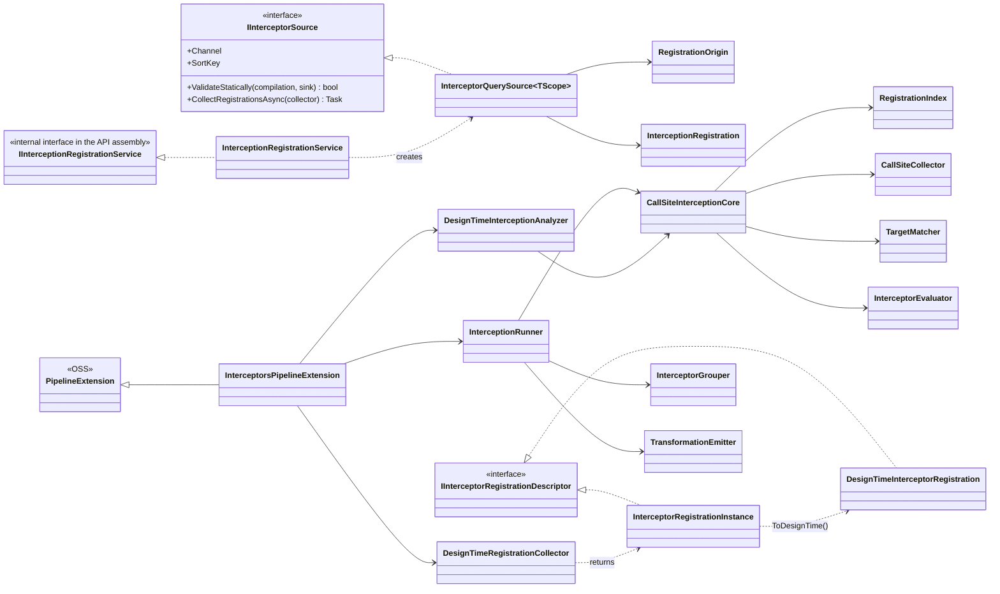
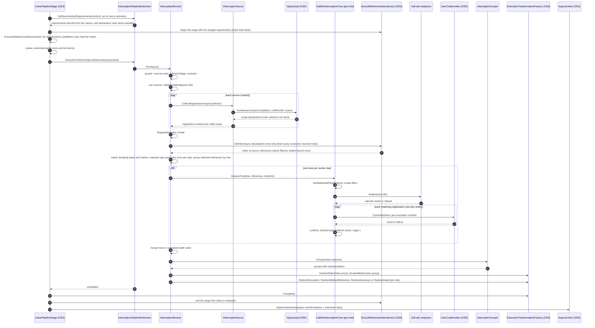

# Premium engine architecture

> Part of the [call-site interceptors design](README.md). Previous: [08-deduplication-and-naming.md](08-deduplication-and-naming.md) | Next: [10a-oss-bridge-hook-factory.md](10a-oss-bridge-hook-factory.md). Evidence prefixes and terms: [00-conventions.md](00-conventions.md).

## 9. Premium engine architecture

### 9.1 Assemblies, packaging and licensing

#### 9.1.1 Projects

PROPOSED. The package mirrors the layout of Metalama.Extensions.Validation.

| Project (under P27) | Assembly name | Target frameworks | References | Mirrors (EXISTING) |
|---|---|---|---|---|
| `Metalama.Extensions.Interceptors` | `Metalama.Extensions.Interceptors` (PackageId `Metalama.Extensions.Interceptors.Redist`) | netstandard2.0;net10.0 | `Metalama.Framework.Redist` | P27 `Metalama.Extensions.Validation\Metalama.Extensions.Validation.csproj:4-5, 12` |
| `Metalama.Extensions.Interceptors.Engine` | `Metalama.Extensions.Interceptors.Engine.$(ThisRoslynVersionNoPreview)`, which is 5.11.0 | net472;net10.0 | `Metalama.Framework.Implementation.$(ThisRoslynVersionNoPreview)`, the API project | P27 `Metalama.Extensions.Validation.Engine\Metalama.Extensions.Validation.Engine.csproj:3, 7, 10, 22-23` |
| `Metalama.Extensions.Interceptors.Engine.5.0.0` | `Metalama.Extensions.Interceptors.Engine.5.0.0` | net472;net10.0 | Source-linked from the Engine project, imports `Roslyn.5.0.0.props` | P27 `Metalama.Extensions.Validation.Engine.5.0.0\Metalama.Extensions.Validation.Engine.5.0.0.csproj:6-10` |
| `Metalama.Extensions.Interceptors.Package.Resources` | Executable that builds both engine variants | net10.0;net472 | Both engines, `PrivateAssets=all` | P27 `Metalama.Extensions.Validation.Package.Resources\...csproj:4-6, 26-27` |
| `Metalama.Extensions.Interceptors.Package` | PackageId `Metalama.Extensions.Interceptors`; no lib folder; assemblies under `metalama/<tfm>` | netstandard2.0 | `Metalama.Framework`, `Metalama.Licensing`, the API project | P27 `Metalama.Extensions.Validation.Package\Metalama.Extensions.Validation.Package.csproj:7, 35-53` |

No project references another premium extension package.

The API project grants `InternalsVisibleTo` to both engine variants, as P27 `Metalama.Extensions.Validation\Metalama.Extensions.Validation.csproj:15-18` does, and also to the unit test assemblies of the interceptor engine. It ships `build\Metalama.Extensions.Interceptors.Redist.props` and its `buildTransitive` twin, which declare the API as a `MetalamaCompileTimeAssembly`, and a `MetalamaExtensionAssemblies.props` for consumers that use a project reference (P27 `Metalama.Extensions.Validation\MetalamaExtensionAssemblies.props:5-16`).

#### 9.1.2 Package props

```xml
<Project>
    <ItemGroup>
        <!-- The API assembly is listed first so that it is loaded before the extension types are instantiated. -->
        <MetalamaExtensionAssembly Include="$(MSBuildThisFileDirectory)../metalama/net472/Metalama.Extensions.Interceptors.dll" TargetFramework="net472"/>
        <MetalamaExtensionAssembly Include="$(MSBuildThisFileDirectory)../metalama/net10.0/Metalama.Extensions.Interceptors.dll" TargetFramework="net10.0"/>

        <MetalamaExtensionAssembly Include="$(MSBuildThisFileDirectory)../metalama/net472/Metalama.Extensions.Interceptors.Engine.5.11.0.dll" TargetFramework="net472" TargetRoslynVersion="5.11.0"/>
        <MetalamaExtensionAssembly Include="$(MSBuildThisFileDirectory)../metalama/net10.0/Metalama.Extensions.Interceptors.Engine.5.11.0.dll" TargetFramework="net10.0" TargetRoslynVersion="5.11.0"/>
        <MetalamaExtensionAssembly Include="$(MSBuildThisFileDirectory)../metalama/net472/Metalama.Extensions.Interceptors.Engine.5.0.0.dll" TargetFramework="net472" TargetRoslynVersion="5.0.0"/>
        <MetalamaExtensionAssembly Include="$(MSBuildThisFileDirectory)../metalama/net10.0/Metalama.Extensions.Interceptors.Engine.5.0.0.dll" TargetFramework="net10.0" TargetRoslynVersion="5.0.0"/>

        <MetalamaPremiumComponent Include="Metalama.Extensions.Interceptors" />
    </ItemGroup>
</Project>
```

EXISTING precedent: P27 `Metalama.Extensions.Validation.Package\build\Metalama.Extensions.Validation.props:5-14`. The `buildTransitive` props import this file.

#### 9.1.3 Extension export

```csharp
// Metalama.Extensions.Interceptors.Engine/InterceptorsPipelineExtension.cs
[assembly: ExportExtension( typeof(InterceptorsPipelineExtension), ExtensionKinds.Default )]

namespace Metalama.Extensions.Interceptors.Engine;

/// <summary>Connects the interceptor engine to the Metalama pipeline.</summary>
[UsedImplicitly]
public sealed class InterceptorsPipelineExtension : PipelineExtension
{
    public override bool Initialize( PipelineExtensionInitializationContext context )
    {
        context.ServiceBuilder.Add( _ => new InterceptionRegistrationService() );

        // Loads Metalama.Extensions.Interceptors.dll before any compile-time code resolves the service.
        _ = typeof(IInterceptionRegistrationService);

        var discovery = context.ServiceProvider.GetRequiredService<DiagnosticDefinitionDiscoveryService>();
        context.AddDiagnosticDefinitions( discovery.GetDiagnosticDefinitions( typeof(InterceptorDiagnosticDescriptors) ) );

        return true;
    }

    // Registration-time checks (section 9.4.7).
    public override Task ExecuteContributorsAsync(
        AspectPipelineConfiguration pipelineConfiguration,
        CompilationModel initialCompilation,
        UserDiagnosticSink diagnosticSink,
        ImmutableArray<IPipelineContributor> contributors,
        CancellationToken cancellationToken )
        => RegistrationValidator.ValidateSourcesAsync( initialCompilation, diagnosticSink, contributors.OfKind( InterceptorContributorKinds.InterceptorSource ), cancellationToken );

    // Requirements for the shared index of source references (sections 9.5.3 and 10.7.5).
    public override SourceIndexRequirements GetSourceIndexRequirements( SourceIndexRequirementsContext context )
        => InterceptionRunner.GetIndexRequirements( context );

    // Compile time, preview, live templates and introspection (section 9.5; hook of section 10.3).
    public override Task ExecuteTransformingContributorsAsync( ExtensionTransformationContext context, CancellationToken cancellationToken )
        => new InterceptionRunner( context ).RunAsync( cancellationToken );

    // Design time, Phase A (section 9.7.1).
    public override Task<ExtensionPipelineContributorsResult> ExecuteDesignTimePipelineContributorsAsync(
        AspectPipelineConfiguration pipelineConfiguration,
        IEnumerable<IPipelineContributor> contributors,
        CompilationModel initialCompilation,
        CompilationModel finalCompilation,
        CancellationToken cancellationToken )
        => DesignTimeRegistrationCollector.CollectAsync( pipelineConfiguration, contributors, initialCompilation, finalCompilation, cancellationToken );

    // Design time, Phase B (section 9.7.4).
    public override ImmutableUserDiagnosticList AnalyzeSemanticModel(
        AspectPipelineConfiguration pipelineConfiguration,
        SemanticModel semanticModel,
        DesignTimeAspectPipelineResultExtensionCollection extensions,
        AspectRepository aspectRepository,
        CancellationToken cancellationToken )
        => DesignTimeInterceptionAnalyzer.Analyze( pipelineConfiguration, semanticModel, extensions, aspectRepository, cancellationToken );

    // ExecutePipelineContributorsAsync, GetTransitiveManifestExtensions and GetPipelineContributorsFromTransitiveManifest
    // are not overridden in version 1. Interceptor registrations are project-local and never written to a manifest.
}
```

EXISTING precedent for every overridden member: P27 `Metalama.Extensions.Validation.Engine\ValidationPipelineExtension.cs:21-146`. EXISTING hook signatures: ENG27 `Extensibility\PipelineExtension.cs:26-80`.

#### 9.1.4 Build program

PROPOSED changes to `eng\src\Program.cs` of `metalama/Metalama.Premium` (2027.0 line):

- Add the two packages `Metalama.Extensions.Interceptors` and `Metalama.Extensions.Interceptors.Redist` to the public artifacts (EXISTING list at lines 91-99).
- Add a `ProjectUsageInfo` for `Metalama\.Extensions\.Interceptors\.(Engine|Package(\.Resources)?)` with the dependent package `Metalama.Extensions.Interceptors` (EXISTING pattern at lines 105-106).
- Add the package to the dependent packages of `Metalama.Licensing` (lines 108-109).
- Add an `MsbuildSolution` entry for `src\Tests\Standalone\Interceptors\Interceptors.sln`, so that the licensing task runs under MSBuild (lines 86-88).

#### 9.1.5 Licensing

EXISTING: licensing is enforced only at MSBuild time by `VerifyMetalamaLicense`, which consumes one `MetalamaExtensionLicenseRequirement` per `MetalamaPremiumComponent` item (P27 `Metalama.Licensing\build\Metalama.Licensing.targets:82-90`). The eligible products are Metalama Professional, Metalama Enterprise, PostSharp Framework, PostSharp Ultimate and the legacy Metalama Starter and Metalama Ultimate products. Metalama Community is not eligible (SharpCrafters.Backstage `Metalama.Backstage\Licensing\MetalamaExtensionLicenseRequirement.cs:19-30`).

PROPOSED: the Package project references `Metalama.Licensing` and declares its own component. No open-source or Backstage change is needed for the Professional tier (PO3). Because the props are in `buildTransitive`, every project downstream of a project that references the package loads the engine and is license-checked, even when the library intercepts only its own code. A library that intercepts only its own code references the package with `PrivateAssets="all"`. A library that ships a `TransitiveProjectFabric` that registers interceptors cannot do so (section [9.9.2](#992-licensing-implications)).

### 9.2 Sharing with Metalama.Extensions.Validation (R5)

Decision (RC23 as revised by RC47, decision PO46): interceptors share one thing with reference validators, the scan pass. The open-source `SourceReferenceIndexService` builds one index of the references of the source compilation per high-level stage, from the merged requirements of all extensions. Validators and interceptors read the same index, and a member body that both need is bound once (section [9.2.4](#924-shared-scan-pass) and section [10.7.5](10c-oss-reference-graph-design-time.md#1075-shared-index-of-source-references)). The member names of the interceptor registrations are the requirements that the interceptor engine adds to the index (section [9.2.3](#923-name-requirements)).

Interceptors depend on no other premium package. They do not depend on Validation or on Architecture, and they change no type of these packages. R5 rests on the shared index, and on the migration of the Validation engine to it (F20).

#### 9.2.1 Options considered

| Criterion | A. Reference the Validation package, as Architecture does | B. Extract a shared premium assembly | C. Open-source walker plus a shared internal source folder (first choice) | D. Shared scan pass plus a neutral predicate package (second choice, withdrawn) | E. Shared scan pass only (chosen) |
|---|---|---|---|---|---|
| Licensing | The Validation props declare the Validation component (P27 `Metalama.Extensions.Validation.Package\build\Metalama.Extensions.Validation.props:14`). Every interceptor project would declare it. | Isolation preserved. | Isolation preserved. | Isolation preserved when the neutral package declares no premium component. | Isolation preserved. |
| Versioning | Interceptors would depend on Validation internals through a new `InternalsVisibleTo`. | Moving `ReferenceEnd` and related types out of Validation is a breaking change, or needs type forwarding. A new package must ship. | No new binary, no type moves. | A new package ships. The move is a breaking change for Architecture users. | No new binary, no type moves, no breaking change. |
| Benefit | Reuse of `ReferenceEnd` and Architecture predicates, which requires `InternalsVisibleTo` because their constructors are internal (P27 `Metalama.Extensions.Validation\ReferenceValidationContext.cs:110`; `ReferenceEnd.cs:75`). | Same, at a higher cost. | The walker and its fixes are shared, but each feature binds the same bodies again. | One binding per body for both features; one predicate language. | One binding per body for both features. |
| Runtime cost | The Validation engine loads into every interceptor project. | A third engine assembly loads. | Two scans and two bindings when both features are used. | One scan and one binding per stage, after the Validation migration of F20. | Same as D. |

Option B was rejected in the first version of this design because of its breaking change. Option D was option B with the shared scan pass and a predicate analysis. The third product-owner batch replaced target predicates by declaring types and member names (RC46), so the predicate language brings nothing to interceptors, and option E keeps the only benefit that remains: one scan and one binding per stage (RC47).

#### 9.2.2 Withdrawn: the package Metalama.Extensions.References

The second product-owner review adopted a new neutral package, `Metalama.Extensions.References` (RC35, PO45, PO47). The predicates of Architecture would have moved into it, together with `ReferenceEnd`, `ReferenceEndRole` and `ReferenceGranularity` of Validation, and a new base class `ReferenceContext` would have been shared by `ReferenceValidationContext` and `InterceptionContext`. The move renamed `ValidatedRole` to `Role` and changed the parameter of `ReferencePredicate.IsMatchCore` (P27 `Metalama.Extensions.Architecture\Predicates\ReferencePredicate.cs:51`), which broke user predicates (CS0115).

The third product-owner batch withdrew the extraction (RC47). No package is created, no type moves, nothing is renamed: `ValidatedRole` and `IsMatchCore( ReferenceValidationContext )` stay, and no breaking change ships. The reason is RC46: interceptors select targets by declaring type and member names, so they no longer evaluate reference predicates, and the shared base class and the predicate analysis have no consumer. The option is recorded in the table of section [5.3.12](05a-api-registration.md#5312-target-selection-options-considered) as considered and not adopted.

#### 9.2.3 Name requirements

The interceptor engine needs no analysis of predicates: the member names of every method and accessor registration are explicit (section [5.3.3](05a-api-registration.md#533-target-selection-for-members)). The engine gives them to the shared index as requirements, so the index binds only the member bodies that contain one of the names (section [9.5.3](#953-registration-index-and-index-requirements)). Name rules, which let the engine compare the names with the identifier that the walker records:

- A generic call is recorded under the bare identifier, without type arguments, for example `Select` for `Select<int>( ... )`.
- A classic extension method has the same name in its reduced form and in its static form.
- An override and an implicit interface implementation have the name of the method that they override or implement, so the names are compatible with every `MethodMatching` policy.
- An explicit interface implementation cannot be called by its own name. It is called through the interface method, whose name the registration states.
- A property or an event is recorded under its own name, both for a read and for an assignment (section [6.2.11](06a-call-site-model.md#6211-accessor-sites)).

Memoization. The engine evaluates a type predicate once per registration and per distinct type definition of the run, and memoizes the result (section [9.5.5](#955-target-matching)). A declaring type given as a `Type` or an `INamedType` needs no evaluation: the engine compares definitions. This memoization saves user-code evaluation, which is cheap compared with binding (section [9.6](#96-cost-model-and-shared-binding)).

No registration is unconstrained, because the names are mandatory. The hidden cost hint LAMA1009, which reported a method registration without names over a namespace or the compilation, is withdrawn (section [9.11.2](#9112-premium-diagnostics)). Await registrations cannot be filtered by name, because an await reference has no identifier (section [5.3.4](05a-api-registration.md#534-await-registrations)).

#### 9.2.4 Shared scan pass

The interceptor engine does not walk syntax itself. It reads the index of the stage from `SourceReferenceIndexService` (section [10.7.5](10c-oss-reference-graph-design-time.md#1075-shared-index-of-source-references)):

1. Before the first hook of the stage, `LinkerPipelineStage` calls `GetSourceIndexRequirements` on every extension. The interceptor engine returns, for each method registration, one requirement of the kinds `ReferenceKinds.Invocation` and `ReferenceKinds.Default` per name, for each accessor registration one requirement of the kinds `ReferenceKinds.Default` and `ReferenceKinds.Assignment` per name, and for each await registration one requirement of kind `ReferenceKinds.Await` (section [9.5.3](#953-registration-index-and-index-requirements)).
2. The service merges the requirements of all extensions. Name filters merge per reference kind by union. Filtering is disabled only for a kind for which some consumer is unconstrained, which the interceptor engine never is for `Invocation`, `Default` and `Assignment`.
3. The interceptor engine reads the index keyed by referenced symbol. It matches the declaring type of each referenced definition with the registrations whose names contain the name of the symbol, and evaluates a type predicate once per distinct type definition (section [9.2.3](#923-name-requirements)). It then filters the referencing nodes by scope. Finally, it calls `GetOperation` on the body, which is already bound, to obtain the constructed method or accessor, the receiver and the arguments.

The Validation engine builds its own index today (P27 `Metalama.Extensions.Validation.Engine\ReferenceValidatorRunner.cs:66-79`). It migrates to the shared index in a separate change, fix-track item F20. Until then, both scans run as today, and the behavior of validators does not change.

#### 9.2.5 Internal helpers of the interceptor engine

The first version of this design planned a source folder shared with the Validation engine. With the shared scan pass, the remaining helpers are small, and they are internal to the interceptor engine. The Validation engine keeps its own code.

| Type | Responsibility | Generalizes (EXISTING) |
|---|---|---|
| `UserDelegateDriverCache<TContext, TResult>` | Compiles an expression-tree invoker per `MethodInfo` and caches it in a static `WeakCache`. | P27 `...\ValidatorDriverFactory.cs:14-60` |
| `ContributorQueue<T>` | Lazily allocated `ConcurrentQueue` used by collectors. | P27 `...\ValidatorInstanceCollector.cs` |
| `AspectStateResolver` | Returns `IAspectInstance.AspectState` from an `AspectPredecessor`, or null for a fabric. | P27 `...\ValidatorImplementation.cs:22-27` |
| `PerInvocationExecutionContext` | Creates one `UserCodeExecutionContext` per user-code invocation. | Replaces the shared context of P27 `...\ReferenceValidatorRunner.cs:98-104, 151` |
| `SourceOrderComparer` | Orders syntax nodes by normalized relative path, span start and span length (section [8.6](08-deduplication-and-naming.md#86-representative-order)). | None |

### 9.3 Engine components

The engine separates four concerns: registration, a call-site core shared by compile time and design time, the compile-time grouping and emission, and the design-time adapters. The shared core keeps design-time and compile-time results consistent.



| Component (PROPOSED) | Responsibility | Runs in |
|---|---|---|
| `InterceptionRegistrationService` | Implements `IInterceptionRegistrationService`. Converts each registration into an `InterceptorQuerySource` and adds it to the query owner. | `BuildAspect`, `AmendProject`, `AmendNamespace`, `AmendType` |
| `InterceptorQuerySource<TScope>` | The contributor (premium `ContributorKind`). Holds the query, the `InterceptionRegistration` and the origin. | Pipeline state, or the pipeline configuration for static fabrics |
| `RegistrationValidator` | Static checks of a source that do not need the scan. | `ExecuteContributorsAsync`, then silently again in the hook |
| `InterceptorRegistrationInstance` | One source applied to one scope declaration. Per run. Implements `ITransitivePipelineContributor` only for the design-time path. | Hook, Phase A |
| `DesignTimeInterceptorRegistration` | Durable form of a registration. | Per-file design-time results |
| `RegistrationIndex` | Maps scope keys to registration descriptors, and computes the requirements for the shared index of source references. | Hook, Phase B |
| `CallSiteInterceptionCore` | For one syntax tree: scan, match, analyze call sites, evaluate user interceptors, detect conflicts, run stage 1. | Hook (per tree, in parallel), Phase B (the analyzed tree) |
| `CallSiteCollector` | Converts scanner references into candidate call sites. | Inside the core |
| `TargetMatcher` | Matches a referenced definition with the names, the declaring types, the accessor kinds and the matching policies of the registrations, evaluates the type predicates with their memoization per type definition, and applies the await filters. | Inside the core |
| `InterceptorEvaluator` | Invokes user interceptors through `UserCodeInvoker` with a per-invocation context, and the `configure` function of a template result or the `bind` function of an existing-method result in the same context. | Inside the core |
| `ReceiverMappingResolver`, `InterceptorSignatureBuilder`, `InterceptorBuilder`, `InterceptorMethodBinder`, `ArgumentPlanBuilder`, `PulledParameterGuard` | Stage 1 for invocations: receiver mapping, signature derivation, the adjustments and bindings of the `configure` and `bind` functions, the argument plan and the pull guard (sections [5.6.8](05b-api-providers-contexts-results.md#568-parameter-binding-and-the-signature-builder) to [5.6.10](05b-api-providers-contexts-results.md#5610-the-callers-instance-and-method-reference-sites), [6.4](06b-signatures-and-validation.md#64-signature-derivation)). | Inside the core |
| `InterceptorSignatureValidator` | Validates an existing method after its `bind` function, or a synthesized signature after its `configure` function, with their bindings, with the rules E1 to E21 (section [6.6](06b-signatures-and-validation.md#66-signature-validation-existing-methods-and-adjusted-signatures-r9)). | Inside the core |
| `InterceptorGrouper` | Stage 2: groups requests and selects representatives. | Hook only |
| `TransformationEmitter` | Calls the open-source factory. | Hook only |
| `DesignTimeRegistrationCollector` | Phase A: collects registrations and returns them as transitive contributors. | Design-time pipeline |
| `DesignTimeInterceptionAnalyzer` | Phase B: runs the core on one semantic model, without stage 2. | `TheDiagnosticAnalyzer` |
| `InterceptorDiagnosticDescriptors` | The diagnostic definitions of section [9.11](#911-diagnostics-catalog). | All |

### 9.4 Registration

#### 9.4.1 Timeline

| Moment | EXISTING hook or call site | Interceptor work (PROPOSED) |
|---|---|---|
| Static fabrics execute | `FabricManager.ExecuteFabrics`: project fabrics, then transitive project fabrics, then namespace fabrics (ENG27 `Fabrics\FabricManager.cs:46-131`, order at 120-123). Contributors are stored in `AspectPipelineConfiguration.FabricsContributors`. | Sources are created and added to the static amender. They are durable. |
| Fabric contributors are checked | ENG27 `Pipeline\AspectPipeline.cs:723-737` calls `ExecuteContributorsAsync` once per pipeline execution. | `RegistrationValidator` reports registration errors of fabric sources. |
| An aspect executes | `AspectDriver` calls `BuildAspect`, disposes the builder (ENG27 `Aspects\AspectDriver.cs:273`), computes the outcome (line 279), then calls `ExecuteContributorsAsync` for outcomes other than Error and Ignore (lines 283-305). | Sources are added to the aspect builder. `RegistrationValidator` reports errors, which are merged into the aspect result without changing the outcome. |
| Contributors accumulate | ENG26 `Pipeline\ExecuteAspectLayerPipelineStep.cs:135-147`; ENG26 `Pipeline\PipelineStepsState.cs:99`. | Nothing. |
| End of a high-level stage, compile time | ENG27 `Pipeline\CompileTime\LinkerPipelineStage.cs:47-56` runs `ExecutePipelineContributorsAsync`, then builds the linker. | The new hook runs between these two steps (section [10.3](10a-oss-bridge-hook-factory.md#103-transforming-pipeline-hook-b2b)). |
| End of a design-time stage | ENG26 `Pipeline\DesignTime\DesignTimePipelineStage.cs:35-47`. | Phase A. |
| Each analyzed file | DT27 `DiagnosticAnalysis\TheDiagnosticAnalyzer.cs:191-211`. | Phase B. |

#### 9.4.2 Query path (fabrics and IAspectBuilder.Outbound)

`InterceptionRegistrationService.Register(IQuery<TScope>, registration)` copies the EXISTING validator steps of P27 `...\Queries\ValidationReferenceValidationQueryService.cs:84-111`:

1. Cast the query to the public `IQueryImpl<TScope>` (ENG27 `Queries\IQueryImpl.cs:21-36`) and call `OnChildAdded`.
2. Delegates are not checked at registration. They may be lambdas, and the durability analyzer has checked them at the `[Durable]` parameter when the user code was compiled (section [5.3.9](05a-api-registration.md#539-registration-rules)). The validator step that checks the owner method has no counterpart.
3. The registration already stores the declaring type as an `IDurableRef<INamedType>` of its definition, or a `[Durable]` type predicate, and the names as strings (section [5.2](05a-api-registration.md#52-seam-between-the-public-api-and-the-engine)). An await registration stores no type (RC58).
4. Capture the origin with `ExtensionContributionOrigin.Capture( queryImpl.Owner )` (section [10.2.3](10a-oss-bridge-hook-factory.md#1023-contribution-origin)), and build a `RegistrationOrigin` (section [9.4.5](#945-source-object-and-durable-capture)).
5. Create an `InterceptorQuerySource<TScope>` and call `queryImpl.Owner.AddContributor( source )`.

#### 9.4.3 Adviser path (aspects and type fabrics)

`InterceptionRegistrationService.Register(IAdviser<TScope>, registration)` uses the open-source adviser bridge (section [10.2](10a-oss-bridge-hook-factory.md#102-adviser-bridge-b2a)):

1. `var context = adviser.GetExtensionContext();` This works for every `IAdviser` implementation except the result of `IntroduceAttribute`, which throws `NotSupportedException`. The result of an introduction whose outcome is Error or Ignore throws `InvalidOperationException`. The user-code invoker reports both exceptions.
2. `context.ThrowIfDisposed();` A registration after `BuildAspect`, or from inside an interceptor or a template, throws.
3. No delegate check, as in step 2 of the query path.
4. Check that `adviser.Target` is contained in the containing declaration of `context.AspectTarget` (the compilation, the namespace, or the closest named type). When the check fails, the source is marked invalid, and `RegistrationValidator` reports LAMA1000 in `ExecuteContributorsAsync`, like the other registration errors of section [9.4.7](#947-registration-time-checks) (RC19). The diagnostic is not reported through the adviser, because an error reported during `BuildAspect` gives the aspect the Error outcome and discards all its advice (ENG27 `Aspects\AspectBuilderState.cs:78-95`).
5. When the registration has no template provider, use `context.TemplateProvider`, which honors `WithTemplateProvider`.
6. Create the query with `context.CreateQuery( adviser.Target )`, capture the origin with `context.CaptureOrigin()`, and continue with step 5 of the query path.

An `ITypeAmender` is both an `IAdviser<INamedType>` and an `IQuery<INamedType>`. The `ITypeAmender` overloads of section [5.3.8](05a-api-registration.md#538-itypeamender-overloads) take the query path.

#### 9.4.4 Contributor kinds

```csharp
namespace Metalama.Extensions.Interceptors.Engine;

internal static class InterceptorContributorKinds
{
    /// <summary>A registration made by an aspect or a fabric. It flows through the pipeline to the extension hooks.</summary>
    public static ContributorKind<IInterceptorSource> InterceptorSource { get; } = new( nameof(InterceptorSource) );

    /// <summary>A source applied to one scope declaration. It is returned only by Phase A.</summary>
    public static ContributorKind<InterceptorRegistrationInstance> InterceptorRegistration { get; } = new( nameof(InterceptorRegistration) );

    /// <summary>The durable design-time form of a registration. It is project-local.</summary>
    public static ContributorKind<DesignTimeInterceptorRegistration> DesignTimeInterceptorRegistration { get; } =
        new( nameof(DesignTimeInterceptorRegistration) ) { IsProjectLocal = true };
}
```

EXISTING: a premium `ContributorKind` is an extension kind by default, because `IsExtension` is an internal init property that defaults to true (ENG27 `Extensibility\ContributorKind.cs:23`). `IsDesignTimeValidator` stays false (line 25), so the design-time form does not enter the validator index, which is merged into referencing projects. `IsProjectLocal` is the new open-source property of section [10.8.1](10c-oss-reference-graph-design-time.md#1081-contributorkindisprojectlocal). Without it, every non-validator design-time extension is exported to the design-time manifest.

#### 9.4.5 Source object and durable capture

```csharp
internal enum InterceptorRegistrationChannel
{
    /// <summary>Project, namespace and transitive project fabrics. The source lives in the pipeline configuration and is replayed in every run and stage.</summary>
    StaticFabric,

    /// <summary>Aspects and type fabrics. The source exists only in the run and stage in which the aspect executed.</summary>
    Aspect
}

internal interface IInterceptorSource : IExtensionPipelineContributor
{
    InterceptorRegistrationChannel Channel { get; }

    /// <summary>Gets a stable key that orders sources deterministically and identifies the source across design-time runs.</summary>
    string SortKey { get; }

    RegistrationOrigin Origin { get; }

    /// <summary>Performs the checks that do not need the call-site scan. Reports errors when <paramref name="diagnostics"/> is not null.</summary>
    bool ValidateStatically( CompilationModel compilation, IDiagnosticAdder? diagnostics );

    /// <summary>Evaluates the scope query and adds one registration instance per valid scope declaration.</summary>
    Task CollectRegistrationsAsync( InterceptorRegistrationCollector collector );
}

internal sealed class RegistrationOrigin
{
    public InterceptorRegistrationChannel Channel { get; }

    /// <summary>Gets IQueryOwner.DiagnosticSourceDescription, captured as a string.</summary>
    public string OwnerDescription { get; }

    /// <summary>Gets OwnerDescription followed by a sequence number allocated per registering instance (section 9.4.6).</summary>
    public string SortKey { get; }

    /// <summary>Gets the predecessor of the owner: a fabric instance or an aspect instance.</summary>
    public AspectPredecessor Predecessor { get; }

    public TemplateProvider DefaultTemplateProvider { get; }

    /// <summary>
    /// Gets the open-source origin. For static fabrics, it holds no aspect instance and no template class instance, so it
    /// holds no compilation-bound state and can be kept in the configuration (section 10.2.3). For aspects, it is per run.
    /// </summary>
    public ExtensionContributionOrigin ContributionOrigin { get; }
}

internal sealed class InterceptorQuerySource<TScope> : IInterceptorSource
    where TScope : class, IDeclaration
{
    private readonly IQueryImpl<TScope> _query;
    private readonly InterceptionRegistration _registration;

    public ContributorKind ContributorKind => InterceptorContributorKinds.InterceptorSource;

    // Other members as declared by IInterceptorSource.
}
```

Durability rules (grounded in DOCS27 `design-time-memory.md:28-47, 269-305`):

- A static-fabric source lives in the long-lived pipeline configuration. It may hold the amender query (made durable by the fix of issue #1799, ENG27 `Fabrics\FabricDriver.BaseAmender.cs:47-90`), durable references, the user interceptor object, delegates to fabric methods, the fabric template provider, and a fabric origin. It must hold no `IDeclaration`, `ISymbol`, `CompilationModel` or `UserCodeExecutionContext`.
- An aspect source is per run, but it follows the same rules, so that a single type serves both channels.
- The provider interfaces carry `[Durable]`, so the `DurableContractAnalyzer` checks every user provider (LAMA0870, LAMA0876).
- `UserCodeRetentionAnalyzer` walks the fabric contributors (ENG26 `Pipeline\UserCodeRetentionAnalyzer.cs:196`), so static-fabric sources are covered by `MetalamaDiagnoseMemoryLeaks`.

#### 9.4.6 Channel, sort key and source key

- Channel. When `queryImpl.Owner` is an `IProjectAmender` or an `INamespaceAmender`, the channel is `StaticFabric`. Otherwise it is `Aspect`. Static amenders implement these interfaces (ENG27 `Fabrics\NamespaceFabricDriver.cs:90`; `Fabrics\ProjectFabricDriver.cs:135`), transitive project fabrics use the project amender (ENG27 `Fabrics\FabricManager.cs:121`), and the type-fabric amender forwards `AddContributor` to the aspect builder (ENG27 `Fabrics\TypeFabricDriver.cs:160`).
- Sort key. `OwnerDescription + '#' + ` a sequence number with six digits. The sequence is allocated per registering instance, not per owner. The table is a `ConditionalWeakTable<object, StrongBox<int>>`, which does not keep the instance alive (DOCS27 `design-time-memory.md:214-228`). It is keyed by `IAspectBuilder.AspectInstance` for an aspect builder, and by the fabric instance for an amender. `IAspectBuilder.With` creates a new `AspectBuilder<T>` for each call (ENG27 `Aspects\AspectBuilder.cs:160-170`), and all these builders return the description of the same aspect instance (line 193). A per-owner sequence would therefore give the same key to different registrations of one aspect. For a fabric, `OwnerDescription` also contains the name of the assembly that declares the fabric, because `BaseAmender` describes a fabric only by the full name of its type (ENG27 `Fabrics\FabricDriver.BaseAmender.cs:130`). The engine asserts that no two sources of a run have the same key. The key is stable across design-time runs, because a static fabric runs once per configuration and `BuildAspect` is deterministic.
- Source key. The source is the registering aspect instance or fabric instance. The source key is the owner part of the sort key: `OwnerDescription` and the registering instance, without the sequence number. Registrations of one source are counted once at a site (section [9.5.8](#958-conflict-detection-r7-b7)), including two registrations of one owner that overlap on a site, such as a base type and a derived type with `MethodMatching.Overrides`. The string survives the conversion to the design-time form, where object identity is lost.

#### 9.4.7 Registration-time checks

`RegistrationValidator.ValidateSourcesAsync` calls `ValidateStatically(compilation, sink)` on each source. The compilation is the revision before the aspect (ENG27 `Aspects\AspectDriver.cs:295`) or the initial compilation for fabrics. The checks do not evaluate the scope query.

| Check | Diagnostic |
|---|---|
| The declaring type, stored as a durable reference, resolves in the current compilation. It does not resolve when, for example, the design-time compilation no longer references its assembly. | LAMA1003 |
| The scope of an adviser registration is contained in the containing declaration of the aspect target. The result of the check is computed at registration (section [9.4.3](#943-adviser-path-aspects-and-type-fabrics), step 4) and stored in the source. | LAMA1000 |
| The declaring type is not introduced by an aspect. Uses of the members of an introduced type do not exist in the source code. | LAMA1004 |
| For a declaring type given as a `Type` or an `INamedType`, each name designates at least one member of the right kind, declared or inherited: an ordinary method, a classic extension method or a C# 14 extension method for `InterceptMethods`, and a property or an event that has an accessor of the requested kind for `InterceptAccessors`. The message advises the other verb when the name designates a member of the other kind. No check is possible for a type predicate. | LAMA1008 (warning) |
| A shorthand template resolves on its template provider and is a method template, through the template-existence helper of section [10.6.1](10b-oss-linker-and-templates.md#1061-selection-at-declaration-time). | LAMA1005 |
| The type of a shorthand placement is a class, struct or record declared in the source of the current project, not a compile-time type, not introduced by an aspect. | LAMA1006 |

The outcome of the aspect is not changed by these diagnostics (ENG27 `Aspects\AspectInstanceResult.cs:40-46`), so the source still reaches the hook. The hook calls `ValidateStatically` again with a null sink and drops invalid sources silently. The checks are cheap, and this avoids both duplicate diagnostics and mutable state on contributors.

#### 9.4.8 Registration collection

Collection is shared by the compile-time hook and by Phase A.

```csharp
internal sealed record InterceptorRegistrationCollector(
    CompilationModel Compilation,          // The scanned compilation, section 9.5.2.
    UserDiagnosticSink Diagnostics,
    CancellationToken CancellationToken )
{
    private readonly ContributorQueue<InterceptorRegistrationInstance> _registrations = new();

    public void Add( InterceptorRegistrationInstance registration ) => this._registrations.Add( registration );

    /// <summary>Returns the registrations sorted by source sort key, then by the deterministic order of the scope declaration.</summary>
    public ImmutableArray<InterceptorRegistrationInstance> ToSortedArray();
}
```

`InterceptorQuerySource.CollectRegistrationsAsync` calls `IQueryImpl.InvokeAsync` with the definition LAMA1000. `InvokeAsync` executes the user selectors under the owner's `UserCodeInvoker` and reports LAMA1000 for any selected declaration that is not contained in the query root (ENG27 `Queries\Query.cs:445-503`). For each selected scope:

1. Reject a scope that is not a namespace, a named type, a member or the compilation (LAMA1001).
2. Reject an external scope (LAMA1001). `InvokeAsync` does not reject external declarations when the origin is the compilation (ENG27 `Queries\Query.cs:483-484`).
3. Reject a scope introduced by an aspect (LAMA1002).
4. Create the interceptor provider. A per-scope factory is invoked through the owner's `UserCodeInvoker`, as P27 `...\Queries\DynamicReferenceValidatorQuerySource.cs:40-47` does. The tag of an `ITaggedQuery` is consumed here.
5. Add an `InterceptorRegistrationInstance`, which computes its scope key, its index requirements from its names (section [9.5.3](#953-registration-index-and-index-requirements)) and its filing key (section [9.7.2](#972-filing-key)).

### 9.5 Compile-time run

#### 9.5.1 Entry point and guards

`InterceptionRunner.RunAsync` executes in the hook of section [10.3](10a-oss-bridge-hook-factory.md#103-transforming-pipeline-hook-b2b), which runs in every `LinkerPipelineStage` (RC1). The guards run in this order:

1. `sources = context.Contributors.OfKind( InterceptorSource )`. When the set is empty, return. This is the only cost for projects that reference the package without using it.
2. Stage check:

| Condition | Behavior |
|---|---|
| `context.IsSourceStage` | Continue with step 3. |
| `!IsSourceStage` | Report LAMA1007 for each interceptor source in `context.ContributorsAddedInStage` (an aspect of a later stage registered it). Ignore the others, which are replays of static-fabric sources already processed. Return. |

Stage 0 is always the source stage. `AspectPipeline` inserts the high-level system aspect layers before all user layers (ENG27 `Pipeline\AspectPipeline.cs:333-341`), and adjacent high-level layers form one stage (lines 351-358), so no weaver can run before the first high-level stage. The engine asserts that `IsSourceStage` equals `HighLevelStageIndex == 0`. No diagnostic exists for the opposite case.

3. When `context.ExecutionScenario.CapturesNonObservableTransformations` is false, return. This is false for design time, code fixes and WPF precompile (ENG27 `CodeModel\ExecutionScenario.cs:39-51`). The hook does not run in these scenarios, so the guard is defensive.
4. Sort the sources by `SortKey` (ordinal). The accumulation order is not deterministic (ENG26 `Pipeline\PipelineStepsState.cs:46`).
5. Drop sources for which `ValidateStatically( compilation, null )` returns false.

#### 9.5.2 The scanned compilation

`scanCompilation = context.SourceCompilationWithFinalAspects`, which is `SourceCompilation.WithAspectRepository( StageFinalCompilation.AspectRepository )` (section [10.3.2](10a-oss-bridge-hook-factory.md#1032-the-context)).

- Validators use the same derivation, so that user code can call `Enhancements().HasAspect` (P27 `Metalama.Extensions.Validation.Engine\ValidationRunner.cs:52`).
- `WithAspectRepository` creates a derived model that shares the `PartialCompilation` (ENG27 `CodeModel\CompilationModel.cs:393`; ENG26 `CodeModel\CompilationModel.cs:331`). The syntax nodes found by the scan are therefore the objects that the linker rewrites.

#### 9.5.3 Registration index and index requirements

```csharp
internal interface IInterceptorRegistrationDescriptor
{
    InterceptionKind Kind { get; }
    InterceptionScopeKey Scope { get; }
    InterceptionScopeOptions ScopeOptions { get; }
    SymbolDictionaryKey? ScopeContainingTypeKey { get; }     // For member scopes: enables a per-tree early exit at design time.
    TypeSelector? Types { get; }                             // Declaring types; null for an await registration.
    ImmutableArray<string> Names { get; }                    // The member names; empty for an await registration.
    MethodKind? AccessorKind { get; }                        // The accessor kind of an accessor registration.
    MethodMatching Matching { get; }
    InterceptorProviderInstance Provider { get; }
    string DiagnosticSourceDescription { get; }
    string SortKey { get; }
    string SourceKey { get; }
}

internal readonly record struct InterceptionScopeKey( InterceptionScopeKind Kind, SymbolDictionaryKey Symbol );

internal enum InterceptionScopeKind { Compilation, Namespace, Type, Member }

internal sealed class RegistrationIndex
{
    public static RegistrationIndex Create( IEnumerable<IInterceptorRegistrationDescriptor> descriptors );

    public bool IsEmpty { get; }

    /// <summary>Gets a value indicating whether a compilation or namespace scope exists, which requires indexing whole trees.</summary>
    public bool HasWideScopes { get; }

    /// <summary>Returns the requirements of the given registrations for the shared index of source references.</summary>
    public IEnumerable<ReferenceIndexerRequirements> GetIndexRequirements( IEnumerable<IInterceptorRegistrationDescriptor> descriptors );

    /// <summary>
    /// Adds the registrations whose scope contains <paramref name="referencingSymbol"/> to <paramref name="result"/>.
    /// Walks the accessor, its associated property or event, the containing types, the containing namespaces and the
    /// compilation. Keeps the innermost scope of each registration, and sorts the result by sort key, so that the
    /// registrations of one source key are adjacent and in registration order (section 9.5.8).
    /// </summary>
    public void GetApplicableRegistrations( ISymbol referencingSymbol, List<IInterceptorRegistrationDescriptor> result );

    /// <summary>Returns false when no registration can apply to a declaration of the given tree (design-time early exit).</summary>
    public bool MayApplyToTree( SyntaxTree tree, SemanticModel semanticModel, CancellationToken cancellationToken );
}
```

All scope keys are `SymbolDictionaryKey` values created with `CreatePersistentKey` (ENG27 `Utilities\Roslyn\SymbolDictionaryKey.cs:46`). Candidate lookups use `CreateLookupKey`, which becomes public (section [10.9](10c-oss-reference-graph-design-time.md#109-small-public-helpers-b2g)) and computes no identifier string for a lookup that misses. The same index type serves the compile-time run and Phase B, which guarantees consistent matching.

The requirements are public `ReferenceIndexerRequirements` records (ENG27 `ReferenceGraph\ReferenceIndexerRequirements.cs:15-19`). The engine derives them from the names of the registrations:

- for a method registration, one requirement `(ReferenceKinds.Invocation, false, DeclarationKind.Method, name)` per name, and the same requirement with `ReferenceKinds.Default` for method-reference sites. A method group is recorded with `Default` (section [3.3](03-background.md#33-reference-index)). The name filter applies to `Default` as it applies to `Invocation`, so a body that contains no selected name is not bound. The analyzer of section [6.2.10](06a-call-site-model.md#6210-method-reference-sites) discards, silently and after binding, the references of kind `Default` to a selected method that are not converted method groups;
- for an accessor registration, one requirement with `DeclarationKind.Property` or `DeclarationKind.Event` per name, for each of the kinds `ReferenceKinds.Default` (reads, increments and decrements) and `ReferenceKinds.Assignment` (assignments, compound assignments, `??=`, and `+=` and `-=` on events), as the walker records them (section [6.2.11](06a-call-site-model.md#6211-accessor-sites)). The accessor kind is applied after binding, by the accessor-site analyzer;
- one requirement `(ReferenceKinds.Await, false, DeclarationKind.Compilation, null)` for each await registration, which cannot be filtered by name. The declaration kind `Compilation` removes `Await` from the kinds that are filtered by identifier (ENG27 `ReferenceGraph\ReferenceIndexerOptions.cs:80-84`).

No member registration produces an unfiltered requirement, because every member registration has names. An earlier version of this design produced one for a predicate without names, with `DeclarationKind.Compilation`, and reported the cost with LAMA1009, which is withdrawn.

`InterceptorsPipelineExtension.GetSourceIndexRequirements` evaluates nothing. It reads the names of the interceptor sources of the stage, and returns the requirements in a `SourceIndexRequirements` record (section [10.7.5](10c-oss-reference-graph-design-time.md#1075-shared-index-of-source-references)). The context gives the high-level stage index, so the engine returns no requirement in a stage other than the source stage, where it reads nothing (section [9.5.1](#951-entry-point-and-guards)).

Scan roots. The engine also returns declaration roots in the result when all its scopes of the stage are types or members: the declaring syntax nodes of these scopes. A root nested in another root is removed. When a scope is a namespace or the compilation (`HasWideScopes`), it returns no roots. The service walks only the declaration roots when every consumer of the stage returned roots, and every tree of `scanCompilation.PartialCompilation.SyntaxTreeCollection` otherwise (RC52). Roots are grouped by syntax tree, and one task handles one tree.

#### 9.5.4 Reading the index

The engine does not walk syntax itself. It reads the index of source references (an `InboundReferenceIndex`, keyed by referenced symbol) that `SourceReferenceIndexService` builds with the open-source walker (section [10.7.5](10c-oss-reference-graph-design-time.md#1075-shared-index-of-source-references)). The walker provides name filtering before binding, lazily created semantic models, attribution of calls in lambdas and local functions to the enclosing member (the scope rule of R2), attribution of initializers, and exclusion of compile-time types. A dedicated premium walker was rejected because it would duplicate this attribution logic and diverge from validators (R5). Reading an index that validators also read removes the second binding of the bodies that both features need (section [9.6](#96-cost-model-and-shared-binding)).

The index is keyed by referenced symbol. For each referenced symbol that is a method, a property or an event, the engine proceeds in this order. The references of kind `ReferenceKinds.Await`, keyed by awaited type, skip step 1, because an await registration has no target selection (RC58): every await reference of the index goes to the scope filter.

1. Match the referenced definition with the registrations of the stage whose names contain its name: its declaring type, or the declaring types of the members that the matching policy walks, must be the declaring type of the registration or satisfy its type predicate (section [5.3.3](05a-api-registration.md#533-target-selection-for-members), [9.5.5](#955-target-matching)). A symbol that no registration matches is skipped with all its references, before any site analysis.
2. For each reference of a matched symbol, `CallSiteCollector` applies the scope and call-site filters below.
3. For each remaining call site, the call-site analysis of section [9.5.6](#956-call-site-analysis) calls `GetOperation` on the body, which the index has already bound, to obtain the constructed method, the receiver and the arguments.

`CallSiteCollector` processes each reference:

1. Keep `ReferenceKinds.Invocation` and `ReferenceKinds.Default` references whose referenced symbol is an `IMethodSymbol`, `ReferenceKinds.Default` and `ReferenceKinds.Assignment` references whose referenced symbol is an `IPropertySymbol` or an `IEventSymbol`, and `ReferenceKinds.Await` references. Reduced extension calls are keyed by the static method, because the open-source builder normalizes `ReducedFrom` (section [10.7.3](10c-oss-reference-graph-design-time.md#1073-reducedfrom-normalization)).
2. Navigate from the recorded name node to the `InvocationExpressionSyntax`, through `MemberAccessExpression.Name`, `MemberBindingExpression.Name`, or the name itself. For a property or an event, navigate to the access expression; the accessor-site analyzer then finds the enclosing assignment, compound assignment or increment (section [6.2.11](06a-call-site-model.md#6211-accessor-sites)). For awaits, the recorded node is the `AwaitExpressionSyntax`.
3. Drop nodes in files classified as generated code unless the registration includes `IncludeGeneratedFiles` (PO12). The engine classifies a file with the rules of Roslyn: the file-name suffixes `.designer.cs`, `.generated.cs`, `.g.cs` and `.g.i.cs`, a leading `<auto-generated>` comment, and the `generated_code` key of the analyzer configuration of the tree. Roslyn's own classifier is internal, and the hook has no analyzer context.
4. Ask `RegistrationIndex.GetApplicableRegistrations` for the referencing symbol, and keep the registrations that matched in step 1. When the list is empty, discard the reference.
5. Deduplicate by syntax node, as a defensive measure after the walker fix of section [10.7.2](10c-oss-reference-graph-design-time.md#1072-proposed-walker-code).

The references are then grouped by syntax tree, and one task processes one tree, in source order (section [9.5.13](#9513-concurrency-and-determinism)).

#### 9.5.5 Target matching

`TargetMatcher` matches a referenced definition with a registration:

- Methods and accessors. The name of the referenced method, property or event must be one of the names of the registration. A method matches only a method registration, and a property or an event only an accessor registration, whose accessor kind the site analysis checks after binding (section [6.2.11](06a-call-site-model.md#6211-accessor-sites)). The declaring type of the referenced definition must be the declaring type of the registration, compared by definition, or satisfy its type predicate. With `MethodMatching.Overrides`, the matcher also tests the declaring type of each member of the overridden chain (`OverriddenMethod`, `OverriddenProperty`, `OverriddenEvent`). With `MethodMatching.InterfaceImplementations`, it also tests the declaring type of each interface member that the referenced member implements. A site made through the interface or the base declaration binds to that declaration and matches directly. The first member that passes is `MatchedMethod`, or the matched accessor of an accessor registration.
- Awaits. An await registration has no target selection, so every await reference matches every await registration of the stage, and only the scope filter of `CallSiteCollector` applies (RC58). Earlier versions compared the awaitable type with a registered type or a type predicate, filtered by `AwaitableKinds`, and looked through `ConfigureAwait` calls.
- Memoization. A type predicate is user code. The engine evaluates it at most once per pair of registration and type definition per run, and memoizes the result per compilation. The cache is a `ConcurrentDictionary` of `Lazy<bool>` values created with `LazyThreadSafetyMode.ExecutionAndPublication`, because `GetOrAdd` can call its value factory more than once under concurrency. An exception thrown by a predicate is reported once, at the predecessor of the registration, to the sink of the hook, and the pair then counts as not matching. This is the only cache of user decisions.

#### 9.5.6 Call-site analysis

The engine calls `InvocationCallSiteAnalyzer.Analyze` (section [6](06a-call-site-model.md#6-call-site-semantics-and-signature-derivation-for-invocations)), `MethodReferenceSiteAnalyzer.Analyze` (section [6.2.10](06a-call-site-model.md#6210-method-reference-sites)), `AccessorSiteAnalyzer.Analyze` (section [6.2.11](06a-call-site-model.md#6211-accessor-sites)) or `AwaitSiteAnalyzer.Analyze` (section [7](07-await-interception.md#7-await-interception)) once per matched site, shared by all matching registrations, and only after target matching. A reference of kind `Invocation` goes to the first analyzer, a reference of kind `Default` to a selected method goes to the second, and a reference to a selected property or event goes to the third. Each accessor use of an accessor site is evaluated with the registrations of its accessor kind. Silent refusals discard the call site. Limitations are exposed through `NonInterceptableReason`.

#### 9.5.7 Evaluation of user interceptor providers

```csharp
internal readonly struct InterceptorProviderInstance
{
    public InterceptorProviderDriver Driver { get; }
    public object Provider { get; }           // The provider instance, or the owner instance (or type) for a delegate.
    public IAspectState? State { get; }       // Read from the aspect instance at evaluation time, after BuildAspect.
}

internal abstract class InterceptorProviderDriver
{
    /// <summary>Invokes the user code. Returns null when the user code threw; UserCodeInvoker has then reported the exception.</summary>
    public abstract InterceptorResult? Invoke(
        in InterceptorProviderInstance provider,
        InterceptionContext context,
        UserCodeInvoker invoker,
        UserCodeExecutionContext executionContext );
}
// Concrete drivers: ClassBasedMethodProviderDriver, ClassBasedAwaitProviderDriver, DelegateProviderDriver,
// ConstantResultProviderDriver (template and existing-method shorthands).
```

This evaluation is the only source of provider diagnostics. It runs in the source stage of every build, and in the analyzer when decision PO26 is accepted (section [9.7.4](#974-phase-b-analyzer)). It does not depend on the linker.

After evaluation, the engine checks that the arguments and tags of a template result contain no inspection-only expression of an interception context (section [5.5.2](05b-api-providers-contexts-results.md#552-methodinterceptioncontext-and-invocationargument)). Such a result is reported with LAMA1014 ("A template argument or tag cannot contain an expression of the interception context, because generated code cannot evaluate it again.") and the call site is not rewritten. The check reads the values through the object reader of the arguments and compares them with the expressions that the engine created for the call site.

At an await site, the engine also checks the template of a template result. A `MethodTemplateSelector` that names an alternative template, or that sets `UseAsyncTemplateForAnyAwaitable` or `UseEnumerableTemplateForAnyEnumerable`, is reported with LAMA1014 ("An await interceptor takes a template name. The template selector names an alternative template, which applies only to method interceptors."), and the site is not rewritten (RC60). A selector that names only a default template is accepted as a template name.

Each evaluation creates its own execution context:

```csharp
var executionContext = UserCodeExecutionContext.CreateInstance(
    serviceProvider,
    UserCodeDescription.Create( "executing the {0} for the call to '{1}'", registration.DiagnosticSourceDescription, callSiteDisplay ),
    scanCompilation,
    diagnostics: treeSink );
```

This avoids the EXISTING defect of the validator runner, which creates one context and assigns its `Description` per validator while validators run concurrently (P27 `Metalama.Extensions.Validation.Engine\ReferenceValidatorRunner.cs:98-104, 151, 195`). `UserCodeExecutionContext.CreateInstance` is public (ENG27 `Utilities\UserCode\UserCodeExecutionContext.cs:169-174`).

The context gives the provider the scope declaration, the origin, the call-site model, the `AspectState` of the predecessor, and a `ScopedDiagnosticSink` whose default location is the call site and whose suppression scope is the origin. This follows P27 `...\ReferenceValidationContextImpl.cs:51, 65-71`.

When user code throws, the call site is not rewritten, even when another registration would apply. `UserCodeInvoker` reports an error, so the build fails in any case, and a partial decision could hide a conflict.

#### 9.5.8 Conflict detection (R7, B7)

1. Registrations of one source are counted once (challenge to B7, adopted). The source is the registering aspect instance or fabric instance (section [9.4.6](#946-channel-sort-key-and-source-key)). `GetApplicableRegistrations` keeps the innermost scope of each registration, which is needed with `IncludeNestedTypes` and with queries that select nested scopes. When several registrations of one source apply to a site, for example a base type and a derived type with `MethodMatching.Overrides`, or a type predicate and a declaring type that it also accepts, the engine evaluates them in registration order and keeps the first result that is not a skip. It does not evaluate the later registrations of that source for the site. The test `Conflicts/SameSource_OverlappingRegistrations_CountedOnce` covers this rule.
2. After evaluation, skip results are discarded. When more than one result remains, from different sources, LAMA1010 is reported at the call site. The message lists the sources in sort-key order. The call site is not rewritten. At an accessor site, the rule applies to each accessor use: the getter use and the setter use of a compound site each accept at most one interceptor, and they can come from different sources.
3. When exactly one result remains and the call site is an invocation, the engine calls `semanticModel.GetInterceptorMethod( invocation )` (RC `CSharpExtensions.cs:1661`). When it returns a method, LAMA1011 is reported and the call site is not rewritten. At compile time, generators run after Metalama, so only hand-written or tool-written interceptors exist in the source compilation. At design time, the analyzer compilation contains the output of all source generators, including their `[InterceptsLocation]` interceptors, for example those of the ASP.NET Core request delegate generator, of the configuration binding generator and of Dapper.AOT. `SourceGeneratorHelper.IsGeneratedFile` recognizes only the trees of the Metalama source generator (ENG27 `Utilities\SourceGeneratorHelper.cs:17-22`). The check therefore runs only at compile time.
4. User providers are evaluated before the C# check, because a skip removes the conflict (R14).
5. An invocation and the `await` that awaits its result are different targets (interpretation I3). Both can be intercepted, and the rewrites nest.

#### 9.5.9 Stage 1

| Result | Engine action |
|---|---|
| Skip | Nothing is rewritten, and the engine reports nothing. A provider that explains a skip reports its own diagnostic (RC42). |
| Result on a call site with `NonInterceptableReason` | LAMA1012 (warning). Nothing is rewritten. |
| Existing method | The method is translated into `scanCompilation`. Invocations: `InterceptorSignatureValidator.ValidateExisting` (section [6.6](06b-signatures-and-validation.md#66-signature-validation-existing-methods-and-adjusted-signatures-r9)). Awaits: `ExistingAwaitInterceptorValidator` (section [7.10.1](07-await-interception.md#7101-existing-method-interceptors)). Failure: LAMA1013 or LAMA1018. Success: a redirection plan, with no synthesis and no grouping. |
| Template | The template must resolve (LAMA1005). A `BaseMostAccessibleType()` placement is first resolved to a type by the walk of section [6.5.6](06b-signatures-and-validation.md#656-base-most-accessible-type). The placement must be admissible with the default receiver mapping (section [6.5](06b-signatures-and-validation.md#65-placement-admissibility), LAMA1015). A local-function placement needs a block or expression body. The `configure` function, when present, runs through `UserCodeInvoker` (section [5.6.8](05b-api-providers-contexts-results.md#568-parameter-binding-and-the-signature-builder)). A refused request is reported with LAMA1014, and a requested mapping that the placement does not admit with LAMA1015. The adjusted signature must pass `InterceptorSignatureValidator.ValidateSynthesized` (section [6.6](06b-signatures-and-validation.md#66-signature-validation-existing-methods-and-adjusted-signatures-r9), LAMA1013). The template must be compatible with the adjusted signature, through the binding check of section [10.6.2](10b-oss-linker-and-templates.md#1062-binder-with-hidden-leading-parameters) without expansion (LAMA1016). At an await site, the template must be given by its name (LAMA1014, RC60); the engine reads its `async` modifier and its declared return type from the template symbol and derives `T_I` (section [7.9.1](07-await-interception.md#791-accepted-template-shapes)); an `async` template in mode `Awaitable` is refused with LAMA1022, and an unsupported declared type or a conflicting `TaskKind` with LAMA1016; `R_I` must satisfy section [7.6.1](07-await-interception.md#761-result-compatibility) (LAMA1021). The await options must be valid (LAMA1014, LAMA1020, LAMA1021, LAMA1023). Success: an `InterceptorRequest`. |

In preview and live templates, a template result is not rewritten when the primary syntax tree of its placement is not in `scanCompilation.PartialCompilation.SyntaxTrees`, and LAMA1030 (Hidden) is reported (section [9.8](#98-preview-live-templates-and-introspection)). In the preview, the generated static class counts as such a placement, because its new tree is not observed.

```csharp
/// <summary>The result of stage 1 for a template result.</summary>
internal sealed class InterceptorRequest
{
    public required InterceptorRequestKey Key { get; init; }
    public required InterceptorRegistrationInstance Registration { get; init; }
    public required ExpressionSyntax CallSite { get; init; }
    public required InterceptorSignature Signature { get; init; }
    public required ProceedRecipe Proceed { get; init; }            // InvocationProceedShape or the await proceed kind; translated into
                                                                    // a ProceedBinding by the CreateProceedBinding callback.
    public required CallSiteRewriteRecipe Rewrite { get; init; }    // Invocation rewrite plan (section 6.4.10) or await call-site shape (section 7.11).
}
```

#### 9.5.10 Stage 2: grouping

After all trees are processed, `InterceptorGrouper` sorts the requests with `SourceOrderComparer` (section [8.6](08-deduplication-and-naming.md#86-representative-order)) and inserts them into a `Dictionary<InterceptorRequestKey, InterceptorGroup>` in that order. The first request of a group is the representative. The accessibility of the group is computed (section [8.7](08-deduplication-and-naming.md#87-names-and-accessibility)), and LAMA1017 is reported when it is inconsistent with the signature.

The template of a group can read only data that is part of the key. The meta extension of the group (`MethodInterceptionInfo` or `AwaitInterceptionInfo`, section [5.7.3](05c-api-templates.md#573-metamethodinterception-and-metaawaitinterception)) is built from the representative request.

#### 9.5.11 Emission

`TransformationEmitter` uses `context.TransformationFactory` (section [10.4](10a-oss-bridge-hook-factory.md#104-extension-transformation-factory-b2c)), sequentially, in the order of the sorted groups and call sites:

1. When at least one group uses `InterceptorPlacement.GeneratedStaticClass()`, call `DeclareStaticClass` once, with the name hint `MetalamaInterceptors` and the global namespace.
2. For each group, call `DeclareMethod` with:
   - the contribution origin of the representative's registration (`RegistrationOrigin.ContributionOrigin`);
   - the `SynthesizedMethodPlacement` to which the `InterceptorPlacement` of the group resolves: `InType(type)`, `InType(staticClassHandle)` or `AsLocalFunction(host)`, where the host is the origin of the sites (section [5.6.3](05b-api-providers-contexts-results.md#563-interceptorplacement));
   - the requested name of the key as name hint (the default name, or the name set by the `configure` function);
   - a `BuildSignature` callback that calls `InterceptorSignatureBuilder.Apply` (section [6.4.11](06b-signatures-and-validation.md#6411-signature-types)) with the adjusted signature, including the requested accessibility;
   - a `SynthesizedMethodTemplate` with the template selector (for an await interceptor, a selector that the engine builds from the template name, with `UseAsyncTemplateForAnyAwaitable` in mode `Await`, section [7.9.1](07-await-interception.md#791-accepted-template-shapes)), the template provider, the arguments and tags, `HiddenLeadingParameterCount = 1` when a receiver parameter exists (R1, R1x, R3), and 0 under R0, R2 and R4, `ProceedMultiplicity.AtMostOnce` for await interceptors, and `MetaExtensions = [ new MethodInterceptionInfo( ... ) ]` or `[ new AwaitInterceptionInfo( ... ) ]` (section [5.7.3](05c-api-templates.md#573-metamethodinterception-and-metaawaitinterception));
   - a `CreateProceedBinding` callback that translates the proceed recipe with the frozen method;
   - for a method in extension form, an `IsNameAvailable` function that runs the lookup of check C5 (section [6.5.2](06b-signatures-and-validation.md#652-checks)) at every call site of the group.

   `DeclareMethod` throws `InvalidTemplateSignatureException` or `DiagnosticException` for template errors. The engine reports them as LAMA1016 or as the carried diagnostic at the representative, and does not redirect the call sites of the group.
3. For each call site of a group, call `RedirectInvocation` or `RedirectAwait` with the source node, `CallSiteRedirectionTarget.Synthesized( handle )`, the receiver mode (including `MemberOfReceiver` under R2), the explicit type arguments, the extra arguments (caller information and materialized defaults), the result cast, and for awaits `AppendConfigureAwaitFalse`.
4. For each existing-method result, call `RedirectInvocation` or `RedirectAwait` with `CallSiteRedirectionTarget.Existing( method )`.
5. For each accessor use, with a synthesized or an existing target, call `RedirectAccessor` (section [10.4.5](10a-oss-bridge-hook-factory.md#1045-call-site-redirections)) with the node of the site, the accessor role, the target, the receiver mode, and the shape of the site with its operator and its temporaries. The factory merges the get and set uses of one compound site into one rewrite. The engine calls it for the uses of one site in the order get, then set.
6. For each method-reference site, call `RedirectMethodReference` (section [10.4.5](10a-oss-bridge-hook-factory.md#1045-call-site-redirections)) with the method-group expression, the target, the receiver mode of the shape of section [6.4.12](06b-signatures-and-validation.md#6412-method-reference-sites) (`Drop`, `MemberOfReceiver` or `ExtensionReceiver` for a method group; `FirstArgument` or `FirstArgumentByRef` for the wrapper), the explicit type arguments, and, for the wrapper, the converted delegate type. A method-reference site in a group joins the group like a call site; only the redirection request differs.

The hook returns nothing. It returns no transitive contributor, because any transitive contributor forces the compile-time pipeline to write a manifest resource (ENG26 `Pipeline\CompileTime\CompileTimeAspectPipeline.cs:333-351`).

#### 9.5.12 Diagnostics and attribution

- Every registration implements `IDiagnosticSource`. `DiagnosticSourceDescription` is the interceptor display name followed by "registered by" and the owner description (precedent: P27 `...\ValidatorInstance.cs:10-25`).
- Diagnostics reported by user providers go through the context's `ScopedDiagnosticSink` to the tree's `UserDiagnosticSink`, with the registration as source. They depend only on the evaluation of the provider, not on the linker (section [5.6.1](05b-api-providers-contexts-results.md#561-interceptorresult)).
- Registration diagnostics are located at the target of the predecessor (FW27 `Aspects\IAspectPredecessor.cs:68`), with two exceptions. LAMA1001 and LAMA1002 are located at the scope declaration when it has a source location. A design-time diagnostic is filed under the tree of its location, and a location in a tree outside the partial compilation is dropped (DT27 `Pipeline\DesignTimeAspectPipelineResult.cs:418-432`), so the location at the scope files the diagnostic together with the registration that it concerns. LAMA1000 from `InvokeAsync` keeps the predecessor location that `Query.InvokeAsync` imposes (ENG27 `Queries\Query.cs:486-490`). In the IDE, it is therefore current only while the file of the predecessor is part of the partial compilation.
- Call-site diagnostics are located at the invocation name or the `await` keyword.
- All definitions except LAMA1000 take string arguments. The formatting of a `DiagnosticDefinition` is lazy, and an `IDeclaration` argument would retain a compilation in a per-file design-time result (DOCS27 `design-time-memory.md:298-305`). LAMA1000 must use the tuple type imposed by `IQueryImpl.InvokeAsync` (ENG27 `Queries\IQueryImpl.cs:27`); this pre-existing retention risk is shared with LAMA0044.
- All diagnostics go to `context.Diagnostics`, the sink of the hook.

#### 9.5.13 Concurrency and determinism

| Step | Concurrency | Determinism measure |
|---|---|---|
| Source list | Sequential | Sort by `SortKey`. |
| Query evaluation | Concurrent (`InvokeAsync`) | Registrations sorted after collection. |
| Registration collection diagnostics | Concurrent (`InvokeAsync` and the per-scope factories) | The collector sink is sorted by location and identifier before it is copied to `context.Diagnostics`. |
| Tree processing | One task per tree through `IConcurrentTaskRunner` | Each tree has its own `UserDiagnosticSink` and result list. |
| Inside a tree | Sequential, in source order | Evaluation order equals source order. |
| Merge | Sequential | Trees concatenated in normalized path order. |
| Grouping and emission | Sequential | Sorted input, first-inserted representative. |

`UserDiagnosticSink` is thread-safe but unordered (ENG27 `Diagnostics\UserDiagnosticSink.cs:30-32`), which is why each tree has its own sink. User providers can run concurrently for different trees, so they must be thread-safe. The `[ImmutableType]` contract on the interfaces supports this.

#### 9.5.14 Sequence of a compile-time run



### 9.6 Cost model and shared binding

Binding dominates the cost of both interceptors and reference validators. Roslyn binds a whole member body at a time: a semantic model creates one member model per member declaration and caches it, and the member model binds the body and keeps the bound nodes (RC `Compilation\SyntaxTreeSemanticModel.cs:35, 176-185`; `Compilation\MemberSemanticModel.cs:158`). The same semantic model then answers the other queries on nodes of that body from the cache. The saving that is possible before binding is therefore the simple name of the referenced method, which lets the walker skip a body in which no name of interest occurs (ENG27 `ReferenceGraph\ReferenceIndexerOptions.cs:191-209`). Every other filter, such as a kind filter, a type filter or a predicate without names, applies after binding.

Two measures follow from this:

1. Mandatory names. Every method and accessor registration states the names of its targets (section [5.3.3](05a-api-registration.md#533-target-selection-for-members)), so the index binds only the bodies that contain one of them. No member registration binds every body in scope. The type predicate applies after binding and does not change the binding cost.
2. One binding per body per stage for both features. The shared index of section [10.7.5](10c-oss-reference-graph-design-time.md#1075-shared-index-of-source-references) is built once per stage from the merged requirements of validators and interceptors. Both consumers use the same `SemanticModelProvider`, so a body bound for one consumer is free for the other. The engine then calls `GetOperation` only on bodies that the index has already bound.

The memoization of type predicates is not a cost lever either. It only saves the evaluation of the predicate (section [9.2.3](#923-name-requirements)), which is cheap compared with binding. Interceptors still evaluate the user provider per call site, for these reasons:

1. The inputs of a decision differ per call site: the constructed target, the receiver, the awaited type and the enclosing function.
2. Diagnostics reported by a provider are located at a call site.
3. Validator granularity groups references per file at design time and per compilation at compile time (P27 `...\ReferenceValidatorRunner.cs:35-88`), so the number of user calls differs between the two. Per-call-site evaluation removes this source of inconsistency.

The linker's own binding cannot be reused, for four reasons:

1. The linker binds the intermediate compilation, not the source compilation (ENG27 `Linking\LinkerAnalysisStep.AspectReferenceCollector.cs:25, 41`; `Linking\LinkerAnalysisStep.cs:1286`). Its semantic models describe the trees that the injection step produced.
2. It binds only a narrow set of call sites: the caller-member fix-up in types whose members are overridden (ENG27 `Linking\LinkerAnalysisStep.cs:1251-1286`), the aspect references that carry annotations (`Linking\LinkerAnalysisStep.AspectReferenceCollector.cs:25`), and the object creations of the `OnInitialized` advice (`Linking\LinkerAnalysisStep.cs:284-297`).
3. The first two sets exist only in trees that the injection step modified. The `OnInitialized` finder walks every tree, but only when an initializable type is reachable (`Linking\LinkerAnalysisStep.cs:284-287`).
4. The linker runs after the hook of section [10.3](10a-oss-bridge-hook-factory.md#103-transforming-pipeline-hook-b2b). The interception decisions must already be taken when the hook requests the extension transformations that the linker applies.

Cost model. N is the number of syntax nodes in the indexed trees or roots, B the number of member bodies bound in the stage, C the number of candidate references after name filtering, D the number of distinct referenced definitions, M the number of matched call sites, r the average number of registrations per matched site, A the number of applied call sites and G the number of groups.

| Step | Cost | Notes |
|---|---|---|
| Source collection | Proportional to the declarations selected | User selectors, concurrent. |
| Syntax walk | O(N) name comparisons, once per stage for all consumers | No binding when the name does not pass the merged filter of the reference kind. |
| Binding | B member bodies, once per stage for validators and interceptors combined | Await registrations bind every body in scope that contains an await. This is the shared-binding metric of benchmark B7 (section [12.15](12-test-plan.md#1215-performance-benchmark)). |
| Target matching | O(C) index reads, plus at most one type-predicate evaluation per registration and type definition (at most D) | A declaring type given as a type needs no evaluation. |
| Call-site analysis | One `GetOperation` per matched site, on a bound body | Shared by all registrations of the site. Existing-method validation adds one speculative binding. |
| User evaluation | O(M x r) calls, one context allocation each | Usually r = 1. |
| Stage 1 | O(A) | Pure computation. |
| Stage 2 and emission | O(A log A) sorting, O(G + A) factory calls | Sequential. |

For a large solution, a method or accessor interceptor whose scope is the compilation costs the binding of the bodies that contain one of its names. When validators run in the same stage, the syntax walk and the binding of the bodies that both need are shared. An await interceptor with a compilation scope binds every body that contains an await, because an await has no name and the awaited type is known only after binding. An await registration has no type or kind filter (RC58), so every await of the scope is analyzed (section [7.2](07-await-interception.md#72-site-analysis)) and presented to the provider. The earlier type and kind filters reduced the number of awaits that were analyzed and evaluated, but not the binding cost, so their removal does not change the binding cost. Only a narrower scope reduces the binding cost of such a registration, and the documentation recommends it. The benchmarks of section [12.15](12-test-plan.md#1215-performance-benchmark) measure these costs.

### 9.7 Design time

#### 9.7.1 Phase A (design-time pipeline)

`DesignTimeRegistrationCollector.CollectAsync`:

1. `sources = contributors.OfKind( InterceptorSource )`, sorted by `SortKey`. When the set is empty, return `ExtensionPipelineContributorsResult.Empty`.
2. Drop sources that fail `ValidateStatically( compilation, null )`.
3. `scanCompilation = initialCompilation.WithAspectRepository( finalCompilation.AspectRepository )`.
4. Collect registration instances with the collector of section [9.4.8](#948-registration-collection) and a new `UserDiagnosticSink`.
5. Return `new ExtensionPipelineContributorsResult( registrations, sink.ToImmutable() )`.

Phase A evaluates no call site, runs no interceptor and expands no template (B9). The design-time pipeline runs on a partial compilation of the dirty trees after the first run, and calls the hook only when an extension contributor exists (ENG26 `Pipeline\DesignTime\DesignTimePipelineStage.cs:35`). Static-fabric sources are replayed in every run, so the hook runs in every run of a project that uses fabric registrations.

With several design-time stages, Phase A runs in each stage, but only the transitive contributors of the last stage reach the design-time result (ENG27 `Pipeline\DesignTime\DesignTimePipelineStage.cs:74`; DT27 `Pipeline\DesignTimeAspectPipeline.PipelineState.cs:547`). The design-time pipeline skips low-level stages and runs the high-level stages one after the other (ENG27 `Pipeline\DesignTime\BaseDesignTimeAspectPipeline.cs:26`). Without a change, when a weaver splits the stages, the IDE differs from the build in three ways. Registrations of first-stage aspects are lost. Registrations of later-stage aspects, which the build rejects with LAMA1007, are analyzed as valid. Static-fabric registrations are collected from a model that contains the declarations introduced by the first stage. The open-source change S1 of section [10.8.5](10c-oss-reference-graph-design-time.md#1085-change-s1-multi-stage-design-time-accumulation) is therefore required. It accumulates the contributors across stages and passes the stage index to the design-time hook. Phase A then processes static-fabric sources only in the first stage, and reports LAMA1007 for aspect sources of later stages.

#### 9.7.2 Filing key

EXISTING behavior of per-file results (DT27 `Pipeline\DesignTimeAspectPipelineResult.cs:545-610, 339-367`): a contributor filed under a dirty tree replaces the result of that tree; a contributor filed under a clean tree of the project is discarded and the earlier one survives (#1768); a contributor with the default key goes to a bucket replaced by any run that produces a default-key item; the result of a clean tree is carried forward.

PROPOSED rule for `InterceptorRegistrationInstance.DocumentKey` (RC20). A registration must be filed under a tree whose analysis always produces it again.

| Channel | Scope | Filing key | Reason |
|---|---|---|---|
| Aspect whose target is a type or a member | Any | The primary tree of the aspect target. | The aspect runs exactly when its target tree is analyzed, like the aspect instances and diagnostics that are already filed by target. The scope is contained in the target (LAMA1000). |
| Aspect whose target is a namespace or the compilation | Type or member | The primary tree of the scope declaration. | Such an aspect is re-created in every run, and its queries select only declarations of the partial compilation (ENG27 `CodeModel\References\SymbolRef.Strategy.cs:157-161`). Filing under the tree of a predecessor would discard the registrations of new declarations when that tree is clean, and would replace the complete set by a partial one when it is dirty. |
| Aspect whose target is a namespace or the compilation | Namespace or compilation | The default key. | The registration is produced in every run. |
| Static fabric | Type or member | The primary tree of the scope declaration. | The fabric query runs in every run against the partial compilation. A new type in a dirty tree gets its registration in that run. Registrations of clean trees survive. |
| Static fabric | Namespace or compilation | The default key. | Static-fabric sources are replayed in every run, so these registrations are produced in every run and the bucket is complete. |

Filing under the fabric's own tree fails: a new type selected by the fabric query in a dirty tree would be filed under a clean fabric tree and discarded. Filing under the target fails for an external target, which lands in the foreign set of #1796. The default-bucket defect of section [10.8.3](10c-oss-reference-graph-design-time.md#1083-fix-of-the-default-bucket-overwrite) must be fixed for the third row to work.

The residual risk is a static-fabric namespace scope that the partial compilation cannot resolve (ENG27 `Fabrics\FabricDriver.BaseAmender.cs:49-58` skips an unresolvable target). The test `NamespaceFabricRegistrationSurvivesPartialRun` verifies the behavior.

#### 9.7.3 Durable descriptor

```csharp
[Durable]
internal sealed class DesignTimeInterceptorRegistration
    : IDesignTimePipelineResultExtension, IDesignTimeReferenceIndexRequirementsProvider, IInterceptorRegistrationDescriptor
{
    internal DesignTimeInterceptorRegistration( InterceptorRegistrationInstance registration )
    {
        // Scope: SymbolDictionaryKey.CreatePersistentKey of the scope symbol; the compilation scope has a flag.
        // Targets: the durable reference of the declaring type or the [Durable] type predicate; the names; the accessor kind; the options.
        // Index requirements: the ReferenceIndexerRequirements of section 9.5.3, which are [Durable] records.
        // Implementation: the user provider object or the owner instance, the driver and the IAspectState.
        // Strings: DiagnosticSourceDescription, SortKey, SourceKey.
    }

    public ContributorKind ContributorKind => InterceptorContributorKinds.DesignTimeInterceptorRegistration;

    /// <remarks>Never called, because the contributor kind is project-local.</remarks>
    public ITransitiveAspectsManifestExtension ToTransitiveAspectManifestExtension()
        => throw new InvalidOperationException( "Interceptor registrations are project-local and are not exported to referencing projects." );

    // IInterceptorRegistrationDescriptor members.
}
```

The descriptor holds no `IDeclaration`, `ISymbol`, `CompilationModel`, `TemplateMember` or non-durable `IRef`. It holds the template provider as the user object it already is, never as a resolved template member. The `[Durable]` attribute on `IDesignTimePipelineResultExtension` (ENG27 `Extensibility\IDesignTimePipelineResultExtension.cs:44-48`) makes the analyzer check this type at the premium build.

#### 9.7.4 Phase B (analyzer)

`DesignTimeInterceptionAnalyzer.Analyze` for one semantic model:

1. Get the index: `_indexes.GetValue( extensions, e => RegistrationIndex.Create( e.Extensions.OfKind( DesignTimeInterceptorRegistration ) ) )`. `Extensions` is public and holds the own extensions of all files (ENG27 `Extensibility\DesignTimeAspectPipelineResultExtensionCollection.cs:37`). When the index is empty, return an empty list.
2. When `index.MayApplyToTree( tree )` is false, return. The method walks the type declarations, calls `GetDeclaredSymbol` on each and looks up the scope keys. It binds no method body.
3. Get the model: `_baseModels.GetOrAdd( semanticModel.Compilation, c => CreateBaseModel( configuration, c ) ).WithAspectRepository( aspectRepository, "Phase B" )`. The base model is cached without a repository. The validator runner caches the model with the first repository it receives (P26 `...\DesignTimeReferenceValidatorRunner.cs:24, 37-42`), which this design avoids. The base model must carry a hierarchical options manager. A model created by `CompilationModel.CreateInitialInstance( configuration.ProjectModel, c )` has none: `IHierarchicalOptionsManager` then falls back to `NullHierarchicalOptionsManager` (ENG27 `CodeModel\CompilationModel.cs:143-144`), and `DeclarationEnhancements.GetOptions<T>()` returns `new T()` (FW27 `Code\DeclarationEnhancements.cs:117-120`). `HierarchicalOptionsManager.InitializeAsync` is internal, so section [10.8.6](10c-oss-reference-graph-design-time.md#1086-hierarchical-options-at-design-time) adds an open-source helper that creates an initialized manager for a design-time compilation from the option sources of the configuration. Options that aspects provide through `IHierarchicalOptionsProvider` are not available in Phase B.
4. Get the references of the tree from the design-time index of the semantic model, through `SourceReferenceIndexService.GetDesignTimeIndex( semanticModel, extensions )` (section [10.7.5](10c-oss-reference-graph-design-time.md#1075-shared-index-of-source-references)). The index is built once per `SemanticModel` for all extensions, from `extensions.Options`, which include the requirements of the interceptor descriptors. Run `CallSiteInterceptionCore.AnalyzeTree` on these references in design-time mode, synchronously through `ITaskRunner.RunSynchronously`, with a new `UserDiagnosticSink`. The core analyzes method-reference sites with the same analyzer as at compile time (section [6.2.10](06a-call-site-model.md#6210-method-reference-sites)), so the IDE reports the same diagnostics for `list.Select( Transform )` as for `list.Select( x => Transform( x ) )`.
5. In design-time mode, the core skips stage 2 and emission. It reports the diagnostics of the providers and, optionally, LAMA1032 for intercepted call sites. Phase B evaluates providers, so it runs only when decision PO26 is accepted. When PO26 is rejected, Phase B does not run: provider diagnostics, conflicts and the other call-site diagnostics are reported only by the build, and Phase A still reports the registration diagnostics (section [5.6.1](05b-api-providers-contexts-results.md#561-interceptorresult)).
6. Return the sink content.

`TheDiagnosticAnalyzer` passes the same `SemanticModel` object to the `AnalyzeSemanticModel` method of every extension (DT27 `DiagnosticAnalysis\TheDiagnosticAnalyzer.cs:199-205`). The Validation engine and the interceptor engine therefore find the same entry in the per-`SemanticModel` cache, and a body is bound once for both, after the Validation migration of F20. The descriptors contribute their requirements through the open-source interface `IDesignTimeReferenceIndexRequirementsProvider` (section [10.7.5](10c-oss-reference-graph-design-time.md#1075-shared-index-of-source-references)). The collection adds these requirements to its own options, but not to the options that referencing projects merge, so the descriptors stay project-local (ENG27 `Extensibility\DesignTimeAspectPipelineResultExtensionCollection.cs:58-59`).

The core also discards a candidate whose referenced method is declared only in trees produced by a source generator: such a method is a design-time stub of an introduced member, or the output of a generator that runs after Metalama at build time. Neither exists in the compile-time source compilation (G17). The classification must recognize the output of all generators, not only that of the Metalama generator (ENG27 `Utilities\SourceGeneratorHelper.cs:17-22`).

#### 9.7.5 Caches and memory

| Cache | Key | Value | Why it does not leak |
|---|---|---|---|
| `_indexes`: static `ConditionalWeakTable` | `DesignTimeAspectPipelineResultExtensionCollection` | `RegistrationIndex` | The value holds only durable descriptors. The key is replaced with each pipeline result. |
| `_baseModels`: static `WeakCache` | `Compilation` | `CompilationModel` | The value references its own key, which ephemeron semantics resolve (DOCS27 `design-time-memory.md:214-228`). |
| Design-time index of source references (open source, section [10.7.5](10c-oss-reference-graph-design-time.md#1075-shared-index-of-source-references)): static `ConditionalWeakTable` | `SemanticModel` | `InboundReferenceIndex` | The value references the compilation of its key, which ephemeron semantics resolve (DOCS27 `design-time-memory.md:214-228`). The entry dies with the semantic model. |
| Predicate results, call-site models, execution contexts | none (locals of one request) | n/a | They die with the request. |

User decisions are never cached across requests, because a decision can depend on other files.

Guards: the `[Durable]` analyzer on the premium sources; premium unit tests modeled on `FabricMemoryLeakTests`; the `Standalone\MemoryLeaks` scenario extended with an interceptor fabric and aspect; and premium retention tests of the descriptors with `MemoryLeakAssert` and `RetentionPathFinder`, which move to `Metalama.Framework.Tests.UnitTestHelpers` in M0. `MetalamaDiagnoseMemoryLeaks` covers static-fabric sources only. The compile-time pipeline returns no interceptor registration, so `UserCodeRetentionAnalyzer` never walks the descriptors of registrations made by aspects (ENG27 `Pipeline\UserCodeRetentionAnalyzer.cs:224-252`). The premium unit tests must therefore build `DesignTimeInterceptorRegistration` objects from aspect registrations, and assert with `RetentionPathFinder` that no compilation is reachable from them.

#### 9.7.6 Consistency between design time and compile time

| Aspect | Compile time | Design time | Consistency measure |
|---|---|---|---|
| Registrations | All sources, full compilation | Per-file results, recomputed for dirty trees | Filing rule of section [9.7.2](#972-filing-key). |
| Call sites in generator output | Absent: generators run after Metalama | Not analyzed (`GeneratedCodeAnalysisFlags.None`, DT27 `DiagnosticAnalysis\DefinitionOnlyDiagnosticAnalyzer.cs:40`) | None needed. |
| Call sites in files classified as generated | Scanned only with `IncludeGeneratedFiles` | Never analyzed: `TheDiagnosticAnalyzer` inherits `GeneratedCodeAnalysisFlags.None` (DT27 `DiagnosticAnalysis\DefinitionOnlyDiagnosticAnalyzer.cs:37-41`) | Documented: `IncludeGeneratedFiles` has no design-time diagnostics (PO12). |
| Calls to introduced members | Do not bind in the source compilation | Bind to design-time stubs | Phase B discards targets declared only in generated trees. |
| C# interceptors | Only non-generated ones exist | Not checked | LAMA1011 is compile-time only (section [9.5.8](#958-conflict-detection-r7-b7)). |
| Hierarchical options | All sources | Sources of the configuration, without the options that aspects provide | Open-source helper of section [10.8.6](10c-oss-reference-graph-design-time.md#1086-hierarchical-options-at-design-time); documented. |
| Introduced members in the model given to interceptors | Absent | Present, from the design-time generated trees | Documented. |
| `PromotedFieldInitializer` limitation | Detected | Not detected, because Phase B has no stage-final model | Documented. |
| Evaluation unit | Call site | Call site | Same core code. |
| Stage 1 checks | Yes | Yes, without template expansion | Same code. |
| Provider evaluation and provider diagnostics | Yes | Yes when PO26 is accepted; otherwise no | Same core code. If PO26 is rejected, the documentation states that provider diagnostics are build-only. |
| Grouping, accessibility conflicts, template expansion, linker completeness | Yes | No | LAMA1016 from expansion, LAMA1017, LAMA0295, LAMA0296, LAMA0297 and LAMA0660 are compile-time only (and preview). |
| Later-stage registrations | LAMA1007 | LAMA1007, with change S1 | Stage index passed by S1 (section [10.8.5](10c-oss-reference-graph-design-time.md#1085-change-s1-multi-stage-design-time-accumulation)). |

### 9.8 Preview, live templates and introspection

EXISTING: the preview runs `PreviewAspectPipeline`, which uses `LinkerPipelineStage` (ENG26 `Pipeline\DesignTime\PreviewAspectPipeline.cs:31-34`). It works on a partial compilation that contains the previewed tree and its dependency masters, built from a compilation without generated files (DT27 `Preview\PreviewPipelineBasedService.cs:93-116`). Only the previewed tree is observed.

PROPOSED behavior:

- The hook runs as at compile time, on the partial compilation.
- The preview shows the rewritten call sites of the previewed tree, and synthesized members whose placement is in the previewed tree: local functions, the calling type, and any other placement declared in that file. With `BaseMostAccessibleType()`, the walk of section [6.5.6](06b-signatures-and-validation.md#656-base-most-accessible-type) often selects a base type declared in another file. The preview then does not show the method, and the site is not rewritten. LAMA1030 records the reason when the tree of the base type is not in the partial compilation. When the tree is in the partial compilation but is not observed, the injection step leaves the site unchanged (section [10.5.10](10b-oss-linker-and-templates.md#10510-preview-and-partial-compilations)). Whether the preview reports LAMA1030 in the second case was not verified ([Appendix B](appendix-b-weak-spots.md#appendix-b-weak-spots-that-remain-after-the-review), item 39).
- Registrations of static fabrics are always present, because they come from the configuration. Registrations of aspects are present only when the aspect target is in the partial compilation.
- A template result is not rewritten when the primary syntax tree of its placement is not in the partial compilation. LAMA1030 (Hidden) records the reason. The generated static class is declared in a new tree, which the preview does not observe: `GetObservableTransformationClosure` filters transformations by observed tree path (ENG27 `CodeModel\PartialCompilation.PartialImpl.cs:103-104`). The premium engine therefore treats the generated static class as outside the partial compilation in the preview, and reports LAMA1030 for the call sites of these groups. This is accepted for version 1 (PO27).
- The linker rewrites call sites in the injection step, so a rewritten call must bind in the intermediate compilation. The injection step therefore removes every redirection whose synthesized target the observability filter removes, and the call site stays unchanged (section [10.5.10](10b-oss-linker-and-templates.md#10510-preview-and-partial-compilations)). This rule is the safety net behind the rule of the premium engine.

Live templates use `LinkerPipelineStage` as well. An aspect applied as a live template that registers interceptors writes rewritten call sites and interceptor methods into the user's source code, as for all other advice of the aspect (RC24, PO29). Fabric registrations are not applied, because the contributor sources of a live template contain only the live-template aspect (ENG26 `Pipeline\LiveTemplates\LiveTemplateAspectPipeline.cs:44-53`). If the product owner chooses not to apply interceptors in live templates, the engine returns early when `context.ExecutionScenario` is the live-template scenario and reports LAMA1033.

Introspection (`ExecutionScenario.Introspection`) runs the linker and produces the rewritten code. The introspection advice model lists only `AdviceKind` values, so interceptors do not appear in it in version 1 (PO28).

### 9.9 Cross-project interception

#### 9.9.1 Version 1 route: TransitiveProjectFabric (B10)

EXISTING: transitive project fabrics are discovered from the compile-time project closure and executed inside the consumer, deepest first, after the consumer's project fabrics (ENG27 `Fabrics\FabricManager.cs:52-62, 120-121`). They use the project amender, so their registrations are static-fabric registrations of the consumer.

PROPOSED behavior:

- A library declares a `TransitiveProjectFabric` that registers interceptors on the consumer compilation (scope: the compilation, or namespaces or types selected by the query). The targets are the library's methods, which is allowed because targets are registration parameters and are not subject to the containment check of `InvokeAsync`. The scope query starts from the compilation, so `InvokeAsync` checks no containment for its selections, and external scopes are rejected with LAMA1001 (section [9.4.8](#948-registration-collection)).
- Everything else is the ordinary compile-time run in the consumer. No serialization is involved.
- Placements must be in the consumer. A library cannot name a consumer type, so it uses `InterceptorPlacement.CallingType()`, `GeneratedStaticClass()` or `LocalFunction()` (G16).
- At design time, the consumer's Phase A collects these registrations as it does for its own fabrics.

#### 9.9.2 Licensing implications

The consumer executes premium code, so it must load the engine and hold a license. The library must reference the full `Metalama.Extensions.Interceptors` package. Its `buildTransitive` props flow to the consumer, which then declares the component and is checked by `VerifyMetalamaLicense`. A consumer without a license gets LAMA0806. This is the same property as transitive validators today (PO4). When the library references only the Redist package, the consumer does not load the engine, and the registration throws the `InvalidOperationException` of section [5.2](05a-api-registration.md#52-seam-between-the-public-api-and-the-engine), which appears as an exception diagnostic in the consumer.

#### 9.9.3 Conflicts between libraries

Two libraries that intercept the same call site in the consumer produce LAMA1010 in the consumer (R7). The fabric order is irrelevant, because there is no priority. The consumer cannot fix the error in its own code. The documented pattern is that the library reads a consumer switch when its transitive fabric registers, for example an MSBuild property read with `IProject.TryGetProperty`, and does not register when the consumer disables it. This behaves the same at design time and at compile time. A switch implemented as a hierarchical option read by the interceptor would not, because Phase B does not see options that aspects provide (section [9.7.6](#976-consistency-between-design-time-and-compile-time)). A built-in consumer-side switch is decision PO37.

#### 9.9.4 Deferred route: manifest-based transitive interceptors

A library aspect that intercepts all calls to its own methods in any consumer would need:

1. A separate opt-in entry point that takes a serializable provider, for example `ISerializableMethodInterceptorProvider : IMethodInterceptorProvider, ICompileTimeSerializable`. The interfaces of version 1 do not require serialization (section [5.4](05b-api-providers-contexts-results.md#54-interceptor-provider-interfaces)), so this entry point is an addition and not a breaking change. Lambdas cannot be serialized, so this entry point accepts no delegate.
2. A `TransitiveInterceptorRegistration : ICompileTimeSerializable, ITransitiveAspectsManifestExtension` with a complete serializer: the declaring type and the names, which are serializable (a type predicate is not, so this entry point would not accept one), a serializable scope descriptor, the serializable interceptor object, the `IAspectState`, the description, the options and the template provider.
3. Implementations of `GetTransitiveManifestExtensions` and `GetPipelineContributorsFromTransitiveManifest`, following P27 `...\ValidationPipelineExtension.cs:113-131` and `TransitiveValidationSource.cs`.
4. A fix of the serializer defect before the pattern is copied (F4).
5. An open-source change for design time: extensions of referenced projects other than validators are not merged into the consumer's collection (ENG27 `Extensibility\DesignTimeAspectPipelineResultExtensionCollection.cs:56`).
6. A versioning policy for premium types in manifests read by a different premium version.

### 9.10 Pipeline edge cases

| Case | EXISTING behavior | PROPOSED handling |
|---|---|---|
| Several high-level stages (a low-level weaver exists) | The hook runs in every stage. A later stage starts from linked output (ENG26 `Pipeline\AspectPipelineResult.cs:63-77`). Configuration contributors are replayed (ENG26 `Pipeline\PipelineStepsState.cs:99`). | All work happens in the source stage, which is always stage 0 (section [9.5.1](#951-entry-point-and-guards)). LAMA1007 for later-stage aspect registrations. Interceptor methods generated in stage 1 are regular code for stage-2 aspects. |
| Aspect with Error outcome | Contributors are dropped (ENG26 `Aspects\AspectBuilderState.cs:78-94`; `Pipeline\ExecuteAspectLayerPipelineStep.cs:137-140`). | No additional diagnostic. Documented (G13). |
| Aspect with Ignore outcome | Contributors are dropped. | Intended. Documented. |
| Registration after `BuildAspect` through an adviser | The builder is disposed (ENG27 `Aspects\AspectDriver.cs:273`). | `ThrowIfDisposed` throws. |
| Registration after `BuildAspect` through `builder.Outbound` | Silently lost (ENG27 `Aspects\AspectBuilderState.cs:78-101`). | Open-source fix F12: `AddContributor` throws after `ToResult`. |
| Registration inside an interceptor or a template | Occurs during the hook or the linker, after disposal. | An exception. |
| WPF precompile | No extension hook (ENG26 `Pipeline\CompileTime\WpfPrecompilePipelineStage.cs:29-85`). | No interception in the markup-compile pass. The real compilation applies interceptors. Documented (G14). |
| Code fix scenario | Design-time stage. | No interception. |

### 9.11 Diagnostics catalog

#### 9.11.1 Ranges

EXISTING: ENG27 `Diagnostics\Ranges.md` assigns 0650-0699 to the linker (used: 0650, 0652 to 0655, 0699), 0220-0299 to templating (last used: 0294), 0870-0889 to the framework analyzers, and 0900-0999 to Extensions.Architecture. No identifier between LAMA1000 and LAMA1099 is used in the 2027.0 repositories (verified by search on 2026-09-24).

PROPOSED (RC4, PO41): reserve 1000-1049 for Extensions.Interceptors in `Ranges.md`: 1000-1009 registration, 1010-1019 call site, 1020-1029 await, 1030-1039 design time and preview, 1040-1049 reserved. Reserve 0656-0669 inside the linker range for the generic open-source primitives. Category: `Metalama.Extensions.Interceptors`.

LAMA1009 is withdrawn. The review of [Appendix C](appendix-c-review-log.md#appendix-c-review-log) removed an earlier diagnostic with this identifier (simplification 13), and the second product-owner review reused it for the cost hint of predicates without names. The third batch made names mandatory (RC46), so no registration can trigger the cost hint. No version has shipped, so the identifier returns to the free pool.

#### 9.11.2 Premium diagnostics

Where: EV = `ExecuteContributorsAsync`, CT = compile-time hook, PA = Phase A, PB = Phase B, PR = preview. `{source}` is a registration or owner description such as "interceptor provider 'RetryProvider' registered by the aspect 'RetryAttribute' on 'OrderService'".

| ID | Severity | Title | Message template | Reported |
|---|---|---|---|---|
| LAMA1000 | Error | An aspect or fabric can add interceptors only under its target declaration. | The {0} cannot add an interceptor to '{1}' because '{1}' is not contained in '{2}'. | EV, CT, PA |
| LAMA1001 | Error | The interception scope is not valid. | The {0} cannot use the {1} '{2}' as an interception scope. A scope must be a namespace, a type, a member or the compilation, and it must be declared in the source code of the current project. | CT, PA |
| LAMA1002 | Error | A declaration introduced by an aspect cannot be an interception scope. | The {0} cannot use '{1}' as an interception scope because '{1}' is introduced by an aspect. Interceptors apply only to call sites that exist in the source code. | CT, PA |
| LAMA1003 | Error | The declaring type of the interception target does not exist. | The {0} cannot intercept uses of members of '{1}' because this type does not exist in the current compilation. | EV |
| LAMA1004 | Error | The members of a type introduced by an aspect cannot be intercepted. | The {0} cannot intercept uses of members of '{1}' because this type is introduced by an aspect. Uses of its members do not exist in the source code. | EV |
| LAMA1005 | Error | The interceptor template does not exist. | The {0} refers to the template '{1}', but the type '{2}' does not contain a template method named '{1}'. | EV, CT, PB |
| LAMA1006 | Error | The type cannot contain an interceptor method. | The {0} cannot use the type '{1}' as the placement of an interceptor method because {2}. | EV |
| LAMA1007 | Error | Interceptors cannot be added after an aspect weaver. | The {0} cannot add an interceptor because it runs after a low-level aspect weaver. Only aspects and fabrics that run before the first aspect weaver can add interceptors. | CT |
| LAMA1008 | Warning | No member matches the interception target. | The {0} intercepts {1} named '{2}' declared by '{3}', but no such member exists. For a name of a member of the other kind, the message adds: '{2}' is a {4}; use {5} instead. For an accessor kind that the member does not have: '{2}' has no {6} accessor. | EV |
| LAMA1009 | | Withdrawn (RC46). It reported a method registration without names over a namespace or the compilation. Names are mandatory, so no registration can trigger it. The identifier returns to the free pool. | | |
| LAMA1010 | Error | A call site cannot have more than one interceptor. | The {0} is intercepted by more than one interceptor: {1}. At most one interceptor can apply to a call site, so the call is not intercepted. | CT, PB |
| LAMA1011 | Error | The call site is already intercepted by a C# interceptor. | The {0} cannot be intercepted by the {1} because the C# interceptor '{2}' already intercepts it. | CT |
| LAMA1012 | Warning | The call site cannot be intercepted. | The {0} cannot be intercepted by the {1} because {2}. The call site is left unchanged. | CT, PB |
| LAMA1013 | Error | The interceptor method is not compatible with the call site. | The method '{0}' cannot intercept the {1} because {2}. | CT, PB |
| LAMA1014 | Error | The interceptor returned an invalid result. | The {0} returned an invalid result for the {1}. {2} | CT, PB |
| LAMA1015 | Error | An interceptor method cannot be generated in the requested placement. | An interceptor method for the {0} cannot be generated in '{1}' because {2}. | CT, PB |
| LAMA1016 | Error | The template is not compatible with the interceptor method. | The template '{0}' cannot implement the interceptor method for the {1} because {2}. | CT, PB (without expansion) |
| LAMA1017 | Error | The accessibility of the interceptor method is inconsistent. | The interceptor '{0}' in '{1}' must be accessible from '{2}', but its signature uses '{3}', which is less accessible. | CT |
| LAMA1018 | Error | An interceptor method cannot intercept a call site in its own body. | The {0} is inside the method '{1}', which is its interceptor. The interception would call '{1}' recursively. | CT, PB |
| LAMA1019 | Hidden | An event handler is replaced by an interceptor. | The handler '{0}' of the event '{1}' is replaced by the interceptor '{2}'. A handler added or removed outside the scope of the {3} is a different delegate, so '+=' and '-=' match only within the scope. | CT, PB |
| LAMA1020 | Warning | The resumption context of the await cannot be preserved. | The await interceptor '{0}' returns '{1}', which cannot preserve the context on which '{2}' resumes after awaiting '{3}', because {4}. Set AwaitRewriteOptions.Resumption, use AwaitInterceptionMode.Awaitable, or skip the await, for example when AwaitInterceptionContext.Resumption is Unknown. The await is left unchanged. | CT, PB |
| LAMA1021 | Error | The result of the await interceptor has the wrong type. | Awaiting the value returned by the interceptor '{0}' produces '{1}', which cannot replace '{2}', the result of the original await, because {3}. | CT, PB |
| LAMA1022 | Error | An async template cannot be used in Awaitable mode. | The template '{0}' cannot be used in AwaitInterceptionMode.Awaitable because it is async. | CT, PB |
| LAMA1023 | Error | ValueTask is not available. | The type '{0}' is not available in project '{1}'. Reference System.Threading.Tasks.Extensions or use AwaitInterceptorTaskKind.Task. | CT, PB |
| LAMA1030 | Hidden | The call site is not intercepted in the preview. | The {0} is not rewritten in the preview because the placement '{1}' of its interceptor method is not part of the previewed code. | PR |
| LAMA1031 | | Withdrawn (RC42). It showed the justification of `SkipWithJustification`, which is removed. The identifier returns to the free pool. | | |
| LAMA1032 | Hidden | The call site is intercepted. | The {0} is intercepted by the {1}. | PB, optional |
| LAMA1033 | Warning | Interceptors are not applied in live templates. | The interceptors of the {0} are not applied because the aspect is applied as a live template. | Only if PO29 chooses not to apply |

Reason clauses are fixed English clauses that complete the sentence, for example "it is declared in a referenced assembly", "it is an interface", "the type 'X' is not accessible from the placement", "a base access requires an instance method of the calling type", "the method returns by reference". Each clause is listed on the diagnostic page of the documentation.

The receiver-mapping rules and the signature builder reuse existing identifiers, with new reason clauses:

- LAMA1015 (placement) and LAMA1013 (existing method, E5): "an instance interceptor must be declared in the type of the receiver or in one of its base types, or in the calling type or in one of its base types" for an instance interceptor in neither family (section [6.4.1](06b-signatures-and-validation.md#641-receiver-mapping)).
- LAMA1013 for an adjusted signature: the method name in `{0}` is the requested name, and the clause is the one of the failed rule E5 to E16 or E18 to E21, for example "the parameter 'path' of type 'object' cannot be passed to 'File.ReadAllText' without an explicit conversion".
- LAMA1014 for a request that the builder refuses (section [5.6.8](05b-api-providers-contexts-results.md#568-parameter-binding-and-the-signature-builder)). The `{2}` argument of LAMA1014 is a sentence, for example: "The receiver mapping InstanceOnReceiver cannot be requested.", "A base call to a virtual method requires an instance method of the calling type.", "The conversion from 'int' to 'long' is not an identity, reference, boxing or nullable conversion.", "The default value of 'mode' cannot be declared.", "Only the name, the accessibility, the static or instance choice and the added parameters of an await interceptor can be changed."
- LAMA1014 for a template result whose arguments or tags contain an inspection-only expression of the context (section [9.5.7](#957-evaluation-of-user-interceptor-providers)): "A template argument or tag cannot contain an expression of the interception context, because generated code cannot evaluate it again."
- LAMA1013 and LAMA1015 for a placement without access to the target (section [6.5.5](06b-signatures-and-validation.md#655-access-to-private-and-protected-targets)): the reason clause of check C10, for example "the method 'OrderService.Validate' is private and is not accessible from 'MetalamaInterceptors'; use InterceptorPlacement.CallingType() or InterceptorPlacement.LocalFunction()".

Method-reference sites (section [5.3.11](05a-api-registration.md#5311-kinds-of-method-use), [6.4.12](06b-signatures-and-validation.md#6412-method-reference-sites)) reuse the existing identifiers, with new reason clauses, and add one hidden diagnostic:

- LAMA1012 with the limitation `MethodReferenceRequiresMaterializedDefaults`: "the method reference is converted to a delegate, and the default value of the parameter '{0}' cannot be declared by an interceptor".
- LAMA1012 with the limitation `MethodReferenceReceiverNotSupported`: "the receiver cannot be kept in a method group of the interceptor, and a wrapper cannot be used because {0}", where the clause is "the delegate type cannot be named", "the receiver has a ref-like type", "the method reference is converted to a function pointer", or, when PO51 selects the limitation, "wrappers are disabled". An event handler that needs a wrapper gets `DelegateEqualityRequired` instead (sixth batch).
- LAMA1013 with E18: "the method 'E' is used as a method reference, so its signature must be identical to the signature of 'M'", or "the method group 'X.E' is ambiguous".
- Earlier versions reported LAMA1014 for a `configure` function that changes a parameter, the return type or the default mode of a group that contains a method-reference site. Since the sixth batch, such a site uses the lambda wrapper (RC69), and no diagnostic is reported unless the wrapper is not possible.
- LAMA1019 (Hidden) for each intercepted event subscription or unsubscription. It lets a user find the handlers whose identity changed. It uses the free identifier of the call-site range 1010 to 1019.

Apart from LAMA1019, no new identifier is allocated.

The decisions of the fifth product-owner batch (RC58 to RC61) reuse existing identifiers, with new reason clauses, and allocate no identifier. The free identifiers LAMA1024 to LAMA1029 of the await range stay free.

- LAMA1021 (RC59). The rule is now implicit convertibility, not identity (section [7.6.1](07-await-interception.md#761-result-compatibility)). Its `{3}` clause is one of: "'{1}' does not convert implicitly to '{2}'", "the original await has no value", "the interceptor produces no value", or "'{2}' cannot be named at the site, so the result cannot be cast".
- LAMA1014 (RC60), for a `MethodTemplateSelector` at an await site that names an alternative template or sets one of its flags: "An await interceptor takes a template name. The template selector names an alternative template, which applies only to method interceptors."
- LAMA1016 (RC60), for the declared return type of an `async` await template: "the template is async and returns '{0}', which is not Task, Task<T>, ValueTask or ValueTask<T>", and "the template is async and returns '{0}', but the rewrite options request the task kind {1}".
- LAMA1020 (RC58). The message suggests the skip when `Resumption` is `Unknown`. Custom awaitables now reach the provider, so the warning can also concern them, as it did before for the kind `All`.
- LAMA1015 (RC61). `BaseMostAccessibleType()` adds no reason clause. The walk falls back to the calling type, and a site where the calling type is not admissible receives the clause of `CallingType()`.

Accessor sites (section [5.3.13](05a-api-registration.md#5313-accessors), [6.2.11](06a-call-site-model.md#6211-accessor-sites)) reuse the existing identifiers, with new reason clauses, and allocate no identifier:

- LAMA1012 with `ObjectOrWithInitializer`: "the property is set in an object or with initializer, which cannot call a method".
- LAMA1012 with `DeconstructionTarget`: "the property is a target of a deconstruction".
- LAMA1012 with `InitOnlySetter`: "the setter is an init accessor, which only a constructor or an init accessor can call".
- LAMA1012 with `InstanceCompoundOperator`: "the site uses the user-defined instance operator '{0}'".
- LAMA1012 with `ReceiverTemporaryNotPossible`: "the receiver must be evaluated once, and {0}", where the clause is "a ref temporary cannot be declared in an expression", "a ref local is not allowed in this method", "'_' is a variable at this site", or "the value of a null-conditional compound assignment is used".
- LAMA1012 with `RefReturn` for a `ref`-returning property: "the property returns by reference".
- LAMA1013 with E19: "the method 'E' cannot intercept the setter of '{0}' because it returns void and the value of the assignment is used", or "the method 'E' does not have the shape of a {1} interceptor".
- LAMA1014 for the builder restrictions of accessor interceptors (section [5.6.8](05b-api-providers-contexts-results.md#568-parameter-binding-and-the-signature-builder)): "The type of the value parameter of a setter interceptor cannot change.", "The type of the handler parameter cannot change.", "The return type of a setter or of an add or remove interceptor cannot change."

The decisions of the sixth product-owner batch (RC62 to RC69) reuse existing identifiers, with new reasons and clauses:

- LAMA1013 with E7, reason `UnboundParameter`: "the parameters {0} of '{1}' are not bound; the parameters of the site are {2}. Bind them with Bind( InterceptorArgument ) or BindRemainingByPosition()". The rule was named `ParameterCountMismatch` in earlier versions.
- LAMA1013 with E20, reason `PulledParameterNotAccessible`: "the pulled parameter '{0}' of '{1}' is not accessible at the site because {2}", where the clause is "the parameter '{0}' of the enclosing lambda or local function hides it", "a static lambda or static local function encloses the site", or "a ref, out or in parameter cannot be captured by a lambda or local function".
- LAMA1013 with E21, reason `CallerInstanceNotAvailable`: "the caller's instance is not available at the site because {0}", where the clause names the context, for example "the origin is static", "the site is in a field initializer" or "a lambda of a struct member cannot capture this"; or "the parameter '{0}' of type '{1}' cannot receive the caller's instance of type '{2}'".
- LAMA1013 with E9 for `BindRemainingByPosition()`: "the parameter '{0}' is bound by position to the argument of '{1}', whose type '{2}' is not identical".
- LAMA1012 with the limitation `DelegateEqualityRequired`: "the method reference is the handler of an event subscription, and its interceptor needs a wrapper, whose delegates are never equal, so -= could not remove the handler". The limitation is decided after the provider has answered, because it depends on the result.
- LAMA1012 without a new limitation member, when a pulled value is `PullAction.None` at a site: "the value of the parameter '{0}' is not available at this site".
- LAMA1014 for a binding or a builder request that is invalid in itself: "The source InterceptorArgument.{0} is not available at a {1} site.", "The source InterceptorArgument.{0} is bound to more than one parameter.", "PullAction.IntroduceParameterAndPull cannot be used to pull the value of an interceptor parameter.", "The receiver mapping {0} cannot be changed to {1}.", "An added parameter cannot have the name '{0}', which is already used.", "A binder or a builder cannot be used after the function that received it has returned." The last one is also the message of the `InvalidOperationException` that a stored binder throws.

#### 9.11.3 Open-source diagnostics

| ID | Severity | Component | Message | Section |
|---|---|---|---|---|
| LAMA0295 | Error | Templating | ConfigureAwait cannot be applied to '{1}' because the type '{0}' has no ConfigureAwait(bool) method. The second argument is meta.ProceedAsync() or an expression of type AnyAwaitable. | 10.6.7, 10.6.9 |
| LAMA0296 | Error | Templating | The template '{0}' evaluates meta.Proceed() more than once, or inside a loop, a lambda or a local function, but the proceed expression of '{1}' can be evaluated at most once. | 10.6.5 |
| LAMA0297 | Error | Templating | The expression '{0}' can be inspected by compile-time code, but it cannot be used in generated code. | 10.6.8 |
| LAMA0298 | Error | Templating | The type '{0}' can be used only in a template, because it exists only so that templates for any awaitable compile. | 10.6.9 |
| LAMA0660 | Error | Linker | The call site '{0}' could not be rewritten as requested by {1}, because the linker did not reach it when it rewrote the source code. An aspect probably removed or replaced the declaration that contains it. | 10.5.9 |
| LAMA0661 | | | Withdrawn (RC39). The rewriter reaches every position that can contain a redirected call site, so LAMA0660 covers every missing rewrite. The identifier returns to the free pool. | |
| LAMA0662 | Warning | Linker | The attribute [InterceptsLocation] on '{0}' refers to '{1}', which Metalama transforms, so the C# compiler cannot resolve the location. | 10.10 (F11) |

LAMA0298 is free in 2027.0: a search of the 2027.0 sources on 2026-09-25 found only LAMA0290 to LAMA0294 in the range LAMA0290 to LAMA0299.

Other diagnostics reported by existing open-source components: exceptions in user providers, factories, type predicates or query selectors (the existing exception-in-user-code diagnostic of `UserCodeInvoker`); errors during template expansion (the template driver); missing licenses (LAMA0806, LAMA0807); non-durable providers and delegates (LAMA0870, LAMA0876, LAMA0878).

`meta.GetExtension<T>()` reports no diagnostic when the extension is absent. It throws `InvalidOperationException`, which `UserCodeInvoker` reports as an exception in the template (section [10.6.6](10b-oss-linker-and-templates.md#1066-meta-extensions-per-expansion-extension-data)).
