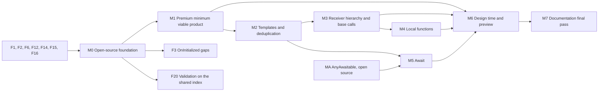

# Delivery plan

> Part of the [call-site interceptors design](README.md). Previous: [10c-oss-reference-graph-design-time.md](10c-oss-reference-graph-design-time.md) | Next: [12-test-plan.md](12-test-plan.md). Evidence prefixes and terms: [00-conventions.md](00-conventions.md).

## 11. Delivery plan

### 11.1 Principles

- Each open-source primitive is consumed by premium code before it ships in a stable engine release. Premium consumes the engine at the same version (`X:\src\Metalama-2027.0\Metalama.Premium\Directory.Packages.props:42-47` pins `Metalama.Framework.Implementation.*` to `$(MetalamaVersion)`), so a primitive whose first consumer is written later is likely to have the wrong shape. When a premium milestone ships after the engine release that contains its primitives, the premium milestone is developed against local engine builds, and it reaches its exit criteria before that engine release.
- The design-time durability contract (Phase A) and the memory-leak guards ship with the first premium milestone, because registrations reach long-lived design-time objects from the first build (ENG27 `Pipeline\UserCodeRetentionAnalyzer.cs:66`).
- Every open-source primitive ships with tests of the in-repository proof of concept in the same pull request (section [12.5](12-test-plan.md#125-in-repository-proof-of-concept-of-interceptors), RC45). The open-source repository therefore proves each primitive without the premium package, and the premium milestones do not carry the proof of open-source behavior.
- Defects found by the analysis are fixed in a separate track, one issue and one pull request each.
- Every milestone from M1 to M6 has one more exit criterion, which is not repeated in section [11.3](#113-milestones): a draft of the corresponding article of section [13.1](13-documentation-plan.md#131-conceptual-chapter) exists.

Size classes: S (up to one week for one engineer), M (one to three weeks), L (three to six weeks), XL (more than six weeks).

### 11.2 Fix track

Items that change validator results are behavior changes and go only to 2027.0, with a release note. Section [11.4](#114-dependencies-and-parallel-tracks) states which items are part of a milestone and which block nothing.

| Id | Defect | Evidence | Target | Size |
|---|---|---|---|---|
| F1 | The reference walker misses explicit generic invocations, collection-expression elements, constructor-initializer arguments and array rank sizes, and visits assignment receivers twice. | ENG27 `ReferenceGraph\ReferenceIndexWalker.cs:103, 110-135, 524-535, 674-702` | 2027.0 only, release note | M |
| F2 | Reduced-form extension calls are keyed by `ReducedExtensionMethodSymbol`, so a validator on the static method misses them. | ENG26 `ReferenceGraph\ReferenceIndexBuilder.cs:20-21` | 2027.0 only | S |
| F3 | `OnInitialized` call-site advice misses call sites in inlined bodies, local functions, expression-bodied properties, primary-constructor base arguments, constructor initializers, and moved initializers. | Section [10.5.11](10b-oss-linker-and-templates.md#10511-follow-up-oninitialized-call-site-gaps) | 2027.0, separate pull request; since RC39 it shares no plumbing with the interceptor work except F15 and F19 | M |
| F4 | The `TransitiveValidatorInstance` serializer does not write `Granularity`, `IncludeDerivedTypes` or `DiagnosticSourceDescription`. | P27 `Metalama.Extensions.Validation.Engine\TransitiveValidatorInstance.cs:77-78, 99-122` | 2027.0 only, release note: transitive validators then run at a different granularity | S |
| F5 | The reference-validator runner shares one `UserCodeExecutionContext` across concurrent tasks and mutates its `Description`. | P27 `Metalama.Extensions.Validation.Engine\ReferenceValidatorRunner.cs:98, 151` | 2026.1 and 2027.0 | S |
| F6 | `Adviser<T>.With` compares the declaration with itself. | FW27 `Aspects\AdviserExtensions.cs:2109` | 2027.0 with a release note; 2026.1 only if accepted (PO33) | S |
| F7 | `IncludeDerivedTypes` is effectively global: the runner always passes `isBaseType: false`. | P27 `Metalama.Extensions.Validation.Engine\ReferenceValidatorRunner.cs:106-114` | 2027.0 | S |
| F8 | The static and dynamic validator sources map property getters to different reference kinds. | P27 `...\Queries\ReferenceValidatorQuerySource.cs:59`; `DynamicReferenceValidatorQuerySource.cs:56` | 2027.0 only, release note: one of the two validator sources then reports a different set of references | S |
| F9 | `ConfigureAwaitUserExpression` dereferences a null lookup; `LexicalScopeFactory` returns an empty scope for builders in types without syntax. | ENG27 `Templating\TemplateExpansionContext.ConfigureAwaitUserExpression.cs:37`; `Linking\LexicalScopeFactory.cs:115-119` | 2027.0 | S |
| F10 | `SignatureTypeComparer.GetHashCode` calls itself with the same argument for array types, in both overloads, so it never terminates. | ENG27 `CodeModel\Comparers\SignatureTypeComparer.cs:104, 207` | 2027.0 | S |
| F11 | Any file that Metalama modifies invalidates the `[InterceptsLocation]` attributes that target it, and the user sees only CS9234. The fix reports LAMA0662 (section [10.10](10c-oss-reference-graph-design-time.md#1010-other-open-source-fixes-found-on-the-way)). | ENG26 `Linking\LinkerInjectionStep.cs:352-358` | 2027.0 | M |
| F12 | `AspectBuilderState.AddContributor` accepts contributors after `ToResult`. | ENG27 `Aspects\AspectBuilderState.cs:78-101` | 2027.0 | S |
| F13 | Optional: child aspects added through a type-fabric adviser are attributed to the aggregate aspect. | ENG27 `Advising\AdviceFactory.cs:2325, 2374` | 2027.0 if accepted (PO33) | S |
| F14 | `LinkerInjectionNameProvider.FindAndUpdate` tests the hint instead of the candidate. | ENG26 `Linking\LinkerInjectionNameProvider.cs:228` | 2027.0 | S |
| F15 | The injection rewriter discards rewrites of root and namespace members when injections exist. | ENG26 `Linking\LinkerInjectionStep.Rewriter.cs:1878, 1898, 1918-1919` | 2027.0 | S |
| F16 | The design-time default bucket is overwritten, which loses default-key contributors. | DT27 `Pipeline\DesignTimeAspectPipelineResult.cs:549-552, 619-622, 771-774` | 2027.0; 2026.1 if a validator case is found | S |
| F17 | Documentation errors: the order of transitive fabrics is described in reverse, and `InboundReferenceValidator` is documented as validating outbound references. | DOC `content\conceptual\using\amending-many-projects.md:26` against ENG27 `Fabrics\FabricManager.cs:60`; P26 `Metalama.Extensions.Validation\InboundReferenceValidator.cs:8`, `ReferenceValidator.cs:11` | Documentation now; code comments in 2027.0 | S |
| F18 | `AsyncHelper.TryGetAsyncInfoFromCodeModel` does not treat `Task` as having a method builder (section [7.9.4](07-await-interception.md#794-interaction-with-the-existing-async-machinery)). | ENG27 `CodeModel\Helpers\AsyncHelper.cs:74-111` | 2027.0 | S |
| F19 | The linker drops the initializer of a semi-automatic property whose accessor has substitutions, which also affects `OnInitialized` (section [10.5.7](10b-oss-linker-and-templates.md#1057-linking-step)). | ENG27 `Linking\LinkerRewritingDriver.Properties.cs:186-189, 298` | 2027.0, with regression tests for `OnInitialized` and for a redirected call site in a semi-automatic setter | S |
| F20 | Not a defect: the Validation engine builds its own index of source references, so a body that validators and interceptors both need is bound twice. The change migrates the Validation engine to the shared index of section [10.7.5](10c-oss-reference-graph-design-time.md#1075-shared-index-of-source-references): it returns its requirements from `GetSourceIndexRequirements` at compile time, and reads `GetDesignTimeIndex` in Phase B. | P27 `Metalama.Extensions.Validation.Engine\ReferenceValidatorRunner.cs:43-48, 66-79` | 2027.0, after the shared index of M0; independent of the interceptor milestones | M |

### 11.3 Milestones

#### M0: Open-source foundation for invocation redirection (XL)

1. Adviser bridge and contribution origin (section [10.2](10a-oss-bridge-hook-factory.md#102-adviser-bridge-b2a)), including owner propagation.
2. Transforming hook with `IsSourceStage`, `HighLevelStageIndex` and `ContributorsAddedInStage` (section [10.3](10a-oss-bridge-hook-factory.md#103-transforming-pipeline-hook-b2b)), in every `LinkerPipelineStage`.
3. The factory with `RedirectInvocation` to existing methods, `RedirectMethodReference` with the `Drop` mode for existing static methods (RC44), shared naming services, the dictionary of redirections, the injection-time rewrite with the invocation and method-group visitors and the descent into declarators, base lists and top-level statements, and the completeness check of the rewriter (sections [10.4](10a-oss-bridge-hook-factory.md#104-extension-transformation-factory-b2c) and [10.5](10b-oss-linker-and-templates.md#105-linker-changes), without synthesized members), the argument lists of `RedirectInvocation` (`RedirectedArgument` with source values and expressions, and the temporaries and discards of reordered or dropped arguments, section [10.4.5](10a-oss-bridge-hook-factory.md#1045-call-site-redirections)), the acceptance of a redirection to the original method with added named arguments (RC68), and `ExtensionTemplateServices.MethodTemplateExists` (section [10.6.1](10b-oss-linker-and-templates.md#1061-selection-at-declaration-time)), which the M1 registration check LAMA1005 uses. The `ExtensionReceiver` mode and its tests are included only if PO9 is accepted.
4. Reference graph: F1, F2, `VisitDeclarationRoot`, and the shared index of source references: `SourceReferenceIndexService`, `GetSourceIndexRequirements( SourceIndexRequirementsContext )` with the union of declaration roots, the merge of indexer options per reference kind, and the design-time index per `SemanticModel` (section [10.7](10c-oss-reference-graph-design-time.md#107-reference-graph-b2e), without `Await`).
5. `OperatorKind.NullCoalescingAssignment` (section [10.1](10a-oss-bridge-hook-factory.md#101-overview), RC51), so that the public enumeration of Metalama.Framework is complete in the general availability, although the accessor sites that report it ship in M3.
6. Design time: `IsProjectLocal`, `HasExportedContent`, F16 and change S1 (section [10.8](10c-oss-reference-graph-design-time.md#108-design-time-plumbing-b2f)).
7. F6, F12, F14, F15, and `[Durable]` on `MethodTemplateSelector` (E2).
8. Recommended: move `MemoryLeakAssert`, `GarbageCollectionHelper`, `RetentionPathFinder` and `DesignTimeEditingSimulator` from TST27 `Metalama.Framework.Tests.UnitTests\DesignTime\Pipeline\MemoryLeaks` to the packable `Metalama.Framework.Tests.UnitTestHelpers`.
9. The in-repository proof of concept of interceptors and its tests for every M0 primitive (section [12.5](12-test-plan.md#125-in-repository-proof-of-concept-of-interceptors), RC45), and a change to `AspectTestRunner` that fails a test that has a non-empty `.t.txt` but whose program was not executed (section [12.8](12-test-plan.md#128-premium-runtime-execution-tests-runtime)).
10. The open-source design document in `docs/future/` (section [13.6](13-documentation-plan.md#136-engineering-documents)).

Exit criteria: the proof of concept exercises every M0 primitive end to end without `InternalsVisibleTo`, including a redirection to an existing method in every linker context of the `Redirection/` folder of section [12.5](12-test-plan.md#125-in-repository-proof-of-concept-of-interceptors), from an aspect and from a fabric; the hook behaves as specified in a pipeline split by a low-level weaver; every existing open-source test passes with only the documented baseline changes of F1, F2 and F15; the premium Validation and Architecture tests pass against the new engine; the continuous-integration build of every touched project has zero warnings on both Roslyn variants; an API review confirms that no public name mentions interceptors.

#### M1: Premium minimum viable product (XL)

- The five projects, props, licensing and build-program changes (section [9.1](09-premium-engine.md#91-assemblies-packaging-and-licensing)).
- `InterceptorsPipelineExtension`, the registration API for methods (sections [5.3](05a-api-registration.md#53-registration) to [5.6](05b-api-providers-contexts-results.md#56-result-model)), target selection by declaring type and member names with the type predicate (section [5.3.3](05a-api-registration.md#533-target-selection-for-members)), the one-source rule for overlapping registrations (section [9.5.8](09-premium-engine.md#958-conflict-detection-r7-b7)), the requirements for the shared index, and scope matching (section [9.2](09-premium-engine.md#92-sharing-with-metalamaextensionsvalidation-r5)).
- Scanning, the call-site model and the limitations (section [6.2](06a-call-site-model.md#62-the-call-site-model)), evaluation, conflicts (including C# interceptors), existing-method interceptors that are static (rules R0, R1 and R1x of section [6.4.1](06b-signatures-and-validation.md#641-receiver-mapping)) with their canonical binding by name and the argument plan (section [5.6.8](05b-api-providers-contexts-results.md#568-parameter-binding-and-the-signature-builder)), `InterceptorSignatureValidator` (section [6.6](06b-signatures-and-validation.md#66-signature-validation-existing-methods-and-adjusted-signatures-r9)), the rules a to h of section [6.4.4](06b-signatures-and-validation.md#644-defaults-and-params) that apply to existing methods, caller-information materialization (section [6.7](06b-signatures-and-validation.md#67-caller-information-materialization)).
- Phase A at design time and the memory guards.
- Open source: the source-expression factory with LAMA0297 (section [10.6.8](10b-oss-linker-and-templates.md#1068-inspection-only-source-expressions)), and the SDK accessor `SourceExpressionExtensions.GetSourceSyntax` (section [10.9](10c-oss-reference-graph-design-time.md#109-small-public-helpers-b2g)), each with its proof-of-concept tests. Premium: `MethodInterceptionContext.Receiver`, `InvocationArgument.Expression`, and the LAMA1014 check of section [9.5.7](09-premium-engine.md#957-evaluation-of-user-interceptor-providers).
- Method-reference sites (RC44): `MethodUseKind` and the context members `Kind`, `ConvertedType` and `IsEventSubscription`, the analyzer of section [6.2.10](06a-call-site-model.md#6210-method-reference-sites) with the `Default` index requirements, existing static methods at method-reference sites of static targets and at function-pointer sites (rule E18), and LAMA1019. Until M2 and M3, a method-reference site that needs a synthesized interceptor, R1x, R2 or the wrapper gets the limitation `MethodReferenceReceiverNotSupported` with the clause "this shape is not supported yet", so a provider sees it and can skip it. A registration then never rewrites the lambda form of a static call without the method-group form.

Exit criteria: a standalone build that consumes the package intercepts `Console.WriteLine(string)` in one namespace with a hand-written static method, proved by program output; conflicts, skips and provider diagnostics are reported at the call site; the memory-leak scenario reports zero retention; the license-failure scenario reports LAMA0806; the Validation and Architecture suites pass unchanged; an API usability review with the product owner takes place before M2.

#### M2: Template interceptors in type placements, with deduplication (XL)

- Open source: `DeclareMethod` for static and instance type members and `DeclareStaticClass`, `MethodTemplateSelection`, `ForSynthesizedMethod`, the proceed bindings `InvokeStatic` and `InvokeOnParameter` with `WithArgumentCasts`, the `ProceedHelper` change, the positional `ArgumentNameMap` of synthesized targets, the meta extension mechanism (`IMetaExtension`, `meta.GetExtension<T>()`, `meta.TryGetExtension<T>()`, `SynthesizedMethodTemplate.MetaExtensions`, section [10.6.6](10b-oss-linker-and-templates.md#1066-meta-extensions-per-expansion-extension-data)) with the verification of its classification by the template compiler, `ExtensionTemplateServices.CanImplement`, F9 (lexical scope), F10, and `RedirectMethodReference` with synthesized targets and the `ExtensionReceiver` mode, each with its proof-of-concept tests.
- Open source: the public kind and parameter of `PullAction` (section [10.9](10c-oss-reference-graph-design-time.md#109-small-public-helpers-b2g), E3), `PackedSourceArgument` and `WrapperArguments` of the redirections (section [10.4.5](10a-oss-bridge-hook-factory.md#1045-call-site-redirections)), and the name-only trailing parameters of `ForSynthesizedMethod` (section [10.6.2](10b-oss-linker-and-templates.md#1062-binder-with-hidden-leading-parameters)), each with its proof-of-concept tests.
- Premium: signature derivation (section [6.4](06b-signatures-and-validation.md#64-signature-derivation)) with the receiver-mapping rules R0, R1, R1x and R3 (section [6.4.1](06b-signatures-and-validation.md#641-receiver-mapping)); the binding API of section [5.6.8](05b-api-providers-contexts-results.md#568-parameter-binding-and-the-signature-builder) (`InterceptorArgument`, `IInterceptorMethodBinder` with the `bind` function of existing methods and shorthands, `IInterceptorBuilder` with its version 1 scope, `BindRemainingByPosition`) and the lightweight `IMethod` of stage 1; added parameters with the packing of `params` and the materialized defaults (section [5.6.9](05b-api-providers-contexts-results.md#569-added-parameters-and-pulled-values)); `InterceptorArgument.CallerInstance` (section [5.6.10](05b-api-providers-contexts-results.md#5610-the-callers-instance-and-method-reference-sites)); the pull of values from the origin member with the guard E20 and `InterceptionContext.IsInNestedFunction` (section [5.6.9](05b-api-providers-contexts-results.md#569-added-parameters-and-pulled-values)); the lambda wrapper of method-reference sites with non-canonical bindings for static targets, and the limitation `DelegateEqualityRequired` (section [5.6.10](05b-api-providers-contexts-results.md#5610-the-callers-instance-and-method-reference-sites)); the synthesized path of `InterceptorSignatureValidator` (section [6.6](06b-signatures-and-validation.md#66-signature-validation-existing-methods-and-adjusted-signatures-r9)), the defaults and `params` rules of section [6.4.4](06b-signatures-and-validation.md#644-defaults-and-params), placement admissibility with the access rule of section [6.5.5](06b-signatures-and-validation.md#655-access-to-private-and-protected-targets), the request key and grouping (section [8](08-deduplication-and-naming.md#8-deduplication-and-naming)), template interceptors in type placements including `CallingType()` and `GeneratedStaticClass()`, `MethodInterceptionInfo` and the C# 14 accessor `meta.MethodInterception` (section [5.7.3](05c-api-templates.md#573-metamethodinterception-and-metaawaitinterception)), with the verification that the API assembly compiles with C# 14 for netstandard2.0, conditional access (if PO9 is accepted), and generic call sites. Method-reference sites with synthesized interceptors under R0 and R1x, the key component `IsMethodGroupConvertible`, the attribute policy of section [6.4.5](06b-signatures-and-validation.md#645-attributes) for method-group convertible signatures, and the choice between a method group and the lambda wrapper at method-reference sites (section [5.6.10](05b-api-providers-contexts-results.md#5610-the-callers-instance-and-method-reference-sites)).
- Accessors (RC48, RC49): open source, `RedirectAccessor` for sites with one accessor use (reads, writes whose value is used or not, event subscriptions, and `r?.P` and `r?.P = v` in extension form), the accessor forms of the proceed bindings, and the assignment and member-access visitors of the injection rewriter, with their proof-of-concept tests; premium, `InterceptAccessors` on every surface, the accessor-site analyzer (section [6.2.11](06a-call-site-model.md#6211-accessor-sites)), the context members `Destination`, `AssignmentOperator`, `IsPostfix` and `IsChecked`, the accessor shapes under R0, R1, R1x and R3 (section [6.4.13](06b-signatures-and-validation.md#6413-accessor-sites)), existing-method accessor interceptors (E19), the builder restrictions of accessor interceptors, and C# 14 extension properties.

Exit criteria: the proof of concept exercises every open-source primitive of M2; deduplication produces exactly one method per group, and the I2 test produces two; the runtime test `MethodReference_LambdaAndMethodGroup_SameOutput` passes for static targets and R1x; output is identical across runs, file-order permutations and Linux; generated code compiles without new warnings with nullable annotations enabled and warnings treated as errors; the runtime tests of invocation shapes pass; the invocation part of the continuous-integration corpus passes (section [12.9](12-test-plan.md#129-semantic-equivalence-corpus-test)).

#### M3: Instance interceptors in the receiver's hierarchy, and base calls (L)

- Open source: the call-site mode `MemberOfReceiver`, `ProceedBinding.InvokeOnThis` and `ProceedBinding.InvokeOnBase`, instance synthesized methods in structs (`IsReadOnly`), the `MemberOfReceiver` and `FirstArgument` modes of `RedirectMethodReference` (the wrapper), and the factory checks of these modes (section [10.4.8](10a-oss-bridge-hook-factory.md#1048-validation-performed-by-the-factory)), each with its proof-of-concept tests.
- Premium: rules R2 and R4 of section [6.4.1](06b-signatures-and-validation.md#641-receiver-mapping), with the speculative binding of condition R2a and the accessibility rule R2b; existing instance methods under R2, R3 and R4; the checks for contexts without `this`; base calls; generic base types; the placement `InterceptorPlacement.BaseMostAccessibleType()` with the walk of section [6.5.6](06b-signatures-and-validation.md#656-base-most-accessible-type) (PO61, RC61), which needs the admissibility checks of base-type placements and the R2a binding in each candidate. Method-reference sites under R2 and R4, and the wrapper of section [6.4.12](06b-signatures-and-validation.md#6412-method-reference-sites) according to PO51.
- Accessors (RC50): open source, the compound rewrites of section [10.5.6](10b-oss-linker-and-templates.md#1056-syntax-of-the-rewritten-call) (compound assignments, increments and decrements, `??=`, the statement block, the `ref` local, the pattern-variable forms and the discard form) with the expression-statement visitor, and the merge of two accessor uses into one redirection, with their proof-of-concept tests; premium, compound sites as two interceptions with the conflict rule per accessor use, the temporary rules of section [6.2.11](06a-call-site-model.md#6211-accessor-sites), the limitations of accessor sites, and the accessor shapes under R2 and R4.

Exit criteria: the proof of concept exercises every open-source primitive of M3; a runtime test proves that a base call does not recurse; the runtime tests of accessor sites of section [12.8](12-test-plan.md#128-premium-runtime-execution-tests-runtime) pass, including the single evaluation of the receiver and the value of postfix, `??=` and null-conditional sites; the runtime tests of method references under R2 and with the wrapper pass, including the equivalence, event-subscription and null-receiver tests of section [12.8](12-test-plan.md#128-premium-runtime-execution-tests-runtime); a runtime test proves that an R2 interceptor keeps virtual dispatch and struct mutations; the R2a tests of section [12.7](12-test-plan.md#127-premium-aspect-tests-metalamaextensionsinterceptorsaspecttests-and-500) fall back to R3 or R1 in every hiding case; instance interceptors in readonly struct members compile without defensive-copy warnings; the `BaseMostAccessible/` tests of section [12.7](12-test-plan.md#127-premium-aspect-tests-metalamaextensionsinterceptorsaspecttests-and-500) pass, including one method shared by sibling types.

#### M4: Local-function placements (L)

- Open source: `AsLocalFunction` placement and local-function injection (section [10.5.4](10b-oss-linker-and-templates.md#1054-local-function-injection)), `ReserveLocalIdentifier`, each with its proof-of-concept tests.
- Premium: the local-function placement and its capture rules, and local-function method groups at method-reference sites whose receiver is the caller's `this`.

Exit criteria: the proof of concept exercises every open-source primitive of M4; templates capture the parameters of the origin; an origin that an aspect overrides keeps the local function in the moved body.

#### MA: AnyAwaitable in templates (M, open source, parallel track)

Tracked by issue metalama/Metalama#919 (section [10.6.9](10b-oss-linker-and-templates.md#1069-anyawaitable), PO66, RC67). It depends on no other milestone, and M5 depends on it.

- `AnyAwaitable`, `AnyAwaitable<T>` and their method builders in `Metalama.Framework.Aspects`; the classification rule of the template compiler, including the addition to the list of types that accept `dynamic` as a type argument; LAMA0298 for a use outside a template; the binding rules of `TemplateBindingHelper`; the expansion of `AnyAwaitable.ConfigureAwait` with LAMA0295.
- Tests: one template test per row of the expansion table of section [10.6.9](10b-oss-linker-and-templates.md#1069-anyawaitable), an analyzer test for a use in run-time code (LAMA0298), and a test of LAMA0295 on a type without `ConfigureAwait`.
- Documentation: the article on async templates (section [13.4](13-documentation-plan.md#134-updates-to-existing-articles)).

Exit criteria: every row of the expansion table of section [10.6.9](10b-oss-linker-and-templates.md#1069-anyawaitable) has a passing template test on both Roslyn variants; the netstandard2.0 build of `Metalama.Framework` compiles the method builders; an API review confirms that the types name no interceptor concept.

#### M5: Await interceptors (L)

- Open source: `ReferenceKinds.Await` and `VisitAwaitExpression`, `RedirectAwait`, `ProceedBinding.AwaitParameter` and `ReturnParameter`, `ProceedMultiplicity`, `ExtensionTemplateServices.TryGetMethodTemplateShape`, F9 (`ConfigureAwait`), F18, each with its proof-of-concept tests.
- Premium: section [7](07-await-interception.md#7-await-interception), `AwaitInterceptionContext.Operand`, `AwaitInterceptionInfo` and the accessor `meta.AwaitInterception`; await registrations without target selection and the enumeration `AwaitableKind` (RC58); the result compatibility rule with its cast (RC59); await templates referenced by name, with the template kind read from the template symbol and the task type of an `async` template read from its declared return type (RC60), which uses the open-source helper `ExtensionTemplateServices.TryGetMethodTemplateShape` (section [10.6.1](10b-oss-linker-and-templates.md#1061-selection-at-declaration-time)); `async AnyAwaitable<dynamic?>` templates, for which the engine chooses the task type (RC67, after MA); added parameters of await interceptors and the binding of existing await methods (section [7.10.1](07-await-interception.md#7101-existing-method-interceptors)).

Exit criteria: the proof of concept exercises every open-source primitive of M5; the runtime tests of section [12.8](12-test-plan.md#128-premium-runtime-execution-tests-runtime) prove that synchronization-context, exception and cancellation behavior is unchanged, with and without runtime async; the continuous-integration corpus passes with await interception enabled; the runtime test `Await_CovariantResult_VarKeepsOriginalType` of section [12.8](12-test-plan.md#128-premium-runtime-execution-tests-runtime) passes.

#### M6: Design-time diagnostics and preview (L, parallel track)

Starts after M1 with existing-method interceptors and grows with M2 to M5. Open source: the hierarchical options helper of section [10.8.6](10c-oss-reference-graph-design-time.md#1086-hierarchical-options-at-design-time), with a proof-of-concept test. Premium: Phase B (section [9.7.4](09-premium-engine.md#974-phase-b-analyzer)), preview behavior (section [9.8](09-premium-engine.md#98-preview-live-templates-and-introspection)). Exit criteria: the IDE reports the same call-site diagnostics as the build for the same code, except the identifiers that section [9.7.6](09-premium-engine.md#976-consistency-between-design-time-and-compile-time) declares specific to one side (parity test); the per-file analysis time stays within the budget of section [12.15](12-test-plan.md#1215-performance-benchmark); no retention is reported.

#### M7: Documentation and samples, final pass (M)

The conceptual chapter, samples, namespace overview, migration updates and release notes (section [13](13-documentation-plan.md#13-documentation-plan)).

### 11.4 Dependencies and parallel tracks

After M2, two tracks run in parallel: instance interceptors and local-function placements (M3, then M4), and await (M5). MA, the open-source `AnyAwaitable`, is independent of M0 to M2 and can start at any time, but it must be complete before M5. M4 follows M3 because local functions whose receiver is the caller's `this` need `InvokeOnThis`, and base calls through local functions need the base-call support of M3 (rules table rows 3 and 4). Design time (M6) starts after M1 and grows with M2 to M5.

F1, F2, F6, F12, F14, F15 and F16 are part of M0. F9 (lexical scope) and F10 are part of M2. F9 (`ConfigureAwait`) and F18 are part of M5. F3 follows M0 in a separate pull request. Since RC39, it no longer reuses interceptor plumbing, except F15 and F19. F20 depends on the shared index of M0 and follows it in a separate pull request; no interceptor milestone depends on it. F4, F5, F7, F8, F11, F13, F17 and F19 block nothing. The helper `SymbolDictionaryKey.CreateLookupKey` (section [10.9](10c-oss-reference-graph-design-time.md#109-small-public-helpers-b2g)) is part of M6, its only consumer.

### 11.5 Mapping to release trains

EXISTING facts: the general availability of 2027.0 is 2027-01-01 (DOCS27 `platform-support.md:149`; DOCS27 `2027.0\DECISIONS.md:15`), about 14 weeks after 2026-09-24. Premium 2027.0 is in preview (`X:\src\Metalama-2027.0\Metalama.Premium\eng\MainVersion.props`: `2027.0.3`, suffix `-preview`).

The rough total of the fix track outside M0 (F3, F4, F5, F7, F8, F9, F10, F11, F13, F17, F18, F19 and F20: three M items and ten S items, size L) and of M0 to M7 (three XL, four L, one M), including the shared index of M0 (size M) and the accessors of M2 and M3 (size M), is 48 to 70 engineer-weeks. The withdrawal of the predicate extraction (RC47) removes about as much work as the accessors add. The sixth product-owner batch adds MA (size M) and about two weeks to M2 for the binding API, the added parameters and the pull guard. The complete scope does not fit before 2027-01-01.

Recommended cut (PO1):

- Before the 2027.0 general availability: the fix-track items marked 2027.0, M0, and the open-source part of M2. No premium package has a breaking change, so no premium work is tied to the 2027.0 general availability. This needs two engineers on the open-source side from October: one on the linker, one on the template engine. The two engineers are in addition to the C# 15 staffing of 2027.0, which changes the same linker files (DOCS27 `2027.0\DECISIONS.md:33-38`). The template engineer takes the M0 items outside the linker (adviser bridge, hook, reference graph, design time, the in-repository proof of concept) until the open-source part of M2 starts. With one engineer, the open-source part of M2 moves to 2027.1. Premium development of M1 and of the premium part of M2 starts in October against local engine builds, so that the open-source primitives are consumed before the general availability (section [11.1](#111-principles)). Only the premium packages ship after it.
- After the general availability: `Metalama.Extensions.Interceptors` as a prerelease on the 2027.0 line with M1 and M2.
- MA can ship in the 2027.0 general availability if an engineer is available, or in a 2027.0 update under PO2, because it is new public API of `Metalama.Framework` and changes no existing behavior. It must ship before M5.
- 2027.1: M3, M4, M5, M6, M7 and the stable package. M3, M4 and M5 need new open-source primitives: the call-site mode `MemberOfReceiver` and the proceed bindings on `this` and on `base` (M3), local-function placement (M4), and await redirection with the new public member `ReferenceKinds.Await` of Metalama.Framework (M5). If PO2 is accepted, M3 and M4 can ship earlier as 2027.0 prerelease updates. M5 can ship earlier only if PO2 also covers `ReferenceKinds.Await`, or if `ReferenceKinds.Await` ships in the general availability with M0.
- 2026.1 is not a target. It would need the Roslyn 4.12.0 engine variant and the older contributor shape. Only F5 and optionally F6 and F16 are backported.

### 11.6 Engineering conventions

- Open-source branches follow `topic/2027.0/XXXX-description`. Each primitive and each fix has its own issue and pull request.
- During development, Premium uses a local dependency on the open-source build (PostSharp.Engineering local dependencies).
- New open-source test projects are added to `Metalama.Framework.sln` and `Metalama.Framework.LatestRoslyn.slnf`. New premium projects are added to `Metalama.Premium.sln` and `Metalama.Premium.LatestRoslyn.slnf`.
- Every pull request passes the continuous-integration build (`-p:ContinuousIntegrationBuild=True`) with zero warnings for every touched project, including test projects.
- New `PipelineExtension` members are virtual with defaults.
- Premium engine code that uses Roslyn APIs available only in newer versions is guarded by the `ROSLYN_x_OR_GREATER` symbols. `GetInterceptorMethod` must be verified in the 5.0.0 variant.
