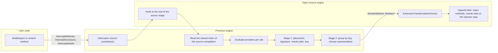

# Call-site interceptors: design overview

> Status: design document only. The feature is not implemented, and no code of the open-source repository implements it. The document is stored in the open-source repository under `Metalama.Framework/docs/future/interceptors/`, the folder that holds designs of future features that are not implemented and may never be implemented (`Metalama.Framework/docs/future/README.md`). This overview summarizes the design of 2026-09-24 as revised on the same day after an adversarial review by seven reviewers (Appendix C of the full document), after a product-owner review (Appendix D of the full document), and after a second product-owner batch: terminology aligned with Roslyn, the rewrite in the injection step of the linker, meta extensions, inspection-only expressions, method references converted to delegates in version 1, an in-repository proof of concept, and future directions (full Appendix D, second batch). A third product-owner batch on 2026-09-25 replaced reference predicates with target selection by declaring type and member names, withdrew the extraction of `Metalama.Extensions.References`, added the interception of property and event accessors, and added sketches for indexers and operators (full Appendix D, third batch). A fourth batch on the same day changed the terminology: placement instead of container, origin and destination for sites, and target-side registration instead of inbound interception (full Appendix D, fourth batch). A fifth batch on the same day removed the awaited type from await registrations, relaxed the result type of await interceptors, restricted await templates to template names, and added the placement `BaseMostAccessibleType()` (full Appendix D, fifth batch). A sixth batch on the same day replaced `IMethodInterceptorBuilder` with a parameter-binding API shared by existing and synthesized interceptors, added parameters whose values are supplied per site, the pull of values from the origin member with a guard, the caller's instance as a source, the open-source template type `AnyAwaitable`, and new future directions (full Appendix D, sixth batch).
> Full document: the section documents listed in [README.md](README.md), in the same folder. A reference such as "full [7.5](07-await-interception.md#75-the-adaptive-rewrite-challenge-to-b8-adopted)" points to section 7.5 of that document.
> Audience: the product owner, who takes the decisions of section [9](#9-decisions-needed-from-the-product-owner), and the engineering leads. Target line: 2027.0 (`develop/2027.0`).

## 1. Problem and motivation

Metalama cannot advise a method that is declared in a referenced assembly. PostSharp can, with `AttributeTargetAssemblies`. Metalama also cannot advise the `await` keyword, which PostSharp supports through `OnYield` and `OnResume` of `IOnStateMachineBoundaryAspect`. The public migration documentation lists both gaps. Metalama.Migration marks the corresponding PostSharp APIs as unsupported, with no workaround (full [1.2](01-summary.md#12-why)).

Call-site interceptors address both gaps. An aspect or a fabric replaces calls to a method, method groups of that method converted to delegates, reads and writes of a property, subscriptions to an event, or `await` expressions, inside a chosen scope of the current project. Each rewritten site calls or references an interceptor method. The interceptor method is an existing method, or a method that Metalama generates from a template. In a template, `meta.Proceed()` calls the intercepted logic. Only the call site is rewritten, so the intercepted method can be declared anywhere, including in a referenced assembly. Because the advice is applied at the call site, it can also depend on the caller: the caller's `this`, the caller's parameters, and the scope of the call.

Mechanism (full [4](04-mechanism.md#4-mechanism-decision)). Metalama rewrites the call sites syntactically in its linker. It does not emit C# `[InterceptsLocation]` attributes. C# interceptors cannot intercept `await` expressions, cannot be local functions (CS9146), cannot use the caller's `this`, cannot be declared in a generic calling type (CS9138), cannot accept implicit conversions (CS9144), and cannot make a non-virtual `base` call. Requirements R2, R9, R12 and R13 need these capabilities. The cost of the linker rewrite is that the engine must reproduce the argument semantics of every call-site shape explicitly. The rules table of full [6.3](06a-call-site-model.md#63-rules-table) specifies them shape by shape. Runtime tests and an equivalence corpus verify them (full [12.8](12-test-plan.md#128-premium-runtime-execution-tests-runtime), [12.9](12-test-plan.md#129-semantic-equivalence-corpus-test)).

### 1.1 Requirements and how the design meets them

| Id | Requirement (short form) | Design response | Full |
|---|---|---|---|
| R1 | Aspects and fabrics add interceptors. | Three registration verbs: `InterceptMethods`, `InterceptAccessors` and `InterceptAwaits`, with options records. | 5.3 |
| R2 | A scope (the calling side) and a target (a method or the `await` keyword). | The scope is a compilation, namespace, type or member. A member target is selected by a declaring type, or a durable predicate over declaring types, plus mandatory member names. An await registration has no target selection: every await of the scope reaches the provider, which skips the awaits that it does not want (PO58). Every use of a method is a site: a call, or a method group converted to a delegate or to a function pointer (interpretation I11). The accessors of properties and events are methods, so their uses are sites too (I12). Operators are not targets. | 5.3.2 to 5.3.4, 5.3.11 to 5.3.13 |
| R3 | Aspects use the adviser mechanism, fabrics the amender mechanism. | Extension methods on `IAdviser<T>` and on `IQuery<T>`, plus `ITypeAmender` overloads. | 5.3.6 to 5.3.8 |
| R4 | Implementation in the premium package; only extension points in open source. | Package `Metalama.Extensions.Interceptors`. The open-source primitives are generic and never mention interceptors, including the shared index of source references. | 1.4, 10 |
| R5 | Share design with reference validators. | One index of source references per stage for both features, so a body is bound once. That is the only sharing: no shared predicate language, no shared context base, and no dependency on Validation or Architecture (RC47). | 9.2, 10.7.5 |
| R6 | Scan the source compilation. | The engine reads the index of the source syntax trees, only in the source stage. | 9.5.2 |
| R7 | At most one interceptor per call site. | Errors LAMA1010 and LAMA1011. This is a rule of version 1; composition is a future direction (section [10](#10-future-directions)). | 9.5.8, 16.1 |
| R8 | An interface returns an existing method or a template with arguments; a template needs a container. | `IMethodInterceptorProvider`, for methods and accessors, and `IAwaitInterceptorProvider` return an `InterceptorResult` from `GetInterceptor`. They require no serialization. A template result requires an `InterceptorPlacement`. An existing-method result can bind the parameters of the method (PO62). | 5.4, 5.6 |
| R9 | Exact signature, implicit conversions only; `meta.Proceed()` calls the intercepted logic. | The generated signature is derived from the call site, and a `configure` function can adjust it within fixed limits. Each interceptor parameter receives its value from a source, bound by name by default (PO62, PO63). One validator checks existing methods, adjusted signatures and their bindings per call site. | 5.6.8 to 5.6.10, 6.4, 6.6 |
| R10 | Two-stage deduplication at linker level. | Two stages in the premium engine, before the open-source factory is called (interpretation I9). | 8 |
| R11 | Any awaitable type. | Two await modes. Any awaitable can be awaited, and the interceptor can return any awaitable whose result converts implicitly to the original result (I6, I7, PO59). A template for any awaitable is written `async AnyAwaitable<dynamic?>` (PO66). | 7.6, 7.6.1, 10.6.9 |
| R12 | Local function of the calling member as container. | `InterceptorPlacement.LocalFunction()`: a local-function placement in the origin of the site. | 6.5.4 |
| R13 | Instance or static when in the calling class hierarchy. | The receiver-mapping rules R0 to R4 (section [6.2](#62-placements-and-receiver-mapping)). An interceptor in the calling type or a base type is static by default, and an instance method with `IsStatic = false` in the signature builder. `BaseMostAccessibleType()` selects the base type (PO61). A static helper receives the caller's `this` through the source `CallerInstance` (PO62). | 5.6.8, 5.6.10, 6.4.1, 6.5.6 |
| R14 | Providers report diagnostics or skip. | `context.Diagnostics` and `InterceptorResult.Skip`. Provider diagnostics come only from the evaluation of the providers: in every build, and in the IDE if PO26 is accepted. | 5.4, 5.6.1 |

Two interpretations depart from the wording of the requirements. The product owner confirms them in PO40 (section [9](#9-decisions-needed-from-the-product-owner)). Interpretation I9 moves deduplication from the linker to the premium engine, because the open-source linker must stay free of interceptor semantics (R4) and names must be known when a method is declared. Interpretation I10 reads "template container" as the declaration that receives the generated method, which this design calls the placement. The type that declares the template, the template provider, is optional. Interpretation I11, added by the second product-owner batch, reads the method target of R2 as every use of the method, including method groups converted to delegates. Interpretation I12, added by the third batch, reads it as including the accessors of properties and events, because accessors are methods.

## 2. Concept model

| Term | Meaning |
|---|---|
| Scope | Registration level. The calling-side region that the user selects: the compilation, a namespace, a type or a member. A site is in scope when its origin is contained in the scope. |
| Target selection | Registration level. The declaring type or type predicate plus the member names. An await registration has none: its scope selects the awaits. |
| Target | The called side: the method to which the C# compiler binds the call, the accessor of a property or an event, or the `await` operator. |
| Origin | Site level. The declaration that contains the site: a member, an accessor, the field or property of an initializer, the type for primary-constructor base arguments, or the entry point for top-level statements. Code in lambdas and local functions belongs to the enclosing member. The context exposes it as `InterceptionContext.Origin`. |
| Destination | Site level. The member that the site uses: the definition of the bound method, or of the property or event at an accessor site, which can be an override of the selected member; for an await, the awaitable type. The contexts expose it as `MethodInterceptionContext.Destination` and `AwaitInterceptionContext.AwaitableType`. |
| Call site | An `InvocationExpressionSyntax` or an `AwaitExpressionSyntax` of the source compilation. |
| Method-reference site | A method group of the source compilation converted to a delegate or to a function pointer, such as `Transform` in `list.Select( Transform )`. |
| Accessor site | A read, a write, a compound assignment, an increment or decrement, or a `+=` or `-=` on an event. A compound site has two accessor uses, a get and a set. |
| Site | One occurrence that a registration can intercept: a call, a method reference, an accessor use, or an await. A site is a call site, a method-reference site or an accessor site. |
| Registration | One call to `InterceptMethods`, `InterceptAccessors` or `InterceptAwaits`: the scopes, the target selection (the declaring type or type predicate, the member names, and the accessor kind), the interceptor provider and the options. |
| Interceptor provider | The user object or delegate that chooses the interceptor for a site. It receives an interception context and returns a result: skip, existing method, or template. It implements `IMethodInterceptorProvider` or `IAwaitInterceptorProvider`. |
| Interceptor, interceptor method | The method that the rewritten site calls or references, as in Roslyn: an existing method, or a method synthesized from a template. |
| Intercepted method | The method to which the original call binds, or that the method-group conversion selects; the accessor at an accessor site. |
| Placement | Where a synthesized interceptor is declared: a type, the generated static class, or a local function of the origin. The public type is `InterceptorPlacement`. `BaseMostAccessibleType()` is a type placement whose type the engine computes. Earlier versions called it the container. |
| Group | A set of sites that share one synthesized interceptor method, because their keys are equal (section [6.5](#65-deduplication-contract)). |
| Representative | The first site of a group in deterministic order. Its registration provides the contribution origin used to declare the method. |
| Source stage | The first high-level pipeline stage, whose aspects start from the source compilation. |



Origin and destination have the same meaning as the ends of a reference in reference validation (`ReferenceEndRole.Origin` and `ReferenceEndRole.Destination`). The contexts expose them as plain `IDeclaration`, `IMember` and `IType` values, not as `ReferenceEnd`, which belongs to the Validation package and whose granularity contract would restrict providers. The direction words of validators, inbound and outbound, are not used for interceptors. The open-source factory uses the same word placement (`SynthesizedMethodPlacement`). The contribution origin (`ExtensionContributionOrigin`), which records the aspect or fabric that made a contribution, is a different concept (full [0.3](00-conventions.md#03-terms)).

Terminology (full [0.4](00-conventions.md#04-terminology-aligned-with-roslyn-interceptors)). The names follow C# interceptors where the concepts match: in Roslyn, the interceptor is the replacement method, and the original is the interceptable method at an interceptable location. The Metalama interceptor is also the method that the rewritten site calls. The user object that chooses it is the interceptor provider, which has no Roslyn equivalent. Metalama interceptors rewrite sites in the syntax tree; they are not C# `[InterceptsLocation]` interceptors.

Registration only records the interceptor. Call sites are found later, in the source compilation, after all aspects, fabrics and validators of the first stage have run. Interceptor methods are not observable: aspects do not see them, and the code that the IDE generates does not contain them.

## 3. User experience

### 3.1 Registration API summary

| Concern | API (namespace `Metalama.Extensions.Interceptors`) |
|---|---|
| Verbs | `InterceptMethods` (ordinary methods, classic and C# 14 extension methods), `InterceptAccessors` (property and event accessors, with a mandatory `MethodKind` accessor kind: `PropertyGet`, `PropertySet`, `EventAdd` or `EventRemove`), `InterceptAwaits`. The verb names the target, not the syntax that uses it. A method registration receives every kind of use, with no filter (PO44, reversed): calls, method groups converted to delegates, and method groups converted to function pointers. `InterceptMethods` never matches an accessor. |
| Fabric and query surface | Extension methods on `IQuery<T>` and `ITaggedQuery<T,TTag>`. Fabrics call them on their amender, and aspects on `builder.Outbound`. Each selected declaration is a scope. |
| Aspect surface | Extension methods on `IAdviser<T>`. The scope is the target of the adviser. It must be contained in the closest type of the aspect target, or in the namespace or compilation that is the aspect target. |
| Type fabrics | 35 `ITypeAmender` overloads remove the ambiguity between the two surfaces. |
| Member targets | A declaring type plus a mandatory list of member names (PO52): `( Type declaringType, IReadOnlyList<string> names )`, `( INamedType, IReadOnlyList<string> )`, `( [Durable] Func<INamedType, bool> declaringTypes, IReadOnlyList<string> names )`, and `( Type, string name )`. The type is matched by definition, so `typeof(List<>)` matches every construction. Every overload of a name matches, and the provider filters signatures and returns `Skip`. The names always filter the index before binding. The type predicate, evaluated once per declaring type definition, is the only way to select several types, for example a namespace: `t => t.ContainingNamespace.FullName.StartsWith( "Contoso.Legacy", StringComparison.Ordinal )`. Overlapping registrations of one aspect or fabric count once per site. |
| Await registrations | `InterceptAwaits( <provider form>, AwaitInterceptionOptions? options = null )` on every surface, with no awaited type, no type predicate and no kind filter (PO58). Every await of the scope reaches the provider, including custom awaitables. The provider filters from the context (`AwaitableType`, `AwaitableKind`, `Configuration`, `AwaitedMethod`, `Resumption`), and its recommended first statement is `if ( context.Resumption == AwaitResumption.Unknown ) return InterceptorResult.Skip;`. The name filter never applied to awaits, so the binding cost is unchanged. |
| Options | `MethodInterceptionOptions { Matching = Overrides, Scope }`: overrides match by default, and interface implementations are opt-in (`MethodMatching`). `AwaitInterceptionOptions { Scope }`: the record keeps only the scope, so that a later option adds no overload; `AwaitableKinds`, `Kinds` and `LookThroughConfigureAwait` are removed (full RC58). `Scope` is `InterceptionScopeOptions`: `IncludeNestedTypes`, `ExcludeLambdasAndLocalFunctions`, `IncludeGeneratedFiles`. |
| Interceptor forms | An `IMethodInterceptorProvider` or `IAwaitInterceptorProvider` object; a delegate, which can be a lambda checked by the durability analyzer; an existing `IMethod` with an optional `bind` function (invocations and accessors only; none for awaits, PO70); a template shorthand (template, placement, optional `configure` function), whose template is a name for awaits; a factory per selected scope (query surface only). |
| Contexts | `InterceptionContext`, the base class, with `Origin` and `IsInNestedFunction`; `MethodInterceptionContext`, for methods and accessors, with `Kind` (`MethodUseKind`: `Call`, `DelegateCreation`, `FunctionPointer`; accessor sites are `Call`), `ConvertedType`, `IsEventSubscription`, the intercepted method (the accessor at an accessor site), `Destination` (the definition of the bound method, or the property or event at an accessor site), `AssignmentOperator` (`OperatorKind`: `None`, a compound kind, `Increment`, `Decrement`, or the new `NullCoalescingAssignment`), `IsPostfix`, `IsChecked`, the receiver and the arguments; `AwaitInterceptionContext`, whose `AwaitableType` is the destination of an await site. `Receiver`, `InvocationArgument.Expression` and `AwaitInterceptionContext.Operand` are `IExpression` values for inspection only: a provider reads their type and constant value, and their Roslyn syntax through the SDK method `GetSourceSyntax`; generated code cannot contain them (LAMA0297). |
| Results | `InterceptorResult.Skip`, `ExistingMethod( method, bind )`, `Template( template, placement, configure )` with a `MethodTemplateSelector`, a template name (`string`) or a `TemplateInvocation`, and `WithAwaitRewriteOptions( AwaitRewriteOptions, ... )` for awaits (the record was named `AwaitInterceptorOptions`). An await site takes a template name only: a selector with an alternative template gives LAMA1014 (PO60). The `string` overload wins over the implicit conversion to a selector, so a name never becomes a selector. A provider explains a skip with its own diagnostic through `context.Diagnostics`. |
| Placements | `InterceptorPlacement.CallingType`, `InType`, `BaseMostAccessibleType`, `GeneratedStaticClass` and `LocalFunction`. The placement names the declaration only; the receiver-mapping rules decide whether the method is static (section [6.2](#62-placements-and-receiver-mapping)). |
| Parameter binding | `InterceptorArgument`, the source of the value of one interceptor parameter: `Receiver`, `Argument( name )`, `Value`, `Awaitable`, `CallerInstance`, `CallerInfo( kind )` and `Pull( PullAction )`, which reuses the public `PullAction` (`UseExpression`, `UseExistingParameter`, `UseConstant`, `None`). `IInterceptorMethodBinder : IMethod`, passed to the `bind` function of `ExistingMethod`, with `Parameters` (`IInterceptorParameterBinder`, each with `Argument`, `IsExplicitlyBound` and `Bind`), the read-only `ReceiverMapping`, and `BindRemainingByPosition()` (PO62, PO63; full [5.6.8](05b-api-providers-contexts-results.md#568-parameter-binding-and-the-signature-builder)). |
| Signature builder | `IInterceptorBuilder : IInterceptorMethodBinder`, passed to the `configure` function of a template result. It replaces `IMethodInterceptorBuilder` (PO49, superseded by PO62). It sets the name, the accessibility, the static or instance choice and the receiver mapping within the permitted overrides, widens by-value parameter types, narrows the return type, renames parameters, binds them, adds parameters with a mandatory source (`AddParameter( name, type, argument )`), and chooses the default mode. Its parameter list, `IInterceptorParameterBuilderList`, does not derive from the binder list, as `IParameterBuilderList` does not derive from `IParameterList`. Binders and builders are valid only during the callback (full [5.6.8](05b-api-providers-contexts-results.md#568-parameter-binding-and-the-signature-builder), [5.6.9](05b-api-providers-contexts-results.md#569-added-parameters-and-pulled-values)). |
| Template side | `meta.Proceed()`; `meta.Target`, which is the interceptor method; `meta.MethodInterception` and `meta.AwaitInterception`, C# 14 static extension properties of `meta` that return the meta extensions `MethodInterceptionInfo` and `AwaitInterceptionInfo`. With C# 13 or earlier, a template calls `meta.GetExtension<MethodInterceptionInfo>()`. An await template decides its shape by its `async` modifier, and `async AnyAwaitable<dynamic?>`, a new open-source template type, lets the engine choose the task type (section [6.6](#66-await-rewrite-rule)). |

The provider interface of R8:

```csharp
[CompileTime]
[Durable]
[ImmutableType]
public interface IMethodInterceptorProvider
{
    InterceptorResult GetInterceptor( MethodInterceptionContext context );
}
```

`IAwaitInterceptorProvider` has the same shape, with `GetInterceptor( AwaitInterceptionContext context )`. The context describes one site: the scope, the origin, the destination, the kind of use, the intercepted method, the receiver, the arguments, a diagnostic sink, and `NonInterceptableReason`. Providers run concurrently, at compile time and, if PO26 is accepted, in the IDE, so they must be thread-safe and deterministic. The IDE keeps registrations across compilations, so a provider must not store declarations. The durability analyzer verifies this rule. Registrations are never serialized in version 1, so the interfaces do not derive from `ICompileTimeSerializable`. The contexts have their own base class, `InterceptionContext`, and share no base with `ReferenceValidationContext` (full [5.4](05b-api-providers-contexts-results.md#54-interceptor-provider-interfaces), [5.5](05b-api-providers-contexts-results.md#55-interception-contexts)).

### 3.2 Sample A. Namespace fabric: an interceptor object and a template in a static class

Full 5.8, sample 2. Using directives are omitted. Run-time source:

```csharp
namespace Contoso.Billing;

public static class SystemHooks
{
    public static Func<Guid>? NewGuid { get; set; }

    public static Func<long>? GetTimestamp { get; set; }
}

public sealed record Invoice( Guid Id, decimal Amount, long Timestamp );

public sealed class InvoiceFactory
{
    public Invoice Create( decimal amount ) => new( Guid.NewGuid(), amount, Stopwatch.GetTimestamp() );
}
```

Compile-time code:

```csharp
internal sealed class TestabilityFabric : NamespaceFabric
{
    public override void AmendNamespace( INamespaceAmender amender )
    {
        var provider = new SystemHookProvider();

        amender.InterceptMethods( typeof(Guid), nameof(Guid.NewGuid), provider );
        amender.InterceptMethods( typeof(Stopwatch), nameof(Stopwatch.GetTimestamp), provider );
    }
}

[CompileTime]
internal sealed class SystemHookProvider : IMethodInterceptorProvider, ITemplateProvider
{
    public InterceptorResult GetInterceptor( MethodInterceptionContext context )
    {
        var hooks = TypeFactory.GetNamedType( typeof(SystemHooks) );
        var hook = hooks.Properties.OfName( context.InterceptedMethod.Name ).SingleOrDefault();

        if ( hook == null )
        {
            return InterceptorResult.Skip;
        }

        return InterceptorResult.Template(
            nameof(this.UseHook),
            InterceptorPlacement.InType( hooks ),
            args: new { hook } );
    }

    [Template]
    private dynamic? UseHook( [CompileTime] IProperty hook )
    {
        var replacement = hook.Value;

        return replacement != null ? replacement() : meta.Proceed();
    }
}
```

Transformed code:

```csharp
public static class SystemHooks
{
    public static Func<Guid>? NewGuid { get; set; }

    public static Func<long>? GetTimestamp { get; set; }

    internal static Guid NewGuid_Interceptor()
    {
        var replacement = SystemHooks.NewGuid;

        return replacement != null ? replacement() : Guid.NewGuid();
    }

    internal static long GetTimestamp_Interceptor()
    {
        var replacement = SystemHooks.GetTimestamp;

        return replacement != null ? replacement() : Stopwatch.GetTimestamp();
    }
}

public sealed class InvoiceFactory
{
    public Invoice Create( decimal amount ) => new( SystemHooks.NewGuid_Interceptor(), amount, SystemHooks.GetTimestamp_Interceptor() );
}
```

The targets are declared in the .NET runtime, which no Metalama aspect can advise today. The two registrations share one provider object, and their names `NewGuid` and `GetTimestamp` filter the index, so the build binds only the bodies that contain one of them. The provider object implements the interface of R8, decides per call site, and serves as its own template provider. The interceptors are placed in an explicit static class. The methods are `internal`, because the calling type is another type. The two targets produce two methods, because the intercepted target is part of the group key. When the result does not depend on the call site, a template shorthand replaces the provider object, as in sample B. A method group such as `Func<Guid> factory = Guid.NewGuid;` in the namespace would be rewritten to `SystemHooks.NewGuid_Interceptor` with the same provider, which can test `context.Kind` to skip it.

### 3.3 Sample B. Type aspect: an instance interceptor in the calling type

Full 5.8, sample 6a. Run-time source:

```csharp
public interface IMessageBus { void Publish( object message ); }

public interface IAuditLog { void Record( string source, string action, object details ); }

public abstract class ServiceBase
{
    protected ServiceBase( IAuditLog audit ) { this.Audit = audit; }

    protected IAuditLog Audit { get; }

    protected abstract string ServiceName { get; }
}

[AuditPublishedMessages]
public sealed class OrderService : ServiceBase
{
    private readonly IMessageBus _bus;

    public OrderService( IMessageBus bus, IAuditLog audit ) : base( audit ) { this._bus = bus; }

    protected override string ServiceName => "Orders";

    public void PlaceOrder( Order order )
    {
        this._bus.Publish( new OrderPlaced( order.Id ) );
    }
}
```

Compile-time code:

```csharp
public sealed class AuditPublishedMessagesAttribute : TypeAspect
{
    public override void BuildEligibility( IEligibilityBuilder<INamedType> builder )
        => builder.MustSatisfy( t => t.Is( typeof(ServiceBase) ), t => $"{t} must derive from ServiceBase" );

    public override void BuildAspect( IAspectBuilder<INamedType> builder )
    {
        builder.InterceptMethods(
            typeof(IMessageBus),
            nameof(IMessageBus.Publish),
            nameof(this.AuditPublish),
            InterceptorPlacement.CallingType(),
            configure: b => b.IsStatic = false );
    }

    [Template]
    private void AuditPublish( object message )
    {
        meta.This.Audit.Record( meta.This.ServiceName, "Publish", message );
        meta.Proceed();
    }
}
```

Transformed code:

```csharp
public sealed class OrderService : ServiceBase
{
    // Field, constructor and ServiceName unchanged.

    public void PlaceOrder( Order order )
    {
        this.Publish_Interceptor( this._bus, new OrderPlaced( order.Id ) );
    }

    private void Publish_Interceptor( [NotNull] IMessageBus receiver, object message )
    {
        this.Audit.Record( this.ServiceName, "Publish", message );
        receiver.Publish( message );
    }
}
```

This sample uses the overload that takes a declaring type and a method name. It shows R13 through rule R3 (section [6.2](#62-placements-and-receiver-mapping)): `IMessageBus` is not in the hierarchy of `OrderService`, so the interceptor would be static by default, and the `configure` function makes it an instance method of the calling type. `meta.This` is then the caller's `this`, and the receiver `this._bus` is the first argument. The receiver parameter has the type of the target's containing type, `IMessageBus`. It carries `[NotNull]` only because the target framework of the sample declares `NotNullAttribute` (full [6.4.5](06b-signatures-and-validation.md#645-attributes)). The template parameter `message` is bound by name. The owner is part of the group key, so an aspect applied to many types produces one method per aspect instance. A fabric that registers once with `InterceptorPlacement.InType( typeof(ServiceBase) )` and the same `configure` function produces one `private protected` method in the base type, shared by all derived types (full [5.8](05d-api-samples.md#58-samples), sample 6b).

### 3.4 Sample C. Method aspect: an await interceptor

Full 5.8, sample 4, reduced to two awaits. Compile-time code:

```csharp
public sealed class MeasureAwaitsAttribute : MethodAspect
{
    public override void BuildAspect( IAspectBuilder<IMethod> builder )
    {
        builder.InterceptAwaits( this.MeasureAwait );
    }

    private InterceptorResult MeasureAwait( AwaitInterceptionContext context )
    {
        // The recommended first statement of an await provider.
        if ( context.Resumption == AwaitResumption.Unknown )
        {
            return InterceptorResult.Skip;
        }

        var operation = context.AwaitedMethod?.ToDisplayString( CodeDisplayFormat.MinimallyQualified )
                        ?? context.AwaitableType.ToDisplayString( CodeDisplayFormat.MinimallyQualified );

        return InterceptorResult.Template( nameof(this.Measure), InterceptorPlacement.CallingType(), args: new { operation } );
    }

    [Template]
    private dynamic? Measure( [CompileTime] string operation )
    {
        var stopwatch = Stopwatch.StartNew();

        try
        {
            return meta.Proceed();
        }
        finally
        {
            Console.WriteLine( $"await {operation}: {stopwatch.ElapsedMilliseconds} ms" );
        }
    }
}
```

Run-time source:

```csharp
public sealed class CatalogClient
{
    private readonly HttpClient _http = new();

    [MeasureAwaits]
    public async Task<int> CountProductsAsync( string url )
    {
        var json = await this._http.GetStringAsync( url ).ConfigureAwait( false );
        await Task.Delay( 10 );

        return json.Length;
    }
}
```

Transformed code:

```csharp
public sealed class CatalogClient
{
    private readonly HttpClient _http = new();

    public async Task<int> CountProductsAsync( string url )
    {
        var json = await Await_Interceptor( this._http.GetStringAsync( url ).ConfigureAwait( false ) ).ConfigureAwait( false );
        await Await_Interceptor1( Task.Delay( 10 ) );

        return json.Length;
    }

    private static async ValueTask<string> Await_Interceptor( ConfiguredTaskAwaitable<string> awaitable )
    {
        var stopwatch = Stopwatch.StartNew();

        try
        {
            return await awaitable;
        }
        finally
        {
            Console.WriteLine( $"await HttpClient.GetStringAsync(string?): {stopwatch.ElapsedMilliseconds} ms" );
        }
    }

    private static async ValueTask Await_Interceptor1( Task awaitable )
    {
        var stopwatch = Stopwatch.StartNew();

        try
        {
            await awaitable;

            return;
        }
        finally
        {
            Console.WriteLine( $"await Task.Delay(int): {stopwatch.ElapsedMilliseconds} ms" );
        }
    }
}
```

The registration has no awaited type, so every await of the method reaches the provider, including awaits of custom awaitables (PO58). The first statement of the provider skips the awaits whose resumption is unknown, which avoids warning LAMA1020. The template is referenced by its name, and it is not `async`: `meta.Proceed()` gives the awaited value, and the engine generates an `async` interceptor. This sample shows the default await mode, in which the interceptor is `async` and returns `ValueTask<R>` or `ValueTask`. It also shows the adaptive rewrite of section [6.6](#66-await-rewrite-rule). The first await did not resume on the captured context, so the rewritten await receives `.ConfigureAwait( false )`. The second await captured the context, so it receives no suffix. The `operation` argument differs per call site, so each await has its own method.

### 3.5 Sample D. Project fabric: reads and writes of a property of an external type

Full 5.8, sample 12, reduced. `Order` is declared in a referenced assembly. Compile-time code:

```csharp
amender.InterceptAccessors( typeof(Order), nameof(Order.Quantity), MethodKind.PropertyGet, nameof(this.LogRead), InterceptorPlacement.GeneratedStaticClass() );
amender.InterceptAccessors( typeof(Order), nameof(Order.Quantity), MethodKind.PropertySet, nameof(this.LogWrite), InterceptorPlacement.GeneratedStaticClass() );

[Template]
private dynamic? LogWrite( dynamic? value )
{
    Console.WriteLine( $"Write {meta.MethodInterception.Destination.Name}: {value}" );

    return meta.Proceed();   // receiver.Quantity = value, whose value is the assigned value.
}
```

Run-time source and transformed code (`Ig` and `Is` stand for `MetalamaInterceptors.Quantity_get_Interceptor` and `Quantity_set_Interceptor`):

```csharp
this._orders[index].Quantity += count;
// becomes:
{
    var receiver = this._orders[index];
    Is( receiver, Ig( receiver ) + count );
}

public int Next( Order order ) => order.Quantity++;
// becomes:
public int Next( Order order ) => Ig( order ) is var value && Is( order, value + 1 ) is var _ ? value : default!;
```

A compound site is two interceptions, a get and a set, which can come from different registrations. The receiver is evaluated once: in a block when the site is a statement, and with pattern variables when its value is used. The setter interceptor returns the assigned value, so one setter serves the writes whose value is used and those whose value is discarded.

### 3.6 Sample E. Binding the parameters of an existing method

Full 6.4.1. An existing helper receives the receiver in its second parameter and the member name of the caller in its first:

```csharp
public static class Telemetry
{
    public static decimal Track( string operation, Order target, bool withTax ) { /* Logs, then returns target.Total( withTax ). */ }
}

return InterceptorResult.ExistingMethod(
    trackMethod,
    m =>
    {
        m.Parameters["target"].Bind( InterceptorArgument.Receiver );
        m.Parameters["operation"].Bind( InterceptorArgument.CallerInfo( CallerInfoKind.MemberName ) );
    } );

// In OrderService.Process, the site order.Total( true ) becomes:
var gross = Telemetry.Track( "Process", order, true );
```

`withTax` binds by name to the argument of the site. The binder reports the mapping `StaticReceiverParameter`, because `Track` is static and the site has a receiver. The constant has no side effect, and `order` and `true` keep their order, so no temporary is needed. Without the `bind` function, `target` and `operation` would have no argument of the same name at the site, and LAMA1013 would list the unbound parameters.

## 4. How it works

### 4.1 Registration

The public extension methods resolve an internal registration service that the premium engine registers in `PipelineExtension.Initialize`. The service converts each registration into a premium contributor and adds it to the owner of the registration: the aspect builder, or the fabric amender. On the adviser surface, the open-source bridge `GetExtensionContext` gives the owner, the aspect target and the current template provider of any `IAdviser`. Registrations of project, namespace and transitive project fabrics are stored in the pipeline configuration and replayed in every run. Registrations of aspects and type fabrics exist only in the run and stage in which the aspect executed, and they are discarded when the aspect ends with an error or is ignored. The checks that need no scan run in `ExecuteContributorsAsync`, for example an unresolved target (LAMA1003), a missing template (LAMA1005), an invalid placement (LAMA1006), and a scope outside the containing declaration of the aspect target (LAMA1000). These diagnostics do not change the outcome of the aspect. A registration holds no declaration, symbol or compilation, because the IDE keeps it across compilations (full [9.4](09-premium-engine.md#94-registration)).

### 4.2 Source-stage hook

A new virtual method, `PipelineExtension.ExecuteTransformingContributorsAsync`, runs at the end of every high-level stage that runs the linker. It runs after all aspects, fabrics and validators of the stage, and before the linker. Its context gives the contributors of the stage, the source compilation, the compilations at the start and at the end of the stage, `IsSourceStage`, `HighLevelStageIndex`, a diagnostic sink and the transformation factory. The premium engine works only in the source stage, which is always the first high-level stage. A later stage exists only when a low-level weaver splits the pipeline. In such a stage, the engine reports LAMA1007 for each registration made by an aspect of that stage. The hook runs at compile time and in the preview, live-template and introspection scenarios. It does not run at design time or in the WPF markup compilation (full [9.5.1](09-premium-engine.md#951-entry-point-and-guards), [10.3](10a-oss-bridge-hook-factory.md#103-transforming-pipeline-hook-b2b)).

### 4.3 Scanning

The engine does not walk syntax itself. A new generic open-source service, `SourceReferenceIndexService`, builds one index of the references of the source compilation (R6) per high-level stage. Before the first hook of the stage, every extension returns its requirements from the new virtual method `PipelineExtension.GetSourceIndexRequirements( SourceIndexRequirementsContext )`, whose context gives the contributors and the stage index, and whose result record gives the `ReferenceIndexerRequirements` and optional declaration roots. The interceptor engine derives its requirements from the names of the registrations: the kinds `Invocation` and `Default` for method names (`Default` is the kind with which the walker records a method group, such as `Transform` in `list.Select( Transform )`), the kinds `Default` and `Assignment` for property and event names (the walker records reads with `Default` and the left operand of every assignment, compound assignment and event `+=` with `Assignment`), and `Await` for awaits (full [3.3](03-background.md#33-reference-index), [6.2.11](06a-call-site-model.md#6211-accessor-sites), [9.2.3](09-premium-engine.md#923-name-requirements), [9.5.3](09-premium-engine.md#953-registration-index-and-index-requirements)). Name filters merge per reference kind by union, and filtering is disabled only for a kind for which some consumer states no name. Validators and interceptors read the same index and use the same `SemanticModelProvider`, so a body that both features need is bound once. Roslyn binds a whole member body at a time, so the simple name is the only saving before binding. Names are mandatory in member registrations, so no member registration binds every body in scope. The walker keeps its attribution rules and its fixes (R5): code in lambdas and local functions belongs to the enclosing member, initializers belong to their field or property, and compile-time code is not indexed. The engine reads the index by referenced symbol. It matches the declaring type of each referenced definition, evaluating a type predicate once per type definition, filters the referencing nodes by scope, and calls `GetOperation` on the already-bound body. The service walks only declaration roots when every consumer of the stage returned roots, which the interceptor engine does when all its scopes are types or members (RC52). At design time, one index is cached per `SemanticModel` for the analyzers of all extensions. The Validation engine migrates to the shared index in a separate change (F20); until then, both scans run as today (full [9.5.3](09-premium-engine.md#953-registration-index-and-index-requirements), [9.5.4](09-premium-engine.md#954-reading-the-index), [9.6](09-premium-engine.md#96-cost-model-and-shared-binding), [10.7.5](10c-oss-reference-graph-design-time.md#1075-shared-index-of-source-references)).

### 4.4 Evaluation

For each candidate, the engine matches the name and the declaring type of the definition (awaits have no target selection, so only the scope applies to them), with the override policy and the optional interface-implementation policy, which test the declaring type of each member walked. It evaluates a type predicate at most once per registration and type definition. It then builds the site model from `IInvocationOperation`, from an `IMethodReferenceOperation` whose parent is an `IDelegateCreationOperation` or an `IAddressOfOperation` (a method-reference site, full [6.2.10](06a-call-site-model.md#6210-method-reference-sites)), from an `IPropertyReferenceOperation` or `IEventReferenceOperation` and its parent assignment, compound assignment, increment or `??=` (an accessor site, full [6.2.11](06a-call-site-model.md#6211-accessor-sites)), or from the await information of Roslyn. Each accessor use of a site is evaluated with the registrations of its accessor kind. Silent refusals are dropped, including method groups in expression trees and in `nameof`. The engine invokes the provider of each applicable registration through `UserCodeInvoker`, with its own execution context. The provider returns a skip, an existing method or a template, and it can report diagnostics at the site. This evaluation is the only source of provider diagnostics; it does not depend on the linker. The engine then detects conflicts (section [6.3](#63-one-interceptor-per-call-site)) and runs stage 1 on the remaining result. For a template, stage 1 checks the placement, selects the receiver-mapping rule, derives the signature, runs the `configure` function of the result and validates the adjusted signature and its bindings, then derives the proceed shape, the rewrite plan and the group key. For an existing method, it runs the `bind` function and validates the method and its binding by speculative binding. The binding of a site, the canonical binding by name completed by the explicit bindings, gives the argument plan: the values of the site are evaluated once, from left to right, with temporaries when a binding reorders them and a discard for a dropped value with side effects. The speculative binding checks pulled expressions and the availability of `CallerInstance`, and the guard E20 checks that a pulled parameter of the origin is not shadowed. Stage 1 expands no template (full [5.6.8](05b-api-providers-contexts-results.md#568-parameter-binding-and-the-signature-builder), [9.5.5](09-premium-engine.md#955-target-matching) to [9.5.9](09-premium-engine.md#959-stage-1)).

### 4.5 Grouping and deduplication

Stage 2 runs at compile time only, after all syntax trees are processed. The engine sorts the stage-1 requests by the path of the file relative to the project directory, then by the span of the call site, so that the output is identical on Windows and Linux. It groups the requests by key. The first request of a group is the representative. The engine computes the accessibility of each group: the least restrictive level that a call site of the group needs. It reports LAMA1017 when a type of the signature is less accessible than that level. Deduplication therefore happens in the premium engine, before the open-source factory is called (interpretation I9; full [8](08-deduplication-and-naming.md#8-deduplication-and-naming), [9.5.10](09-premium-engine.md#9510-stage-2-grouping)).

### 4.6 Extension transformations

The engine calls the open-source `ExtensionTransformationFactory` sequentially, in the order of the sorted groups and call sites. It calls `DeclareStaticClass` once when a group uses the generated static class, `DeclareMethod` once per group, and `RedirectInvocation`, `RedirectAwait`, `RedirectMethodReference` or `RedirectAccessor` once per site or accessor use, for synthesized and for existing methods. The factory merges the get and set uses of one compound site into one rewrite. `DeclareMethod` allocates the final name with the naming services of the linker, resolves and binds the template, and records a declarative `ProceedBinding` that defines what `meta.Proceed()` generates. The group data that `meta.MethodInterception` and `meta.AwaitInterception` expose reaches the template as a meta extension: an `IMetaExtension` object that the engine attaches to the expansion through `SynthesizedMethodTemplate.MetaExtensions`, which called templates inherit, and which `meta.GetExtension<T>()` returns (full [10.6.6](10b-oss-linker-and-templates.md#1066-meta-extensions-per-expansion-extension-data)). A redirection can carry the complete argument list of the rewritten call (`RedirectedArgument`), which reorders, drops, packs or adds arguments, and its target can be the original method with added named arguments. The factory validates every request, stores it in a dictionary keyed by syntax tree and by source node, and rejects a second redirection of the same site (full [9.5.11](09-premium-engine.md#9511-emission), [10.4](10a-oss-bridge-hook-factory.md#104-extension-transformation-factory-b2c), [10.6](10b-oss-linker-and-templates.md#106-template-engine-changes-b2d)).

### 4.7 Linker rewrite

The linker input is a dictionary keyed by syntax tree and by source node. The injection step expands the templates of the synthesized methods like other body templates, appends local functions to the root block of their host body, and rewrites each site in the same pass: when its rewriter visits a source invocation, await or method group that is a key of the dictionary, it visits the children first and returns the final call or method reference, so nested rewrites compose, for example `await IA( IF( x ) )` or `IF( X.IG )`. The rewriter gains visitors for these nodes and descends into field and event-field declarators and primary-constructor base arguments. Accessor sites are keyed by the expression node: the member access of a read, or the assignment, compound assignment, `??=`, event subscription, increment or decrement. A compound site whose receiver needs a temporary becomes a block when it is a statement, `{ var t = r; Is( t, Ig( t ) + 1 ); }`, in which case the rewriter replaces the enclosing expression statement, and uses pattern variables when its value is used, `r is var t ? Is( t, Ig( t ) + 1 ) : default!`. The `default!` branch is unreachable, and these forms compiled without warning in every position tested, including field and constructor initializers, `for` incrementors (after `_ =`) and query clauses (full [6.2.11](06a-call-site-model.md#6211-accessor-sites), [6.4.13](06b-signatures-and-validation.md#6413-accessor-sites), [10.5.6](10b-oss-linker-and-templates.md#1056-syntax-of-the-rewritten-call)). The bodies that the linker later moves, copies or inlines, and the initializers that it copies raw, therefore already contain the rewritten code, and the analysis and linking steps need no change. A verification on the 2027.0 linker found this sound, with three named exceptions: promoted field initializers (a limitation), source expressions that templates copy (specified by R6), and redirections whose synthesized target the preview filters out (left unchanged). Each rewriter records the sites that it rewrote, and a comparison with the dictionary reports LAMA0660, an error, for each missing site. The annotation, the analysis-step collector, the substitution, the raw-copy rewrites, the skip rule of `CallerMemberSubstitution` and LAMA0661 of the earlier design are removed (full [10.5](10b-oss-linker-and-templates.md#105-linker-changes), RC39).

### 4.8 Design time

The IDE never receives interceptor code. In the design-time pipeline (Phase A), the engine converts the registrations into durable, project-local descriptors. A descriptor is filed under the syntax tree of the aspect target or of the scope, or under the default key for a namespace or compilation scope, with the rule of full [9.7.2](09-premium-engine.md#972-filing-key). Descriptors are never exported to referencing projects. In the analyzer (Phase B, `AnalyzeSemanticModel`), the engine runs the same call-site code as the build on the analyzed file: matching, site analysis, evaluation of user providers, conflicts and the stage-1 checks, without template expansion. If PO26 is accepted, the IDE therefore reports provider diagnostics, conflicts and limitations while the user types. If PO26 is rejected, Phase B does not run, and these diagnostics are build-only, which the documentation states. Grouping, accessibility conflicts, template expansion, the linker checks and LAMA1011 exist only in the build. The preview shows the rewritten call sites of the previewed file and the synthesized members whose placement is declared in that file. A call site whose placement is outside the preview compilation is not rewritten, and the hidden diagnostic LAMA1030 records the reason (full [9.7](09-premium-engine.md#97-design-time), [9.8](09-premium-engine.md#98-preview-live-templates-and-introspection)).

## 5. Open source and premium

### 5.1 Open-source extension points

No public name, comment or diagnostic of the open-source repository mentions interceptors (R4, PO13). Sizes are the estimates of full [10.11](10c-oss-reference-graph-design-time.md#1011-open-source-file-list-and-size), in lines of production code with documentation.

| Area | Extension points | Purpose | Size | Milestone |
|---|---|---|---|---|
| Adviser bridge | `AdviserExtensibility.GetExtensionContext`, `AdviserExtensionContext`, `ExtensionContributionOrigin`; owner propagation in `AdviceFactory<T>` | Read the owner, the aspect target and the template provider of any `IAdviser`, check disposal, and capture the attribution of a contribution. | 460 | M0 |
| Pipeline hook | `PipelineExtension.ExecuteTransformingContributorsAsync`, `ExtensionTransformationContext` | Stage-end hook before the linker, with `IsSourceStage` and `HighLevelStageIndex`. | 270 | M0 |
| Transformation factory and template engine | `ExtensionTransformationFactory` (static classes, methods, local functions, redirections of invocations, awaits, method references with `RedirectMethodReference` and accessor uses with `RedirectAccessor`), `ProceedBinding` (with accessor forms), `ProceedMultiplicity`, `ExtensionTemplateServices`, a binder with hidden leading parameters, LAMA0295, LAMA0296 | Declare members that aspects cannot observe, with template bodies and custom proceed expressions, and redirect source sites. The redirections form a dictionary keyed by syntax tree and by source node. A redirection can carry a complete argument list (`RedirectedArgument`), and it can keep the original target with added named arguments (full [10.4.5](10a-oss-bridge-hook-factory.md#1045-call-site-redirections)). | 2,830 | M0 (redirection to existing methods, method references to static targets), M2 (static and instance methods, argument casts, extension-form method references, accessor sites with one use), M3 (`MemberOfReceiver`, proceed on `this` and on `base`, the method-reference wrapper, compound accessor sites), M4 (local functions), M5 (awaits) |
| Linker | The rewrite in the injection rewriter (invocation, await, method-group, assignment, unary and expression-statement visitors; descent into declarators, base lists and top-level statements; the accessor and compound rewrites), the completeness check against the dictionary (LAMA0660), local-function injection, fixes F15 and F19 | Rewrite each site before the linker moves, copies or inlines code. | 1,460 | M0, M2, M3, M4, M5 |
| Template language | `AnyAwaitable` and `AnyAwaitable<T>` with their method builders; LAMA0298 for a use outside a template (full [10.6.9](10b-oss-linker-and-templates.md#1069-anyawaitable), issue metalama/Metalama#919) | Write an `async` template for any awaitable type, which C# cannot express because it has no awaitable interface. Useful to override templates as well. | 260 | MA, before M5 |
| Pull actions | `PullAction.Kind` and the parameter of `UseExistingParameter` become public | Let an extension tell a pulled parameter from a parsed name, and refuse `IntroduceParameterAndPull`. | 30 | M2 |
| Code model | `OperatorKind.NullCoalescingAssignment`, appended to the public enumeration, which already has kinds that C# cannot overload, such as `Concatenate` and `Like` | Report `??=` at accessor sites (RC51). | 5 | M0 |
| Meta extensions | `IMetaExtension`, `meta.GetExtension<T>()`, `meta.TryGetExtension<T>(out T?)`, `SynthesizedMethodTemplate.MetaExtensions` (replaces `ExpansionServices`) | Attach compile-time objects to a template expansion; called templates inherit them. The template compiler classification is verified in M2. | 120 | M2 |
| Source expressions and SDK accessor | `SourceExpressionFactory.CreateInspectionOnly` (LAMA0297), `SourceExpressionExtensions.GetSourceSyntax( this IExpression )` in `Metalama.Framework.Sdk` | Expose source expressions to extensions for inspection, with their Roslyn syntax, but never for emission. | 90 | M1 |
| Reference graph | Walker fixes (F1, F2), `ReducedFrom` normalization, `ReferenceKinds.Await`. `OutboundReferenceIndexBuilder` stays internal. | Complete and correct references for validators and interceptors. | 200 | M0, M5 (`Await`) |
| Shared index of source references | `SourceReferenceIndexService`, `PipelineExtension.GetSourceIndexRequirements( SourceIndexRequirementsContext )` returning a `SourceIndexRequirements` record with optional declaration roots, `ExtensionTransformationContext.SourceReferenceIndex`, the merge of name filters per reference kind, the design-time index per `SemanticModel`, `IDesignTimeReferenceIndexRequirementsProvider` | One scan and one binding per stage for validators and interceptors (PO46); the walk is restricted to declaration roots when every consumer returned roots (RC52). | 330 | M0 |
| Design time | `ContributorKind.IsProjectLocal`, `HasExportedContent`, the default-bucket fix (F16), change S1, `DesignTimeHierarchicalOptions.CreateManager` | Keep design-time results in their project, keep contributors across design-time stages, and give Phase B the hierarchical options. | 110 | M0, M6 (options) |
| Helpers | `SymbolDictionaryKey.CreateLookupKey` becomes public; `[Durable]` on `MethodTemplateSelector`; F12; F18 | Cheap lookups, durable template selectors, and two fixes. | 30 | M0, M5, M6 |
| Engineering documents | `extension-transformations.md` and updates of `extensibility.md`, `linker-callsite.md`, `pipeline.md`, `design-time-memory.md`, `testing.md`, `Ranges.md` | Document the primitives for extension authors. | 550 | M0 |

The total is about 6,150 lines of production code and documentation, plus about 7,700 lines of tests, baselines and test-only code. The sixth batch adds about 540 lines of production code and 700 lines of tests. The open-source repository contains a test-only, minimal proof of concept of interceptors (section [7.4](#74-in-repository-proof-of-concept)), which exercises every primitive end to end without `InternalsVisibleTo` (full [12.5](12-test-plan.md#125-in-repository-proof-of-concept-of-interceptors)).

### 5.2 What the premium package implements

Everything else, in `Metalama.Extensions.Interceptors` (full [1.5](01-summary.md#15-what-the-premium-package-implements), [9](09-premium-engine.md#9-premium-engine-architecture)):

- The public API (section [3.1](#31-registration-api-summary)), shipped as the Redist package for netstandard2.0 and net10.0. The interceptor packages depend on no other premium package: not on Validation, not on Architecture, and no premium package is extracted or changed. An earlier version extracted `Metalama.Extensions.References` with breaking changes; the third batch withdrew it (RC47). The assembly is compiled with C# 14 for its extension block on `meta`; the compiler embeds the attribute that extension blocks need, and consumers with an older language version can use every other member (full [5.7.3](05c-api-templates.md#573-metamethodinterception-and-metaawaitinterception)).
- Registration, durable capture of registrations (declaring types as durable references, names as strings, type predicates as `[Durable]` delegates), and the registration checks.
- Scope and target matching by declaring type, names and accessor kind, the memoization of type predicates, and the requirements for the shared index of source references.
- The site models of calls, method references and accessor sites: receiver classification, temporaries of compound sites, limitations, and silent refusals.
- The invocation of user providers, conflict detection, and the diagnostics LAMA1000 to LAMA1049.
- The meta extensions `MethodInterceptionInfo` and `AwaitInterceptionInfo`, and their accessors `meta.MethodInterception` and `meta.AwaitInterception`.
- Signature derivation, parameter binding with the canonical binding by name, added parameters, the pull of values from the origin member with its guard, generic specialization and lifting, placement admissibility, existing-method validation, and caller-information materialization.
- The await model: classification, resumption classes, the two modes, and the adaptive rewrite.
- The group key, grouping, the choice of the representative, and the accessibility of groups.
- The design-time analysis (Phase A and Phase B) and the preview behavior.
- Packaging with two Roslyn engine variants (5.11.0 and 5.0.0), and licensing: the Metalama Professional tier, like Validation.

## 6. Rules that matter most for users

### 6.1 What is intercepted and what is declined

`InterceptMethods` targets ordinary methods, classic extension methods and C# 14 extension methods. `InterceptAccessors` targets the accessors of properties and events, including C# 14 extension properties. Indexers and operators are future directions (section [10](#10-future-directions)). Constructors, finalizers and local functions are never targets. A name that designates no member of the right kind in the declaring type gets the warning LAMA1008.

| Category | Call-site shapes | Outcome |
|---|---|---|
| Intercepted invocations | Static and instance methods; implicit and explicit `this`; `base` calls; struct receivers (by `ref` when the receiver is a writable variable); type-parameter receivers; `T.M()` for static abstract members; classic extension methods in both forms; C# 14 extension members; generic methods; `ref`, `out`, `in` and `params` parameters; optional and caller-information parameters; named arguments; interpolated-string handlers; conditional access `a?.M()` (PO9); calls in initializers, constructor initializers, primary-constructor base arguments, top-level statements, lambdas, local functions, and query expressions over `IEnumerable` | Presented to the provider. Rewritten unless it skips. |
| Intercepted method references | Method groups converted to a delegate: `list.Select( Transform )`, `new Action( M )`, `Action a = M;`, `var d = M;`, `e += M` and `e -= M`; method groups of static methods converted to a function pointer, `&M`. The kind is `context.Kind`, and `context.IsEventSubscription` marks events. | Presented to the provider, with no registration option (PO44, reversed). Rewritten unless it skips (section [6.2](#62-placements-and-receiver-mapping)). |
| Intercepted accessor sites | Reads; writes whose value is used or discarded; compound assignments; `++` and `--` in prefix and postfix form; `??=`; `r?.P` and `r?.P = v`; event `+=` and `-=`; static properties and events; `this`, `base` (R4 for virtual members) and other receivers; C# 14 extension properties. A compound site is a get and a set, each presented to the registrations of its accessor kind. | Same. |
| Intercepted awaits | `await e` in methods, accessors, lambdas, local functions, `catch` and `finally` blocks, async iterators, `async void` methods and top-level statements. Every await of the scope, including custom awaitables, which the provider usually skips because their resumption is unknown. | Same. |
| Presented with a limitation | `RefReturn`, `ScopedParameter`, `PointerType`, `VariableArguments`, `UnsupportedDefaultValue`, `UnnameableType`, `CovariantArrayElementReceiver`, `ConditionalAccessMutableReceiver`, `ReceiverReassignedByArguments`, `PromotedFieldInitializer` (compile time only), `RequiresNewerLanguageVersion`, `RefLikeAwait`, for method references `MethodReferenceRequiresMaterializedDefaults` and `MethodReferenceReceiverNotSupported`, and for accessor sites `ObjectOrWithInitializer`, `DeconstructionTarget`, `InitOnlySetter`, `InstanceCompoundOperator` (C# 14 user-defined instance compound operators) and `ReceiverTemporaryNotPossible` (for example a struct receiver with side effects in an expression) | `context.NonInterceptableReason` is set. A skip is silent. Any other result gives warning LAMA1012, and the call site is left unchanged (PO10). |
| Never presented | `dynamic` invocations and awaits; `nameof`; method groups that are not converted, and method groups of local functions; delegate, local-function and function-pointer invocations; calls and method groups in expression trees and `IQueryable` queries; calls that the compiler omits (`[Conditional]`, partial methods without implementation); calls that do not bind; compile-time code; calls without invocation syntax (collection initializers, `foreach`, `using`, deconstruction, query clauses, `GetAwaiter` and others); `await foreach` and `await using` (PO43); the assignment of a getter-only auto-property in its own constructor (a write of the backing field); a field-like event used as a value in its declaring type (a read of the field) | Silent. |
| Never in scope | Code introduced by aspects (R6); source-generator output, because generators run after Metalama; files classified as generated code, unless `IncludeGeneratedFiles` (PO12); nested types of a type scope, unless `IncludeNestedTypes` (PO7) | Silent. |
| Conflict | A call site that a C# `[InterceptsLocation]` interceptor already intercepts | Error LAMA1011 at compile time, when a result other than a skip remains. |

The full rules table has 94 rows and row 77a, which the sixth batch added for bindings at method-reference sites (full [6.3](06a-call-site-model.md#63-rules-table)), and full [7.1](07-await-interception.md#71-which-await-sites-are-targets) covers awaits. The reason for intercepting method references is equivalence: `list.Select( x => Transform( x ) )` contains a call site, so `list.Select( Transform )` must be intercepted too, or two equivalent programs would compile to programs that behave differently (full [5.3.11](05a-api-registration.md#5311-kinds-of-method-use), RC44).

### 6.2 Placements and receiver mapping

The intercepted call is `r.M(a)` in the calling type `C`, with a receiver of static type `TR`, and the interceptor `I` is declared in `TI`. The receiver family holds when `TR` is `TI` or derives from it, and the caller family holds when `C` is `TI` or derives from it. The engine applies these rules in order (full [6.4.1](06b-signatures-and-validation.md#641-receiver-mapping), PO48):

| Rule | When | Rewritten call | `meta.This` | `meta.Proceed()` |
|---|---|---|---|---|
| R0 | No receiver: static target, extension method or C# 14 extension member (static form), static abstract member through a type parameter | `X.I(a)`, or `this.I(a)` for an instance `I` of the caller family | The caller for an instance `I` | `X.M(a)` |
| R4 | `base.M(a)` with a virtual `M`; `I` is an instance member of `C`, or a local function | `this.I(a)` | The caller | `base.M(a)` |
| R2 | `I` is an instance member of the receiver family, and `this.M(a)` bound speculatively in `TI` gives the target | `r.I(a)`, `this.I(a)`, `r?.I(a)` | The receiver | `this.M(a)` |
| R3 | `I` is an instance member of the caller family, R2 does not apply, and `this` is available | `this.I(r, a)` | The caller | `receiver.M(a)` |
| R1 | `I` is static | `X.I(r, a)`; `ref` for a writable struct variable | Not available | `receiver.M(a)` |
| R1x | As R1, with `TI` a top-level non-generic static class; the receiver parameter has `this` | `X.I(r, a)`; `r?.I(a)` for a conditional access | Not available | `receiver.M(a)` |

The binder reports the rule as `InterceptorReceiverMapping`: `None` (R0), `StaticReceiverParameter` (R1), `StaticExtensionReceiver` (R1x), `InstanceOnReceiver` (R2), `InstanceOnCaller` (R3) and `InstanceBaseCall` (R4); an await always reports `None`, and its operand is bound through `InterceptorArgument.Awaitable`. Full 6.4.1 shows each value on one program. By default, the interceptor is an instance method when R2 or R4 applies, and static otherwise. When the placement is in the receiver family but the speculative binding fails (the target is declared only in a derived type, or a member of the placement hides it), the engine falls back to R3 when the caller family holds and `this` is available, and to R1 otherwise. This guard addresses the review finding CS-06, which had led to always passing the receiver as a parameter. The signature builder can change R2 to R3 when the placement is also in the caller family, R2 to R1, R3 to R1, and R1 to R3; R0 and R4 are fixed, and the placement decides between R1 and R1x. Any other change gives LAMA1014. For an existing method, the rule is derived and read-only. An instance interceptor in neither family is an error (LAMA1015, or LAMA1013 for an existing method). A local function behaves like R2 when the receiver is the caller's `this` in a class, and like R3 otherwise.

| Placement | How to request it | Rules |
|---|---|---|
| A source type | `CallingType()`, `InType( type )` | The rules above decide static or instance. A generic type is valid only when it encloses the call site or is a base type of the calling type. The calling type is not available in top-level statements. |
| The base-most type of the calling hierarchy | `BaseMostAccessibleType()` | The engine walks from the calling type through its base types declared in the current project, and keeps the last type that passes every check of `InType` for the site: access to the destination (a private destination keeps the calling type; a protected one stops at its declaring type), types of the signature nameable in the base type, check C6 and lifting for generic bases, and R2a for instance mappings. The calling type is the fallback. No new placement code. Sibling types that reach the same base type share one method, `private protected` in the base type (full [6.5.6](06b-signatures-and-validation.md#656-base-most-accessible-type), PO61). |
| The generated static class | `GeneratedStaticClass()` | Static, extension form (R1x). The final name is looked up at every call site of the group (check C5). No using directive is added. |
| Local function | `LocalFunction()` | Appended to the root block of the host body. The template can use the caller's parameters (R12), and `this` in a class member. Not in initializers, constructor initializers, top-level statements, static lambdas or static local functions. |

A conditional access `a?.M()` needs R1x or R2 (PO9). R3 and R4 need `this`; R2 does not. With `BaseMostAccessibleType()`, `meta.This` has the type of the selected base type, so a template that uses a member of the calling type fails with a compiler error in the generated code, and should request `CallingType()`. The method is added to the file of the base type, so the preview of a derived type does not show it (LAMA1030). A generated method is `private` in the calling type, `private protected` in a base type, and `internal` elsewhere; under R2, `private protected` also requires a receiver of the calling type's hierarchy (CS1540). It is `readonly` when the host is a readonly struct member (R3, R4) or when the target is readonly (R2). The type of a type placement must be a run-time type of the current project, declared in source or introduced by an aspect. A signature that uses a file-local type requires a local function or a file-local placement. An existing method follows the same rules with `TI` its declaring type (full [5.6.3](05b-api-providers-contexts-results.md#563-interceptorplacement), [6.5](06b-signatures-and-validation.md#65-placement-admissibility)).

`meta.Target` is always the interceptor method, also for a local function. `meta.Target.Parameters` are the receiver parameter, when there is one (R1, R1x, R3), followed by the parameters of the intercepted method and the parameters added by the builder. `meta.MethodInterception.Receiver` gives the receiver under every rule, so one template can serve every placement (full [5.7.1](05c-api-templates.md#571-metatarget), [5.7.3](05c-api-templates.md#573-metamethodinterception-and-metaawaitinterception)).

Access (full [6.5.5](06b-signatures-and-validation.md#655-access-to-private-and-protected-targets)). The site always has access to the intercepted method, so the calling type and a local function always have access. An interceptor placed elsewhere, for example with `InType` or in the generated static class, can lack access to a `private`, `protected`, `private protected` or file-local target, and the protected rule CS1540 also constrains the receiver type. Version 1 requires access: otherwise LAMA1015 or LAMA1013 suggests `CallingType()` or `LocalFunction()`. An accessor mode is a future direction (section [10](#10-future-directions)).

Method-reference sites (full [6.4.12](06b-signatures-and-validation.md#6412-method-reference-sites)). The rewritten site is a method group of the interceptor when the rule keeps the receiver in the group: `X.I` under R0, `r.I` under R2 and R1x, `this.I` under R4, and `I` for a local function that captures the caller's `this`. For a method-reference site, the engine therefore tries R2 and R1x before R3 and R1. R1x needs a receiver of a reference type (CS1113). Otherwise, the site becomes a wrapper that evaluates the receiver once, when the delegate is created, as the method group does: `((Func<TR, D>) ( static receiver => ( a ) => X.I( receiver, a ) ))( r )`. A wrapper is never used for an event subscription, because two wrapped delegates are never equal. Whether the wrapper is the default is PO51.

### 6.3 One interceptor per call site

The engine evaluates every registration that applies to a call site, in a deterministic order, and discards the skips. When more than one result remains, it reports LAMA1010 and leaves the call site unchanged. Registrations of one source, the registering aspect instance or fabric instance, count once: at the innermost scope, and, when several registrations of the source overlap on a site (for example a base type and a derived type with `MethodMatching.Overrides`), the first non-skip result in registration order applies. At an accessor site, the rule counts per accessor use: the get and the set of a compound site each accept one interceptor, possibly from different sources. At compile time, a call site that a C# interceptor already intercepts gives LAMA1011. An invocation and the `await` of its result are two targets (interpretation I3), so both can be intercepted, and the rewrites nest: `await IA( IF() )`. When a provider throws, the error is reported and the call site is not rewritten. One interceptor per site is a rule of version 1, not a permanent rule: composition of interceptors is a future direction (full [9.5.8](09-premium-engine.md#958-conflict-detection-r7-b7), [16.1](16-future-directions.md#161-composition-of-several-interceptors-on-one-site)).

### 6.4 Signature and conversions (R9)

- A generated method has the signature derived from the call site: a receiver parameter first under R1, R1x and R3 (section [6.2](#62-placements-and-receiver-mapping)), then the parameters of the target with the same names, types, reference kinds, defaults and `params`, then the return type of the target. The receiver parameter has the type of the target's containing type for a reference-type receiver. For a struct receiver, or a type-parameter receiver that is not known to be a reference type, it has the receiver type, passed by `ref` or `in` when this is needed to keep mutations or to avoid copies. Under R2, C# passes a struct receiver as the `this` of the interceptor, as for the original call.
- Defaults and `params` (full [6.4.4](06b-signatures-and-validation.md#644-defaults-and-params)). Defaults are declared when C# can declare them, and otherwise materialized at the call site; `DateTime` defaults are always materialized. Enumeration defaults use the member name or a cast, `decimal` defaults the `M` suffix, and a lifted type-parameter default is `default`. An empty expanded `params` stays empty. Appended named arguments are always valid after `params` arguments, including the named expanded form `M( "a", args: 1 )`. `meta.Proceed()` passes the collection in normal form, and a template must not store a `params` span. A template binds a `params` parameter with the collection type or `dynamic`, without `params` and without a default. An existing method may declare other parameters, which are bound to sources or receive their own defaults, and a normal-form `params` call accepts a parameter that is not `params`.
- The signature builder (full [5.6.8](05b-api-providers-contexts-results.md#568-parameter-binding-and-the-signature-builder), PO62). The `configure` function receives an `IInterceptorBuilder`. It can set the name, the accessibility and the static or instance choice; widen a by-value parameter through an identity, reference, boxing or nullable conversion, which `meta.Proceed()` casts back; narrow the return type; rename parameters, with named arguments remapped; bind parameters; add parameters; and choose the default mode. It cannot change a default value, add or remove `params` itself, or remove or reorder parameters. It runs once per call site in stage 1, also in the IDE, and the adjusted signature is part of the group key. Its bindings are not.
- Canonical binding (full [5.6.8](05b-api-providers-contexts-results.md#568-parameter-binding-and-the-signature-builder), PO63). A parameter that is not bound explicitly receives the receiver when the receiver mapping selects it, the argument of the site with the same name, never by position, caller information when it has a caller-information attribute, or its own default when it is an optional parameter of an existing method. An unbound required parameter gives LAMA1013 `UnboundParameter`, whose message lists the unbound parameters and the names of the site. `BindRemainingByPosition()` opts in to positional binding and requires identical types, so that an implicit conversion cannot hide two swapped arguments. The values of the site are evaluated once, from left to right, with temporaries when a binding reorders them, and a dropped value with side effects is evaluated into a discard (PO72).
- Added parameters (full [5.6.9](05b-api-providers-contexts-results.md#569-added-parameters-and-pulled-values), PO64). `AddParameter( name, type, argument )` adds a trailing parameter without default, whose value the source gives at each site, typically `InterceptorArgument.Pull( PullAction.UseExpression( ... ) )` or `PullAction.UseExistingParameter( p )`; `PullAction.None` means that the site cannot supply the value. The value is site data, so the group does not split. In a group with added parameters, `params` is packed into a collection expression and defaults are materialized, so `r.M( a )` against `M( A a, int b = 5, params int[] xs )` becomes `I( r, a, 5, [], cancellationToken: ct )`. Added arguments are always named. Accessor and await interceptors accept added parameters too: `await I( task, cancellationToken: ct )`.
- Pulled parameters (full [5.6.9](05b-api-providers-contexts-results.md#569-added-parameters-and-pulled-values), PO65). A pulled parameter always refers to a parameter of the origin member (`value` for a setter, `args` for top-level statements, none in field initializers), never to a parameter of an enclosing lambda or local function. The engine checks that the name, bound at the site, is that parameter: a shadowing lambda parameter, an enclosing static lambda or static local function, or a captured `ref`, `out` or `in` parameter refuses the site with LAMA1013 `PulledParameterNotAccessible`, because E16 alone would accept a shadowing parameter of the same type. `context.IsInNestedFunction` lets a provider skip such sites. The parameters of an enclosing lambda, such as the `CancellationToken` of a minimal-API handler, are out of reach in version 1, except through an advanced SDK route that only E16 checks.
- The caller's instance (full [5.6.10](05b-api-providers-contexts-results.md#5610-the-callers-instance-and-method-reference-sites)). `InterceptorArgument.CallerInstance` passes the `this` of the origin, for example to a static helper. It is available exactly when `this` is (not in static members, initializers, constructor initializers, static lambdas, top-level statements, or lambdas of struct members). A struct caller is copied unless the parameter is `in` or `ref`, and `ref` needs the calling struct type in a member that is not `readonly`.
- Generic call sites are specialized. A type that the placement cannot name is lifted into a type parameter of the interceptor, with the copied constraints.
- An existing method, and a generated signature after its `configure` function, are checked with their bindings by one validator (full [6.6](06b-signatures-and-validation.md#66-signature-validation-existing-methods-and-adjusted-signatures-r9)). Each by-value argument must convert implicitly. `ref`, `out` and `in` parameters require identical types. The return type must be implicitly convertible. A cast is inserted only when the value of the call is used, and an identical return type is required inside a conditional access. Each call site is validated by speculative binding; a violation gives LAMA1013. A refused builder request gives LAMA1014.
- At a method-reference site, the site stays a method group of the interceptor only when the interceptor keeps the exact signature of the target after the receiver mapping (the same parameter types, reference kinds, default values, `params`, scopes and return type, no added parameter, the `Declared` mode) and the binding is canonical. Otherwise the method-group conversion or the natural function type of `var d = M;` could change, so the site uses a lambda wrapper, which is the program of the equivalent lambda form: `x => Helpers.Transform( x, timestamp: DateTime.Now )` evaluates the pulled value at each invocation (RC69). An event subscription that would need a wrapper gets the limitation `DelegateEqualityRequired`, because `-=` could not remove the handler. The interceptor also copies the reflection-visible attributes of the target, because `Delegate.Method` now returns the interceptor, and frameworks such as ASP.NET Core minimal APIs read the attributes of its parameters (full [6.4.5](06b-signatures-and-validation.md#645-attributes)).
- Caller-information values are computed at the source call site and passed explicitly, so the intercepted method receives the values it would receive without interception.
- `meta.Proceed()` is a plain call. It keeps virtual and interface dispatch, and it calls the final implementation of the target, including an override that an aspect adds. A `base` call to a virtual method becomes `base.M()` in the interceptor, and under R2 the call is `this.M()`.

### 6.5 Deduplication contract

Call sites share one generated method when all of these are equal: the placement (for `BaseMostAccessibleType()`, the selected type), the receiver-mapping rule, the requested name and accessibility, the interceptor signature after the builder adjustments, the intercepted target and its dispatch, the template (member and selected variant), the template provider, the template arguments, the tags, and the registering owner (aspect instance or fabric). The template is expanded once per group, not once per call site (full [5.6.7](05b-api-providers-contexts-results.md#567-grouping-identity-as-seen-by-users), [8](08-deduplication-and-naming.md#8-deduplication-and-naming)).

Consequences for template authors:

- `meta.MethodInterception` and `meta.AwaitInterception` expose only facts that are equal for every call site of a group. `Origin` exists only for local functions, whose group never spans origins.
- A call site and a method-reference site with the same signature share one method. The key contains `IsMethodGroupConvertible`, which depends only on the signature, so the kind of use does not split a group. The wrapper belongs to the site, not to the method.
- Call-site data passed as a template argument or a tag produces one method per distinct value. Call-site data passed through an added parameter does not split the group: bindings, pulled values, caller information and the caller's instance are site data, never part of the key. Existing methods are not grouped.
- An aspect applied to many types produces one method per aspect instance. To share one method, register from a fabric, or from an aspect on a namespace or on the compilation.
- The accessor kind is part of the key; the shape of an accessor site (read, write, compound, increment) is not, so one getter interceptor serves every read of a group.
- Default names are `{MethodName}_Interceptor`, `{Member}_{get|set|add|remove}_Interceptor` and `Await_Interceptor`, and the builder can request another one. A numeric suffix is added when a name is taken. Generated methods never overload each other.

### 6.6 Await rewrite rule

The interceptor returns `T_I`. The original await has the awaited type `A` and the result type `R`. The task family is `Task`, `Task<R>`, `ValueTask` and `ValueTask<R>` (full [7.5](07-await-interception.md#75-the-adaptive-rewrite-challenge-to-b8-adopted)).

| Condition | Rewrite |
|---|---|
| `T_I` equals `A`, or `T_I` is not in the task family (mode `Awaitable`, or an existing method that returns another awaitable) | `await I(e)`. The interceptor decides where the caller resumes. |
| `T_I` is in the task family and differs from `A`, and the original await resumed on the captured context | `await I(e)` |
| Same, and the original await did not resume on the captured context (for example `ConfigureAwait(false)`) | `await I(e).ConfigureAwait(false)` |
| Same, and the resumption is unknown (custom awaiters, non-constant `ConfigureAwait` arguments, stored configured awaitables) | The result must set `AwaitRewriteOptions.Resumption`. Otherwise the await is left unchanged, with warning LAMA1020 (PO24). |

| Mode and template | Interceptor | `meta.Proceed()` |
|---|---|---|
| `Await` (default), non-async template | `async`, returns `ValueTask<R>` when available, otherwise `Task<R>` (`ValueTask` or `Task` for a `void` result); `AwaitRewriteOptions.TaskKind` overrides | Awaits the original awaitable and returns `R`. |
| `Await`, `async` template | `async AnyAwaitable<dynamic?>`, the standard form, lets the engine choose the task type, as for a non-async template (PO66); `async ValueTask<dynamic?>` and `async Task<dynamic?>` keep their literal meaning, `ValueTask<R>` and `Task<R>`; a type argument other than `dynamic` gives that result type; `async AnyAwaitable` serves a template that never returns a value | Returns the awaitable `A`, which the template awaits, as in async override templates (full [7.9.2](07-await-interception.md#792-meaning-of-metaproceed-and-metaproceedasync)). |
| `Awaitable`, non-async template only | Not `async`, returns any awaitable whose result converts implicitly to `R` | Returns the original awaitable without awaiting it. |

Await templates are referenced by name, never by a `MethodTemplateSelector`; the `async` modifier of the template method decides the shape (PO60, full [7.9.1](07-await-interception.md#791-accepted-template-shapes)). Unlike override templates, where `Task<dynamic>` keeps the return type of the target, `async Task<dynamic?>` selects `Task<R>` for an interceptor, which is why `AnyAwaitable<dynamic?>` is the recommended form.

`AnyAwaitable` (full [10.6.9](10b-oss-linker-and-templates.md#1069-anyawaitable), PO66, issue metalama/Metalama#919) is a generic open-source feature of the template language: `AnyAwaitable` and `AnyAwaitable<T>` in `Metalama.Framework.Aspects`, with nested awaiter types and never-executed method builders that exist only so that `async AnyAwaitable` compiles. Every member throws outside a template, and LAMA0298 reports a use in run-time code. For an override, `async AnyAwaitable<dynamic?>` on `Task<int> M()`, `ValueTask<string> M()` or a custom task-like type such as `UniTask<T>` produces an `async` method of that type; on an awaitable without a method builder, such as `ConfiguredTaskAwaitable<T>`, it is an error. `AnyAwaitable.ConfigureAwait` emits `ConfigureAwait` on the concrete type, with LAMA0295 when it has none. The template compiler must add `AnyAwaitable` to its name-based list of types that accept `dynamic` as a type argument, which was verified not to contain it (LAMA0227). `UseAsyncTemplateForAnyAwaitable` stays.

Result compatibility (PO59, full [7.6.1](07-await-interception.md#761-result-compatibility)). The awaitable type of the interceptor can differ from `A`. The result `R_I` of awaiting its return value must convert implicitly to `R`, and must be `void` when `R` is `void`. When `R_I` is not identical to `R` and the value is used, the rewrite is `(R)( await I( e ) )`, so that `var` and later overload resolution see the original type. No cast is inserted when the value is discarded. Examples: `ValueTask<T>` for `Task<T>` is admitted without cast; `ValueTask<string>` for `Task<object>` is admitted with a cast to `object`; `ValueTask<object>` for `Task<string>` gives LAMA1021. Existing methods follow the same rule. The suffix rule above uses `T_I` and is independent of the cast.

The suffix rule keeps the resumption context of the caller. The unconditional `ConfigureAwait(false)` of the baseline would move UI and scheduler code to the thread pool (PO22). In an await template, the proceed expression can be emitted at most once, and not in a loop, a lambda or a local function (LAMA0296), because a `ValueTask` must not be awaited twice.

### 6.7 Accessor sites

Signatures (full [6.4.13](06b-signatures-and-validation.md#6413-accessor-sites)), with `TR` the receiver parameter of section [6.2](#62-placements-and-receiver-mapping), `T` the property type and `THandler` the event type:

| Accessor | Interceptor | `meta.Proceed()` |
|---|---|---|
| Getter | `T I( TR receiver )` | `receiver.P` |
| Setter | `T I( TR receiver, T value )`, which returns the assigned value | `receiver.P = value`, whose value is the value of the original assignment; a template writes `return meta.Proceed();` |
| Add, remove | `void I( TR receiver, THandler handler )` | `receiver.E += handler`, `receiver.E -= handler` |

- A synthesized setter interceptor always returns `T`, so one interceptor serves `r.P = v;` and `x = r.P = v`. An existing `void` setter is admissible only at sites whose value is not used; a setter that returns a type implicitly convertible to `T` is admissible everywhere (rule E19).
- The receiver-mapping rules of section [6.2](#62-placements-and-receiver-mapping) apply unchanged: R0 for static members and C# 14 extension properties (static implementation form), R1x for `r?.P` and `r?.P = v`, R2 for an instance member of the receiver family, and R4 for `base.P` on a virtual property.
- A compound site is two interceptions, evaluated and checked independently. When only one is intercepted, the other accessor stays a plain access. The receiver is evaluated once: no temporary when it has no side effects (`this`, a type, a constant, a readonly field of `this`, a local or parameter that the right operand does not assign); a block with a local, or a `ref` local for a struct variable, in a statement; pattern variables in an expression, `r is var t ? Is( t, Ig( t ) + 1 ) : default!`; and `Ig( t ) is var old && Is( t, old + 1 ) is var _ ? old : default!` for a postfix increment whose value is used. The explicit conversion of a compound operator, such as `(byte)`, and its checked context are kept.
- `??=` becomes `{ var t = r; if ( Ig( t ) is null ) Is( t, v ); }` in a statement, and `r is var t ? ( Ig( t ) is { } c ? c : Is( t, v ) ) : default!` when its value is used.
- The builder of section [6.4](#64-signature-and-conversions-r9) applies, except that the value and handler parameters and the return types of setters and of add and remove interceptors cannot change (LAMA1014). Default names are `{Member}_{get|set|add|remove}_Interceptor`, for example `Quantity_set_Interceptor`.

## 7. Delivery

### 7.1 Milestones

Size classes: M is one to three weeks, L three to six weeks, and XL more than six weeks, for one engineer (full [11.3](11-delivery-plan.md#113-milestones)).

| Milestone | Scope | Size | After | Recommended release (PO1, PO2) |
|---|---|---|---|---|
| M0 | Open-source foundation: adviser bridge, hook, factory with redirection of invocations and of method references to existing methods, the dictionary of redirections, the rewrite in the injection rewriter with its completeness check, reference-graph fixes, the shared index of source references with `GetSourceIndexRequirements( SourceIndexRequirementsContext )` (size M), `OperatorKind.NullCoalescingAssignment`, design-time plumbing with change S1, fixes F1, F2, F6, F12, F14, F15 and F16, the in-repository proof of concept | XL | none | 2027.0 general availability |
| M1 | Premium minimum viable product: projects, packaging, licensing; registration API for methods with target selection by declaring type and names; index requirements, call-site and method-reference site models, evaluation and conflicts; static existing-method interceptors with the canonical binding by name and the argument plan, also at method-reference sites of static targets (E18, LAMA1019); inspection-only expressions and the SDK accessor; caller information; Phase A and the memory guards | XL | M0 | 2027.0 prerelease |
| M2 | Template interceptors in type placements, with deduplication, and accessor sites with one accessor use. Open source: `DeclareMethod` (static and instance), `DeclareStaticClass`, template binding, proceed bindings with argument casts and accessor forms, the meta extensions, `RedirectMethodReference` to synthesized methods and in extension form, `RedirectAccessor` for reads, writes and event subscriptions, F9 (lexical scope), F10. Open source also: the public kind of `PullAction`, packed and wrapper arguments of redirections. Premium: signature derivation with the receiver rules R0, R1, R1x and R3, the binding API (`InterceptorArgument`, `IInterceptorMethodBinder`, `IInterceptorBuilder`), added parameters, `CallerInstance`, the pull guard, the validator for adjusted signatures and bindings, the defaults and `params` rules, placements with the access rule, key and grouping, `meta.MethodInterception`, conditional access (PO9), generic call sites, method-reference sites under R0 and R1x, `InterceptAccessors` with its context members and accessor shapes | XL | M1 | Open-source part in the 2027.0 general availability; premium part as a 2027.0 prerelease |
| M3 | Instance interceptors in the receiver's hierarchy (R2) and `base` calls (R4), for calls, method references and accessors, `BaseMostAccessibleType()` (PO61), the method-reference wrapper (PO51), and compound accessor sites (compound assignments, increments, `??=`, statement and expression rewrites). Open source: the call-site mode `MemberOfReceiver`, `InvokeOnThis`, `InvokeOnBase`, the wrapper mode of `RedirectMethodReference`, the compound rewrites of `RedirectAccessor` | L | M2 | 2027.1, or a 2027.0 prerelease update if PO2 is accepted |
| M4 | Local-function placements | L | M3 | Same as M3 |
| MA | `AnyAwaitable` in the open-source template language (issue #919): the types, the template-compiler rules, LAMA0298, template tests per expansion row, and the templates article | M | none | 2027.0 general availability or a 2027.0 update (PO2); before M5 |
| M5 | Await interceptors, including `ReferenceKinds.Await`, F9 (`ConfigureAwait`), F18, `AwaitInterceptionContext.Operand` and `meta.AwaitInterception`; registrations without awaited type, the result compatibility rule, and templates by name with the open-source helper `ExtensionTemplateServices.TryGetMethodTemplateShape` (PO58 to PO60, PO71), `AnyAwaitable` templates and added parameters of awaits | L | M2, MA | 2027.1, or earlier if PO2 also covers `ReferenceKinds.Await` |
| M6 | Design-time diagnostics (Phase B) and preview, with the hierarchical options helper | L | M1; grows with M2 to M5 | 2027.1 |
| M7 | Documentation and samples, final pass | M | M6 | 2027.1, with the stable package |

After M2, two tracks run in parallel: instance interceptors and local-function placements (M3, then M4), and awaits (M5). MA is independent of M0 to M2 and must precede M5. Every milestone from M1 to M6 also delivers a draft of its documentation article. Every milestone that adds open-source primitives has one more exit criterion: the proof of concept of section [7.4](#74-in-repository-proof-of-concept) exercises each of them.

### 7.2 Release cut

The 2027.0 general availability is on 2027-01-01, about 14 weeks after 2026-09-24. The fix track outside M0 and the milestones M0 to M7 total 48 to 70 engineer-weeks, so the complete scope does not fit. The withdrawal of the predicate move removes about as much work as the accessors add, and no premium breaking change ties premium work to the general availability. The recommended cut (PO1) ships M0, the open-source part of M2 and the 2027.0 fixes in the general availability. This requires two open-source engineers from October, one on the linker and one on the template engine, in addition to the C# 15 staffing that changes the same linker files. Premium development of M1 and M2 starts in October against local engine builds, so that each open-source primitive has a consumer before it ships in a stable engine release. The premium package then ships as a prerelease on the 2027.0 line, and as a stable package in 2027.1. 2026.1 is not a target (full [11.1](11-delivery-plan.md#111-principles), [11.5](11-delivery-plan.md#115-mapping-to-release-trains)).

### 7.3 Fix track

Each fix has its own issue and pull request (full [11.2](11-delivery-plan.md#112-fix-track)). Fixes that change validator results go to 2027.0 only, with a release note.

| Id | Defect | Target | Schedule |
|---|---|---|---|
| F1 | The reference walker misses explicit generic invocations, collection-expression elements, constructor-initializer arguments and array rank sizes, and visits assignment receivers twice. | 2027.0, release note | M0 |
| F2 | Reduced-form extension calls are keyed by the reduced symbol, so a validator on the static method misses them. | 2027.0 | M0 |
| F3 | `OnInitialized` call-site advice misses call sites in inlined bodies, local functions and several other positions. | 2027.0 | After M0, separate pull request |
| F4 | The transitive validator serializer omits three fields. | 2027.0, release note | Independent |
| F5 | The reference-validator runner shares one execution context across concurrent tasks. | 2026.1 and 2027.0 | Independent |
| F6 | `Adviser<T>.With` compares the declaration with itself. | 2027.0, release note | M0 |
| F7 | `IncludeDerivedTypes` of validators is effectively global. | 2027.0 | Independent |
| F8 | The static and dynamic validator sources map property getters to different reference kinds. | 2027.0, release note | Independent |
| F9 | `ConfigureAwaitUserExpression` dereferences a null lookup (new LAMA0295); `LexicalScopeFactory` returns an empty scope for builders in types without syntax. | 2027.0 | M2 (scope), M5 (`ConfigureAwait`) |
| F10 | `SignatureTypeComparer.GetHashCode` never terminates for array types. | 2027.0 | M2 |
| F11 | A tree that Metalama rewrites invalidates the `[InterceptsLocation]` attributes that target it, and the user sees only CS9234. New warning LAMA0662. | 2027.0 | Independent |
| F12 | A contributor added through `builder.Outbound` after `BuildAspect` is silently lost. | 2027.0 | M0 |
| F13 | Optional: child aspects added through a type-fabric adviser are attributed to the aggregate aspect. | 2027.0 if accepted (PO33) | Independent |
| F14 | `LinkerInjectionNameProvider.FindAndUpdate` tests the hint instead of the candidate. | 2027.0 | M0 |
| F15 | The injection rewriter discards rewrites of root and namespace members when injections exist. | 2027.0 | M0 |
| F16 | The design-time default bucket is overwritten, which loses contributors. | 2027.0; 2026.1 if a validator case is found | M0 |
| F17 | Documentation errors: the order of transitive fabrics, and the description of `InboundReferenceValidator`. | Documentation now | Independent |
| F18 | `AsyncHelper` does not treat `Task` as having a method builder in its code-model path. | 2027.0 | M5 |
| F19 | The linker drops the initializer of a semi-automatic property whose accessor has substitutions. This also affects `OnInitialized`. | 2027.0 | Independent |
| F20 | Not a defect: the Validation engine migrates to the shared index of source references, so that validators and interceptors bind each body once. | 2027.0 | After the shared index of M0; independent of the interceptor milestones |

F4, F5, F7, F8, F11, F13, F17 and F19 block nothing and can start immediately. F20 can start when the shared index of M0 exists. Since the rewrite moved to the injection step, F3 shares no plumbing with the interceptor work except F15 and F19.

### 7.4 In-repository proof of concept

The open-source repository contains a test-only, minimal implementation of interceptors (full [12.5](12-test-plan.md#125-in-repository-proof-of-concept-of-interceptors), RC45), so that the design does not rely primarily on cross-repository or cross-solution tests. Two test projects, an API assembly `Metalama.Framework.Tests.ExtensionPoints.Api` (about 250 lines) and an engine `Metalama.Framework.Tests.ExtensionPoints.Engine` with its `.5.0.0` variant (about 1,050 lines), are loaded by the aspect-test project `Metalama.Framework.Tests.AspectTests.ExtensionPoints` through `MetalamaCompileTimeAssembly` and `MetalamaExtensionAssembly` items, the mechanism that already loads HtmlWriter and DiffEngine, and by the unit tests through `ConfigureExtensions`. A test aspect intercepts every call and method reference of a method named by its argument with a fixed template, another redirects them to an existing method, and a third intercepts the accessor uses of a property or event named by its argument, including compound sites. The engine uses every open-source primitive and nothing else: the adviser bridge from aspects and fabrics, `GetSourceIndexRequirements` and the shared index, the hook with `IsSourceStage`, the factory (`DeclareStaticClass`, `DeclareMethod` with each proceed binding, local functions, `RedirectInvocation`, `RedirectAwait`, `RedirectMethodReference`, `RedirectAccessor`), the linker rewrite in every context, the meta extensions in templates and called templates, the receiver-mapping shapes, and project-local design-time contributors. It has no context model, no grouping heuristics and no template selection logic. About 130 aspect tests cover it. Every open-source primitive ships with its proof-of-concept tests in the same pull request. Premium tests then focus on premium logic (context model, providers, conflicts, grouping, signature derivation), and the cross-repository tests are a smoke layer.

## 8. Main risks

Section 14 of the full document lists 45 risks, one of them withdrawn (T28), and Appendix B lists 46 weak spots that remain after the review. These are the eight with the highest combined likelihood and impact.

| Id | Risk | Likelihood | Impact | Mitigation | Full |
|---|---|---|---|---|---|
| T1 | The syntactic rewrite changes semantics: evaluation order, struct receivers, caller information, named and optional arguments, `params`, interpolated-string handlers. | High | High | Derivation from `IOperation`; the rules table; runtime tests with a control path; the equivalence corpus; unknown shapes are declined. | 6, 12.8, 12.9 |
| T15 | The full scope does not fit before 2027-01-01. | High | High | The release cut of section [7.2](#72-release-cut). | 11.5 |
| T27 | The M0 linker changes and the C# 15 work of 2027.0 modify the same linker files in the same period. | High | Medium | Small pull requests for call-site identity and injection first; weekly rebase; M0 exit criteria independent of the C# 15 schedule. | 11.5 |
| T2 | Await semantics change: resumption context, single consumption of a `ValueTask`, `AsyncLocal`, stack traces, allocations. A template that adds a capturing await before `meta.Proceed()` can deadlock in callers that block synchronously. | Medium | High | Adaptive rewrite; runtime tests with a recording synchronization context, with and without runtime async; LAMA0296; documentation. | 7, 12.8 |
| T3 | Call sites are lost when the linker moves, inlines or copies bodies. | Low | High | The rewrite happens in the injection step, before any move, copy or inlining (RC39); descent into declarators and base lists; the completeness check of the rewriter (LAMA0660). | 10.5 |
| T5 | The per-keystroke cost of Phase B in the IDE. | Medium | High | Early exit per syntax tree; no template expansion; benchmark budgets. | 9.7.4, 12.15 |
| T6 | Design-time retention of compilations by user interceptor objects, targets, scopes or contribution origins; loss of registrations filed under the default key. | Medium | High | `[Durable]` contracts; durable references; the filing rule; F16; memory-leak tests. | 9.4.5, 9.7 |
| T19 | The receiver classifier replicates internal Roslyn rules. A wrong `ref` gives a compile error, and a wrong by-value receiver silently loses mutations. | Medium | High | A unit test per branch compared with the IL that Roslyn emits; runtime mutation tests. | 6.2.6 |

Two further risks have a high likelihood and a medium impact. The walker fixes make validators and Architecture rules report new references, which can break builds that treat warnings as errors (T12). The public API is complex (P1). The risk of the move of the predicates to `Metalama.Extensions.References` (T28) is withdrawn with the move. Accessor sites add a risk of medium likelihood and high impact: the rewrite of assignments and compound sites could evaluate a receiver twice, change the value of an assignment or a postfix increment, or lose a conversion or a struct mutation (T33, mitigated by the temporary rules, the compiled forms and runtime tests with a control path). Four API findings of the review are deferred to an API usability review with the product owner before M2. The cost risk T4 now covers the double binding of bodies by validators and interceptors until F20 migrates the Validation engine to the shared index. Method references add two risks: reflection-based frameworks read `Delegate.Method`, which becomes the interceptor (T29, mitigated by the attribute policy and by providers that skip), and an event handler added in the scope is not removed by `-=` outside the scope (T30, reported by the hidden LAMA1019). Parameter binding adds two risks of medium likelihood and high impact: silent misbinding of parameters of the same type (T38), mitigated by the binding by name and by the positional opt-in with identical types, and a change of the order of evaluation when a binding reorders arguments (T39), mitigated by temporaries and runtime tests with a control path.

## 9. Decisions needed from the product owner

Each decision has a recommendation. The last column gives the milestone that needs the decision (full [15.1](15-decisions.md#151-top-decisions)).

| Id | Question | Recommendation | Consequence of the alternative | Needed before |
|---|---|---|---|---|
| PO1 | Release vehicle. | M0, the open-source part of M2 and the 2027.0 fixes in the 2027.0 general availability; a premium prerelease on 2027.0; M3 to M7 and the stable package in 2027.1; no 2026.1 target. | Everything in 2027.0 does not fit the 14 remaining weeks. Everything in 2027.1 delays the PostSharp gaps by about six months. 2026.1 needs a Roslyn 4.12.0 engine variant. | M0 |
| PO2 | May new public API used only by extension packages ship in 2027.0 updates, in the engine and as the new member `ReferenceKinds.Await` of Metalama.Framework? | Yes, because Premium consumes the engine at the same version. M3, M4 and M5 can then ship as 2027.0 prerelease updates. | M3, M4 and M5 ship in 2027.1. The premium part of M2 also moves to 2027.1 if the open-source part of M2 misses the general availability. | M0 |
| PO3 | License tier and Redist package. | Metalama Professional, like Validation, with no open-source or Backstage change, and an API-only Redist package. | Enterprise needs a new Backstage requirement. Without Redist, libraries that register interceptors force the full package on their consumers. | M1 |
| PO4 | Cross-project scope in version 1. | `TransitiveProjectFabric` only. Every consumer of such a library loads the engine and needs a Professional license, as for transitive validators. The interceptor interfaces require no serialization. | Manifest-based transitive interceptors add a separate opt-in entry point with a serializable interceptor (an addition, not a break), a cross-project lookup and generation in the consumer (size L or more). | M1 |
| PO6 | Default matching of overrides and interface implementations. | The target and its overrides by default; interface implementations opt-in. | Exact matching misses `fileStream.Write(...)` for a registration on `Stream.Write`. | M1 |
| PO7 | Nested types in type scopes. | Excluded by default, with `IncludeNestedTypes`. | Including them creates conflicts when an aspect is applied per type through `SelectTypes()`. | M1 |
| PO9 | Conditional access `a?.M(x)`. | Support through the extension form in `GeneratedStaticClass()` or in a user static class in scope; no using directive added. From M3, also through an instance interceptor of the receiver's hierarchy (R2). | Conditional-access call sites are presented with a limitation and never rewritten. The extension receiver mode of M0 is not built. | M0 |
| PO10 | Severity when a matched call site cannot be intercepted and the provider does not skip it. | Warning LAMA1012. | Silence hides missed interceptions. An error blocks builds for shapes that the user did not target on purpose. | M1 |
| PO12 | Call sites in files that Roslyn classifies as generated code. | Not intercepted by default; opt-in with `IncludeGeneratedFiles`, which has no design-time diagnostics. | Interception by default rewrites designer files that users do not read, and the IDE never reports diagnostics for them. | M1 |
| PO20 | Deduplication contract. | The registering owner, the template provider, the template arguments and the tags are part of the key. Call-site data reaches templates only through arguments and tags. | Sharing across owners can generate wrong code, because templates can read the owner. | M2 |
| PO22 | Await rewrite. | The adaptive rewrite of section [6.6](#66-await-rewrite-rule). | The unconditional `ConfigureAwait(false)` of the baseline moves UI and scheduler code to the thread pool. | M5 |
| PO23 | Await modes and the meaning of R11. | Two modes: an async interceptor (task family only), and a non-async interceptor that returns any awaitable. | An async-only design cannot enforce `ConfigureAwait(false)` semantics or give exact suspension hooks. | M5 |
| PO24 | Custom awaiters and non-constant `ConfigureAwait` arguments. | Updated on 2026-09-25 (PO58): require an explicit resumption policy, mode `Awaitable` or a skip. Otherwise leave the await unchanged with warning LAMA1020. There is no default filter any more; the recommended first statement of an await provider skips the unknown resumption. | Treating them as captured context silently breaks awaiters that switch context. An error instead of a warning breaks the build of library code that forwards a `continueOnCapturedContext` flag. | M5 |
| PO26 | Run user interceptor providers in the IDE (Phase B). | Yes, within the benchmark budget. | Provider diagnostics (reported through `context.Diagnostics`) and conflicts are build-only, and the documentation must say so. Template expansion, grouping and the linker checks are build-only (or preview) in both cases. | M6 |
| PO27 | Preview in version 1. | Best effort, with LAMA1030 when the placement is outside the preview compilation. | No preview of rewritten call sites. | M6 |
| PO28 | Visibility in the Aspect Explorer, CodeLens and introspection. | Not in version 1. | A new open-source introspection API in the first release. | M6 |
| PO29 | Interceptors registered by aspects applied as live templates. | Apply them, as all other advice of the aspect. | The engine returns early and reports LAMA1033. | M1 |
| PO44 | Verb and kinds of method use (reversed by the second batch). | `InterceptMethods` receives every kind of use: calls, method groups converted to delegates, and function pointers, with no filter at the registration. `MethodInterceptionKinds` and `MethodInterceptionOptions.Kinds` are removed. `MethodInterceptionContext.Kind` is the non-flags `MethodUseKind`, and a provider skips the kinds that it does not want (full [5.3.11](05a-api-registration.md#5311-kinds-of-method-use), RC44). | With a `Call`-only default, `list.Select( Transform )` escapes an interception that `list.Select( x => Transform( x ) )` receives, so equivalent programs behave differently. | M1 |
| PO45 | Target selection with reference predicates and the extraction of `Metalama.Extensions.References`. | Withdrawn on 2026-09-25 (RC46, RC47): replaced by PO52, which removed the reason for the neutral package, `ReferenceContext` and the breaking changes. The record is kept in full RC35 and full [5.3.12](05a-api-registration.md#5312-target-selection-options-considered). | Not applicable. | Not applicable |
| PO46 | Shared index of source references. | Yes: `SourceReferenceIndexService` and `GetSourceIndexRequirements( SourceIndexRequirementsContext )` in open source, one index per stage for validators and interceptors, name filters merged per reference kind by union, restricted to declaration roots when every consumer returned roots; `OutboundReferenceIndexBuilder` stays internal (full [10.7.5](10c-oss-reference-graph-design-time.md#1075-shared-index-of-source-references)). R5 rests on this index and on F20. | Each feature binds the same bodies again, and a public outbound builder is a second scanning entry point to maintain. | M0 |
| PO47 | License tier of `Metalama.Extensions.References`. | Withdrawn on 2026-09-25 (RC47): the package is no longer planned. | Not applicable. | Not applicable |
| PO48 | Receiver mapping. | Yes: the ordered rules R0 to R4 of section [6.2](#62-placements-and-receiver-mapping), with R2 (an instance interceptor of the receiver's hierarchy, called on the receiver) before R3. R2 applies only when `this.M()` bound speculatively in the placement gives the target, which guards against the defect of review finding CS-06; otherwise R3 or R1. `InterceptorBinding` is removed. `InvokeOnThis`, `ProceedReceiverKind.This` and `MemberOfReceiver` return to the open-source surface for R2 only. R1, R1x and R3 in M2; R2 and R4 in M3 (full [6.4.1](06b-signatures-and-validation.md#641-receiver-mapping), RC37). | With the review rule, the receiver is always a parameter, and an interceptor in the receiver's own type cannot use the receiver as `meta.This`. | M2 |
| PO49 | Signature builder. | Superseded by PO62 on 2026-09-25. The earlier recommendation was `IMethodInterceptorBuilder` as the `configure` function of template results and shorthands, with the version 1 scope of section [6.4](#64-signature-and-conversions-r9): name, accessibility, static or instance choice, widening of by-value parameters, narrowing of the return type, renaming, trailing optional and caller-information parameters, default mode. Not in version 1: changing defaults, adding or removing `params`, removing or reordering parameters. One validator for existing and adjusted signatures (full [5.6.8](05b-api-providers-contexts-results.md#568-parameter-binding-and-the-signature-builder), [6.6](06b-signatures-and-validation.md#66-signature-validation-existing-methods-and-adjusted-signatures-r9), RC38). | A `name` parameter and `InterceptorBinding` stay, and call-site data reaches a template only as a template argument, with one method per call site. | M2 |
| PO50 | Future directions (section [10](#10-future-directions)). | Confirm that composition of interceptors, delegate-based handler interceptors, other method uses without invocation syntax, the accessor mode, indexers and operators are out of scope for version 1, and that version 1 must not close them. | A later version must break the API to add them. | M1 |
| PO51 | Method-reference sites whose receiver cannot stay in a method group (R1, R3, value-type receivers without R2). | The wrapper by default: the receiver is evaluated once when the delegate is created, as for the method group; document the allocation of a closure and that two wrapped delegates are never equal; never for event subscriptions. | These sites get the limitation `MethodReferenceReceiverNotSupported` and warning LAMA1012 unless the provider skips, and the method-group form escapes an interception that the lambda form receives. | M3 |
| PO52 | Target selection. | Decided on 2026-09-25 (RC46): a declaring type (`Type`, `INamedType`, matched by definition) or a `[Durable]` type predicate, plus mandatory member names; no predicate over members, the provider filters signatures; no namespace or multi-type API, because a type predicate covers them; overlapping registrations of one source count once; LAMA1009 withdrawn. The await part (awaitable type, type predicate or no type) is replaced by PO58. | Not applicable. | M1 |
| PO53 | Accessors. | Decided on 2026-09-25 (RC48 to RC50): `InterceptAccessors` with a mandatory accessor kind, value-returning setter interceptors, compound sites as two interceptions with a single evaluation of the receiver; one-use sites in M2, compound sites and R2 and R4 in M3. | Not applicable. | M2 |
| PO54 to PO56 | `OperatorKind.NullCoalescingAssignment`; one context type for calls and accessors; `IsChecked` with the plain operator kind. | Decided on 2026-09-25 (RC51, full [15.1](15-decisions.md#151-top-decisions)). | Not applicable. | M0, M2 |
| PO57 | Terminology. | Decided on 2026-09-25 (full RC54 to RC57): placement instead of container (`InterceptorPlacement`, same factories); scope and target selection for registrations; origin and destination for sites (`InterceptionContext.Origin` replaces `CallingDeclaration` and `CallingMember`, `MethodInterceptionContext.Destination` replaces `InterceptedMember`, `AwaitableType` is the destination of an await); no inbound or outbound; target-side registration for the deferred registration on the target (PO5). | Not applicable. | M1 |
| PO58 | Await registrations. | Decided on 2026-09-25 (full RC58): `InterceptAwaits( <provider form>, AwaitInterceptionOptions? )` with no awaited type, type predicate or kind filter; `AwaitInterceptionOptions` keeps only `Scope`; the kind of one await is the non-flags `AwaitableKind`; custom awaitables reach the provider, which filters from the context and skips the unknown resumption first. | Not applicable. | M5 |
| PO59 | Result of await interceptors. | Decided on 2026-09-25 (full RC59): the result of awaiting the interceptor's return value must convert implicitly to the original result, `void` for `void`; a cast restores the original type when the value is used; existing methods follow the same rule. | Not applicable. | M5 |
| PO60 | Await templates. | Decided on 2026-09-25 (full RC60): a template name or a `TemplateInvocation`, never a `MethodTemplateSelector` (LAMA1014 otherwise); an `async` template awaits `meta.Proceed()` and declares the task type; a non-async template receives the value and gets the default task type; mode `Awaitable` requires a non-async template. | Not applicable. | M5 |
| PO61 | Base-most accessible placement. | Decided on 2026-09-25 (full RC61): `InterceptorPlacement.BaseMostAccessibleType()`, the last source base type that passes every check of `InType`, with the calling type as fallback; sibling types share one method; errors of templates that need members of the calling type come from the C# compiler. | Not applicable. | M3 |

| PO62 | Parameter binding API. | Decided on 2026-09-25 (full RC62, RC63, RC69): `InterceptorArgument` sources; `IInterceptorMethodBinder` for existing methods and `IInterceptorBuilder` for templates, which replaces `IMethodInterceptorBuilder`; separate list types; valid only during the callback; `CallerInstance` in version 1; bindings outside the key; the lambda wrapper for non-canonical bindings at method-reference sites, and `DelegateEqualityRequired` for events. | Not applicable. | M2 |
| PO63 | Canonical binding. | Decided on 2026-09-25 (full RC64): by name only, with `BindRemainingByPosition()` as the opt-in with identical types; LAMA1013 `UnboundParameter` otherwise. | Not applicable. | M1 |
| PO64 | Added parameters. | Decided on 2026-09-25 (full RC65): a mandatory source, no default, site data; packed `params` and materialized defaults in the group; named appended arguments; no registration-level `IPullStrategy` in version 1. | Not applicable. | M2 |
| PO65 | Pulled parameters. | Decided on 2026-09-25 (full RC66): the origin member only, with the guard E20 and `IsInNestedFunction`. | Not applicable. | M2 |
| PO66 | `AnyAwaitable`. | Decided on 2026-09-25 (full RC67): the open-source template types, the milestone MA before M5, and `async AnyAwaitable<dynamic?>` as the form with which the engine chooses the task type of an await interceptor. | Not applicable. | M5 (MA before it) |

Four groups of decisions of full [15.2](15-decisions.md#152-other-decisions) also need attention before the corresponding milestone:

- PO40 confirms interpretations I1 to I12 (full [2.2](02-requirements.md#22-interpretations)). I9 (deduplication in the premium engine instead of the linker) and I10 (the meaning of "template container") depart most from the wording of the requirements. Needed before M1.
- PO33 accepts change S1, which accumulates contributors across design-time stages and which the interceptor engine requires, and fix F6 in 2027.0. F13 goes to 2027.0 only if its change to predecessor chains is acceptable. Needed before M0.
- PO67 to PO72, decided on 2026-09-25: the sketches of full [16.8](16-future-directions.md#168-the-proceed-and-packedarguments-sources-interception-without-a-template) to [16.11](16-future-directions.md#1611-functions-and-locals-that-enclose-a-site), with the choice between the `Proceed` source and the handlers of full [16.2](16-future-directions.md#162-delegate-based-handler-interceptors) deferred to the end of M2 (PO67); a documentation rule for templates placed with `BaseMostAccessibleType()` (PO68); the non-flags `AwaitableKind` stays (PO69); no existing-method shorthand for awaits (PO70); `TryGetMethodTemplateShape` as public engine API (PO71); dropped arguments into discards (PO72).
- PO8 keeps the template and `IMethod` shorthands without template arguments and tags; the `IMethod` shorthands gain an optional `bind` function. Every delegate may be a lambda, which the durability analyzer checks at its `[Durable]` parameter, because registrations are never serialized. The API usability review before M2 revisits the shorthands together with the deferred API findings.

## 10. Future directions

Full section 16 sketches eleven directions that version 1 does not implement but must not close (PO50, PO67). Composition of several interceptors on one site would treat each interceptor as a layer of the site, ordered by aspect order, with `meta.Proceed()` bound to the previous layer, as for stacked overrides; version 1 keeps the proceed binding declarative, keeps the ordering data in `ExtensionContributionOrigin`, and documents existing-method interceptors as terminal. Delegate-based handler interceptors, in the style of PostSharp's `MethodInterceptionAspect.OnInvoke`, would be ordinary run-time code that receives a `MethodInvocation` with the receiver, the packed arguments and `Proceed()`; they need a run-time library, and version 1 keeps them open because `InterceptorResult` is a sealed class with factories and the group key contains the implementation identity. Method uses without invocation syntax (collection initializers, `foreach`, deconstruction, query clauses) would become new values of `MethodUseKind`. The accessor mode would let an interceptor elsewhere call a private or protected target through a static lambda generated in the calling type. Composition and handlers apply per accessor use at accessor sites.

Target-side registration (full [16.7](16-future-directions.md#167-target-side-registration), PO5): an aspect applied to a method or a property registers on its own target, `builder.InterceptUses( provider )`, and the scope is implicitly the whole project. It needs a containment rule that differs from the strict rule of the adviser surface, and possibly the manifest-based transitive route for downstream projects. Earlier versions called it inbound registration.

Indexers (full [16.5](16-future-directions.md#165-indexers)): either `InterceptAccessors` with the code-model name `"this[]"` and the accessor kind, or a dedicated `InterceptIndexers( <type or predicate>, MethodKind accessorKind, ... )` without names; signatures `T I( TR receiver, TIndex index )` and `T I( TR receiver, TIndex index, T value )`, with the index arguments evaluated once at compound sites.

Operators (full [16.6](16-future-directions.md#166-operators)): `InterceptOperators( <type or predicate>, IReadOnlyList<OperatorKind> kinds, ... )` with an `IOperatorInterceptorProvider` and an `OperatorInterceptionContext`; `a + b` becomes `I( a, b )`, `meta.Proceed()` emits the operator itself with its lifting and checked context, and the operator token filters the index, except for implicit conversions.

Four sketches were added by the sixth batch (PO67). The `Proceed` and `PackedArguments` sources (full [16.8](16-future-directions.md#168-the-proceed-and-packedarguments-sources-interception-without-a-template)) would let an ordinary method such as `static T Measure<T>( Func<T> proceed, [CallerMemberName] string operation = "" )` intercept a call without a template: the site becomes a block with temporaries and `Telemetry.Measure( () => r0.Total( a0 ), "Process" )`. The cost is a closure per call, eager temporaries, at most 16 parameters for `Func` and `Action`, no `ref`, `out`, `in` or ref-struct values, a separate async contract and deeper stack traces. It overlaps with the handlers of full [16.2](16-future-directions.md#162-delegate-based-handler-interceptors); the choice is deferred to the end of M2, and it is the strongest candidate for version 1 if the migration from PostSharp becomes the priority. Pull strategies (full [16.9](16-future-directions.md#169-pull-strategies-at-the-registration-and-at-the-site)) would add a registration-level `IPullStrategy` overload, which reuses dependency-injection strategies, and a site-level `ISitePullStrategy.GetPullAction( IParameter pulledParameter, InterceptionContext site )`. Caller-side argument providers (full [16.10](16-future-directions.md#1610-caller-side-argument-providers)) are parameter-level aspects on optional parameters, such as `[Now] DateTime timestamp = default` or `[PullCancellationToken] CancellationToken cancellationToken = default`, registered with `builder.ProvideOmittedArgument( PullAction )` or `( IPullStrategy )`: only sites that omit the argument are rewritten, the original target is kept, and a named argument is appended. They reuse the site model, the pull vocabulary, the binding rules, the injection-time rewrite and E16, and version 1 keeps their doors open: the factory accepts a redirection to the original method with added named arguments, the site model keeps `DefaultValue` and `Computed`, providers would run before interceptors and are not counted by R7, and library attributes would need the manifest-based transitive route. The enclosing functions (full [16.11](16-future-directions.md#1611-functions-and-locals-that-enclose-a-site)) would expose `context.EnclosingFunctions`, from the innermost function to the origin, with their parameters and accessibility at the site, and possibly the definitely assigned locals; hoisting an alias such as `var __ct = ct;` at the start of the origin body is a third option, with snapshot semantics. Templates at the level of the awaiter (`AnyAwaiter`) also stay in full section 16.
