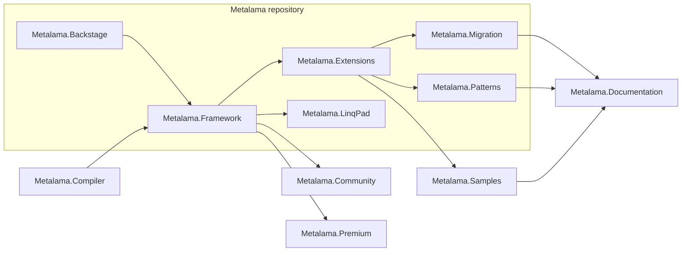
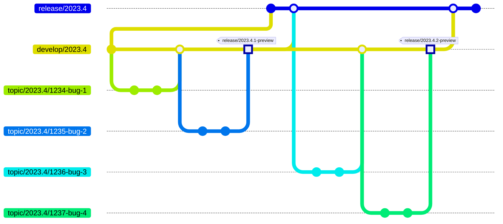

<p align="center">

</p>

[](https://www.postsharp.net/slack)

Welcome to Metalama, a Roslyn-based framework for code generation and validation, designed to enhance your code quality and productivity in C#. Metalama stands on three foundational principles:

* *Boilerplate Reduction*: Harness the power of aspect-oriented programming to dynamically generate repetitive code during compilation. This ensures your source code stays concise and clear.
* *Architecture as Code*: Receive real-time validation of your code against your architectural guidelines, patterns, and conventions. Say goodbye to waiting for code reviews.
* *Tailored Coding Assistance*: Arm your team with personalized code fixes and refactorings.


## Quick Links

- 🌐 [Metalama Website](https://www.postsharp.net/metalama)
- 📖 [Documentation](https://doc.metalama.net)
- 📝 [Annotated Examples](https://doc.metalama.net/examples)
- 🎥 [Tutorial Videos](https://doc.metalama.net/videos)
- 🐞 [Bug Reports](https://github.com/postsharp/Metalama/issues)
- 💬 [Discussions](https://github.com/postsharp/Metalama/discussions)
- 📜 [Detailed Changelog](https://github.com/orgs/postsharp/discussions/categories/changelog)
- 📢 [Release Notes](https://doc.metalama.net/conceptual/aspects/release-notes)
- ✨ [Visual Studio Extension](https://marketplace.visualstudio.com/items?itemName=PostSharpTechnologies.PostSharp)

## Components


### Dependency Graph

Here is a graph of the dependencies between the principal packages in this repository:



### Packages

This repository contains several components that compose the main parts of Metalama.

| Link                                                                           | Description                                                                                                                                     |
| ------------------------------------------------------------------------------ | ----------------------------------------------------------------------------------------------------------------------------------------------- |
| [Metalama.Framework](Metalama.Framework)                                       | The core implementation of the Metalama Framework.                                                                                              |
| [Metalama.Backstage](Metalama.Backstage)                                       | Implements infrastructure core for other Metalama projects, like management of configuration and temporary files.                               |
| [Metalama.Extensions](https://github.com/postsharp/Metalama.Extensions)        | Open-source, professional-grade extensions for Metalama such as dependency injection or architecture  verification.                             |
| [Metalama.Patterns](https://github.com/postsharp/Metalama.Patterns)            | Ready-to-use, open-source and professional-grade aspects, including caching, code contracts, and `INotifyPropertyChanged`.                      |
| [Metalama.LinqPad](https://github.com/postsharp/Metalama.LinqPad)              | A LinqPad driver for querying any C# project or solution.                                                                                       |
| [Metalama.Migration](https://github.com/postsharp/Metalama.Migration)          | The original PostSharp API annotated with guidelines to transition to Metalama.                                                                 |

### Other repositories

There are also other supporting repositories:

| Link                                                                           | License          | Description                                                                                                                                     |
| ------------------------------------------------------------------------------ | ---------------- | ----------------------------------------------------------------------------------------------------------------------------------------------- |
| [Metalama.Compiler](https://github.com/postsharp/Metalama.Compiler)            | MIT              | A [Roslyn](https://github.com/dotnet/roslyn) fork that introduces an extension point for arbitrary source code transformations.                 |
| [Metalama.Premium](https://github.com/postsharp/Metalama.Premium)              | Proprietary      | This repository contains prooprietary extensions to Metalama, available to customers with a paid license. Access to this repository is gra    nted to customers who have an active Metalama Enterprise license. |
| [PostSharp.Engineering](https://github.com/postsharp/PostSharp.Engineering)    | MIT              | A custom multi-repo build and CI framework.                                                                                                     |
| [Metalama.Community](https://github.com/postsharp/Metalama.Community)          | MIT              | Repository housing community-contributed aspects.                                                                                               |
| [Metalama.Documentation](https://github.com/postsharp/Metalama.Documentation)  | MIT              | Source repository for documentation hosted on [Metalama Docs](https://doc.metalama.net/).                                                       |
| [Metalama.Samples](https://github.com/postsharp/Metalama.Samples)              | MIT              | A collection of illustrative samples available at [Metalama Examples](https://doc.metalama.net/examples).                                       |


## Building

### Requirements

To build Metalama, you will need:
- Windows 
- PowerShell
- .NET SDK (see the exact version in `global.json`).

### Performing a local (development) build

To build Metalama, execute this script from PowerShell:

```powershell
./Build.ps1 build
```

The packages are then placed into the `artifacts/publish/private` directory.

This command creates _development builds_, designed to be consumed on your development machine only. Every time you call `Build.ps1 build`, a new package version is created.

### Consuming local builds

To use a local build in a project:

1. Add the following code to your `Directory.Build.props`:

    
    ```xml
    <Import Path="path/to/Metalama/Metalama.Imports.props">
    
    ```

2. Use `$(MetalamaVersion)` property to reference the version number of any package produced by this repo:

    ```xml
    <PackageReference Include="Metalama.Framework" Version="$(MetalamaVersion)"/>
    ```

3. Do a `dotnet restore` every time you complete a new local build. 


### Running tests

Execute this script from PowerShell:

```powershell
./Build.ps1 test
```

### Building with Docker

We use Docker as a reference build environment, to make sure that all dependencies are made very explicit. 

The Metalama build requires .NET Framework, which requires a Windows Server Core image.

Follow these steps:

1. Switch to Windows containers.
2. Create the `artifacts` directory:

    ```powershell
    md artifacts
    ```

3. Create the `build-metalama` image:

    ```powershell
    docker build . -t build-metalama  
    ```

4. Run the build:

    ```powershell
    docker run -v ".\artifacts:c:/src/artifacts" build-metalama pwsh ./Build.ps1 build
    ```

The packages are then placed into the `artifacts/publish/private` directory.

## Our Git flow

* We don't use the `master` nor the `main` branch.
* We are generally concurrently working on three versions, numbered `YYYY.N`. Typically, one is stable and maintained, the other is `rc` and the third is `preview`.
* You should generally check out the `release/YYYY.N` branch.
* Our continuous integration branches are `develop/YYYY.N`. They generally depend on unpublished build artifacts of dependencies and therefore _cannot_ be easily built by the public except by building the dependencies locally. Our `develop/YYYY.N` builds can occasionally be broken.
* When we publish artifacts (for instance to `nuget.org`):
  - We update the version of package references to the ones just uploaded to `nuget.org`.
  - We mark the released commit with the precise package version, e.g. `/release/2023.4.1-preview`.
  - We merge the `develop/YYYY.N` branch into `release/YYYY.N`.
* We work on branches named `topic/YYYY.N/whatever` and generally do PRs to `develop/YYYY.N`.
* After any merge to an "old" `develop/YYYY.N`, the "old" `develop/YYYY.N` is automatically merged into the newer `develop/YYYY.N+1`. A merge commit, named `merge/YYYY.N+1/commit-123456` is automatically created, tested, if possible merged, then deleted.
* We use a private TeamCity service for our continuous integration.

### Illustration

The following schema illustrates our workflow. It shows two public builds, `2023.4.1-preview` and `2023.4.2-preview`, each including two bug fixes.

[//]: # (The "commit" before the first "merge develop/2023.4" is a workaround for https://github.com/mermaid-js/mermaid/issues/5898 and should be removed when fixed.)


